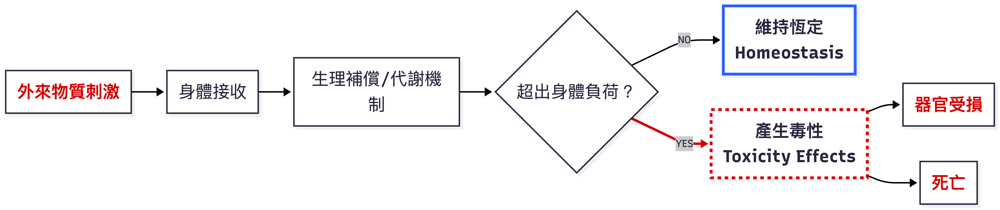
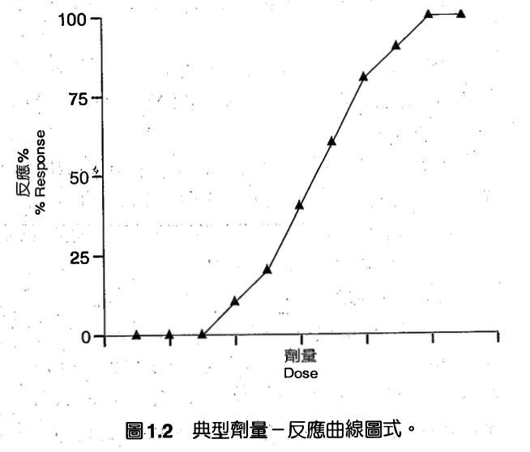
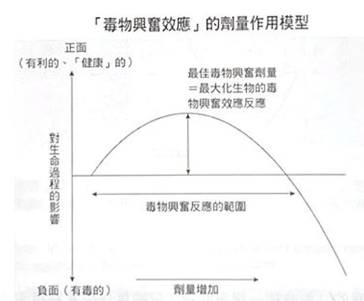
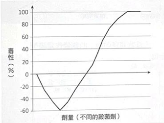
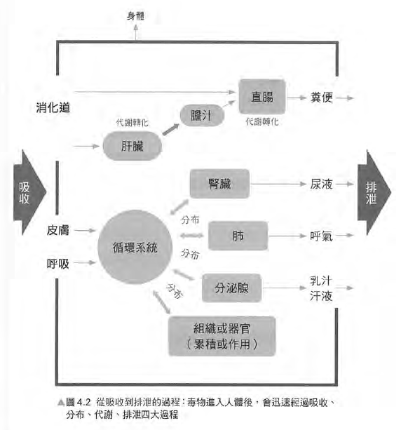
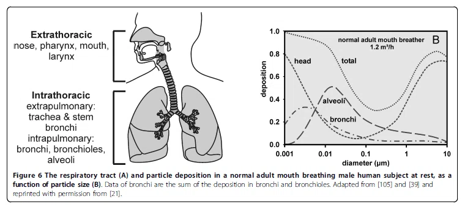

## 講師簡介

- 姓名：何明信

- 學歷：成大環醫所 、職安衛技師

- 經歷：檢查員30年 (製造、危機設、營造、化工職衛科、專委)

- 現職：114年退休

- E-mail：msho7336959\@gmail.com

## 教材目錄

#### **壹、何謂「毒」**

- 毒物學概論、毒性作用、影響毒性作用的因子

#### **貳、劑量-效應關係**

- 無觀察到反應劑量 (NOEL)、最低觀察到反應劑量 (LOEL)、無觀察到不良反應劑量 (NOAEL)、最低觀察到不良反應劑量 (LOAEL)、半數致死劑量 (LD50) 或半數致死濃度 (LC50)

**參、吸收、分布、代謝與排泄 (毒物動力學)**

- 毒性物質的吸收、分布、代謝、排泄

#### **肆、重金屬與其毒性效應**

#### **伍、有機溶劑與其毒性效應**

#### **陸、粒狀物與其毒性效應**

#### **柒、工業毒物學在職業衛生之應用**

#### **捌、SDS與危害性化學品標示簡介**

## 壹、何謂「毒」

- **「毒」**指會危害身體對健康或生命有危害的物質。

- 「**毒物學（Toxicology）**」主要探討的就是物質對生物體所產生的不良健康效應（adverse health effects）。涵蓋了探究毒性（toxicity）、機轉（mechanism）。

<!-- -->

- 「劑量」思維：十六世紀德國醫師 Paracelsus 提出「所有物質皆有毒性，劑量決定該物質為毒還是藥」。例如，水中毒（低血鈉）；阿斯匹靈會造成胃出血。 —\> 「劑量-效應關係」。

- **「劑量-效應關係」**：預測該物質的閾值劑量（threshold dose），進而確定「可接受之暴露劑量或濃度」，並將真實作業環境中多重暴露、勞工健康狀態與生活嗜好等複雜變因納入考量，以達到保護勞工健康與安全的最終目的。

## 壹、何謂「毒」（cont.）

### 毒性作用

{.lightbox}

### 毒性作用的兩個維度分類

1.  **可逆性**：若在停止暴露並經適當休養後，症狀消失且身體恢復正常，稱為「可逆（reversible）」。

    - 反之，若造成永久性器官傷害，則屬「不可逆（irreversible）」。

2.  **時間進程**：從暴露到產生反應的時間分

    - 急性（單次高濃度）、亞急性（一個月內多次）、亞慢性（一到三個月多次）與慢性（三個月以上多次）。例如...

## 壹、何謂「毒」（cont.）

### **影響毒性作用的因子**

- 物質有毒 —\> 暴露 --\> 危害

  - 毒性效應的嚴重程度與暴露時間、頻率以及途徑直接相關。

- 個人差異（耐受性）：物種、年齡、遺傳、健康狀況、暴露環境

- **多重暴露因素**：當混合暴露時，單一物質的毒性會產生變化：

  - **相加作用**：總毒性為個別毒性加成。

  - **協同作用（1+1\>2）**：混合後毒性大幅增加。

  - **拮抗作用（1+1\<2）**：混合後毒性減少，這常應用於解毒劑機制。

::: callout-caution
## 健康風險評估考量？

**在執行健康風險評估時，絕對不能只看單一的容許濃度數值，必須考慮上述因子影響。**
:::

## 貳、劑量-效應關係 （Dose-response）

#### 毒物學的科學基礎，是建立在有害物質於生物體產生不良（有害）反應的劑量-效應關係上。

- 毒理學研究為了精確觀察單一因子的暴露與毒性效應之間的因果關係，通常會藉由**嚴謹的動物實驗**過程來控制暴露條件。

- **劑量-效應關係**，最直觀的**定義**就是：[當暴露的毒物劑量增加時，其所產生的毒性效應亦會隨之增加]{.underline}。在探討化學毒物的「**非致癌性毒性效應**（noncancerous）」時，學理上存在著「閾值效應」，也就是必須達到某個產生可觀察到毒性的「臨界劑量」。

{.lightbox width="50%"}

- 在進行職業衛生風險評估與推論可接受暴露劑量時，我們會頻繁地使用到劑量-效應關係曲線圖中的五個關鍵參數。

## 貳、劑量-效應關係 （cont.)

+-----------------+-----------------------------------------------------------------------------+----------------------------------------------------------------------------------------------------------------------------------------------------------------------------------------------------------------+
| 參數縮寫        | 中文名稱                                                                    | 學理定義與實務意義                                                                                                                                                                                             |
+=================+=============================================================================+================================================================================================================================================================================================================+
| NOEL            | 無觀察到反應劑量(no-observed-effect level)                                  | 在特定暴露條件下，測試毒物**不造成任何指標生物反應**的最高劑量或濃度。                                                                                                                                         |
+-----------------+-----------------------------------------------------------------------------+----------------------------------------------------------------------------------------------------------------------------------------------------------------------------------------------------------------+
| LOEL            | 最低觀察到反應劑量(lowest-observed-effect level)                            | 在特定暴露條件下，受測試毒物**能引發指標生物反應**的最低劑量或濃度。                                                                                                                                           |
+-----------------+-----------------------------------------------------------------------------+----------------------------------------------------------------------------------------------------------------------------------------------------------------------------------------------------------------+
| **NOAEL**       | **無觀察到不良反應劑量**(no-observed-adverse-effect level)                  | 在特定暴露條件下，毒物**不致造成實驗者所欲觀察毒性效應**之最高劑量或濃度。此參數在實務上極為重要，在發展職業暴露容許濃度時，通常會以實驗推估之 NOAEL 再除上ㄧ個**安全因子 (Safety factor)** 來進行標準之調整。 |
+-----------------+-----------------------------------------------------------------------------+----------------------------------------------------------------------------------------------------------------------------------------------------------------------------------------------------------------+
| **LOAEL**       | **最低觀察到不良反應劑量**(lowest observed adverse effect level)            | 爲化學物在劑量-效應關係中，真正**引起毒性效應**的最低暴露劑量。                                                                                                                                                |
+-----------------+-----------------------------------------------------------------------------+----------------------------------------------------------------------------------------------------------------------------------------------------------------------------------------------------------------+
| **LD50 / LC50** | **半數致死劑量 / 半數致死濃度**(lethal dose 50% / lethal concentration 50%) | 指在特定實驗條件下，**導致 50% 受測試對象死亡**所須之毒物劑量或濃度。LD50 通常爲單一暴露之口服及皮膚塗抹劑量，LC50 則為呼吸道暴露之濃度；這兩項數據經常被直接作為比較不同物質毒性大小的量化指標。              |
+-----------------+-----------------------------------------------------------------------------+----------------------------------------------------------------------------------------------------------------------------------------------------------------------------------------------------------------+

::: callout-caution
## 留意

不確定性 (uncertainty)：實驗室數據（高劑量、短時間）外推的侷限性（例如從 LOAEL 推論至 NOAEL，或由動物數據推論至人類）。
:::

## 參、吸收、分布、代謝與排泄 (毒物動力學)

- 簡稱 ADME（Absorption 吸收、Distribution 分布、Metabolism 代謝、Excretion 排泄）。

### **一、 毒性物質的吸收 (Absorption)**

- 先有暴露與吸收：毒物必須先突破人體的外在障壁進入體內，才能對全身產生毒性影響。

- 主要的三大暴露與吸收途徑分別為呼吸道、皮膚與腸胃道。

1.  **經由呼吸道的暴露與吸收**： 最主要、最快速，也是最直接的途徑。

2.  **經由皮膚的暴露與吸收**： 皮膚最主要的防護障壁是「角質層」。皮膚吸收主要有兩種途徑：

    - 第一是「經由角質層細胞間親脂性的擴散」，這是多數親脂性有機溶劑與殺蟲劑進入人體的路徑；

    - 第二是「直接破壞角質層細胞」，通常是強酸或強鹼等具腐蝕性的化合物所致。

3.  **經由腸胃道的吸收**。

::: callout-tip
## RPE？

**呼吸防護具的防護與功能？**
:::

## 參、吸收、分布、代謝與排泄 (cont.)

### **二、 毒物在身體內的分布 (Distribution)**

- 毒物進入血液後，會快速在身體中循環，但它們在各器官的分布並非均勻的。毒物必須滲透過微血管壁才能進入器官，這取決於毒物的分子量、脂溶性與極性等因素；通則上，**分子越小且非極性的物質，越容易穿透進入器官**。

- **組織親和性**：毒物的分布與各器官細胞內的水、脂質及蛋白質含量密切相關。親水性毒物容易散佈至水份高的體液中，而**親脂性毒物則會迅速散佈並蓄積在脂肪成份較多的組織與器官中**。

- **生理障壁的防護與破口**：人體具有保護特定器官的屏障，例如**「血腦障壁」**可限制大分子及親水性毒物進入中樞神經，但部分親脂性毒物（如有機汞、有機溶劑、麻醉劑）仍可輕易通過；而**「胎盤障壁」**雖能保護胎兒，但親脂性毒物（如多氯聯苯）依然可以穿透。

- **累積與半衰期**：毒物在器官的滯留時間我們常以**「半衰期（清除50%毒物所需時間）」**來表示。脂肪組織因血管通透率與生物轉化率低，極易累積親脂性毒物；親脂性神經毒物（如四乙基鉛、有機汞、殺蟲劑）沉積於神經系統髓鞘質是極為危險的現象。此外，骨骼在吸收鈣質維持生理功能的過程中，也常會讓化學性質相似的「重金屬」趁機進入並長期蓄積。

## 參、吸收、分布、代謝與排泄 (cont.)

### **三、 毒性物質的代謝 (Metabolism)**

- 脂溶性高、非極性的化學物質極不易直接排出體外。為了對抗毒害，人體會透過酵素將這些物質「代謝（生物轉化）」成水溶性較高的產物，以利排泄。

- 「肝臟」是人體最主要的毒物生物轉化器官。代謝過程分為兩個階段：

  - **第一階段生物轉化 (Phase I)**：主要透過氧化 (oxidation)、還原 (reduction) 及水解 (hydrolysis) 反應，改變化學物質的分子結構（例如加上極性官能基），初步降低毒性並增加水溶性。

  - **第二階段生物轉化 (Phase II)**：若第一階段代謝物仍無法排除，便會進入第二階段，與體內特定的生物分子或官能基產生「結合反應」，形成結構改變幅度更大、水溶性極高的次代謝物，使其極易自體內排除。

- **生物活化 (Bioactivation) 的致命風險**：代謝並不絕對等於解毒。有時候代謝後的產物或中間產物，其反應活性反而會大幅增加，轉而攻擊體內的蛋白質或 DNA 等大分子，造成嚴重的器官損傷或引發癌症。這種**毒性被放大的過程，在毒理學上稱為「生物活化」**。

### 大豆沙拉油檢出苯駢芘？ ＡＩ這麼說 .....

- **Ｑ：苯駢芘（Benzo\[a\]pyrene, BaP）本身並非直接攻擊DNA的終極毒物，它屬於「前致癌物」（procarcinogen）。** 真正致命的是—**它必須經過體內的「生物活化」代謝過程，才會轉變成高反應性的終極致癌物。 你認為呢？**

- Ｑ：同樣暴露於苯駢芘，不同個體的致癌風險差異極大——**這不是劑量問題，而是代謝分流與遺傳易感性的問題**。 **你認為呢？**

## 參、吸收、分布、代謝與排泄 (cont.)

### **四、 毒性物質的排泄 (Excretion)**

- 將毒物或其代謝產物清除體外是最後一道防線。雖然毒物可經由毛髮或指甲自然生長排出，但在量化評估上，呼氣、尿液與糞便是最主要的三大排泄管道。

- **肺部呼氣清除**。

- **腎臟尿液排泄**：腎臟是專門負責過濾並排除多種「水溶性」毒物及代謝物（特別是經過肝臟代謝轉化後的產物）的最主要管道。

- **糞便排除與腸肝循環**：部分毒物或代謝物會分泌至膽汁或腸胃道黏膜中，隨後進入腸胃道。但物質在腸胃道中可能發生「再吸收」現象，若未被再吸收的部份才會經由糞便徹底排除。

職業衛生風險評估時，我們必須根據毒物的吸收途徑來選擇防護具，並根據其分布與代謝排泄特性來決定該採集勞工的血液、尿液還是呼氣樣本。

## **肆、重金屬與其毒性效應**

+------------------+------------------------------------------------------------------------------------------------------------------------------------------------------------------------+
| 受損系統         | 毒性作用機制與代表性物質實務案例                                                                                                                                       |
+==================+========================================================================================================================================================================+
| **神經系統**     | 重金屬易引起中樞或周邊神經系統的損害，且許多傷害是不可逆的。                                                                                                           |
|                  |                                                                                                                                                                        |
|                  | - **鉛**：急性大量暴露會造成急性腦病變，神經學上顯示有頭痛、精神紊亂、昏迷、妄想，在小孩子身上更常發生。                                                               |
|                  |                                                                                                                                                                        |
|                  | - **汞**：甲基汞引起著名的水俁病(minamata disease)；早期症狀包含四肢、臉部與舌頭感覺異常，惡化時發生精神異常、震顫、運動協調異常、發音不良，以及視野縮小、聽力損失等。 |
+------------------+------------------------------------------------------------------------------------------------------------------------------------------------------------------------+
| **心血管系統**   | 有些重金屬會引起高血壓，造成心血管系統之負擔。                                                                                                                         |
|                  |                                                                                                                                                                        |
|                  | - **鉛**：中年人與老年人暴露可能會導致血壓升高。                                                                                                                       |
|                  |                                                                                                                                                                        |
|                  | - **鎘**：動物實驗中顯示食入鎘亦會造成高血壓。                                                                                                                         |
+------------------+------------------------------------------------------------------------------------------------------------------------------------------------------------------------+
| **肝腎機能**     | 重金屬主要在肝臟代謝，並由腎臟排出，肝腎負荷大而易受傷害。                                                                                                             |
|                  |                                                                                                                                                                        |
|                  | - **鎘**：急性暴露數小時內即造成肝組織壞死，可能引發肝衰竭；吸入燻煙或蒸氣也會引起急性腎小管壞死。                                                                     |
|                  |                                                                                                                                                                        |
|                  | - **砷**：對蛋白質氫硫基具高親和力，影響酵素活性與蛋白質結構，並進入粒線體抑制代謝反應及降低ATP生成。                                                                  |
+------------------+------------------------------------------------------------------------------------------------------------------------------------------------------------------------+
| **呼吸系統**     | 經由呼吸途徑進入體內，直接接觸呼吸系統細胞或組織造成傷害。                                                                                                             |
|                  |                                                                                                                                                                        |
|                  | - **六價鉻**：呼吸高濃度會造成鼻子發炎反應，嚴重者導致鼻中膈穿孔，亦提高工人發生氣喘甚至肺癌的危險。                                                                   |
+------------------+------------------------------------------------------------------------------------------------------------------------------------------------------------------------+
| **皮膚系統**     | 直接接觸引起過敏、接觸性皮膚炎或刺激作用，常伴隨特異性色素沉著。                                                                                                       |
|                  |                                                                                                                                                                        |
|                  | - **鉻酸鹽**：皮膚呈黃色。                                                                                                                                             |
|                  |                                                                                                                                                                        |
|                  | - **硝酸銀**：皮膚變黑。                                                                                                                                               |
|                  |                                                                                                                                                                        |
|                  | - **砷**：皮膚出現棕色細斑樣的色素沉著。                                                                                                                               |
|                  |                                                                                                                                                                        |
|                  | - **鎳**：接觸含鎳之土壤、水或金屬合金極易造成皮膚過敏。                                                                                                               |
+------------------+------------------------------------------------------------------------------------------------------------------------------------------------------------------------+
| **血液系統**     | 產生直接的細胞毒性。                                                                                                                                                   |
|                  |                                                                                                                                                                        |
|                  | - **鉛**：暴露會造成紅血球壽命縮短，可能產生貧血等症狀。                                                                                                               |
+------------------+------------------------------------------------------------------------------------------------------------------------------------------------------------------------+
| **免疫系統**     | 影響體內免疫系統調節功能或傷害免疫細胞，使免疫機能受損。                                                                                                               |
|                  |                                                                                                                                                                        |
|                  | - **鎘、鉛、鎳、金及汞**：產生免疫抑制作用，如降低對感染物質的耐受性、排除抗原能力下降等。                                                                             |
|                  |                                                                                                                                                                        |
|                  | - **鉛及汞**：更有可能與自體免疫疾病的引發有關。                                                                                                                       |
+------------------+------------------------------------------------------------------------------------------------------------------------------------------------------------------------+
| **骨骼系統**     | 毒物會經由骨骼吸收鈣質的生理活動而進入骨骼組織中累積。                                                                                                                 |
|                  |                                                                                                                                                                        |
|                  | - **鎘**：長期暴露造成痛痛病，產生骨痛與骨質疏鬆的症狀。                                                                                                               |
+------------------+------------------------------------------------------------------------------------------------------------------------------------------------------------------------+
| **癌症(致癌性)** | 產生導致癌症發生之慢性毒害。                                                                                                                                           |
|                  |                                                                                                                                                                        |
|                  | - **砷**：具明確致癌性（肝、皮膚、肺）。                                                                                                                               |
|                  |                                                                                                                                                                        |
|                  | - **鎘(吸入性)與六價鉻**：相關化合物被歸類為確定的人體致癌物質。                                                                                                       |
+------------------+------------------------------------------------------------------------------------------------------------------------------------------------------------------------+

## **伍、有機溶劑與其毒性效應**

- 有機溶劑在工業上應用極廣，其共同特徵是對人體中樞神經系統具有不同程度的「抑制作用」與「麻醉作用」。視暴露程度與種類，輕則不適，重則全身麻醉甚至呼吸停止致死。其主要危害涵蓋四大系統。

+----------------+------------------------------------------------------------------------------------------------------------------------+
| 受損系統       | 毒性作用機制與代表性物質實務案例                                                                                       |
+================+========================================================================================================================+
| **神經系統**   | 抑制神經系統的傳導功能，産生麻醉、神經系統障礙或引起神經炎等。                                                         |
|                |                                                                                                                        |
|                | - **二硫化碳**：引起神經炎。                                                                                           |
|                |                                                                                                                        |
|                | - **甲醇**：中毒會影響視神經。                                                                                         |
|                |                                                                                                                        |
|                | - **其他神經毒性溶劑**：包含酒精、苯、二甲苯、三氯乙烯、正己烷、丙酮、汽油、松節油等。                                 |
+----------------+------------------------------------------------------------------------------------------------------------------------+
| **肝腎機能**   | 損傷肝臟機能，並可能因血氧量減少使腎臟受害。                                                                           |
|                |                                                                                                                        |
|                | - **肝臟毒性**：引起噁心、嘔吐、發燒、黃疸及中毒性肝炎；常見溶劑如四氯化碳、氯仿、三氯乙烯、四氯乙烷、苯及其衍生物等。 |
|                |                                                                                                                        |
|                | - **腎臟毒性**：使腎臟受害發生腎炎及腎病；常見溶劑包含烴類之鹵化物、苯及其衍生物、二元醇等。                           |
+----------------+------------------------------------------------------------------------------------------------------------------------+
| **造血系統**   | 破壞骨髓細胞，造成貧血現象。                                                                                           |
|                |                                                                                                                        |
|                | - **代表性溶劑**：苯及其衍生物（如甲苯、氯化苯）、二元醇等。                                                           |
+----------------+------------------------------------------------------------------------------------------------------------------------+
| **皮膚及黏膜** | 產生局部刺激與系統性損傷。                                                                                             |
|                |                                                                                                                        |
|                | - **皮膚傷害**：主要會將皮膚表面的油脂保護膜破壞，使其失去保護屏障，進而產生簡單刺激或造成系統性的吸收與損傷。         |
|                |                                                                                                                        |
|                | - **黏膜刺激與過敏**：刺激黏膜使鼻黏膜出血、喉頭發炎、嗅覺喪失，或因皮膚敏感産生紅腫、發癢、紅斑及壞疽。               |
|                |                                                                                                                        |
|                | - **代表性溶劑**：氯仿、三氯甲烷、醚、苯、丙酮、四氯化碳等。                                                           |
+----------------+------------------------------------------------------------------------------------------------------------------------+

## **陸、粒狀物與其毒性效應**

除了氣體，懸浮在空氣中的液態或固態粒子（又稱氣懸微粒或氣膠 aerosol）同樣是致命的危害。

1.  **沉積機制與呼吸道損害**：微粒進入呼吸道後，會藉由撞擊、沈積、擴散與攔截等機制，停留在頭區、支氣管區或最深處的肺泡區。**粒子越小，進入的範圍越深**。

2.  **載體效應與急性症狀**：微粒具備強大吸附能力，會將環境中許多有害化學物質吸附並帶入體內。流行病學顯示，微粒會導致咳嗽、氣喘惡化，並直接增加心血管與呼吸道疾病的住院率及死亡率。

3.  **新興奈米微粒的挑戰**：奈米科技帶來了新隱憂。奈米微粒的物化特性異於微米級粒子，極小的顆粒使其更容易長驅直入進入肺泡區，大幅增加了潛在的健康危害風險。

## **柒、工業毒物學在職業衛生之應用**

我們在實驗室取得的毒理資訊，最終目的是應用於**「健康風險評估」**，以此推估人體不受傷害的閾值劑量，並輔助制定職業暴露容許濃度等管制標準。

1.  **風險評估四步驟**：這是一個量化分析危害機率的過程，包含「危害鑑定」、「劑量-效應評估」、「暴露評估」與「風險量化」。

2.  **不確定性（Uncertainty）與安全因子**：從動物實驗外推至人體管制標準充滿了挑戰。實務上必須克服五大不確定性：(1)動物推論至人類的差異、(2)人類個體間敏感度差異、(3)觀察期推論（如亞慢性推至慢性）差異、(4)由 LOAEL 推論至 NOAEL 的落差、以及 (5)研究資料的不齊全。因此，在制定職業暴露容許濃度時，我們通常會以實驗取得的「無觀察到不良反應劑量（NOAEL）」為基準，再除上一個「安全因子（Safety factor）」來進行數值下修，以確保防護足夠保守。

## **捌、SDS與危害性化學品標示簡介**

防護科學必須化為前線勞工能看懂的資訊。據統計，化學品造成的職業傷病佔比高達 60%。為保障百萬勞工的安全，我國已全面實施「化學品全球分類與標示調和制度（GHS）」。

1.  **法規與標示要件**：凡符合 CNS15030 分類（具物理或健康危害）之化學品，雇主必須在容器上明顯標示。標示內容包含：危害圖式（如火焰、骷髏頭等），以及名稱、危害成分、警示語、危害警告訊息、防範措施，與供應商資訊。

2.  **落實知的權利 (Right to Know)**：為了在供應鏈間傳遞複雜的毒理資料，並賦予勞工安全使用化學品的權利，供應廠商必須依 GHS 規範提供「安全資料表（Safety Data Sheet, SDS）」。這份文件就是我們工業毒物學與現場勞工安全之間最重要的資訊傳遞橋梁。

## 以上是教材主要內容，以下為補充資料

### 參考資料：

1.  費里柏（Richard Friebe）。（2018）。《誰說無毒一身輕？看壓力和毒物如何讓我們更強健》（藍之廷譯）。商周出版。
2.  招名威（2023）。《*毒理學全書：長期失眠、內分泌失調、腹瀉……理解生活中潛伏的各類毒物，激發人體保護機制的防毒聖經*》。臺灣商務印書館。
3.  AIHA (2019)。《Toxicology Principles for the Industrial Hygienist》 **推薦**

## 1.《誰說無毒一身輕》

- **沒有絕對的「毒」與「非毒」，關鍵在於「劑量」**。

- 我們的身體在面對適度的壓力和毒素時，不僅不會被擊垮，反而會啟動修復與強化機制，變得更強健。這個原則就是 **「毒物興奮效應」（Hormesis）** 。

- 毒物興奮效應 (Hormesis)？

- **劑量與效果的關係是非線性的，低劑量可能有益，高劑量必然有害。**

+----------------------------------------------------+----------------------------------------------------+
|                                                    |                                                    |
+====================================================+====================================================+
| {.lightbox} | {.lightbox} |
+----------------------------------------------------+----------------------------------------------------+

## 2.《毒理學全書》- 招名威（2023）

- 毒理學是一門研究各種物質~~對人類及其它生物體產生~~毒性，探討其毒性機轉來源，並對暴露受體進行定量評估（如嚴重程度與頻率）的科學。

- 核心：劑量決定一切（Dose-Response）

- 實務上落實「劑量」的管理，毒理學家與法規單位發展出了幾個關鍵指標

  - **無明顯不良反應劑量（NOAEL）**：藉由動物試驗找到「未觀察到任何有害作用」的最高劑量。

  - **每日容許攝取量（ADI）**：將 NOAEL 除以一個安全係數（通常是 100 到 1000 不等），藉此推算出人類即使每天攝取也不會對健康造成負面影響的劑量。最早由世界衛生組織（WHO）於 1964 年所創立。

  - **最大殘留容許劑量（MRL）**：針對非刻意添加的殘留物（如農藥、飼料殘留），政府會依據 ADI、各國飲食習慣及田間測試結果，制定出「執法劑量」。要注意的是，產品超標代表違反法規，但不等同於吃下去會立刻中毒。

## 2.《毒理學全書》- (cont.)

### 決定毒性反應的關鍵變數與暴露途徑

- 是否發生毒性反應，並不僅僅取決於化學物質本身的毒性，還受到許多變數的控制，包含系統如何代謝、特定目標部位的活性形式濃度，以及生物系統整體的敏感性。

- 在工業場域中，特別關注**接觸途徑**與**接觸部位**。

- 劑量-反應關係（Dose-Response Relationship）?

  - 「多少劑量會產生多嚴重的毒性」- 個體與群體

  - 一般是「隨著劑量暴露增加，造成毒性或反應的影響就越大」

  - 「非單調劑量-反應曲線」- 毒物興奮效應（Hormesis）

- 跨物種的劑量推測：從動物到人類

  - 這是工業毒理學極為關鍵的一環。新藥或新化學品不可能直接用人體做致死測試，因此我們必須將動物實驗的數據推估到人類身上。

- **閾值（Threshold）?**

  - **為制定安全暴露標準**。閾值的概念是：於某一特定劑量下，個體產生不良反應的可能性為零，這個劑量界線就是閾值。被廣泛應用於評估食品、化妝品與藥物製劑中非致癌雜質的安全規範。

  - **並非所有毒性反應都有閾值**。

  - 對於許多「[遺傳毒性致癌物]{.underline}」（會直接與 DNA 作用破壞遺傳物質的化學品），科學界一般採用「線性、非閾值模型」。這個模型假設，[即使在非常低、極微量的劑量下，致癌物劑量與腫瘤發生反應之間依然有一定的線性直接關係]{.underline}。換言之，只要你接觸了這類化學物質，就算劑量再低，也會機率性地增加 DNA 受損與致癌的風險，[不存在絕對安全的「零風險閾值」]{.underline}。 (保守態度)

## 2.《毒理學全書》- (cont.)

### 人體如何面對毒物的入侵? (**ADME**)

{.lightbox width="50%"}

- 毒物在體內的分布並非均勻的，最初由血液流量決定，最終則取決於毒物對各種組織的親和力。

- **雙面刃的生化反應：代謝 (Metabolism)**

  - 外來物質在體內發生化學結構變化的過程，主要由「肝臟」負責。代謝的初衷是將脂溶性毒物轉化為水溶性，以便於排出體外。

  - 「代謝活化（Metabolic Activation）」現象：並非所有代謝都能解毒，有時代謝的中間產物反而比原物質更具毒性。

- 排泄 (Excretion)

  - 從尿液排泄（腎臟）： 這是清除體內毒物最有效率的器官。

  - 從糞便排泄（肝臟與膽汁）& 其他。

## 3.Toxicology Principles for the Industrial Hygienist (AIHA 專書)

- 對於現代工業衛生師而言，毒理學不僅是一個相關學科，它提供了辨識危害、評估風險和制定控制措施所需的理論基礎和數據依據。

  - 一個工業衛生師需要向勞工解釋某個**職業暴露限值（OEL）** 是如何制定的，它的依據是什麼，以及它能預防什麼樣的健康危害。

- 毒理學原理（Principles of Toxicology）

  - 劑量－反應關係：**化學物質的暴露劑量與生物體產生反應（健康效應）之間的關聯**。

  - **毒物動力學（Toxicokinetics）：**「物質如何進出身體」(**ADME)**。

  - **毒效動力學（Toxicodynamics）：**「對身體做了什麼」。

    - 毒物動力學決定了化學物質**到達標靶部位的濃度與時間**；毒效動力學則決定了該濃度下**會產生什麼樣的效應**。兩者共同決定了最終的毒性表現。

- **For OH**

  - 決定「安全」與「危險」的界線
  - 職業接觸限值（OEL）的科學基礎
  - 有效溝通風險
  - 設計有效的控制策略

## AIHA 專書 (cont.)

### 3. 毒性作用機制（Mechanisms of Toxicity）

- 化學物質的毒性效應並非單純由其「存在」決定，而是取決於其**在標靶部位的濃度**以及**物理化學性質**（如溶解度、蒸氣壓、分子量、物理狀態等）。

  - **性質截然不同的化學物質可能引發類似的毒性結果**。

- 化學交互作用（Chemical Interactions）

+--------------------------------+--------------------------------------------------------------------+----------------------------------------------------------------------------------------------------------------------------+
| 交互作用類型                   | 定義                                                               | 實例                                                                                                                       |
+:===============================+:===================================================================+:===========================================================================================================================+
| **加成作用（Additive）**       | 合併效應等於各化學物質單獨效應的總和                               | 多數有機磷化合物同時給予時，對膽鹼酯酶活性的抑制效應為加成作用                                                             |
+--------------------------------+--------------------------------------------------------------------+----------------------------------------------------------------------------------------------------------------------------+
| **協同作用（Synergistic）**    | 合併效應**大於**各化學物質單獨效應的總和                           | **石棉暴露與吸菸**：石棉工人肺癌發生率增加5倍，吸菸者增加11倍，但石棉工人同時吸菸者竟增加**55倍**                          |
+--------------------------------+--------------------------------------------------------------------+----------------------------------------------------------------------------------------------------------------------------+
| **潛在化作用（Potentiation）** | 一種本身對某組織無毒性的物質，**顯著增加**另一種物質對該組織的毒性 | 三氯乙烯本身對肝臟影響甚微，但能**顯著增加**四氯化碳的肝毒性                                                               |
+--------------------------------+--------------------------------------------------------------------+----------------------------------------------------------------------------------------------------------------------------+
| **拮抗作用（Antagonism）**     | 兩種化學物質反應後產生**毒性較低**的產物（通常為解毒劑的基礎）     | 二巰基丙醇（dimercaprol）可螯合**砷、汞**等重金屬，使其無法到達作用部位；**阿托品（atropine）** 可用於降低有機磷農藥的毒性 |
+--------------------------------+--------------------------------------------------------------------+----------------------------------------------------------------------------------------------------------------------------+

## AIHA 專書 (cont.)

### 4.毒物的分布與代謝〉（Disposition of Toxicants）

+--------------------------+--------------------------------------------------------------------------------+
| 過程                     | 說明                                                                           |
+:=========================+:===============================================================================+
| **吸收（Absorption）**   | 化學物質如何經由暴露途徑（主要是吸入與皮膚接觸）進入血液循環                   |
+--------------------------+--------------------------------------------------------------------------------+
| **分布（Distribution）** | 化學物質隨血液運送到全身各組織器官的過程                                       |
+--------------------------+--------------------------------------------------------------------------------+
| **代謝（Metabolism）**   | 身體將化學物質轉化（生物轉化），通常使其更易排出，但有時會產生更具毒性的代謝物 |
+--------------------------+--------------------------------------------------------------------------------+
| **排泄（Excretion）**    | 化學物質及其代謝物排出體外的方式（尿液、糞便、呼氣等）                         |
+--------------------------+--------------------------------------------------------------------------------+

- **代謝的雙重角色**

  - **解毒（Detoxification）**：將脂溶性物質轉化為水溶性較高的代謝物，使其更容易經由尿液或糞便排出。

  - **活化（Bioactivation）**：某些化學物質本身毒性不高，但在代謝過程中會產生**更具毒性的中間產物**，攻擊特定器官或細胞。

  - **註：細胞色素 P450 酶系統（Cytochrome P450 Enzymes）**是肝臟中最主要的代謝酶家族。P450 酶在氧化反應中扮演關鍵角色，既是解毒的主要工具，也可能是活化前驅致癌物的元凶。

## AIHA 專書 (cont.)

### 5.呼吸系統毒理學（Respiratory Toxicology）

- 肺是人體與環境之間最大的氣體交換界面。成人肺部的氣體接觸面積高達 **90 平方公尺**，加上面積達 140 平方公尺的微血管網絡，使得許多物質一旦到達肺泡，就能極快速地吸收進入血液循環。

- 影響沉積與吸收的關鍵因素 (物化特性)

  - **氣體與蒸氣**

    - **水溶性**：決定作用部位。高水溶性（氨、氯化氫）→ 上呼吸道；低水溶性（氮氧化物、光氣）→ 深層肺部。

    - **脂溶性**：影響吸收與分布。脂溶性高且不與血液成分結合的物質（如二硫化碳、苯類、鹵代烴）容易通過肺部進入血液，分布到脂肪組織。

  - **粒狀物（Particulates）**

    - **粒徑大小**：決定沉積部位。可呼吸性粉塵的粒徑通常定義在 **5 µm 以下**（空氣動力學直徑）。大顆粒沉積在上呼吸道，小顆粒（≤ 5 µm）能深入肺泡。

    - **纖維形態**：纖維的沉積行為取決於其直徑，與長度無關。而纖維的幾何形狀對某些毒性反應（如間皮瘤誘發）至關重要。

    - **溶解度與吸濕性**：影響顆粒在肺部的滯留時間和後續反應。不溶性顆粒會滯留於肺部，可能引發發炎、肉芽腫、纖維化甚至惡性腫瘤。

## AIHA 專書 (cont.)

6.皮膚毒理學（Dermal Toxicology）(略)

### 7.全身性效應：心血管與腎臟毒性

- 心血管系統由心臟和血管網路組成，負責將氧氣和養分運送到全身，並移除代謝廢物。其正常功能依賴於複雜的電生理信號和精密的調控機制，這些環節都可能成為化學物質干擾的目標。
  - **有機溶劑**：許多有機溶劑（如苯、甲苯、三氯乙烯）具有心臟毒性，可能導致心律不整或心肌功能抑制。

  - **重金屬**：鉛、鎘、汞等重金屬可累積於心血管組織，影響血壓調節和心臟功能。

  - **一氧化碳**：一氧化碳與血紅蛋白結合，減少血液攜氧能力，迫使心臟加倍工作，增加心臟負荷。

  - **顆粒物**：長期暴露於細懸浮微粒（PM2.5）與心血管疾病發生率增加有關。

  - **農藥與殺蟲劑**：某些有機磷殺蟲劑可影響神經系統，間接影響心臟功能。

### 腎臟毒性（Renal Toxicity）

- 腎臟是化學物質毒性的高風險標靶，主要原因在於其生理功能特性：**高血流量**(心臟輸出量的20-25%)、**濃縮機制(**高濃度)、**高代謝活性**(富含代謝酶P450）、**高能量需求**（ATP）**與氧化壓力敏感**。
  - **重金屬**：鉛、鎘、汞、砷等重金屬是常見的腎毒性物質，長期暴露可導致腎小管損傷和腎功能不全。

  - **有機溶劑**：某些溶劑（如四氯化碳、三氯乙烯）經代謝活化後產生腎毒性代謝物。

  - **農藥**：許多農藥被證實具有腎毒性，對農業工作者構成風險。

  - **藥物與化學品**：非類固醇抗發炎藥（NSAIDs）、抗生素等藥物在職業暴露情境中也可能是腎毒性的來源。

## AIHA 專書 (cont.)

8.感覺器官毒理學（Toxicology of Sensory Organs）(略)

- 溶劑與噪音之間存在**協同作用（synergistic interaction）** ，兩者同時暴露時對聽力的損害遠大於各自單獨暴露的總和。(如**苯乙烯、**甲苯、三氯乙烯、鉛)
- 在瑞典，約 **40%** 的 OELs 是基於避免感覺刺激而制定的。

### 9.神經毒理學（Neurotoxicology）

- 神經系統的脆弱性源於以下特性：

  - **高代謝率與氧氣需求**：腦組織耗氧量極高，對缺氧及幹擾能量代謝的毒物特別敏感。
  - **有限的再生能力**：成熟神經元幾乎無法再生，一旦死亡即造成永久性功能喪失。
  - **複雜的結構與功能**：神經系統由多種細胞類型組成，不同類型的化學物質可能攻擊不同的標靶。
  - **血腦屏障的雙面性**：雖然屏障能保護中樞神經系統免受許多物質侵害，但脂溶性高的化學物質仍能穿透，且某些毒物（如錳、鎘）可經由嗅覺途徑繞過屏障直接進入腦部。

- 鉛是工業衛生中最古老且最重要的神經毒素之一。

  - **周邊神經病變**：運動神經元受損，表現為**垂腕症（wrist drop）**，即手腕與手指無法伸展。

  - **中樞神經系統效應**：認知功能障礙、注意力不集中。

  - **其他表現**：鉛線（牙齦藍色沈積）、貧血、腹痛。

- 常見神經毒素引發的症候群

+----------------------------+----------------------------------------------+
| 毒物                       | 主要神經效應                                 |
+:===========================+:=============================================+
| **丙烯醯胺（Acrylamide）** | 遠端感覺運動神經病變（手套襪子分布）         |
+----------------------------+----------------------------------------------+
| **正己烷（n-Hexane）**     | 周邊神經病變（鞋業工人案例）                 |
+----------------------------+----------------------------------------------+
| **二硫化碳（CS₂）**        | 周邊神經病變、精神異常、巴金森氏症           |
+----------------------------+----------------------------------------------+
| **錳（Manganese）**        | 巴金森氏症候群（錐體外症候群）、精神異常     |
+----------------------------+----------------------------------------------+
| **一氧化碳（CO）**         | 缺氧性腦病變、認知障礙、人格改變             |
+----------------------------+----------------------------------------------+
| **有機溶劑（混合）**       | 慢性溶劑中毒腦病變（認知功能下降、記憶障礙） |
+----------------------------+----------------------------------------------+
| **三氯乙烯（TCE）**        | 腦神經麻痺（特別是三叉神經）、腦病變         |
+----------------------------+----------------------------------------------+

## AIHA 專書 (cont.)

### 10.肝臟毒理學（Hepatic Toxicology）

- 肝臟是體內**代謝外源性物質（xenobiotics）最主要的器官**。經由腸道吸收的營養素和化學物質，在進入全身循環之前，首先由肝門靜脈運送至肝臟進行處理。這使得肝臟暴露於高濃度的化學物質及其代謝產物。

  - **高血流灌注**(約 25% 的心臟輸出血液)、**高代謝活性**(富含P450)、**濃縮機制、有限的再生能力(脆弱性)**。

- 常見於工作場所的肝毒性化學物質

+------------------------------+--------------------------------+----------------------------------------------------------------------------+
| 化學物質                     | 暴露來源                       | 主要毒性表現                                                               |
+:=============================+:===============================+:===========================================================================+
| **四氯化碳（CCl₄）**         | 曾用作工業溶劑、清潔劑         | 經 CYP2E1 代謝為三氯甲基自由基 → **脂肪肝與 Zone 3 壞死**                  |
+------------------------------+--------------------------------+----------------------------------------------------------------------------+
| **氯仿（Chloroform）**       | 曾用作麻醉劑、溶劑             | 經代謝活化→脂肪肝與 Zone 3 壞死                                            |
+------------------------------+--------------------------------+----------------------------------------------------------------------------+
| **三氯乙烯（TCE）**          | 金屬清洗、電子元件清潔         | 可引發過敏性皮膚炎與**局部肝細胞壞死伴隨淋巴細胞浸潤**（過敏性肝炎）       |
+------------------------------+--------------------------------+----------------------------------------------------------------------------+
| **二硫化碳（CS₂）**          | 紡織、農藥、橡膠製造           | 動物實驗顯示脂肪變性與肝臟出血，可抑制藥物代謝酶                           |
+------------------------------+--------------------------------+----------------------------------------------------------------------------+
| **2-硝基丙烷（2-NP）**       | 塗料、印刷油墨溶劑             | 大鼠吸入 207 ppm 6個月可誘發**肝細胞癌或腺瘤**（NIOSH 建議視為人類致癌物） |
+------------------------------+--------------------------------+----------------------------------------------------------------------------+
| **乙醇（Ethanol）**          | 飲酒（合併職業暴露時風險增加） | 乙醇是 CYP2E1 的誘導劑，**可增加四氯化碳、三氯乙烯等物質的肝毒性**         |
+------------------------------+--------------------------------+----------------------------------------------------------------------------+
| **氯乙烯（Vinyl Chloride）** | PVC 製造                       | 已知可誘發**肝血管肉瘤**（罕見但具指標性的職業癌）                         |
+------------------------------+--------------------------------+----------------------------------------------------------------------------+

## AIHA 專書 (cont.)

### 11.生殖與發育毒理學（Reproductive and Developmental Toxicology）

- 生殖與發育毒性不僅影響暴露的勞工本人，更可能**影響到下一代**。

- 人類對生殖與發育毒性與環境化學物關係的認識，主要是透過一系列重大公共衛生悲劇建立的。(例如，日本水俁病（甲基汞）、沙利竇邁（Thalidomide）藥害等)

- 生殖毒性效應在低於特定劑量時不會發生。致畸作用的**物種差異特別明顯**，這是生殖毒理學評估的重要挑戰。最著名的例子即沙利竇邁——在大鼠、小鼠的致畸試驗中皆呈現陰性結果，但對人類卻誘發嚴重的短肢畸形。

- 相關毒理學文獻整理的已知或疑似人類生殖/發育毒物：

| 類別           | 代表物質                                 |
|:---------------|:-----------------------------------------|
| **重金屬**     | 鉛、汞（有機汞）、鋰                     |
| **有機溶劑**   | 甲苯、二硫化碳                           |
| **農藥**       | 毒殺芬（有機氯殺蟲劑）                   |
| **工業化學品** | 環氧乙烷、一氧化碳                       |
| **藥物**       | 沙利竇邁、類視黃醇、四環素、抗癲癇藥物等 |
| **物理因素**   | 游離輻射、核輻射塵                       |

## AIHA 專書 (cont.)

### 12.免疫毒理學（Immunotoxicology）

- 免疫系統是身體抵禦外來病原體和異常細胞的防禦網絡，其功能一旦受損，可能導致感染風險增加、腫瘤發生率上升，或引發過敏與自體免疫疾病。
- 職業環境中的重要免疫毒性物質

+-----------------------------+---------------------------------------------------------------------------------------------------------------------------------------------------------------------------------------------+
| 化學物質類別                | 免疫毒性表現                                                                                                                                                                                |
+:============================+:============================================================================================================================================================================================+
| **異氰酸酯（Isocyanates）** | 職業性氣喘（最常見的致敏原之一）                                                                                                                                                            |
+-----------------------------+---------------------------------------------------------------------------------------------------------------------------------------------------------------------------------------------+
| **酸酐（Anhydrides）**      | 過敏性呼吸道疾病                                                                                                                                                                            |
+-----------------------------+---------------------------------------------------------------------------------------------------------------------------------------------------------------------------------------------+
| **重金屬（鉻、鎳、鈷）**    | 過敏性接觸性皮膚炎                                                                                                                                                                          |
+-----------------------------+---------------------------------------------------------------------------------------------------------------------------------------------------------------------------------------------+
| **二甲基甲醯胺（DMF）**     | 動物實驗已證實具免疫毒性。臺灣研究發現，暴露勞工的**免疫球蛋白G（IgG）與免疫球蛋白E（IgE）異常率**隨暴露濃度升高而顯著增加，**免疫球蛋白M（IgM）濃度**則顯著下降，顯示DMF對人體確具免疫毒性 |
+-----------------------------+---------------------------------------------------------------------------------------------------------------------------------------------------------------------------------------------+
| **多鹵化芳香烴**            | 免疫抑制、氯痤瘡                                                                                                                                                                            |
+-----------------------------+---------------------------------------------------------------------------------------------------------------------------------------------------------------------------------------------+
| **石棉**                    | 可能影響免疫細胞功能                                                                                                                                                                        |
+-----------------------------+---------------------------------------------------------------------------------------------------------------------------------------------------------------------------------------------+
| **苯**                      | 骨髓抑制，影響白血球生成                                                                                                                                                                    |
+-----------------------------+---------------------------------------------------------------------------------------------------------------------------------------------------------------------------------------------+

## AIHA 專書 (cont.)

### 13.遺傳毒理學（Genetic Toxicology）

- 是研究外源性化學物質與物理因子對活細胞遺傳物質（DNA）造成有害變化的學科，重點關注化學物質的**致突變性（mutagenicity）**。

  - 化學物質可能透過直接與DNA結合、水解核苷酸、斷裂DNA鏈或使DNA交聯等方式損傷DNA。這種損傷若未經正確修復，在細胞複製時即可能產生**突變（mutation）。**

- 遺傳毒性根據受影響的細胞類型，可分為兩種主要類別：體細胞突變(**致癌、**器官功能損傷)及生殖細胞突變(發生在**精子或卵子**中，影響的是**後代)**

- 遺傳毒性物質可分為以下主要類別：

+--------------------+----------------------------------+-----------------------------------+
| 類別               | 代表物質                         | 暴露來源                          |
+:===================+:=================================+:==================================+
| **工業化學品**     | 氯乙烯、苯、甲醛、環氧乙烷       | PVC製造、橡膠業、紡織業、化學工廠 |
+--------------------+----------------------------------+-----------------------------------+
| **金屬及其化合物** | 鉛、汞、鎘、鉻、砷、鎳           | 電池製造、焊接、冶煉、電鍍        |
+--------------------+----------------------------------+-----------------------------------+
| **有機溶劑**       | 苯、三氯乙烯、四氯化碳、二氯甲烷 | 金屬清洗、乾洗、脫脂作業          |
+--------------------+----------------------------------+-----------------------------------+
| **農藥**           | 有機磷殺蟲劑、除草劑             | 農業作業、農藥製造                |
+--------------------+----------------------------------+-----------------------------------+
| **藥物**           | 烷化劑類抗癌藥、抗生素           | 製藥業、醫療從業人員              |
+--------------------+----------------------------------+-----------------------------------+
| **物理因子**       | 游離輻射（X射線、γ射線）         | 核能工業、醫療放射                |
+--------------------+----------------------------------+-----------------------------------+
| **天然毒素**       | 黃麴毒素、吡咯里西啶生物鹼       | 食品污染（穀物、堅果）            |
+--------------------+----------------------------------+-----------------------------------+

## AIHA 專書 (cont.)

### 14.致癌作用（Carcinogenesis）

- 美國國家衛生研究院（NIH）與學術文獻的定義，化學致癌作用是一個**多階段的過程**，可概念性地分為三個主要階段：起始作用（Initiation）、促進作用（Promotion）、進展作用（Progression）。

- 某些化學物質同時具有起始作用和促進作用的能力，稱為「**完整的致癌物（complete carcinogens）**」。這類物質單獨暴露即可誘發腫瘤的形成，典型代表例如，**苯並芘（Benzo\[a\]pyrene）** ：存在於煤焦油、香煙煙霧中

- 根據流行病學研究與動物實驗證據，以下為確認或高度可疑的職業人類致癌物：

+----------------------------------+------------------------------+------------------------------+
| 化學物質／類別                   | 相關癌症                     | 主要暴露行業／來源           |
+:=================================+:=============================+:=============================+
| **苯（Benzene）**                | 白血病（急性骨髓性白血病）   | 橡膠、製鞋、煉油、化學工業   |
+----------------------------------+------------------------------+------------------------------+
| **氯乙烯（Vinyl Chloride）**     | 肝血管肉瘤（罕見但具指標性） | PVC製造                      |
+----------------------------------+------------------------------+------------------------------+
| **石棉（Asbestos）**             | 肺癌、間皮瘤                 | 建築、造船、絕緣材料製造     |
+----------------------------------+------------------------------+------------------------------+
| **雙氯甲醚（BCME）**             | 肺癌                         | 化學工業（離子交換樹脂製造） |
+----------------------------------+------------------------------+------------------------------+
| **芳香胺類**                     | 膀胱癌                       | 染料、橡膠、印刷業           |
+----------------------------------+------------------------------+------------------------------+
| **重金屬（砷、鉻、鎳、鎘、鈹）** | 肺癌等多種癌症               | 冶煉、電鍍、電池製造         |
+----------------------------------+------------------------------+------------------------------+
| **柴油廢氣**                     | 肺癌                         | 交通運輸、礦業、建築業       |
+----------------------------------+------------------------------+------------------------------+
| **游離輻射**                     | 多種癌症                     | 核能、醫療放射、礦業         |
+----------------------------------+------------------------------+------------------------------+

- **職業接觸限值的「閾值」爭議**：與一般化學物質不同，遺傳毒性致癌物長期被認為**不存在安全閾值（no threshold）** ，意即任何暴露劑量都可能帶有風險。但ACGIH的TLV委員會在討論職業接觸限值時，曾提出「**化學致癌物在工作場所中存在實際閾值**」的觀點。

- 對OH而言，對致癌物採取**盡可能合理降低暴露（ALARA）** 的原則。

## AIHA 專書 (cont.)

- 15.致畸作用（Teratogenesis）(略)

### 16.有機溶劑毒理學（Toxicology of Organic Solvents）

- 工業環境中，有機溶劑的暴露以**吸入**為最主要途徑。透過肺泡壁的吸收效率遠高於經由消化道吸收，對多數常見溶劑（如甲苯），肺部吸收率約為 **50%**。

- 部分溶劑（如液態的二硫化碳 CS₂ 和 N,N-二甲基甲醯胺 DMF）可**穿透完整皮膚**，其吸收量大到足以產生全身性毒性，這對工業衛生師的防護策略至關重要。

- 某些溶劑經代謝後產生的中間產物，其**毒性高於母化合物**。例如，苯經代謝活化後生成的酚類與苯醌類代謝物，才是造成骨髓毒性與白血病的關鍵，而非苯本身。

- 有機溶劑的暴露可用**尿液、血液和呼出氣體**進行監測。

- 對健康的危害

- 中樞神經系統（CNS）毒性：最普遍且關鍵的效應。

- **肝臟**：四氯化碳、氯仿等鹵化烴具顯著肝毒性，可導致脂肪肝或肝細胞壞死。

- **腎臟**：某些溶劑（如三氯乙烯、正己烷）的代謝物具腎毒性。

- **血液與骨髓**：苯是典型的血液毒物，可導致骨髓抑制與白血病。

- **生殖與發育**：部分溶劑（如乙二醇醚）對生殖系統與發育中胚胎具毒性。

- 致突變性、致癌性與致畸性(部分，如苯已被 IARC 歸類為 **Group 1，**甲苯被歸類為 **Group 3**)。

- 神經行為效應（反應變慢、記憶力減退、情緒改變）常是慢性溶劑暴露的最早徵兆。

- 工作場所常同時存在多種溶劑，其神經毒性或肝毒性可能產生**加成或協同效應**。

## AIHA 專書 (cont.)

### 17.金屬毒理學（Toxicology of Metals）

- 金屬的毒性機制與有機溶劑有根本差異。有機溶劑主要透過中樞神經抑制產生急性效應，而金屬則常透過**氧化壓力、酶抑制、DNA損傷與粒線體功能障礙**等途徑造成多系統損傷。

- 金屬的毒物動力學特徵

+------------------+----------------------+-----------------------------------+
| 特徵             | 有機溶劑             | 金屬                              |
+:=================+:=====================+:==================================+
| **生物半衰期**   | 通常數小時至數天     | 可達數年至數十年（如鉛在骨骼中）  |
+------------------+----------------------+-----------------------------------+
| **主要排泄途徑** | 尿液、呼氣           | 尿液、糞便（部分經由膽汁）        |
+------------------+----------------------+-----------------------------------+
| **生物累積性**   | 低                   | 高（尤其在骨骼、腎臟、肝臟）      |
+------------------+----------------------+-----------------------------------+
| **代謝轉化**     | 肝臟代謝為親水性產物 | 部分金屬經由甲基化（如汞→甲基汞） |
+------------------+----------------------+-----------------------------------+

- 職業環境常見金屬毒性總覽表

+--------------------+--------------------------------------------------+--------------------------+--------------------------------------------------------------------------------------------------------+---------------+-----------------------+------------------------------------------------------+
| 金屬               | 主要暴露來源                                     | 靶器官／系統             | 關鍵健康效應                                                                                           | 致癌性 (IARC) | 生物監測指標          | 備註                                                 |
+:===================+:=================================================+:=========================+:=======================================================================================================+:==============+:======================+:=====================================================+
| **鉛 (Lead)**      | 電池製造與回收、冶煉、焊接、顏料、玻璃製造       | 神經系統、血液系統、腎臟 | 認知功能下降、周邊神經病變（垂腕症）、貧血、腎功能損傷                                                 | 2A            | 血鉛                  | 鉛線（牙齦藍色沉積）；EDTA為首選螯合劑               |
+--------------------+--------------------------------------------------+--------------------------+--------------------------------------------------------------------------------------------------------+---------------+-----------------------+------------------------------------------------------+
| **鎘 (Cadmium)**   | 有色金屬冶煉、電鍍、鎳鎘電池、顏料生產           | 腎臟、肺臟、骨骼         | 腎小管損傷（蛋白尿）、肺氣腫、骨軟化（痛痛病）                                                         | **1**         | 尿鎘、尿中β₂-微球蛋白 | 生物半衰期長達10-20年                                |
+--------------------+--------------------------------------------------+--------------------------+--------------------------------------------------------------------------------------------------------+---------------+-----------------------+------------------------------------------------------+
| **汞 (Mercury)**   | 溫度計、螢光燈、氯鹼工廠、電池製造、受污染海鮮   | 中樞神經系統、腎臟       | **元素汞**：震顫、情緒不穩\                                                                            | 2B            | 尿汞、血汞、髮汞      | 三種型態毒性差異極大                                 |
|                    |                                                  |                          | **無機汞**：腎臟損傷\                                                                                  |               |                       |                                                      |
|                    |                                                  |                          | **甲基汞**：水俁病（嚴重神經毒性）                                                                     |               |                       |                                                      |
+--------------------+--------------------------------------------------+--------------------------+--------------------------------------------------------------------------------------------------------+---------------+-----------------------+------------------------------------------------------+
| **鉻 (Chromium)**  | 電鍍、皮革鞣製、焊接、顏料製造                   | 呼吸道、皮膚             | **六價鉻**：鼻中膈穿孔、肺癌、過敏性皮膚炎（鉻潰瘍）                                                   | **1**         | 尿鉻、血鉻            | 六價鉻毒性遠高於三價鉻                               |
+--------------------+--------------------------------------------------+--------------------------+--------------------------------------------------------------------------------------------------------+---------------+-----------------------+------------------------------------------------------+
| **錳 (Manganese)** | 錳礦開採、鋼鐵冶煉、電焊、電池製造               | 中樞神經系統             | 慢性錳中毒：早期頭痛、記憶減退；嚴重者「錳性巴金森氏症候群」（面部呆板、四肢僵直、肌顫）               | —             | 血錳、尿錳            | 臺灣曾有暴露濃度高達28.8 mg/m³的職災案例             |
+--------------------+--------------------------------------------------+--------------------------+--------------------------------------------------------------------------------------------------------+---------------+-----------------------+------------------------------------------------------+
| **砷 (Arsenic)**   | 有色金屬冶煉（銅冶煉副產物）、農藥、半導體製造   | 皮膚、呼吸道、血管       | 肺癌、皮膚病變、指甲橫紋（Mees’ lines）、周邊血管病變                                                  | **1**         | 尿砷、髮砷            | 砷化氫氣體（Arsine Gas）為劇毒，可破壞紅血球         |
+--------------------+--------------------------------------------------+--------------------------+--------------------------------------------------------------------------------------------------------+---------------+-----------------------+------------------------------------------------------+
| **鎳 (Nickel)**    | 冶煉、電鍍、電池製造、焊接                       | 呼吸道、皮膚             | 肺癌、鼻竇癌、過敏性接觸性皮膚炎                                                                       | **1**         | 尿鎳                  | 不溶性鎳化合物致癌風險較高                           |
+--------------------+--------------------------------------------------+--------------------------+--------------------------------------------------------------------------------------------------------+---------------+-----------------------+------------------------------------------------------+
| **鈹 (Beryllium)** | 航太工業、核能工業、電子業、特種合金製造         | 肺臟                     | **慢性鈹病（CBD）** ：肉芽腫性肺病、肺纖維化、呼吸困難、體重減輕                                       | **1**         | 血鈹、尿鈹            | 極低劑量即可引發致敏反應與鈹病                       |
+--------------------+--------------------------------------------------+--------------------------+--------------------------------------------------------------------------------------------------------+---------------+-----------------------+------------------------------------------------------+
| **鋁 (Aluminum)**  | 鋁冶煉、焊接、研磨、製藥                         | 中樞神經系統、肺臟       | 神經毒性（與阿茲海默症關聯性受關注）、肺部纖維化                                                       | —             | 血鋁                  | 腎功能不全者對鋁累積特別敏感                         |
+--------------------+--------------------------------------------------+--------------------------+--------------------------------------------------------------------------------------------------------+---------------+-----------------------+------------------------------------------------------+
| **銅 (Copper)**    | 銅冶煉、電鍍、殺菌劑製造                         | 肝臟、神經系統           | 急性和慢性銅中毒均會影響肝臟（肝硬化、脂肪變性），並可蓄積於中樞神經系統（大腦），影響細胞代謝         | —             | 血清銅、血清藍胞漿素  | 威爾森氏症（遺傳性銅累積疾病）                       |
+--------------------+--------------------------------------------------+--------------------------+--------------------------------------------------------------------------------------------------------+---------------+-----------------------+------------------------------------------------------+
| **鋅 (Zinc)**      | 焊接（鍍鋅鋼）、鋅冶煉、電池製造                 | 呼吸道                   | **金屬燻煙熱（Metal Fume Fever）** ：發燒、發冷、噁心、疲勞（通常在暴露後幾小時出現，24-48小時內消退） | —             | 血鋅、尿鋅            | 氧化鋅燻煙為主要致病原                               |
+--------------------+--------------------------------------------------+--------------------------+--------------------------------------------------------------------------------------------------------+---------------+-----------------------+------------------------------------------------------+
| **鋇 (Barium)**    | 石油與天然氣鑽探（重晶石）、合金製造、氫氧化鋇   | 心血管系統、神經系統     | **心律不整、高血壓**、肌肉無力、腸胃不適                                                               | —             | —                     | 可溶性鋇化合物（如氯化鋇、氫氧化鋇）具較高毒性       |
+--------------------+--------------------------------------------------+--------------------------+--------------------------------------------------------------------------------------------------------+---------------+-----------------------+------------------------------------------------------+
| **鈷 (Cobalt)**    | 硬質合金（碳化鎢鈷）、電池製造、乾電池、磁性材料 | 呼吸道、心臟、甲狀腺     | **硬金屬肺病（Hard Metal Lung Disease）** ：間質性肺炎、肺纖維化、職業性氣喘、過敏性接觸性皮膚炎       | 2B            | 尿鈷、血鈷            | 與碳化鎢結合時毒性增強；可抑制碘攝取，影響甲狀腺功能 |
+--------------------+--------------------------------------------------+--------------------------+--------------------------------------------------------------------------------------------------------+---------------+-----------------------+------------------------------------------------------+

## AIHA 專書 (cont.)

18.農藥毒理學（Toxicology of Pesticides）(略)

### 19.顆粒物毒理學（Toxicology of Particulate Matter）

- 工業衛生師進行暴露評估時，應以**空氣動力直徑**為主要參考，因為它最能反映顆粒在空氣中的運動行為與在呼吸道的沉積位置。
  - Aerodynamic：與密度為1.0 g/cm³的球體具有相同沉降速度的直徑
- 顆粒的形狀對其空氣動力學特性與毒性有重要影響。
  - 纖維的沉降速率取決於其**直徑**，與長度無關；但纖維的幾何形狀對某些毒性反應（如間皮瘤誘發）至關重要。
    - 顆粒在呼吸道中沉積的**五種公認機制**：撞擊（Impaction）、沉降（Sedimentation）、擴散（Diffusion）、攔截（Interception）、靜電吸引（Electrostatic Attraction）。
  - 粒徑約**0.3 μm**的顆粒具有最小的空氣移動性—它們大到擴散性最小，小到沉降與撞擊也最小，因此在肺部的沉積率最低。
- 根據空氣動力直徑，顆粒在呼吸道的沉積位置可分為三個區域。
  - 這些粒徑分界並非絕對，而是基於機率模型預測的沉積位置。

+------------------------+-------------+--------------+------------------+----------------+
| 區域                   | 粒徑範圍    | 主要沉積機制 | 清除機制         | 清除時間       |
+:=======================+:============+:=============+:=================+:===============+
| **頭頸部（HN）**       | ≥ 10 μm     | 撞擊         | 鼻腔過濾、打噴嚏 | 數分鐘至數小時 |
+------------------------+-------------+--------------+------------------+----------------+
| **氣管支氣管（TB）**   | 2.5 - 10 μm | 撞擊、沉降   | **黏膜纖維清除** | 約24小時       |
+------------------------+-------------+--------------+------------------+----------------+
| **肺泡區（Alveolar）** | \< 2.5 μm   | 沉降、擴散   | 肺泡巨噬細胞吞噬 | 數月至數年     |
+------------------------+-------------+--------------+------------------+----------------+

## AIHA 專書 (cont.)

### 19.顆粒物毒理學（Toxicology of Particulate Matter）

- 顆粒物的毒性機制與健康效應
  - **毒性與送達靶器官或系統的物質質量（劑量）相關**，而劑量又與沉積位置及後續的ADME過程密切相關。
- 主要毒性機制
  - **氧化壓力（Oxidative Stress）** ：沉積於肺部的顆粒可誘發發炎反應與活性氧物質（ROS）生成，導致細胞損傷。特別是具有**過渡金屬**（如鐵、銅、鉻、鎳）的顆粒，可經由反應催化ROS生成，造成DNA氧化損傷。
  - **持續性發炎**：不溶性顆粒長期滯留於肺部，可能導致慢性發炎、肉芽腫、纖維化甚至惡性腫瘤。
  - **致突變性與致癌性**：攜帶多環芳香烴（PAHs）或重金屬的顆粒物，可能造成DNA損傷與突變累積。
- 職業環境中的顆粒物健康效應

+--------------------------+------------------------+---------------------------------------------------------------------+
| 顆粒物類型               | 主要暴露來源           | 關鍵健康效應                                                        |
+:=========================+:=======================+:====================================================================+
| **可呼吸性結晶二氧化矽** | 陶瓷業、礦業、石材加工 | 矽肺症（肺纖維化）；印尼陶瓷業研究顯示55.3%勞工暴露超標             |
+--------------------------+------------------------+---------------------------------------------------------------------+
| **焊接燻煙**             | 電焊作業               | 肺癌風險增加；Cr的增量終身癌症風險（ILCR）達2.14×10⁻⁴，超過安全閾值 |
+--------------------------+------------------------+---------------------------------------------------------------------+
| **金屬燻煙（ZnO、CuO）** | 焊接、冶煉             | 金屬燻煙熱（發燒、發冷、噁心）                                      |
+--------------------------+------------------------+---------------------------------------------------------------------+
| **石棉纖維**             | 建築、造船、絕緣材料   | 肺癌、間皮瘤、石棉肺                                                |
+--------------------------+------------------------+---------------------------------------------------------------------+
| **柴油廢氣顆粒**         | 交通運輸、礦業、建築   | IARC Group 1（人類致癌物）                                          |
+--------------------------+------------------------+---------------------------------------------------------------------+
| **煤塵**                 | 煤礦開採               | 煤礦工人塵肺症（黑肺症）                                            |
+--------------------------+------------------------+---------------------------------------------------------------------+
| **生物性粉塵**           | 農業、紡織、木材加工   | 有機粉塵中毒症候群、過敏性肺炎                                      |
+--------------------------+------------------------+---------------------------------------------------------------------+

- 研究顯示，**0.4-0.8 μm**的顆粒在肺泡區域的沉積效率最高，因此造成的吸入風險最大。這強調了**PM1（粒徑小於1 μm）** 在健康導向的空氣污染控制中的重要性—直接控制PM1被認為是更有效保護人體健康的策略。
- 對工業衛生師的實務意義
  - **採樣策略的選擇**：了解不同粒徑顆粒的沉積部位，有助於選擇正確的採樣策略。

  - **個人防護裝備的選擇**：根據顆粒的粒徑分佈，選擇合適的呼吸防護具（如N95過濾效率≥95%，針對0.3 μm測試粒徑）。

  - **風險評估的綜合性**：除了質量濃度（mg/m³），顆粒的**化學成分**（重金屬、PAHs含量）與**粒徑分佈**同樣是決定毒性的關鍵因素。

## AIHA 專書 (cont.)

### 19.顆粒物毒理學（Toxicology of Particulate Matter）

- Geiser, M., & Kreyling, W. G. (2010). Deposition and biokinetics of inhaled nanoparticles. *Particle and Fibre Toxicology*. <https://doi.org/10.1186/1743-8977-7-2>
- 正常成人安靜狀態下（每小時呼吸1.2立方公尺空氣），不同粒徑的顆粒在呼吸道各區域的沉積比例。
  - 留意：沉積位置決定初始傷害、質量與數量。

    +---------------------------------------------------------------------------------------------------------------------------------------------------------------------+
    |                                                                                                                                                                     |
    +=====================================================================================================================================================================+
    | {.lightbox}                                                                                                                         |
    +---------------------------------------------------------------------------------------------------------------------------------------------------------------------+
    | Geiser, M., & Kreyling, W. G. (2010). Deposition and biokinetics of inhaled nanoparticles. *Particle and Fibre Toxicology*. <https://doi.org/10.1186/1743-8977-7-2> |
    +---------------------------------------------------------------------------------------------------------------------------------------------------------------------+

<!-- -->

- **總沉積曲線 (Total)**：呈現「U」形或「浴缸」曲線。粒徑 **\< 0.1 μm（100奈米）** 與 **\> 1 μm（微米級）** 的顆粒，總沉積效率都很高。

- **最難沉積的粒徑**：在 **0.1 至 1 μm** 之間的顆粒，總沉積比例最低。這意味著它們更容易保持懸浮狀態，並可能隨著呼氣被排出體外。

- **不同粒徑的沉積位置差異巨大**。

- **粒徑是決定顆粒物在呼吸道沉積位置的關鍵因素**。職業衛生師必須理解這些機制，才能設計正確的採樣策略與防護措施，有效保護勞工的健康。

## AIHA 專書 (cont.)

### 20.氣體毒理學（Toxicology of Gases）

- 氣體毒物可依其作用機制分為以下主要類別：

+------------------+------------------------------------------------------+------------------------------------------------------------------------------------------------------------------+
| 分類             | 定義                                                 | 代表物質                                                                                                         |
+:=================+:=====================================================+:=================================================================================================================+
| **刺激性氣體**   | 對呼吸道黏膜、眼及皮膚產生直接刺激作用，引起組織發炎 | 氯氣、氨氣、光氣、二氧化硫、氮氧化物、甲醛                                                                       |
+------------------+------------------------------------------------------+------------------------------------------------------------------------------------------------------------------+
| **窒息性氣體**   | 干擾氧氣的輸送或利用                                 | 單純窒息性：氮氣、二氧化碳、甲烷（排除氧氣）；化學窒息性：一氧化碳（與血紅素結合）、氰化氫（抑制細胞色素氧化酶） |
+------------------+------------------------------------------------------+------------------------------------------------------------------------------------------------------------------+
| **麻醉性氣體**   | 對神經系統產生麻醉作用                               | 芳香族化合物、醇類、苯胺等                                                                                       |
+------------------+------------------------------------------------------+------------------------------------------------------------------------------------------------------------------+
| **其他特殊氣體** | 具特定毒性機制者                                     | 硫化氫（兼具刺激與全身毒性）、砷化氫（溶血性）、氟化氫（系統性氟中毒）                                           |
+------------------+------------------------------------------------------+------------------------------------------------------------------------------------------------------------------+

- 氣體吸收與毒物動力學
  - **吸收：**主要途徑是**呼吸道**。氣體經由吸入到達肺部，溶解於肺泡中，再擴散進入肺微血管。吸收速度與效率受以下因素影響：
    - **水溶性**：高水溶性氣體（如氨、氯化氫）迅速被上呼吸道黏膜吸收，產生立即刺激症狀，提供早期警告。低水溶性氣體（如光氣、氮氧化物）能深入肺部，常在無警覺下造成嚴重肺損傷。

    - **呼吸深度與速率**：體力勞動增加通氣量與肺血流量，加速氣體吸收。
  - **分布、代謝與排泄**
    - **分布**：氣體隨血液循環分布全身，親脂性氣體易蓄積於脂肪組織與神經系統。

    - **代謝**：部分氣體（如一氧化碳、氰化氫）在體內與血紅素或酶結合；部分氣體經由肝臟等器官代謝。

    - **排泄**：主要經由**呼氣**排出，部分代謝物經由腎臟隨尿液排泄。

## AIHA 專書 (cont.)

### 20.氣體毒理學（Toxicology of Gases）

- 窒息性氣體分為兩類：

+----------------+--------------------------------+----------------------------+----------------------------------------------------------+
| 類型           | 機制                           | 代表氣體                   | 關鍵效應                                                 |
+:===============+:===============================+:===========================+:=========================================================+
| **單純窒息性** | 取代空氣中的氧氣，導致環境缺氧 | 氮氣、二氧化碳、甲烷、氦氣 | 氧含量低於17%：呼吸急促；低於12%：昏迷；6%以下：心跳停止 |
+----------------+--------------------------------+----------------------------+----------------------------------------------------------+
| **化學窒息性** | 干擾身體對氧氣的利用           | 一氧化碳、氰化氫、硫化氫   | 阻止氧氣運輸（CO）或細胞利用氧氣（HCN）                  |
+----------------+--------------------------------+----------------------------+----------------------------------------------------------+

- **毒性指標**：

+----------+------------------------+---------------------------------------------------------------------------------------------------------+----------------------------------------------------------------------------------------------+-------------------------------------------+
| 指標     | 全稱                   | 定義與核心概念                                                                                          | 主要用途                                                                                     | 性質                                      |
+:=========+:=======================+:========================================================================================================+:=============================================================================================+:==========================================+
| **LC₅₀** | 半數致死濃度           | 在特定時間內，導致**50%實驗動物死亡**的空氣中濃度。                                                     | **比較毒性強弱**：LC₅₀值越低，表示該化學物質的**急性毒性越高**。                             | 毒理學研究中的 **「效應指標」**           |
+----------+------------------------+---------------------------------------------------------------------------------------------------------+----------------------------------------------------------------------------------------------+-------------------------------------------+
| **IDLH** | 立即危害生命或健康濃度 | 如果呼吸防護具失效，暴露者**在30分鐘內還能逃離**而不會受到永久性傷害或無法逃脫的最高濃度。              | **應急應變規劃**：決定是否需要使用最嚴格的呼吸防護具（如全面式供氣式呼吸器）的關鍵參數。     | 毒理學與安全衛生間的 **「風險管理參數」** |
+----------+------------------------+---------------------------------------------------------------------------------------------------------+----------------------------------------------------------------------------------------------+-------------------------------------------+
| **PEL**  | 容許暴露濃度           | OSHA訂定的**法定上限**，指勞工在一個8小時工作班、每週40小時的生涯中，可重複接觸而不致有害的空氣中濃度。 | **日常作業環境管理與法規遵循**：低於此值即視為法規上安全，是判定是否超標的**法律責任標準**。 | 基於風險評估的 **「法規標準」**           |
+----------+------------------------+---------------------------------------------------------------------------------------------------------+----------------------------------------------------------------------------------------------+-------------------------------------------+

- ::: callout-warning
  LC₅₀和IDLH屬「急性」指標，PEL重「慢性」。
  :::

## AIHA 專書 (cont.)

### 22.複雜化學混合物毒理學（Toxicology of Complex Chemical Mixtures）

- 混合物的交互作用類型

+-------------------------------+------------------------------------------------------------------------------------+------------------------------------------------------------------------------+
| 交互作用類型                  | 說明                                                                               | 經典範例                                                                     |
+:==============================+:===================================================================================+:=============================================================================+
| **加成作用 (Additive)**       | 合併效應等於各成分單獨效應的總和。成分作用於**相同機制**或**不同機制**但效應可加總 | 多種有機磷農藥同時暴露                                                       |
|                               |                                                                                    |                                                                              |
| 1 + 1 = 2                     |                                                                                    |                                                                              |
+-------------------------------+------------------------------------------------------------------------------------+------------------------------------------------------------------------------+
| **協同作用 (Synergistic)**    | 合併效應大於各成分單獨效應的總和。成分間相互增強                                   | 石棉暴露與吸菸（肺癌風險增加55倍）；四氯化碳與乙醇（肝毒性協同）             |
|                               |                                                                                    |                                                                              |
| 1 + 1 \> 2                    |                                                                                    |                                                                              |
+-------------------------------+------------------------------------------------------------------------------------+------------------------------------------------------------------------------+
| **潛在化作用 (Potentiation)** | 本身**無毒性**的物質，使另一種物質的毒性顯著增強                                   | 異丙醇本身無肝毒性，但可大幅增強四氯化碳的肝毒性                             |
|                               |                                                                                    |                                                                              |
| 0 + 1 \> 1                    |                                                                                    |                                                                              |
+-------------------------------+------------------------------------------------------------------------------------+------------------------------------------------------------------------------+
| **拮抗作用 (Antagonism)**     | 合併效應小於各成分單獨效應的總和。成分間相互抵消                                   | 硒與汞的拮抗作用（硒可降低甲基汞毒性）；甲醇與乙醇（乙醇競爭性抑制甲醇代謝） |
|                               |                                                                                    |                                                                              |
| 1 + 1 \< 2                    |                                                                                    |                                                                              |
+-------------------------------+------------------------------------------------------------------------------------+------------------------------------------------------------------------------+

## AIHA 專書 (cont.)

### 22.複雜化學混合物毒理學（Toxicology of Complex Chemical Mixtures）

- 職業混合暴露的評估方法

  - ACGIH 提出的 **「混合物添加公式」（Additive Mixture Formula）** 。

  - 公式適用於**成分具有相似毒性效應**的混合物。當多種物質作用於相同靶器官或透過相同機制產生毒性時，其效應應視為加成，而非獨立考量。

- 此方法的限制：

  - 假設各成分的劑量-反應關係具有相似性，此假設不一定總是成立

  - 不適用於**潛在化作用**的混合物

  - 不適用於**致癌效應**的評估

  - 不適用於**多相態（氣體+液體）** 的混合物

::: callout-caution
對工業衛生師的實務意義？
:::

## AIHA 專書 (cont.)

### 23.暴露評估（Exposure Assessment）

- **暴露評估**（EA）是「建立暴露實態，並決定工作場所暴露於物理、化學、生物性危害之可接受程度的過程」。

- AIHA 系統性暴露評估策略

- 步驟一：基本特性描述（Basic Characterization）

- 步驟二：建立相似暴露族群（SEGs）

- 步驟三：建立與評估暴露實態（Exposure Profile）- 半定性、定量？

- 步驟四至七：後續管理與溝通 (控制方法、再評估、風險溝通與文件化、執行)

- **特別提醒**：對於具有**持久性**或**生物累積性**的物質（如特定金屬、放射性核種），即使環境濃度看似很低，體內負荷仍可能隨著時間逐漸累積，工業衛生師對此類物質的暴露評估應更加審慎。

## AIHA 專書 (cont.)

### 24.工業衛生師的風險評估過程

+----------------+--------------------------------------------------------------------------+--------------------------------------------+
| 風險分析階段   | 定義                                                                     | 工業衛生師的角色                           |
+:===============+:=========================================================================+:===========================================+
| **風險評估**   | 利用事實基礎，描述人類暴露於危害物質後，健康效應發生之機率的過程         | 核心專業：量化風險                         |
+----------------+--------------------------------------------------------------------------+--------------------------------------------+
| **風險評價**   | 決定「哪些風險是可接受的」及其理由                                       | 結合科學與管理觀點進行判斷                 |
+----------------+--------------------------------------------------------------------------+--------------------------------------------+
| **風險管理**   | 透過個人、企業或政府決策過程控制風險，權衡政策方案並選擇最適當的監管行動 | 整合風險評估結果與工程、社會、經濟因素     |
+----------------+--------------------------------------------------------------------------+--------------------------------------------+
| **風險溝通\*** | 關於風險及整個分析過程的有目的資訊交換                                   | 將複雜的風險評估結果傳達給非專業利害關係人 |
+----------------+--------------------------------------------------------------------------+--------------------------------------------+

- 風險評估過程分為**四個主要步驟**：

+----------------------+--------------------------+--------------------------------+
| 步驟                 | 英文                     | 核心問題                       |
+:=====================+:=========================+:===============================+
| **1. 危害辨識**      | Hazard Identification    | 該化學物質會造成什麼健康危害？ |
+----------------------+--------------------------+--------------------------------+
| **2. 劑量-反應評估** | Dose-Response Assessment | 暴露多少會造成傷害？           |
+----------------------+--------------------------+--------------------------------+
| **3. 暴露評估**      | Exposure Assessment      | 勞工暴露了多少？暴露多久？     |
+----------------------+--------------------------+--------------------------------+
| **4. 風險特性描述**  | Risk Characterization    | 綜合以上，風險有多大？         |
+----------------------+--------------------------+--------------------------------+

- **風險的兩大類別**：

  - **非致癌物**：遵循閾值模型，低於特定劑量不會產生效應

  - **致癌物**：通常假設無閾值，任何劑量均可能存在風險

- **不確定性處理**：須將先前步驟中產生的所有不確定性納入考量並加以描述。AIHA在其立場聲明中強調，**單點估計值（Single Point Estimates）若不附帶不確定性描述，是不可接受的**。風險評估結果應包含不確定性的定量評估（以機率分佈呈現）或定性描述。

::: callout-important
**工業衛生師的日常工作本質上就是在進行風險評估**。
:::

## AIHA 專書 (cont.)

### 27.緊急應變規劃中的毒理學（Toxicology in Emergency Response Planning）

- 日常職業衛生所用的暴露限值PEL，在突發、大規模、多種危害並存的事故現場，為何不夠用？以及該用什麼替代？
  - 工業衛生師日常使用的暴露限值，如TLV®與PEL，在緊急應變規劃中具有嚴重局限性。

    - 職業接觸限值（如TLV-TWA）設計用於**長期、重複、每日8小時、每週40小時**的工作生涯暴露評估，但緊急應變場景下的暴露情境截然不同：
- 適用緊急應變場景的毒理學指引：
  - ERPG（AIHA 緊急應變計畫指南）<https://www.aiha.org/get-involved/aiha-guideline-foundation/erpgs>
  - AEGL（EPA 急性暴露指引濃度）
  - MSDS / SDS（物質安全資料表）
  - others

## AIHA 專書 (cont.)

### 28.職業接觸限值的推導（Derivation of Occupational Exposure Limits）

- 職業接觸限值（OEL）？
  - OEL被定義為一種物質在空氣中的濃度（通常以8小時工作日、40小時工作週的時間加權平均表示），在該濃度下，**幾乎所有勞工在整個工作生涯中重複暴露，都不會產生不良健康效應**。

    **OEL的性質與定位**：

    - **健康基礎（Health-based）**：OEL的推導應基於科學證據，純粹以健康保護為目的

    - **非絕對安全線**：OEL並不能保證保護所有勞工，因為個體敏感性存在差異

    - **需定期更新**：隨著科學證據累積，OEL應定期審查與修訂

    - **從健康基礎到法規標準**：OEL的推導是第一步（科學家負責）；第二步是由主管機關將其轉化為具法律約束力的「操作限值」（政策制定者負責）
- OEL的推導是一個多步驟的系統性過程
  - **OEL的表述形式**：
    - **8小時TWA**：最常見的形式，保護勞工免受重複暴露的累積效應

    - **STEL（短時間接觸限值，通常15分鐘）** ：保護勞工免受急性效應（如呼吸道刺激）

    - **Ceiling（上限值）** ：瞬間不可超過的濃度
- 致癌物的OEL推導與非致癌物有根本差異：

+----------------------+--------------------------------------------+-------------------------------------------------------------------------------------------------------------+
| 致癌物類型           | 推導原則                                   | 代表機構做法                                                                                                |
+:=====================+:===========================================+:============================================================================================================+
| **基因毒性致癌物**   | 傳統假設**無閾值**，任何劑量均可能存在風險 | 通常不設定健康基礎OEL，而是提供**風險評估**（如每百萬人中額外癌症病例數），由社會夥伴權衡風險與社會經濟因素 |
+----------------------+--------------------------------------------+-------------------------------------------------------------------------------------------------------------+
| **非基因毒性致癌物** | 可能具有閾值                               | 可與非致癌物類似方式推導OEL                                                                                 |
+----------------------+--------------------------------------------+-------------------------------------------------------------------------------------------------------------+

- 對工業衛生師的實務意義
  - **理解OEL的局限性**：OEL是基於科學證據推導的指引值，**不是絕對安全的界線**。

  - **OEL的選擇與應用**：當同一物質有多個OEL（如OSHA PEL、ACGIH TLV、NIOSH REL）時，須理解其差異的根源（如推導年份不同、使用的關鍵研究不同、政策考量不同），並選擇最適合應用情境的限值。

  - **無OEL物質的因應**：當物質無現有OEL時，可考慮使用**類比物質**（同系物）、**WEEL（工作場所環境暴露限值）** 或**內部企業OEL**，並依據本章的推導原則進行科學判斷。
