## 講師簡介

- 姓名：何明信

- 學歷：成大環醫所 、職安衛技師

- 經歷：檢查員30年 (製造、危機設、營造、化工職衛科、專委)

- 現職：114年退休

- E-mail：msho7336959\@gmail.com

------------------------------------------------------------------------

**先腦力激盪一下... (功力傳承)**

------------------------------------------------------------------------

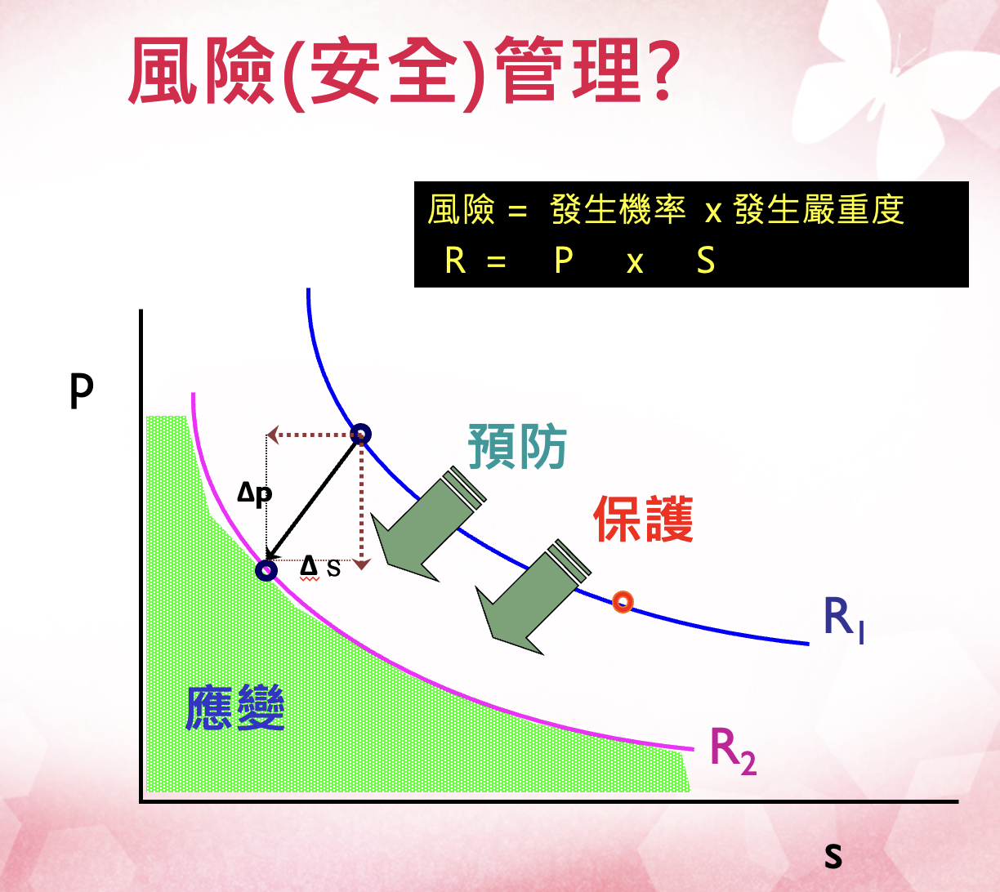

------------------------------------------------------------------------

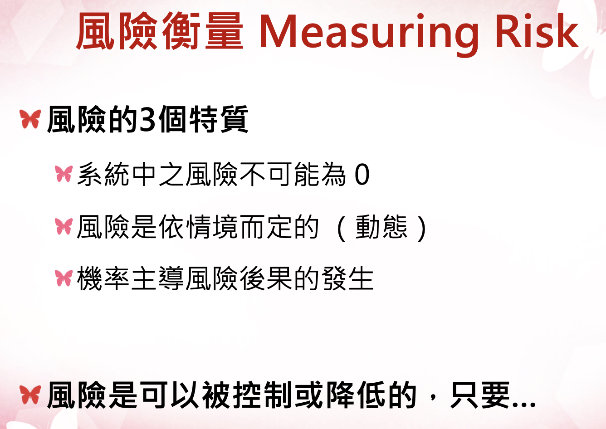

------------------------------------------------------------------------

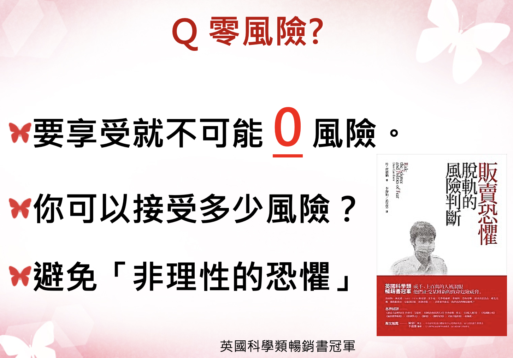

------------------------------------------------------------------------

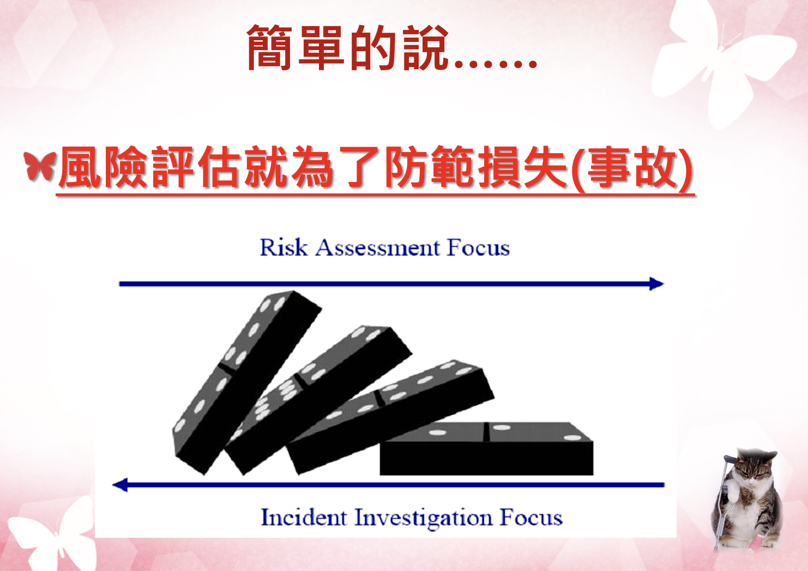

------------------------------------------------------------------------

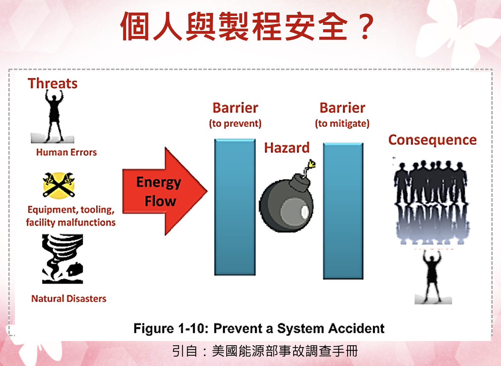

------------------------------------------------------------------------

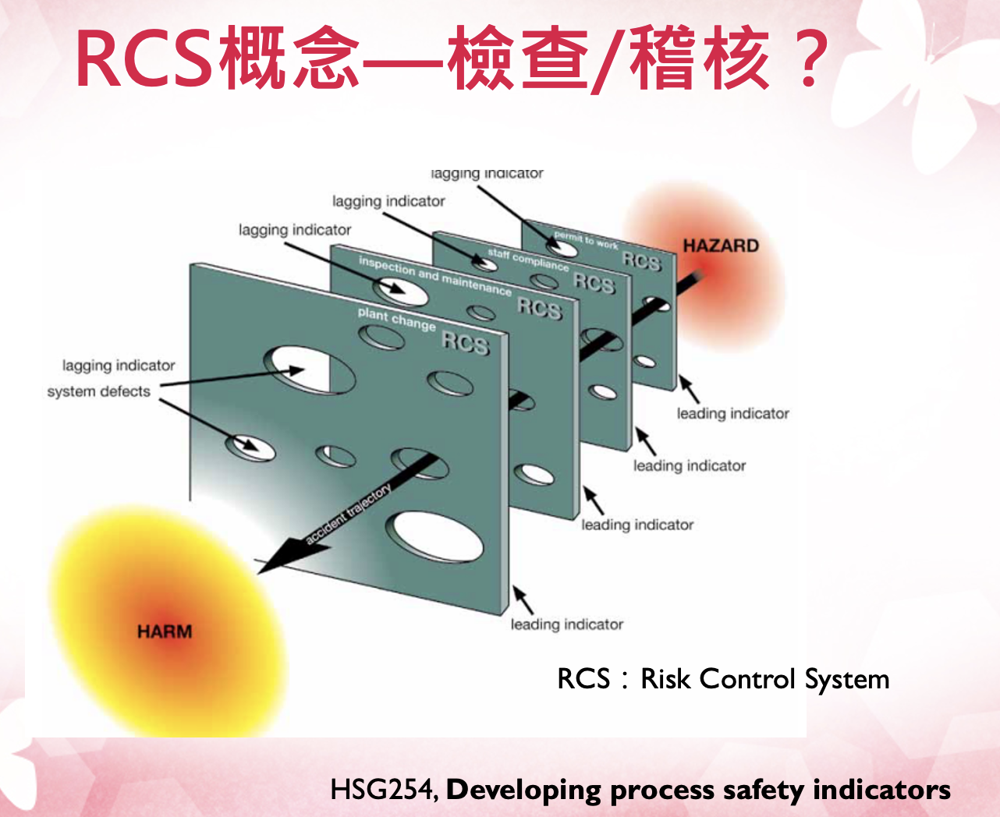

------------------------------------------------------------------------

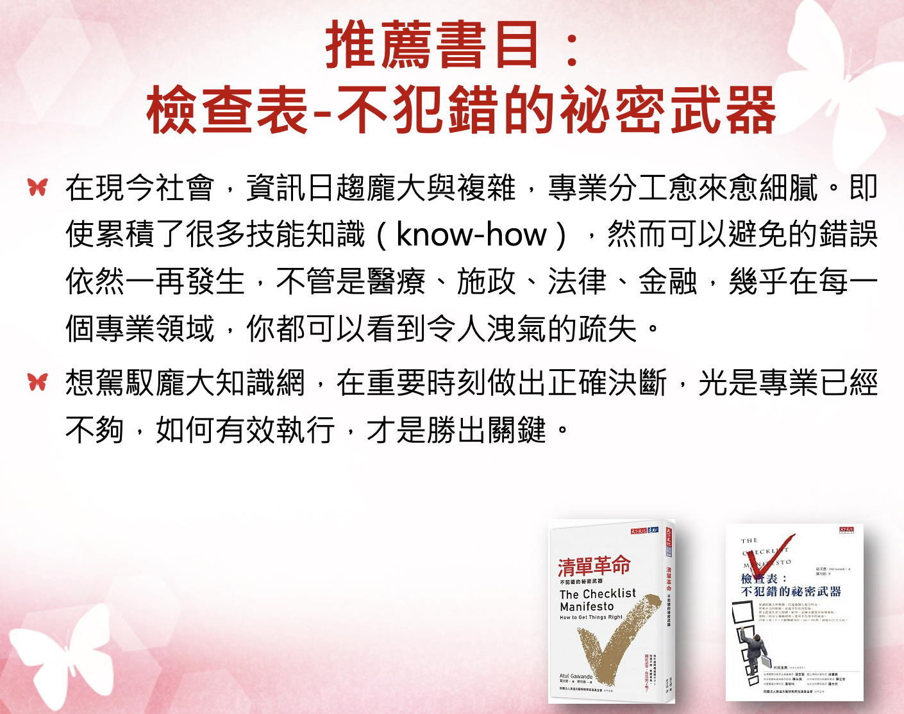

------------------------------------------------------------------------

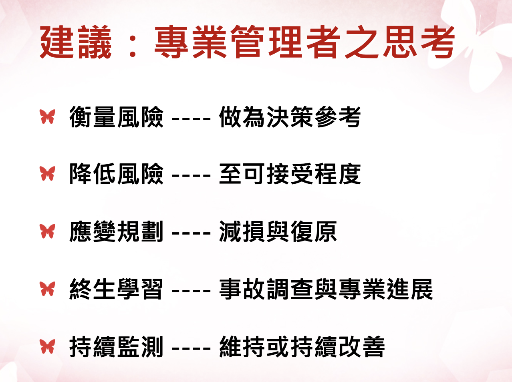

------------------------------------------------------------------------

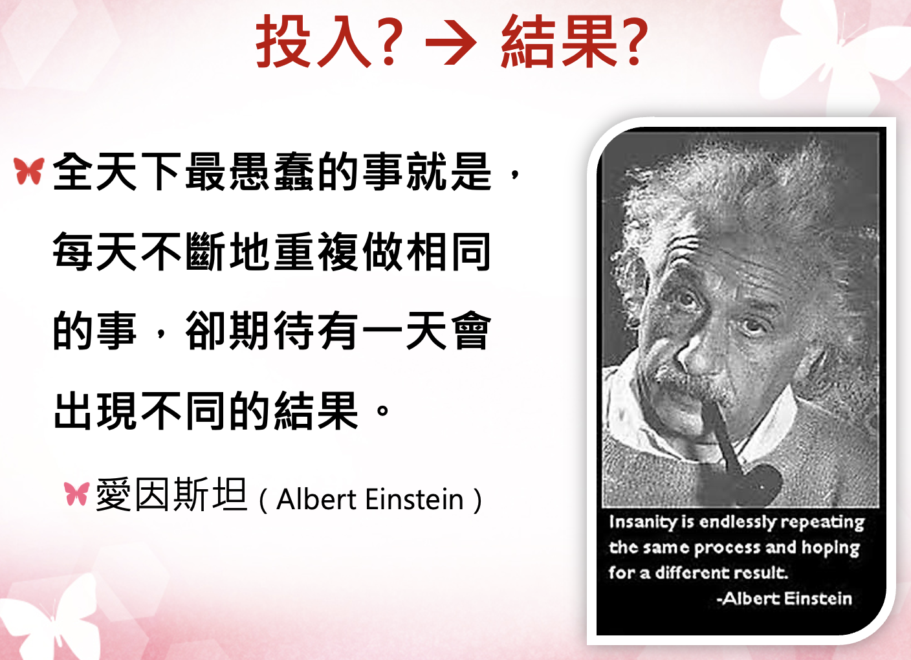

------------------------------------------------------------------------

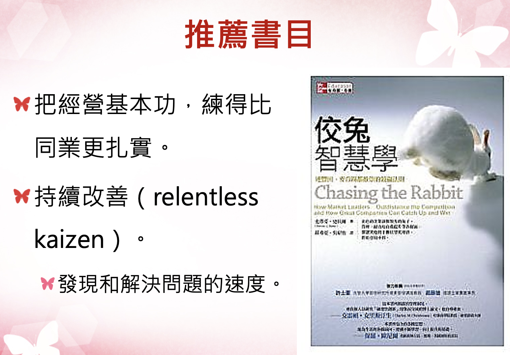

- 高速、高營運績效組織的成功，並非取決於聚集了所有具備某種特殊才能的員工。

- 以員工人數動輒成千上百，甚至上萬名的情況看來，這根本毫無可能。

- 這些組織締造高速的關鍵在於，「人盡其才，悉用其力」，刻意且持續地讓中等人才得以發揮到極致。

- 反觀其對手，卻平白糟蹋人力，讓員工為應付系統雜音而疲於奔命，反覆承受著挫折和失敗。

------------------------------------------------------------------------

------------------------------------------------------------------------

# 1. 職場風險評估總論

## 安全與衛生領域的風險評估

這份教材專為職安衛主管設計，旨在深度解析\*\*安全（Safety）**與**衛生（Hygiene）\*\*兩大領域的風險評估精要。透過通用步驟與與健康（專業毒理學）的並陳，學員將建立起「預見危害、科學評估、有效控制」的全方位預防管理思維，從源頭阻斷職業傷害（意外）與職業病的發生。

## 第一部分：通用風險評估五步驟 (HSE 模式 - 安全導向)

通用風險評估主要聚焦於**即時性、物理性**的傷害。這些危害通常是直觀可見的，依循英國安全衛生執行署（HSE）的經典五步驟（融合我國相關指引），其核心在於透過專業的現場巡查與常識判斷來防止傷亡意外。

### 步驟 1：辨識顯著危害 (Look for the Hazards)

- **管理深度解析**：管理者巡視現場時，應具備「預見性」視角。除了顯而易見的缺失，更要關注「潛在」的不安全狀態。例如：

  - **物理能量可能釋放**：如高壓蒸氣管線的腐蝕劣化、未固定的高壓鋼瓶、運轉中缺乏安全護罩的快速刀片等。

  - **環境動態可能危害**：濕滑地面不只是液體傾倒，也包含環境溼度凝結；堆放雜物不僅堵塞路口，更可能在地震時坍塌造成傷亡。

  - **人機互動介面**：堆高機在盲區的作業、員工因疲勞導致的誤操作情境等。

- **關鍵方法**：採取「行動巡檢」，落實到位查證，及徵詢第一線老員工，詢問：「在哪個作業環節你覺得最不合理？」或「哪台機器曾發生過『差點傷到人』的情況？」。

## 步驟 2：確認可能受到傷害的對象與方式 (Decide Who Might be Harmed)

- **重點**：不要僅列出姓名，而要分析**群體暴露的脆弱性**及其特定的受傷機制。

- **特殊族群考量**：

  - **青少年與新進勞工**：由於缺乏職涯中的「危險記憶」，常會為了追求效率而簡化安全流程。

  - **非固定雇員（承攬商/訪客）**：他們不熟悉廠內特定的應變程序。例如，化學品洩漏報警聲響時，他們可能不知道該往哪裡撤離。

  - **脆弱個體**：包含患有特定慢性病（如心臟病勞工在高溫環境）、孕婦（需防範體力負荷過重）或單獨作業者（發生心肌梗塞或受傷時無人呼救）。

## 步驟 3：評估風險並決定控制措施 (Evaluate and Decide)

- **目標：（ALARP 原則）** 判斷剩餘風險是否已降至「合理可行」的最低限度（As Low As Reasonably Practicable）。這涉及控制成本與風險降低效益之間的平衡。

- **控制層級（Hierarchy of Controls）應用**：

  1.  **消減 (Elimination)**：從設計階段就移除風險，如自動化倉儲取代人工搬運。

  2.  **取代 (Substitution)**：改用較低危險性的作業方式或材料。

  3.  **工程控制 (Engineering)**：這是最應投入預算的環節，如設置連鎖防護、遠端遙控作業。

  4.  **行政管理 (Administrative)**：包括建立作業許可證制度（PTW）、限制高風險區域的進入人數、教育訓練、制定ＳＯＰ等。

  5.  **個人防護裝備 (PPE)**：**嚴禁將 PPE 作為第一線或唯一手段**。主管需指導與監督 PPE 的正確配戴與耗材更換頻率。

## 步驟 4：記錄重要發現 (Record Your Findings)

- **法律與責任**：紀錄不僅是法規要求，更是發生爭議時的「免責與佐證」資料。

- **高品質紀錄的標準**：

  - 必須證明已進行過「適當且充分」的調查。

  - 展示已處理所有顯著危害。

  - 證明控制措施是與風險程度相稱的（Proportionate）。

### 步驟 5：審查與修訂 (Review and Revise)

- **觸發機制**：評估不是終點。當引進新設備、製程變更、或發生「事故或虛驚事故（Near Miss）」時，代表既有危害與風險評估可能存在盲點，必須立即重啟評估流程。

## 第二部分：化學健康風險評估 (毒理學模式 - 衛生導向)

化學品風險評估需具備科學廣度。由於化學傷害具備**長期性、隱蔽性與不可逆性**，管理者必須仰賴毒理學數據而非僅靠肉眼觀察或感覺。

### 1. 危害辨識 (Hazard Identification)

- **資訊解讀能力**：熟練查閱 SDS（安全資料表）第 2、11、15 節。辨識化學品是否具備「三致效應ＣＭＲ」（致癌、致突變、生殖毒性）。

- **環境特徵分析**：分析化學品的飽和蒸氣壓、高揮發性物質在通風不良處會迅速達到有害濃度。

## 2. 危害特徵描述與 ADME 程序 (Hazard Characterization)

- **毒理動力學（Toxicokinetics）解析**：

  {width="100%"}

  - **吸收 (Absorption)**：吸入是職場最危險途徑，肺泡巨大的交換面積使毒素直接進入血流。注意皮膚滲透，某些溶劑會攜帶其他溶質「穿透」防護手套。

  - **分布 (Distribution)**：化學品會儲存於人體「儲存庫」。如鉛儲存於骨骼、脂溶性溶劑存於脂肪。這會導致**動員作用 (Mobilization)**，使員工在停止暴露後血液中仍持續出現毒素。

  - **代謝 (Metabolism)**：身體透過酵素將化學物質轉化，可能降低或增加毒性。

  - **排泄 (Excretion)**：腎臟功能影響排毒效率。半衰期長的化學品更易造成蓄積性中毒。

## 3. 暴露評估與監控邏輯 (Exposure Assessment)

- **定量標準**：不僅看現場量測濃度（如 **8 小時時量平均濃度 (TWA)、ＳＴＥＬ等），更要掌握長期暴露概況（exposure profile）**。

- **生物監測 (Biomonitoring)**：必要時透過尿液或血液檢查，確認「總吸收量」，這比單純的環境空氣採樣更能精準反映勞工的真實風險。

### 4. 風險特徵描述與長期效應 (Risk Characterization)

- **潛伏期與慢性疾病**：（例）

  - **慢性肺部損傷**：如石棉引發的肺纖維化、長期粉塵導致的肺氣腫。

  - **癌症風險**：潛伏期常長達 20-40 年。這意味著今日的管理疏失，將在員工退休時以癌症形式顯現。

- **交互作用 (Interactions)**：

  - **協同效應 (Synergy)**：如吸菸勞工暴露於石棉，其癌症風險不是相加而是**相乘**。

  - **相加效應**：多種溶劑同時使用，會累加中樞神經系統的抑制效果。

## 第三部分：安全 vs. 衛生風險評估比較

| 比較項目 | 通用風險評估 (安全 - Safety) | 化學品風險評估 (衛生 - Hygiene) |
|----|----|----|
| **傷害性質** | 急性、即時發生（如骨折、電擊、爆炸傷）。 | 慢性、累積、延遲發生（如癌症、神經萎縮）。 |
| **危害感知** | 危害清晰可見（如漏電、轉動軸、不穩的梯子）。 | 危害常不可見（如無味蒸氣、亞微米粉塵）。 |
| **判定準則** | 機械安全標準、法規淨空間距、承重係數。 | **OEL**（暴露限值）、**TWA**、**ADME** 分布模型。 |
| **可逆性** | 外科損傷通常可修復。 | 器官損傷常具**不可逆性**（如肺纖維化、細胞突變）。 |
| **監控手段** | 安全巡檢、設備自動檢測、自動斷電。 | 空氣採樣、生物檢材採樣（尿/血）、肺功能監控。 |
| **主要侵入路徑** | 物理性機械能、熱能、電能接觸。 | **吸入**（最主）、皮膚滲透、體內化學代謝。 |
| **預防邏輯** | 阻斷接觸能量傳遞，隔離危險源。 | 降低累積暴露濃度、強化代謝排泄、縮短工時。 |

## 檢查員職涯經驗分享

- 營造工地職業衛生評估 （與現場職安人員協作）

- 產出：**營造作業健康危害評估**：何明信、游淳淼、謝聰敏、顏佐旻、李思玄，工業安全衛生月刊，2011年。

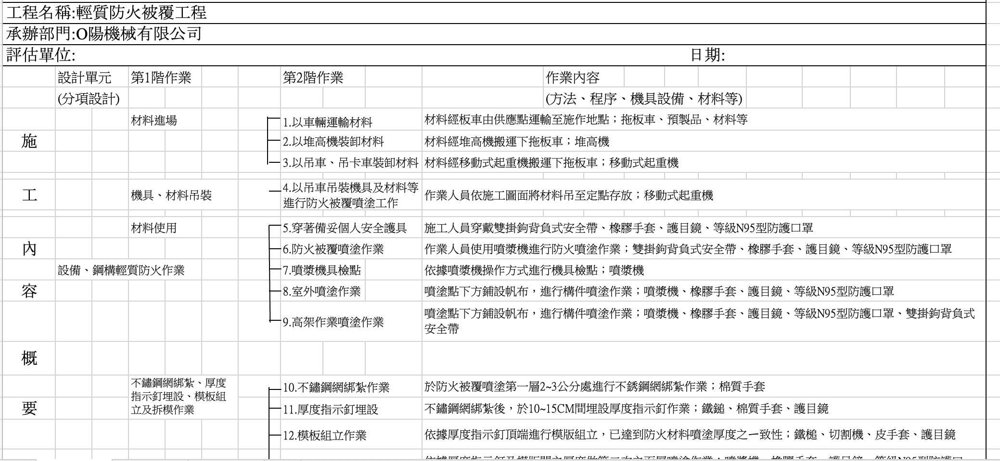

------------------------------------------------------------------------

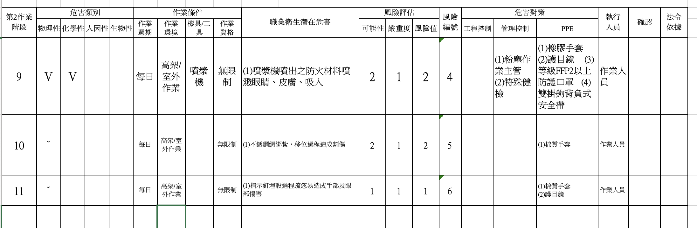

------------------------------------------------------------------------

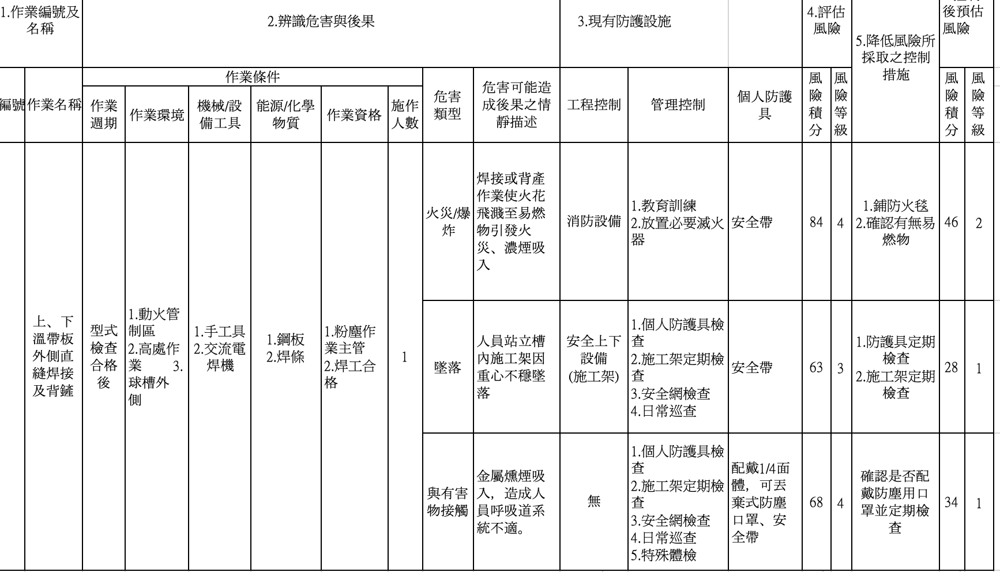

------------------------------------------------------------------------

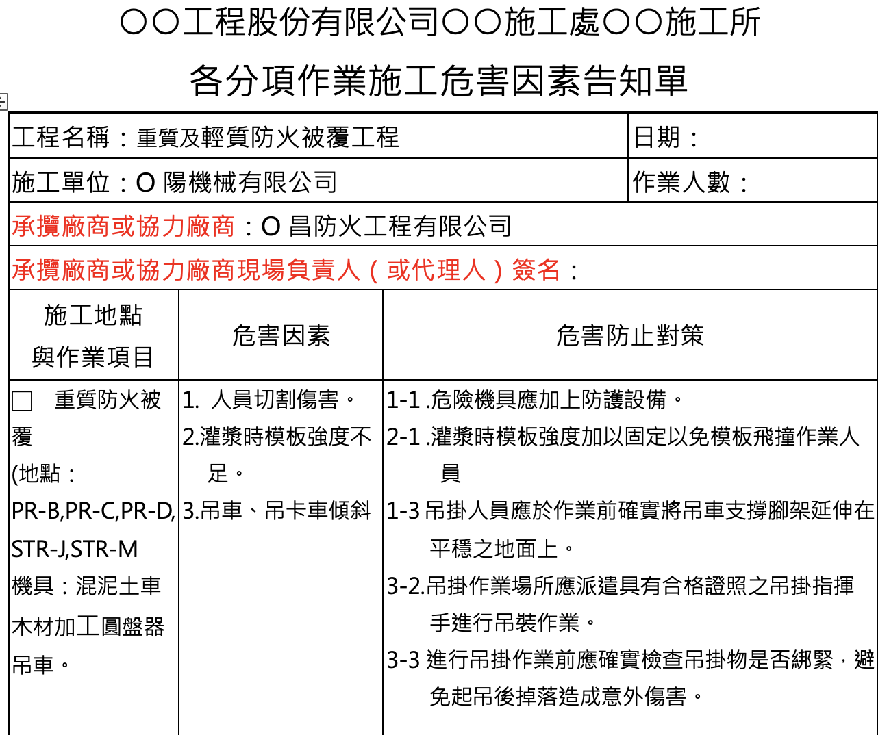

------------------------------------------------------------------------

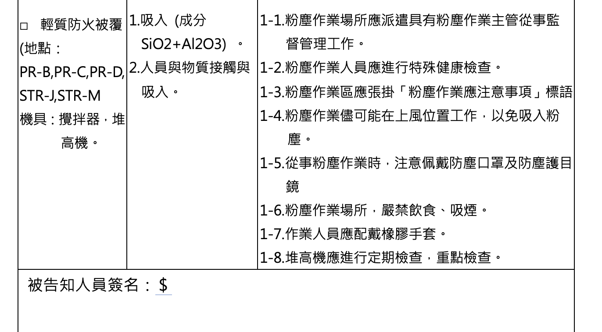

## 第四部分：職安衛專業人員的專業提升建議

為了具備卓越的職場風險評估與控制職能（Competence），專業人員可以從以下四個維度持續自我提升，從追求「合規者」轉型為「策略管理專家」：

### 1. 跨學科知識的深度與廣度

- **化學與毒理學深耕**：不要只滿足於讀懂 SDS。應研究第 11 節的毒理數據（如 $LD_{50}$、$LC_{50}$、$IDLH$），理解化學品的傷害機制。

- **工程與流體力學**：掌握局部排氣系統（LEV）的評估技術。能判斷捕捉風速是否真正將污染物帶離勞工呼吸帶，而非僅是「有抽風聲而已」。

- **倫理與法規**：熟悉 ISO 45001 與最新勞動法令，同時維持「保護勞工生命與健康與企業發展平衡」的專業倫理。

### 2. 數據解讀與證據轉化能力 (Evidence-based Action)

- **批判性思考**：學會質疑環境監測報告，採樣點是否設在「最糟情況」？採樣時間是否涵蓋了作業高峰期？統計推論暴露風險等。

- **流行病學應用**：觀察員工體檢報告的「趨勢」，若特定單位員工肝指數集體異常，即使環境監測合格，也應懷疑是否存在皮膚吸收或非典型暴露路徑的可能性。

## 3. 高階風險溝通與影響力 (Strategic Communication)

- **向上溝通**：學會將「安全與健康數據」轉化為「財務語言」，向高層解釋預防性控制能節省多少未來的停工、罰鍰、職災補償費用與商譽損失等。

- **向下溝通**：將枯燥的法規標準、OEL 限值轉化為感性敘事，如強調「為了二十年後能健康地陪伴家人，在一定狀況下，請選用正確呼吸防護具等」。

### 4. 國際視野與資訊同步

- **追蹤權威機構資訊**：定期訂閱 ＨＳＥ、ＯＳＨＡ、ＡＩＨＡ、勞安所、職安署等電子報或指南與研究報告等。

- **專業認證與社群**：積極參與國內外專業證照考試（如 職安衛技師、管理師、CIH、CSP），並透過案例研討汲取他人的失敗教訓，避免在自家企業重蹈覆轍。

## 對職安衛主管的實務建議

1.  **整合概念 (Integrated Vision)**：考量健康與安全，例如，通風櫃既是職業衛生設施（移除毒氣等有害物質），其馬達也可能需具備安全規格（防爆）。

2.  **專業判斷力**：例如，看懂 ＴＥＬ、ＬＥＬ、**LC50**（刺激濃度）、專業儀器設備與安全裝置等原理。

3.  **拒絕謬誤**：**留意倖存者偏差、確認偏誤、可得性偏誤等思維陷阱**，專注於**源頭控制**風險。

4.  **責任照顧 (Responsible Care)**：視野應超越廠房圍牆，關注社區健康與環境逸散（Fugitive Emissions），落實企業永續經營ＥＳＧ。

**總結：安全防護能確保勞工今日平安回家；衛生管理則能確保勞工在退休後依然擁有尊嚴與健康。而你的專業職能，則是這份承諾與期許的唯一保證。**

# 2. 科學研究-職業健康安全風險評估（OHSRA）系統性綜述

## 模型、方法與應用 (2002–2022) — Liu et al. (2023) Safety Science

- OHS: Occupational health and safety 職業安全衛生

- RA: Risk assessment 風險評估

> 文獻
>
> Liu, R., Liu, H. C., Shi, H., & Gu, X. Z. (2023). Occupational health and safety risk assessment: A systematic literature review of models, methods, and applications. *Safety Science*, 160, 106050.

## 1. 研究背景

### 什麼是職業健康安全（OHS）？

- **OHS**：多學科活動，旨在識別、評估和控制工作場所中可能損害工人健康與安全的危害
- 目標：
  - 預防職傷與職業病
  - 營造安全、健康的工作環境
  - 提升工人身體、心理和社會福祉
  - 幫助工人實現生產性的社會與經濟生活

> 📌 風險管理是組織OHS的核心

## 什麼是 OHS 風險評估（OHSRA）？

- **OHSRA** 是 OHS 風險管理中最關鍵的步驟
- 四個階段：
  1.  識別已知或潛在的職業危害
  2.  確認每個危害的原因和可能後果
  3.  評估風險並制定防護措施
  4.  記錄重要結果並審查評估資訊

## 這篇綜述產出緣由？

- 以往綜述的侷限：
  - 主要關注特定行業（建築、採礦）
  - 缺少對 **數學模型** 的系統梳理
  - 未全面分析風險準則、權重方法和不確定性處理
- **本研究目標**（2002–2022，Web of Science）：
  1.  有哪些 OHSRA 方法？
  2.  採用哪些風險基準？
  3.  如何確定基準權重？
  4.  如何處理專家評估的不確定性？

------------------------------------------------------------------------

## 2. 綜述方法（PRISMA）

### 文獻檢索策略

- **資料庫**：Web of Science（高品質、高影響力期刊）
- **時間跨度**：2002 年 1 月 – 2022 年 11 月
- **關鍵詞**：兩層結構
  - 主關鍵詞：“Occupational health and safety” / “OHS” / “Occupational risk” 等
  - 從屬關鍵詞：“risk assessment” / “risk evaluation” / “risk analysis”
- **語言與類型**：僅英文期刊論文（排除會議論文、綜述、教科書、學位論文）

## 篩選流程

| 步驟 | 操作                            | 剩餘篇數 |
|:-----|:--------------------------------|:--------:|
| 1    | 初始檢索                        |   1214   |
| 2    | 去重                            |   923    |
| 3    | 標題篩選                        |   367    |
| 4    | 摘要篩選                        |   215    |
| 5    | 全文篩選（納入定量 OHSRA 模型） |  **88**  |

> ✅ **納入標準**：論文提出了新的 OHSRA 定量模型或方法\
> ❌ **排除**：僅自動化 OHSRA、純應用案例（無新模型）、會議論文等

------------------------------------------------------------------------

## 3. OHSRA 方法分類框架

### 七大類別概覽

| 類別                                   | 篇數 |   佔比    |
|:---------------------------------------|:----:|:---------:|
| ① 兩兩比較法 (Pairwise comparison)     |  12  |   13.6%   |
| ② 距離度量法 (Distance-based)          |  12  |   13.6%   |
| ③ 折衷方法 (Compromise)                |  13  |   14.8%   |
| ④ 價值/效用法 (Value & utility)        |  16  | **18.2%** |
| ⑤ 人工智慧法 (Artificial intelligence) |  11  |   12.5%   |
| ⑥ 整合方法 (Integrated)                |  4   |   4.5%    |
| ⑦ 其他方法 (Others)                    |  20  |   22.7%   |

> 🔥 **價值/效用法是最熱門的類別**

## 類別 ①：兩兩比較法 {visibility="hidden"}

- **核心方法**：AHP（層次分析法）及其擴展
- **代表研究**：
  - Badri et al. (2012) – 工業專案風險評估
  - Aminbakhsh et al. (2013) – 安全成本 + AHP
  - Kokangul et al. (2017) – Fine-Kinney + AHP
  - Tepe & Kaya (2020) – Pythagorean 模糊 AHP + 餘弦相似度
  - Unver & Ergenc (2021) – 森林伐木活動風險評估
- **特點**：透過成對比較建構判斷矩陣，處理主觀偏好

## 類別 ②：距離度量法 {visibility="hidden"}

- **核心方法**：TOPSIS（**9 篇**，最常用）、DEMATEL、MABAC、EDAS、MAIRCA
- **代表研究**：
  - Gul & Guneri (2016) – 模糊 TOPSIS
  - Mohandes & Zhang (2021) – 永續建築專案
  - Liu et al. (2020a) – 雙極模糊 MABAC
  - Seker et al. (2017) – DEMATEL + 灰系統理論
- **特點**：透過計算方案與理想解的距離進行排序

## 類別 ③：折衷方法 {visibility="hidden"}

- **核心方法**：VIKOR（**9 篇**）、CoCoSo、MOORA
- **代表研究**：
  - Gul et al. (2017, 2018, 2022) – 模糊 VIKOR 系列
  - Ak et al. (2022) – 貝氏 BWM + VIKOR
  - Chen et al. (2022) – Fermatean 模糊語言 + CoCoSo
  - Mete (2019) – Pythagorean 模糊 AHP + MOORA
- **特點**：最大化群體效用，最小化個體遺憾，適合妥協解

## 類別 ④：價值/效用法

- **核心方法**：**風險評分法（13 篇，單方法最多）**、**風險矩陣**、**SWOT**、MARCOS、COPRAS
- **代表研究**：
  - Papadakis & Chalkidou (2008) – 暴露-損害方法
  - Gnoni & Bragatto (2013) – 指數法（石化廠）
  - Adem et al. (2018) – 猶豫模糊語言 SWOT
  - Celik & Gul (2021) – 區間 type-2 模糊 + BWM + MARCOS
  - Hacibektasoglu et al. (2021) – SWARA + COPRAS
- **特點**：基於評分函數或效用值直接排序

## 類別 ⑤：人工智慧法

- **核心方法**：模糊規則庫系統（11 篇）、神經模糊推理、遺傳演算法
- **代表研究**：
  - Beriha et al. (2012) – 模糊邏輯系統
  - Fragiadakis et al. (2014) – 神經模糊推理（造船）
  - Gul & Celik (2018) – Fine-Kinney + 模糊規則專家系統
  - Ilbahar et al. (2018) – Pythagorean 模糊 AHP + 模糊推理系統
  - Durdyev et al. (2022) – 模糊 Delphi + 模糊 BWM + 規則推理
- **特點**：模擬專家推理，處理非線性複雜關係

## 類別 ⑥：整合方法 {visibility="hidden"}

- 僅 4 篇，但方法組合新穎：
  - Bao et al. (2017) – FMEA + 改進 AHP（礦業職業病）
  - Aslantas et al. (2020) – TOPSIS + VIKOR（區間值 Pythagorean 模糊）
  - Liu et al. (2021c) – TODIM + PROMETHEE（語言球形模糊）
  - Koulinas et al. (2019) – AHP + PART（建築工地）
- **特點**：融合兩種或以上 MCDM 方法，取長補短

## 類別 ⑦：其他方法

- 包括：貝氏網路（3 篇）、事件樹（2 篇）、故障樹、Petri 網、Bow-tie、聚類演算法等
- **代表研究**：
  - Papazoglou & Ale (2007) – 事件樹量化
  - Ale et al. (2008) – Bow-tie 用於核/化工廠
  - Mutlu & Altuntas (2019) – FMEA + FTA + BIFPET
  - Sarkar et al. (2022) – 自組織地圖 + 遺傳 K-means 聚類
- **特點**：機率化建模，適合因果鏈分析

------------------------------------------------------------------------

## 4. 風險基準分析

### 最常用的風險準則（出現 ≥2 次）

| 風險準則                          | 出現次數 | 解釋               |
|:----------------------------------|:--------:|:-------------------|
| **Probability**（機率/頻率）      |  **79**  | 危害發生的可能性   |
| **Severity**（嚴重度）            |  **57**  | 後果的嚴重程度     |
| **Detectability**（可探測性）     |    13    | 危害被發現的難易   |
| **Exposure**（暴露頻率）          |    9     | 工人接觸危害的頻率 |
| **Consequence**（後果）           |    7     | 廣義後果           |
| **Undetectability**（不可探測性） |    5     | 探測性反面         |
| **Cost**（成本）                  |    4     | 經濟成本           |

## 風險準則數量分佈

- **2 個準則**：11 篇 (12.5%)
- **3 個準則**：**27 篇 (30.7%)** ← 最常見
- **4 個準則**：4 篇 (4.5%)
- **5 個準則**：4 篇 (4.5%)
- **無明確準則**：22 篇 (25%)
- **其他**：20 篇 (22.7%)

> 📌 最經典的組合：**機率 + 嚴重度 + 可探測性**（類似 FMEA 的 RPN）

------------------------------------------------------------------------

## 5. 風險準則權重方法 {visibility="hidden"}

### 權重方法使用情況

- 88 篇中，**48 篇** 明確計算了風險準則的權重
- 其餘 40 篇採用等權或直接評分（未加權）

### 各種權重方法歸納

| 方法類型          | 具體方法                |  使用頻率  |
|:------------------|:------------------------|:----------:|
| **主觀方法**      | 模糊 AHP                | **最流行** |
|                   | 經典 AHP                |    較多    |
|                   | BWM (Best-Worst Method) |    少量    |
|                   | SWARA                   |    少量    |
|                   | 德爾菲法                |    少量    |
| **客觀/組合方法** | 熵權法                  |    極少    |
|                   | ITARA (無差異閾值法)    |    極少    |
|                   | BWRA (區塊加權)         |    極少    |

> 💡 **未來方向**：更多採用客觀或組合權重，減少主觀偏差

------------------------------------------------------------------------

## 6. 不確定性處理方法 {visibility="hidden"}

### 模糊理論與擴展

- 88 篇中 **51 篇** 使用了模糊/不確定性理論，**37 篇**仍用明確數值

| 方法                          |  次數  |
|:------------------------------|:------:|
| 三角模糊數 (TFNs)             | **19** |
| Pythagorean 模糊集            |   5    |
| 區間值 Pythagorean 模糊集     |   4    |
| 梯形模糊數                    |   3    |
| 猶豫模糊語言術語集 (HFLTS)    |   2    |
| 區間 type-2 模糊集            |   2    |
| 球形模糊集 / 語言球形模糊集   |   2    |
| 雙極模糊集、q-梯 orthopair 等 |  各 1  |

> ✅ 語言表示法（猶豫模糊、Fermatean 語言等）是新興趨勢

------------------------------------------------------------------------

## 7. 文獻計量分析

### 發表年份趨勢

- 2002–2016：低產年份（不足 5 篇/年）
- **2017 年之後顯著增長**
- 2018–2022 年發表量佔全部文獻的 **69.3%**
- 2021 年達到峰值 15 篇，2022 年（僅 11 個月）13 篇

> 📈 增長驅動：ISO 45001（2018）、ISO 31000（2018）、企業 OHS 意識提升

### 期刊分佈（≥2 篇）

| 期刊                                                          |  篇數  |
|:--------------------------------------------------------------|:------:|
| *Safety Science*                                              | **15** |
| *Human and Ecological Risk Assessment*                        |   9    |
| *International Journal of Occupational Safety and Ergonomics* |   6    |
| *Journal of Cleaner Production*                               |   3    |
| *Reliability Engineering & System Safety*                     |   3    |
| *Sustainability*                                              |   2    |

## 國家/地區分佈

- **土耳其**：37 篇（佔比 42.0%）
- **中國**：13 篇（14.8%）
- 兩國合計 **56.8%**
- 其他國家：印度、伊朗、義大利、馬來西亞等

### 應用領域分佈

| 行業       |  篇數  |
|:-----------|:------:|
| **建築業** | **31** |
| **製造業** | **25** |
| 礦業       |   7    |
| 能源與化工 |   7    |
| 服務業     |   5    |
| 交通運輸   |   3    |

> 🏗️ 建築業和製造業是 OHSRA 模型最主要的兩大應用場景

------------------------------------------------------------------------

## 8. 最具影響力論文（TOP 10） {visibility="hidden"}

### 按總被引 / 年均被引排序

| 文獻 | 核心方法 | 年均被引 | 總被引 |
|:---|:---|:--:|:--:|
| Ilbahar et al. (2018) | Pythagorean 模糊 AHP + 模糊推理系統 | **51.2** | 256 |
| Kokangul et al. (2017) | AHP + Fine-Kinney | 23.3 | 140 |
| Aminbakhsh et al. (2013) | 安全成本 + AHP | 22.2 | 222 |
| Gul (2020a) | 模糊 AHP + VIKOR | 19.0 | 57 |
| Karasan et al. (2018) | 安全與關鍵效應分析 + Pythagorean 模糊 | 17.0 | 85 |
| Gul & Ak (2018) | Pythagorean 模糊 TOPSIS | 16.0 | 80 |
| Gul & Guneri (2016) | 模糊 TOPSIS | 14.9 | 104 |
| Mete (2019) | FMEA + AHP + MOORA (Pythagorean 模糊) | 14.3 | 57 |
| Koulinas et al. (2019) | 模糊 AHP + PART | 12.8 | 51 |
| Mohandes et al. (2020) | 模糊 MCDM | 12.7 | 38 |

> 🏆 Ilbahar et al. (2018) 既是年均被引最高，也是總被引最高

## 方法使用頻率總結（所有論文）

| 方法                                    |  次數  |
|:----------------------------------------|:------:|
| 風險評分法                              | **13** |
| 模糊規則庫系統                          |   11   |
| VIKOR                                   |   9    |
| TOPSIS                                  |   9    |
| AHP                                     |   8    |
| MOORA                                   |   3    |
| 貝氏網路                                |   3    |
| DEMATEL, MABAC, EDAS, COPRAS, MARCOS 等 | 各 1–2 |

------------------------------------------------------------------------

## 9. 當前挑戰與侷限

### 研究不足之處

1.  **靜態評估**：大多數模型只能處理固定的一組危害，不能隨時間、空間動態變化\
2.  **專家小組規模小**：通常由少量專家評估，難以反映分散式組織的實際情況\
3.  **不確定性處理仍不充分**：37 篇使用精確數值，忽略模糊性\
4.  **主觀權重佔主導**：模糊 AHP 雖普及，但缺乏客觀數據支撐\
5.  **缺少統一的風險準則體系**：不同研究採用不同準則，難以橫向比較

------------------------------------------------------------------------

## 10. 未來研究方向（原文建議 8 條） {visibility="hidden"}

### 方向 ①：更強大的不確定性理論

- 採用多粒度不平衡猶豫模糊語言術語集\
- 區間語言術語多值集\
- q-梯 orthopair 立方模糊集

### 方向 ②：專家衝突消除

- 引入衝突最小化演算法\
- 共識達成模型（如 Delphi 變體，回饋機制）

### 方向 ③：客觀 / 組合權重

- 熵權法、離差最大化法、CRITIC 等\
- 主觀+客觀的組合賦權

### 方向 ④：系統化風險準則體系

- 建立分層的、標準化的風險準則框架\
- 類似 ISO 31000 的通用結構

### 方向 ⑤：新型 MCDM 模型

- 開發更適合 OHSRA 的新 MCDM 方法\
- 多種 MCDM 融合提高穩健性（如整合 VIKOR+TOPSIS+ELECTRE）

### 方向 ⑥：動態 OHSRA 模型

- 考慮時間、空間、環境因素變化\
- 即時數據驅動的動態風險評估

### 方向 ⑦：大群體決策

- 擴展 OHSRA 到大群體環境（例如分散式組織）\
- 採用大數據和社群網路分析

### 方向 ⑧：人工智慧與深度學習

- 利用深度學習自動學習風險準則權重\
- 從歷史事故數據中提取模式\
- 建構智慧預警系統

> 🤖 **最有潛力的方向**：深度學習和動態 OHSRA

------------------------------------------------------------------------

## 11. 結論與啟示

### 核心結論

1.  **領域快速發展**：2017 年後論文數量激增，已成為安全管理研究熱點\
2.  **方法多樣化**、**模糊集應用最廣**\
3.  **風險準則聚焦**：**機率、嚴重度、可探測性是最核心三個指標**\
4.  **應用高度集中**：建築業和製造業佔 60% 以上，土耳其和中國是研究主力\
5.  **存在明顯侷限**：靜態、小群體、主觀權重為主

### 對實務者的啟示

- 選擇 OHSRA 方法時，應根據行業特點、數據可得性、不確定性程度靈活選擇

------------------------------------------------------------------------

## Ｑ、**請舉例（營造業施工風險評估與一般行業的風險評估）**

::: callout-note
研究指出：發生機率（Probability）、嚴重性（Severity）與可偵測性（Detectability）是最常被納入考量的三大準則（30.7% 的文獻）。
:::

### 三大風險準則簡要定義

| 準則 | 說明 |
|:---|:---|
| **發生機率** | 危害事件發生的可能性（高/中/低，或量化頻率） |
| **嚴重性** | 事件發生後，對人員健康、安全造成的後果程度（例如：輕傷、重傷、死亡） |
| **可偵測性** | 在事件發生前，能否透過檢查、監測、警報等方式發現危害存在或其前兆 |

## Ａ. 營造業**外牆施工墜落風險**評估案例

- 工人於 10 公尺高之施工架上進行外牆貼磚，未設置完整護欄，需佩戴安全帶。

### 三大準則評估

+--------------+---------------+-------------------------------------------------------------------------------------------+
| 準則         | 評估等級      | 說明                                                                                      |
+:=============+:==============+:==========================================================================================+
| **機率**     | **高**        | 施工架未每日檢查，天候變化（強風、下雨）頻繁，工人疲勞或未正確鉤掛安全帶 → 墜落可能性高。 |
+--------------+---------------+-------------------------------------------------------------------------------------------+
| **嚴重性**   | **非常高**    | 10 公尺高度墜落，極可能導致死亡或多處骨折、重傷。                                         |
+--------------+---------------+-------------------------------------------------------------------------------------------+
| **可偵測性** | **低 → 中等** | • 安全帶掛點可由監工目視檢查（可偵測）\                                                   |
|              |               | • 但施工架組立缺失（螺絲鬆脫、踏板未固定）在每日作業前若未詳細查驗，不易偵測。\           |
|              |               | • 天候突變之前兆（風速計）若未安裝，則無法預警。                                          |
+--------------+---------------+-------------------------------------------------------------------------------------------+

### 常見改善措施（降低風險）

- 設置完整護欄、安全母索（降低機率）

- 使用個人墜落防護系統（降低嚴重性）

- 每日作業前檢查施工架與安全帶掛點（提高可偵測性）

::: callout-tip
**可偵測性**往往與「定期巡檢」、「安全觀察」密切相關
:::

## Ｂ. **長時間重複組裝作業導致腕隧道症候群**

- 生產線員工每日重複相同手腕動作（鎖螺絲、組裝小型零件），持續 8 小時，無適當休息或輔助工具。

### 三大準則評估

+--------------+-------------+----------------------------------------------------------------+
| 準則         | 評估等級    | 說明                                                           |
+:=============+:============+:===============================================================+
| **機率**     | **中 → 高** | 若作業節奏快、年資長，罹患累積性肌肉骨骼疾病的機率會顯著上升。 |
+--------------+-------------+----------------------------------------------------------------+
| **嚴重性**   | **中**      | 可能導致手腕麻痛、無力，需手術或長期復健，但通常不致命。       |
+--------------+-------------+----------------------------------------------------------------+
| **可偵測性** | **低**      | • 初期症狀（輕微麻木）易被忽視。\                              |
|              |             | • 無即時監測儀器，需依賴員工自覺與定期健康問卷。\              |
|              |             | • 作業現場不易用目視發現「風險累積」。                         |
+--------------+-------------+----------------------------------------------------------------+

### 常見改善措施

- 調整工作檯高度、提供電動工具（降低機率）

- 增加休息頻率、工作輪調（降低機率及嚴重性）

- 定期人因危害評估、員工自報症狀調查（提高可偵測性）

::: callout-tip
強調「健康監測」與「主訴回報」的可偵測方式
:::

## C. **可偵測性 (D) 與控制措施關係？**

- **加入 D 之後**，風險評估變為：$R=P×S×D$

- **加入可偵測性 (Detectability, D) 能夠有效減少控制措施的失效**，不論是來自人為失誤或自然因素（例如設備老化、天候變化）

- 核心機制：偵測 → 預警 → 補救

  - 提高可偵測性 → 及早發現危害徵兆或控制措施異常 → 即時介入 → **避免危害真正發生** → 等同於降低了「發生機率 (P)」。

## **D. 可偵測性 (D)** 對人為失效的影響

人為失效例如：操作錯誤、忘記檢查、疏於維護、違反程序。

| 控制措施 | 失效模式 | 可偵測性設計 | 效果 |
|:---|:---|:---|:---|
| 每日施工架檢查 | 工人偷懶未確實檢查 | 安全監工隨機抽驗 + 電子簽核系統（未簽 → 警報） | 失效立即被發現，可要求補做 → 降低 P |
| 戴安全帽 | 工人脫帽休息時未戴 | AI 攝影機偵測未戴安全帽 → 即時語音提醒 | 失效秒級偵測 → 立即改正 → 減少墜落物砸傷風險 |
| 高風險作業許可證 | 忘記簽核就施工 | 電子門禁系統：未簽核無法進入作業區 | 失效被系統阻擋 → 強制執行程序 → P 顯著下降 |

> - **可偵測性將「隱性的人為失效」轉為「顯性」，讓管理者有機會即時糾正**，而非等到事故發生。
>
>   - D 分數越高（越難偵測） → RPN 越高 → 需要優先改善 **偵測能力**。
>
>   - 改善偵測能力後，D 分數降低 → RPN 降低 → 實際上 P 也因為及時介入而下降。
>
> 實務上會看到許多風險改善措施其實是**建置監測、檢查、警報系統**，而這些正是為了提升可偵測性，進而降低控制措施的失效風險。

::: {.callout-important appearance="simple" icon="false"}
**加入可偵測性，等於為控制措施裝上「監視器」與「警報器」。**
:::

## 12. 參考文獻

> Liu, R., Liu, H. C., Shi, H., & Gu, X. Z. (2023). Occupational health and safety risk assessment: A systematic literature review of models, methods, and applications. *Safety Science*, 160, 106050.
>
> [點此查看原文 DOI](https://doi.org/10.1016/j.ssci.2022.106050)

**資料庫**：Web of Science\
**方法**：PRISMA 系統性綜述\
**納入文獻**：88 篇（2002–2022）\
**分類**：7 大模型類別

------------------------------------------------------------------------

## 13. 自我詢答？

- ❓ 您所在領域主要使用哪種風險評估方法？\
- ❓ 當遇到專家意見衝突或數據不確定的問題時，如何處理？\
- ❓ 動態風險評估在您的場景中有多重要？

> 🗣️ 提問與分享！

------------------------------------------------------------------------

# 3. 專業論述 - 風險與決策

### （待撰寫與分享...）

# 4. 推薦參考資料

## 練基本功，多利用ＡＩ工具協助你閱讀....

- Successful health and safety management ,HSG65, HSE ,2013

- Five steps to risk assessment, INDG163(rev3), 2011

- Investigating accidents and incidents, HSG245, 2004

- Reducing error and influencing behaviour , HSG48 , HSE, 1999

- Managing competence for safety-related systems, HSE, 2006

- Health and safety training，INDG345(rev1), HSE, 2012.

- A Guide to measuring Health & Safety Performance, HSE, 2001

- **換你來，自己建構....**

# 5. 風險評估的日常運用

Q1：問題＿食物外送員車禍風險較高嗎 ? （相對風險ＯＲ）

Q2：問題＿檢查員會待多久？ （存活分析）

Q3：換你來...
