## 課程大綱

1.  **高壓氣體勞工安全規則**
    - 高壓氣體定義與分類
    - 製造、供應、儲存、運輸及消費安全
    - 設備安全設施與安全管理
2.  **起重升降機具安全規則**
    - 危險性機械定義與分類
    - 固定式、移動式起重機安全管理
    - 吊掛作業與搭乘設備規範
3.  **鍋爐及壓力容器安全規則**
    - 危險性設備定義與分類
    - 鍋爐與壓力容器之操作管理
    - 安全閥與附屬品管理

# 第一部：高壓氣體勞工安全規則

## 高壓氣體生命週期與法規章節對照

+------------------+----------------------------------------------------------------+-------------------------------+
| 生命週期         | 階段定義與管理核心                                             | 對應法規章節                  |
+==================+================================================================+===============================+
| **一、生產分裝** | 將氣體處理成高壓狀態，以及灌注於儲槽或容器。                   | **第二章 製造安全設施**       |
+------------------+----------------------------------------------------------------+-------------------------------+
| **二、移轉**     | 透過容器或導管，將高壓氣體的所有權移轉給消費者。               | **第三章 供應安全設施**       |
+------------------+----------------------------------------------------------------+-------------------------------+
| **三、儲存**     | 將氣體滯留存放於固定式「儲槽」或移動式「容器」中。             | **第四章 儲存安全設施**       |
+------------------+----------------------------------------------------------------+-------------------------------+
| **四、運送**     | 以槽車、一般車輛載運，或透過長途地下導管輸送。                 | **第五章 運輸安全設施**       |
+------------------+----------------------------------------------------------------+-------------------------------+
| **五、降壓使用** | 將高壓氣體「減壓」成非高壓狀態，以供後續燃燒、反應或溶解使用。 | **第六章 高壓氣體消費設施**   |
+------------------+----------------------------------------------------------------+-------------------------------+
| **六、終點**     | 將設備或容器內部的高壓氣體向大氣或環境中「緩緩擴散」的機制。   | **第九章 可燃性氣體等之廢棄** |
+------------------+----------------------------------------------------------------+-------------------------------+
| **管理**         | 依廠場規模設置專責的負責人與作業主管，建立監督與自動檢查機制。 | **第十章 安全管理**           |
+------------------+----------------------------------------------------------------+-------------------------------+

## 高壓氣體生命週期

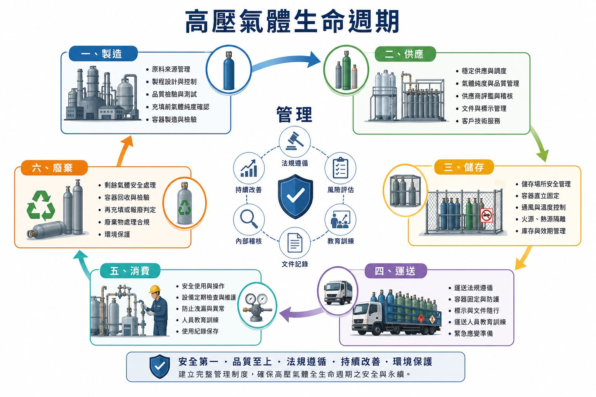{.lightbox}

## 高壓氣體的法定定義 {.smaller}

《高壓氣體勞工安全規則》第2條 - **高壓氣體**包含四類：

+--------------+-------------------------+----------------------------------------------------------+
|              | 類型                    | 條件                                                     |
+==============+=========================+==========================================================+
| **氣體**     | **壓縮氣體** (不含乙炔) | 常用溫度下，表壓力**≧10 kg/cm²** (1 MPa) **或**          |
|              |                         |                                                          |
|              |                         | 35℃時壓力≧10 kg/cm²                                      |
+--------------+-------------------------+----------------------------------------------------------+
|              | **壓縮乙炔氣**          | 常用溫度下，**表壓力≧2 kg/cm²** (0.2 MPa) **或**         |
|              |                         |                                                          |
|              |                         | 15℃時壓力≧2 kg/cm²                                       |
+--------------+-------------------------+----------------------------------------------------------+
| **液體**     | **液化氣體**            | 常用溫度下，**表壓力≧2 kg/cm²** **或**                   |
|              |                         |                                                          |
|              |                         | 35℃以下壓力達2 kg/cm² 之液化氣體                         |
+--------------+-------------------------+----------------------------------------------------------+
|              | **指定液化氣體**        | 35℃時壓力\>**0 kg/cm² 之液化**氯化氫、溴甲烷、環氧乙烷等 |
|              |                         |                                                          |
|              |                         | (具毒性/爆炸性)                                          |
+--------------+-------------------------+----------------------------------------------------------+

> **常用溫度**：指高壓氣體容器、裝置等通常使用或操作之溫度。

## 高壓氣體的法定定義

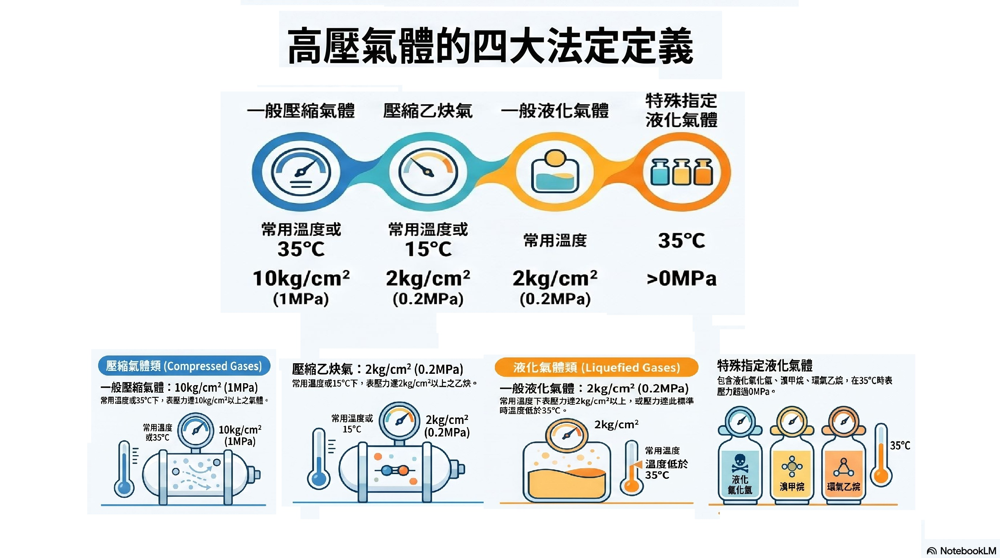{.lightbox fig-align="center" width="100%"}

## 高壓氣體判定計算實例 {.smaller}

**理想氣體公式**：$PV = nRT$ ⇒ $P/T = \text{定值}$

**例**：某氣體於 0℃ 時表壓力 9 kg/cm²，推算 35℃ 時壓力是否達 10 kg/cm² 以上？

$$\begin{aligned}
P_{1} &= (P_{0}+1.033) \times \frac{273+35}{273} - 1.033 \\[2mm]
&= (9+1.033) \times \frac{308}{273} - 1.033 \\[2mm]
&= 10.286 \ \text{kg/cm}^2 \quad \Rightarrow \text{屬於高壓氣體}
\end{aligned}$$

> **判斷練習**\
> (1) 15℃、1.8 kg/cm² 之乙炔氣體？ ⇒ 未達 2 kg/cm²，不屬高壓氣體。\
> (2) 25℃、9.9 kg/cm² 之氫氣？ ⇒ 不屬高壓氣體，**但**需推算35℃壓力，若\>10 kg/cm²，屬高壓氣體。

## (灌氣/殘氣)容器、(氣體、高壓氣體、處理)設備

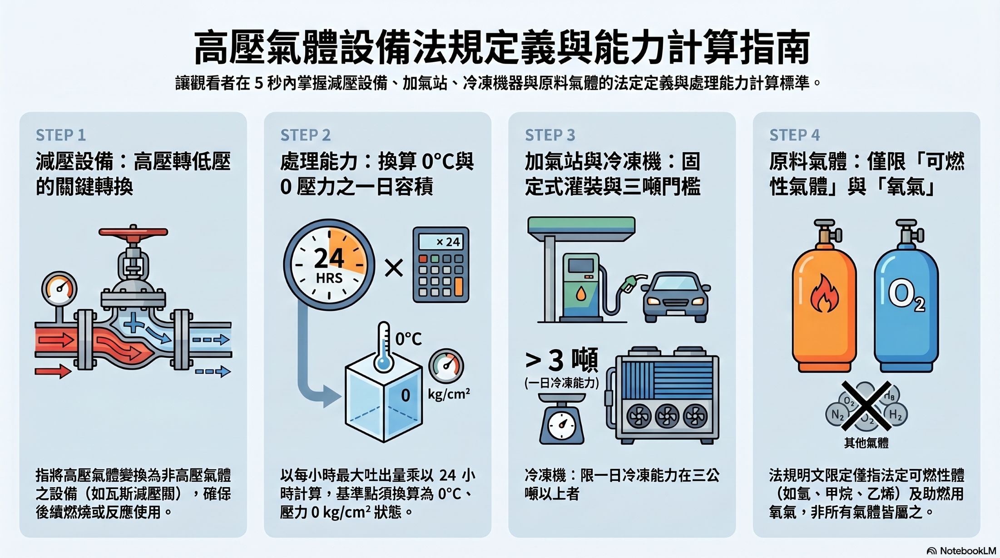{.lightbox}

## 減壓設備與處理能力、加氣站、冷凍機器、原料氣體

{.lightbox}

## 儲存能力計算方式

+----------------------+-------------------------------+------------------------------------------------------------------------------+
| 設備類型             | 儲存能力公式                  | 參數說明                                                                     |
+======================+===============================+==============================================================================+
| **壓縮氣體儲存設備** | $Q = (P+1) \times V_1$        | $Q$：能力 (m³) $P$：35℃(乙炔15℃)最高灌裝壓力(kg/cm²) $V_1$：內容積(m³) |
+----------------------+-------------------------------+------------------------------------------------------------------------------+
| **液化氣體儲存設備** | $W = 0.9 \times w \times V_2$ | $W$：能力 (kg) $w$：常用溫度下比重 (kg/L) $V_2$：內容積(L)             |
+----------------------+-------------------------------+------------------------------------------------------------------------------+
| **液化氣體容器**     | $W = V_2 / C$                 | $C$：中央主管機關指定值                                                      |
+----------------------+-------------------------------+------------------------------------------------------------------------------+

## 高壓氣體儲存

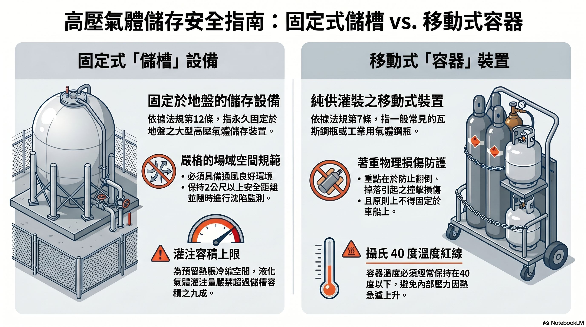{.lightbox fig-align="center"}

## 儲存能力與安全

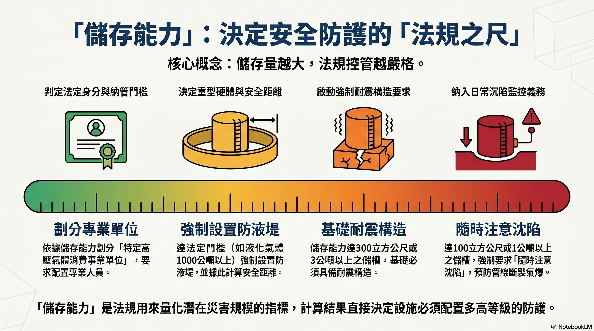{.lightbox}

## 高壓氣體之「**製造**」定義

**製造**並非化學合成，而是**人為處理生成高壓氣體狀態**，包含：

- **改變氣體壓力 ( 高 ⟺ 低 )**
  - 將非高壓氣體加壓至 10 kg/cm² 以上
  - 使高壓氣體壓力進一步上升
  - 降壓處理、灌裝、分裝
- **改變氣體狀態 ( 氣 ⟺ 液)**
  - 使氣體液化 (飽和蒸氣壓 ≥2 kg/cm²)
  - 將液化氣體汽化為高壓氣體 (壓力 ≥10 kg/cm²)

## 製造(第2章 )

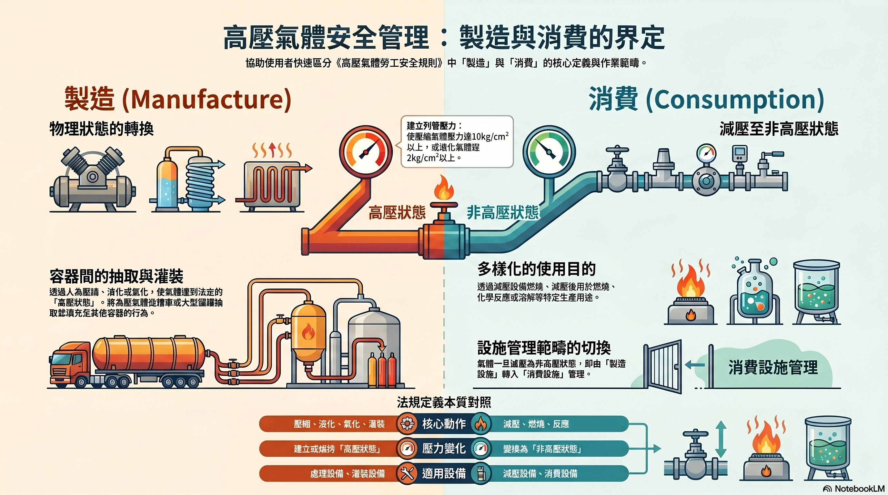{.lightbox}

## 製造事業單位分類

+----------------------+--------------------------------------------------+
| 類別                 | 條件                                             |
+======================+==================================================+
| **甲類製造事業單位** | 一日處理氣體容積 ≥30 m³ (0℃, 0kg/cm²狀態) **或** |
|                      |                                                  |
|                      | 一日冷凍能力 ≥20 公噸                            |
+----------------------+--------------------------------------------------+
| **乙類製造事業單位** | 非屬甲類，但冷凍能力 ≥3 公噸                     |
+----------------------+--------------------------------------------------+

## 製造事業單位分類

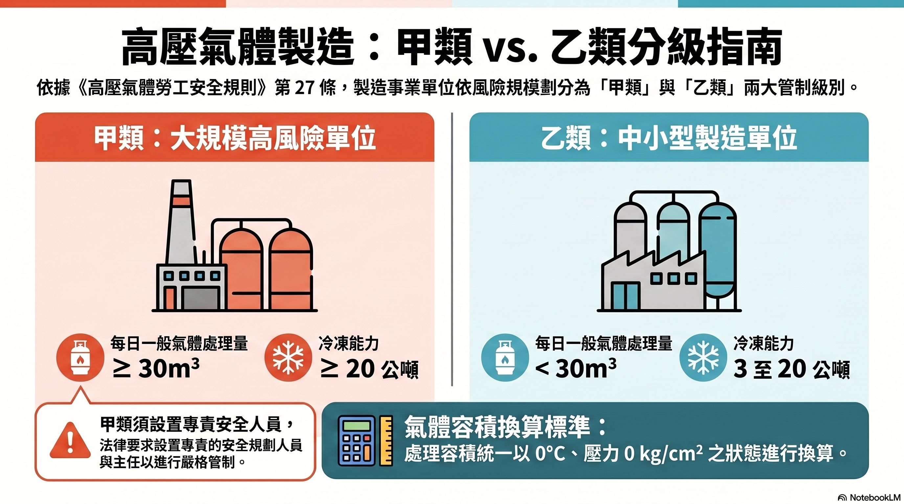{.lightbox}

## 製造設備之安全距離

- **可燃性**氣體製造設備**與煙火設備**：（設備與燃燒設備）
  - 應保持 **8 公尺**以上，或設置防止氣體流竄之防火牆(高度≥2m)。
- **可燃性**氣體高壓設備**與其他可燃性**氣體高壓設備：（設備間）
  - **5 公尺**以上。
- **可燃性與氧氣製造設備**之高壓設備： （設備與氧氣設備）
  - **10 公尺**以上。
- **儲槽間距**：
  - 1 m 或 **最大直徑和之 1/4** (取較大值)。

## 製造設備之安全距離

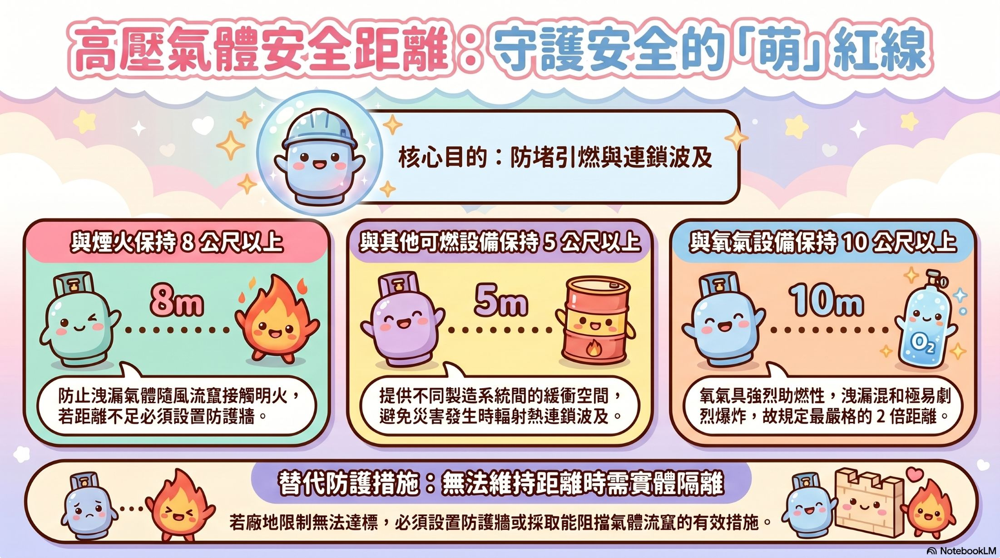{.lightbox}

## 防液堤設置規定 (第37條)

下列設備**四周應設置防液堤**，[防止液化氣體洩漏流竄]{.underline}：

1.  儲存能力 ≥ **1,000 公噸**之液化**可燃性氣體**儲槽
2.  儲存能力 ≥ **1,000 公噸**之液化**氧氣**儲槽
3.  儲存能力 ≥ **5 公噸**之液化**毒性氣體**儲槽
4.  以毒性氣體為冷媒，承液器內容積 ≥ **10,000 公升**之**冷媒設備**

> 防液堤內側及堤外 **10 公尺**內不得設置非許可設備 (液化毒性氣體依公式計算距離L)。

## 液化溴甲烷儲槽防液堤外距離L計算 {.smaller}

$$L = \frac{4}{995} (X - 5) + 6$$

- $X$：儲存能力 (公噸) ，適用於 **毒性氣體中之可燃性氣體**
- $L$：防液堤外維持距離 (公尺)

**例**：儲存能力 5 公噸之液化溴甲烷\

$$L = \frac{4}{995}(5-5)+6 = 6 \ \text{公尺}$$

> 若屬「前述以外之毒性氣體」則公式為 $L = \frac{4}{995}(X - 5) + 4$。

耐壓試驗與氣密試驗

- **耐壓試驗：高壓氣體設備**應以**常用壓力之 [1.5 倍以上]{.underline}**測試
- **氣密試驗：**以**常用壓力以上**測試。
- **例外**：經重新檢查或構造檢查合格之高壓氣體特定設備可免。

## 問題研討1 (教材，題目省略)解答

(2)溴甲烷同時屬於「可燃性氣體」與「毒性氣體」。因此，計算**5噸液化溴甲烷**儲槽之防液堤外側應維持距離時，應適用「**毒性氣體中之可燃性氣體**」之公式。

- **計算**： $L=(4/995)×(X−5)+6 =(4/995)×(5−5)+6=6$**（公尺）**。

(3)**設置於防液堤內側之規定設備（試列6項）：** 依據法規第37-1條，防液堤內側除下列設備及儲槽之附屬設備外，不得設置其他設備（列出其中6項）：

- 與該儲槽有關之**低溫儲槽之輸液設備**。

- **惰性氣體儲槽**。

- **水噴霧裝置**。

- 氣體漏洩檢知警報設備之**感應部**。

- 除毒設備之**吸收洩漏氣體之部分**。

- **照明設備**。 *(備註：其他合法設備尚包含計測設備、排水設備、配管及配管架臺等。)*

## 耐壓試驗與氣密試驗

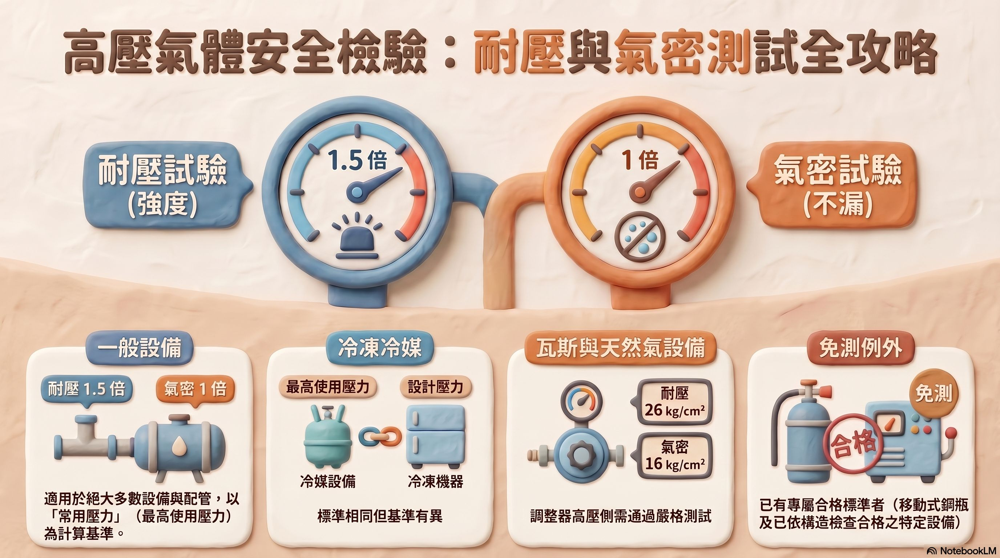{.lightbox}

## 緊急遮斷裝置 (第53條)

內容積 ≥ **5,000 公升**之液化氣體儲槽 (可燃性、毒性或氧氣)，其配管應於距離儲槽外側 **5 公尺以上**安全處所設置**可操作之緊急遮斷裝置**。

- 僅用於接受液態氣體之配管，得以逆止閥代替。
- 液氧儲槽供醫療用者，得另裝旁通閥 (常閉鉛封)。

## 灌裝作業重要規定 (節錄第71條)

- **液化氣體灌注儲槽**：容量 ≤ 常用溫度下槽內容積之 **90%** ；液化毒性氣體儲槽需有自動警報。
- **乙炔灌注**：灌裝壓力 ≤ 25 kg/cm²，灌注後靜置至 15℃ 壓力 ≤ 15.5 kg/cm²。
- **環氧乙烷灌注**：事前以氮氣或二氧化碳置換，不得含有酸或鹼。
- **液化石油氣灌注**：
  - 不得灌注於內容積 ≤ 1,000 公升之容器。
  - 應使用合格容器或儲槽，確認液面計或過裝防止裝置。
  - 卸除配管前須緩慢排放剩餘氣體至無虞危險。

## 灌裝作業重要規定

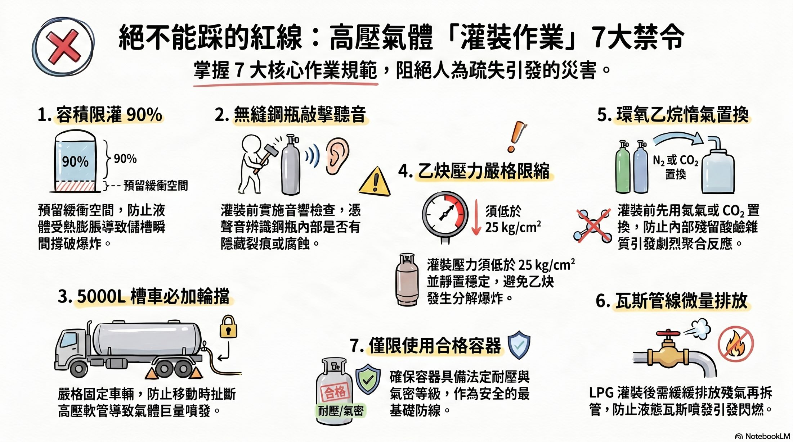{.lightbox}

## 供應安全設施(第3章 )

## 高壓氣體之儲存安全 (第4章 113、116條)

**儲槽儲存**

- 通風良好，四周2公尺內禁煙火及危險物。

- 液化氣體 ≤ 槽內容積 90%。

- 儲存能力 ≥ 100 m³ 或 1 公噸須監測沉陷。

**容器儲存**

- 可燃性或毒性氣體容器須通風良好。

- 氰化氫容器每日檢點，儲存不得超過 **60 日** (純度≥98%未著色除外)。

- 不得固定或積載於船舶、車輛 (法定例外如滅火用二氧化碳等可)。

## 高壓氣體之儲存安全

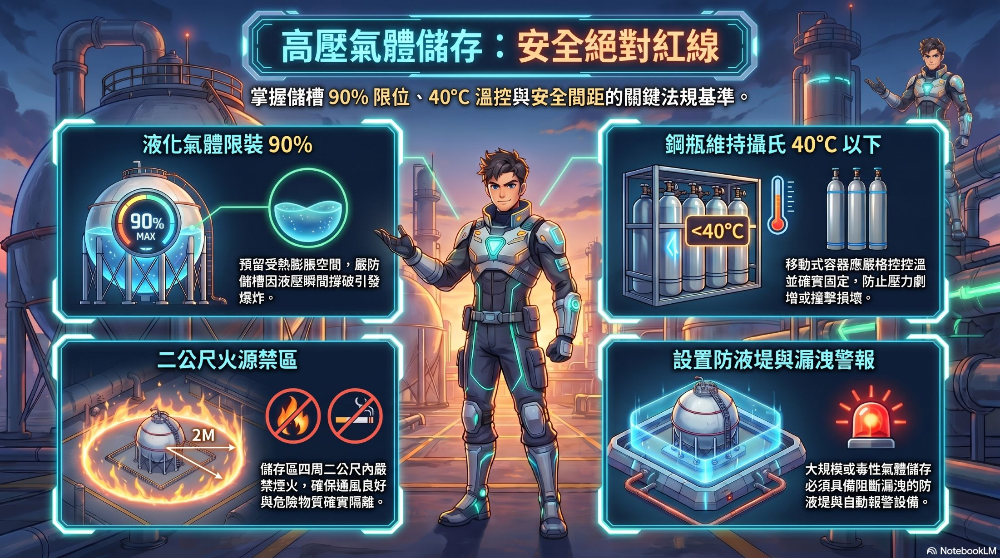{.lightbox}

## 高壓氣體運輸(第5章 )

### 高壓氣體之運輸依據載體的不同，分為3大類

- 「固定於車輛之容器」（如：大型槽車）

- 「非固定於車輛之容器」（如：一般載運之瓦斯鋼瓶）

- 「導管」（如：長途地下管線）

**註：細節可查法規與讓AI協助**

## 高壓氣體運輸

+-------------------------------------------+-------------------------------------------+
|                                           |                                           |
+===========================================+===========================================+
| 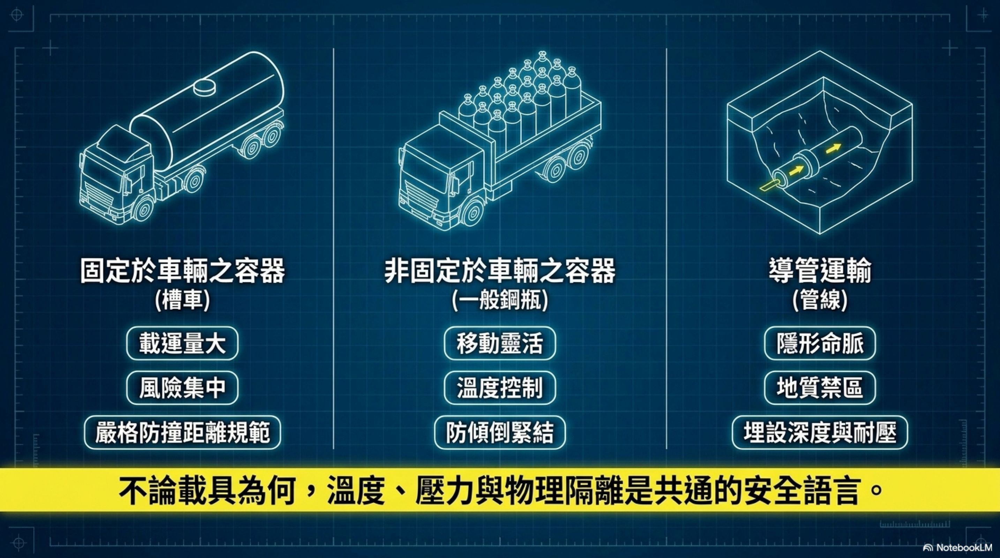{.lightbox} | 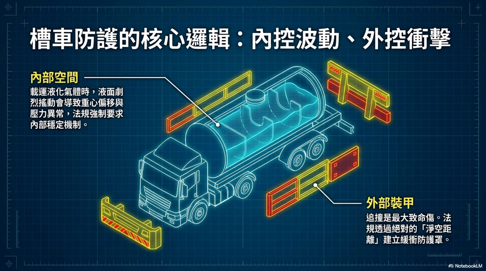{.lightbox} |
+-------------------------------------------+-------------------------------------------+
| 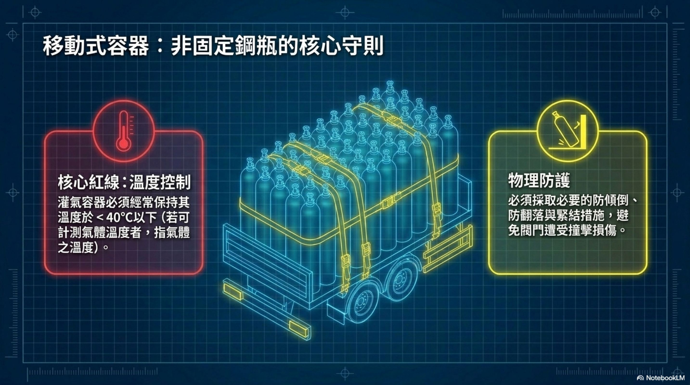{.lightbox} | 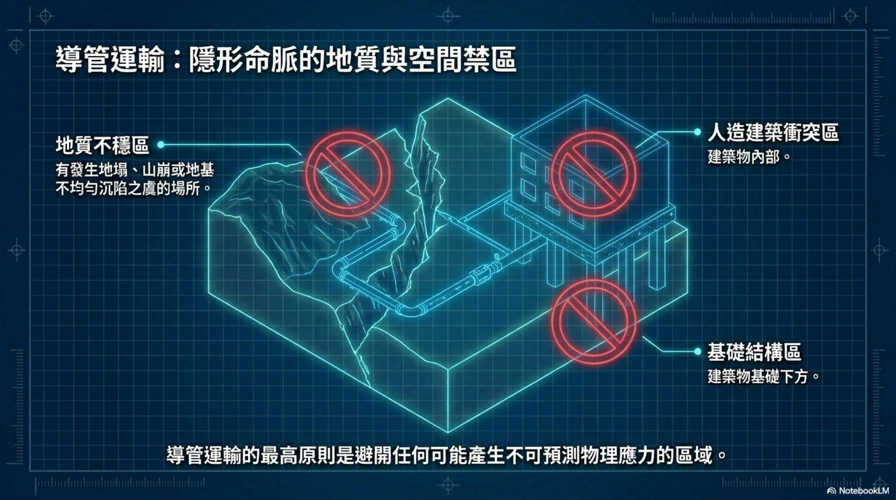{.lightbox} |
+-------------------------------------------+-------------------------------------------+

## 高壓氣體之消費(第6章)

- **特定高壓氣體** (壓縮氫、壓縮天然氣、液氧、液氨、液氯、液化石油氣) 消費事業單位應選任 **消費安全作業主管**。
- 液氯或液氨消費設備須設置**除毒措施** (防止擴散裝置、吸收設備、防護具)。
- 可燃性氣體消費設備應採取**靜電消除措施**。
- 容器串接供廠場使用 (液化石油氣)：
  - 總容量 ≤ 1000 公斤
  - 容器及氣化器設於室外
  - 設置漏洩及地震偵測自動緊急遮斷裝置

## 高壓氣體之消費安全

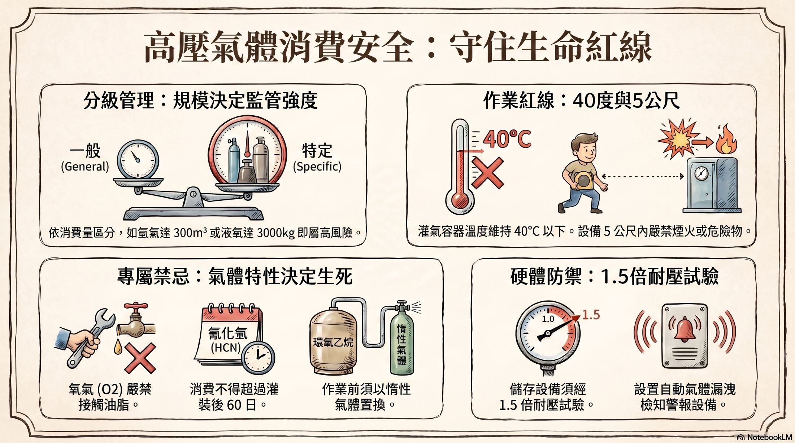{.lightbox}

## 高壓氣體之消費安全

+-----------------------------------------------+-----------------------------------------------+
|                                               |                                               |
+===============================================+===============================================+
| 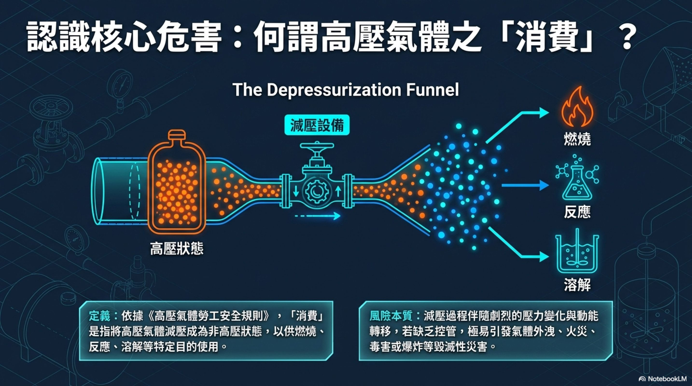{.lightbox} | 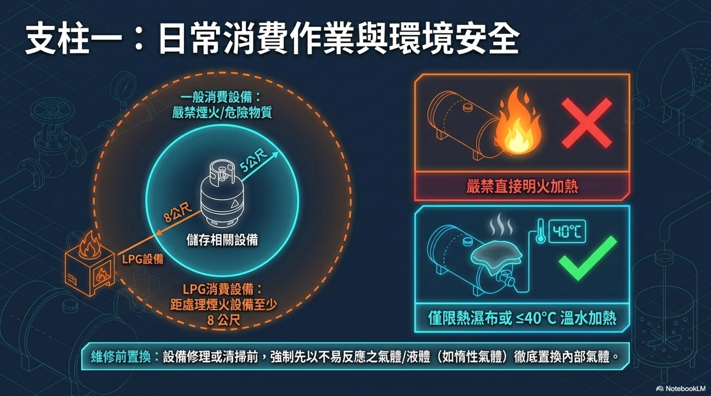{.lightbox} |
+-----------------------------------------------+-----------------------------------------------+
| 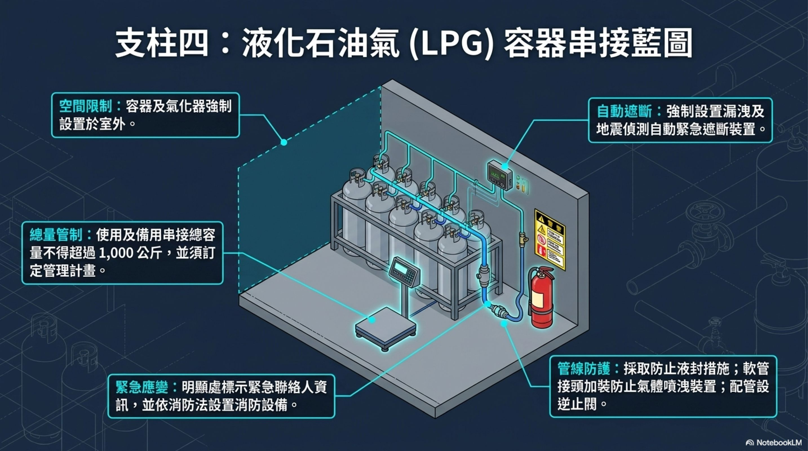{.lightbox} | 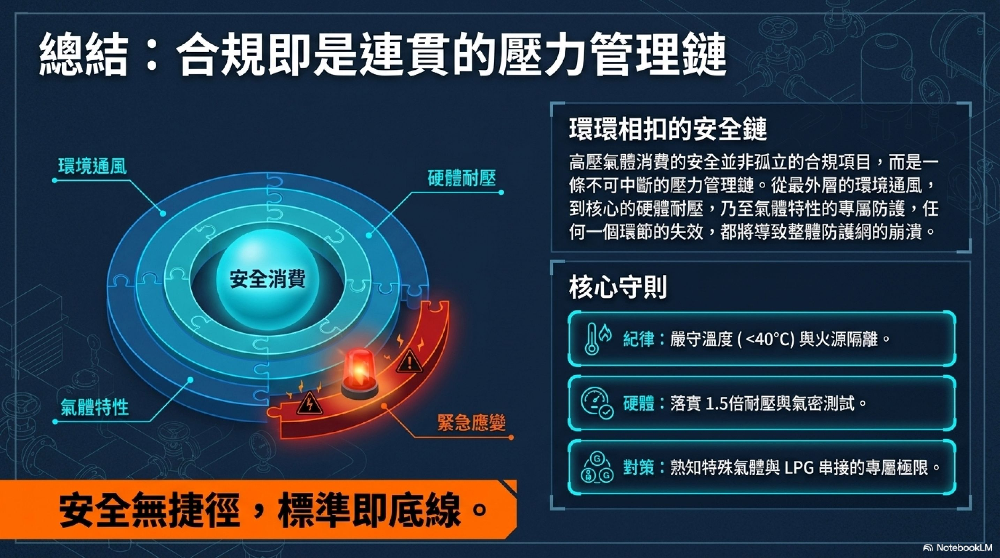{.lightbox} |
+-----------------------------------------------+-----------------------------------------------+

## 高壓氣體廢棄安全(第9章)

+-----------------------------------------------+-----------------------------------------------+
|                                               |                                               |
+===============================================+===============================================+
| 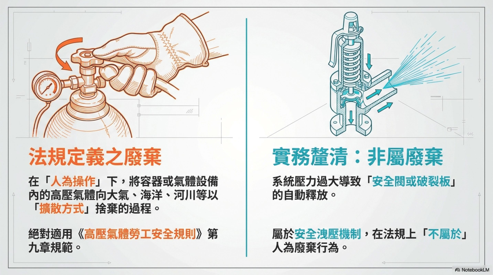{.lightbox} | 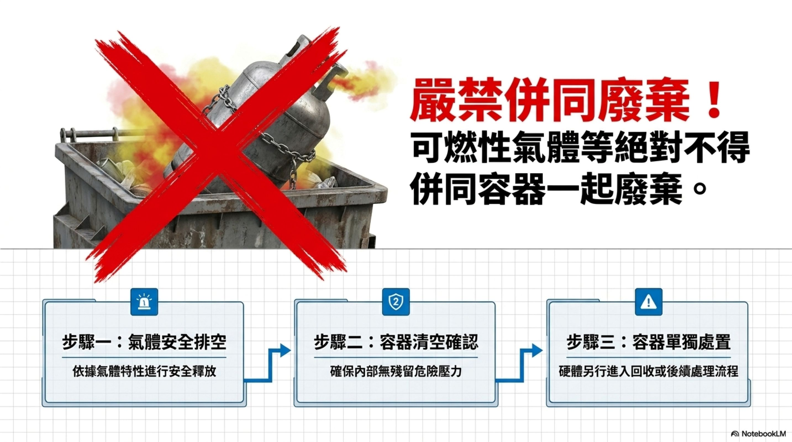{.lightbox} |
+-----------------------------------------------+-----------------------------------------------+
| 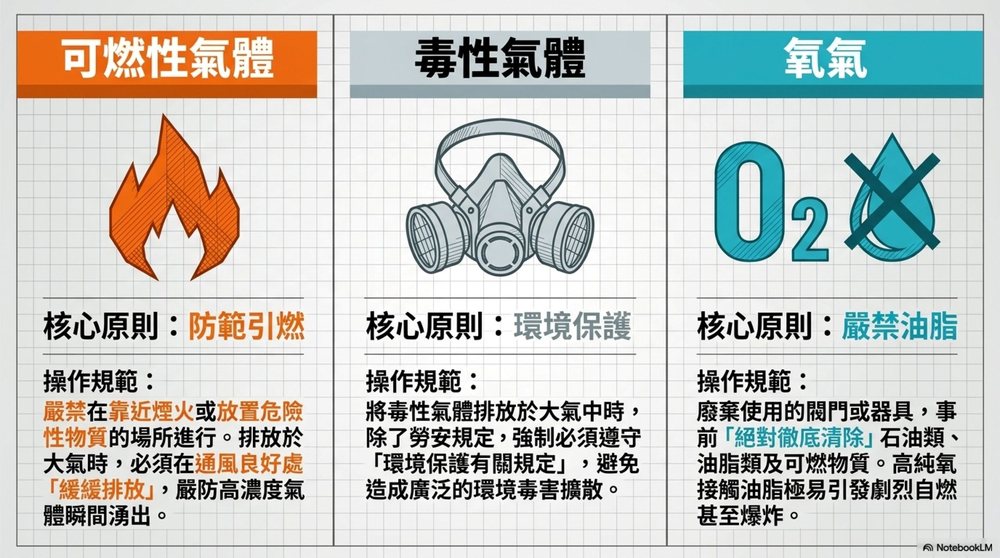{.lightbox} | 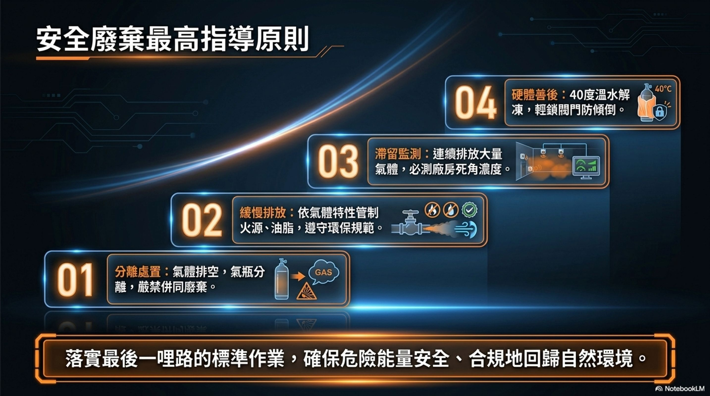{.lightbox} |
+-----------------------------------------------+-----------------------------------------------+

## 冷凍機器(第7章)

+-------------------------------------------+-------------------------------------------+
|                                           |                                           |
+===========================================+===========================================+
| 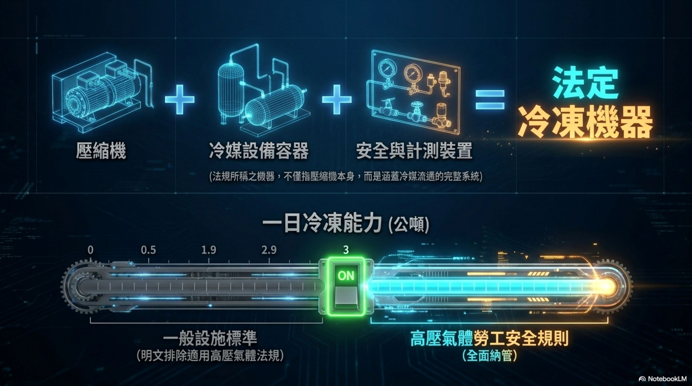{.lightbox} | 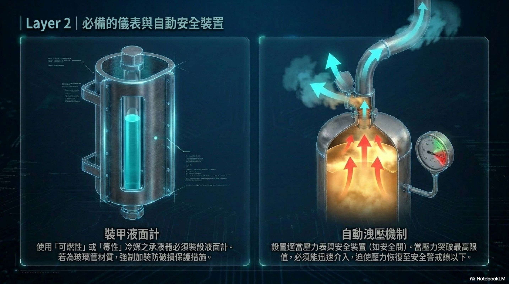{.lightbox} |
+-------------------------------------------+-------------------------------------------+
| 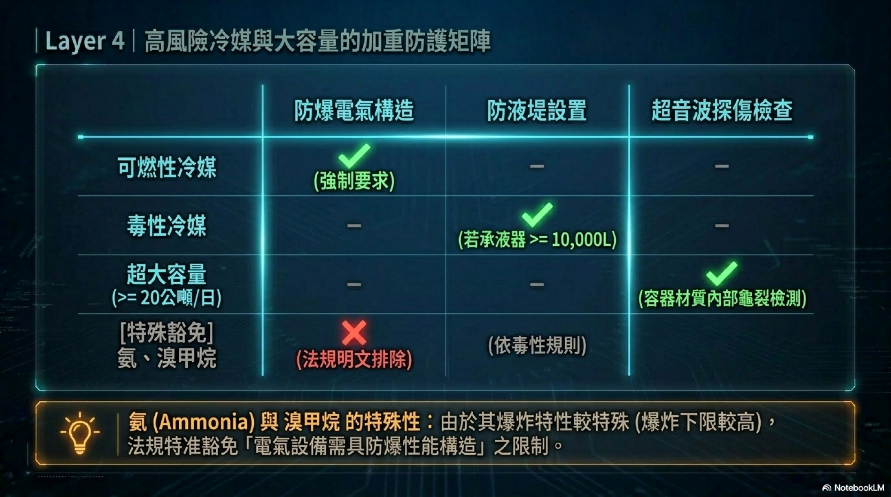{.lightbox} | 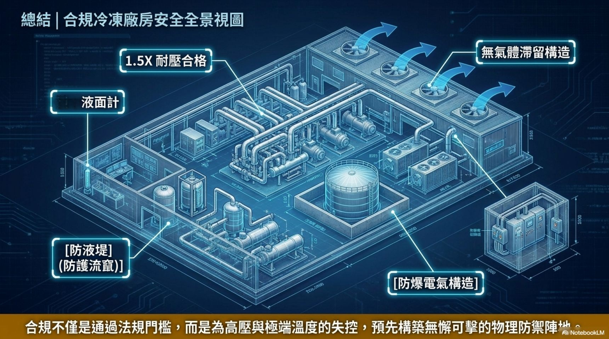{.lightbox} |
+-------------------------------------------+-------------------------------------------+

## 安全管理(第10章)

+--------------------+--------------------------------------------------------------+
| 事業單位類型       | 應選任人員                                                   |
+====================+==============================================================+
| 甲類製造           | 製造安全**負責人** + 製造安全**主任** + 製造安全**作業主管** |
+--------------------+--------------------------------------------------------------+
| 冷凍用高壓氣體製造 | 製造安全**負責人** + 甲/乙/丙種製造安全**作業主管**          |
+--------------------+--------------------------------------------------------------+
| 供應事業單位       | 供應安全作業主管                                             |
+--------------------+--------------------------------------------------------------+
| 特定高壓氣體消費   | 消費安全作業主管                                             |
+--------------------+--------------------------------------------------------------+
| 特定液化石油氣消費 | 消費安全作業主管                                             |
+--------------------+--------------------------------------------------------------+

## 安全管理組織

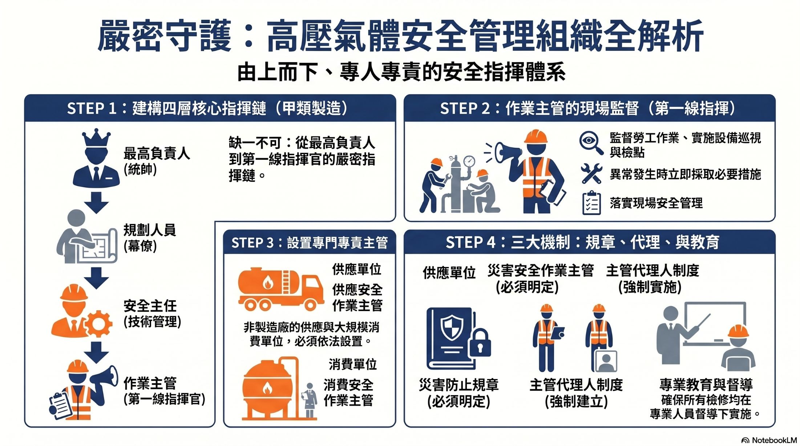{.lightbox}

## 高壓氣體不適用範圍 (第241條節錄)

- 高壓鍋爐及其導管內之高壓蒸氣
- 鐵路、船舶、航空器、礦場、原子能設施內之高壓氣體
- 冷凍能力未滿 3 公噸之冷凍設備內之高壓氣體
- 內燃機起動、輪胎充氣等壓縮裝置內之壓縮氣體
- 清涼飲料水等 (液化氣體質量佔比 ≤15% 且 35℃ 壓力 ≤6 kg/cm²)

## 高壓氣體不適用範圍

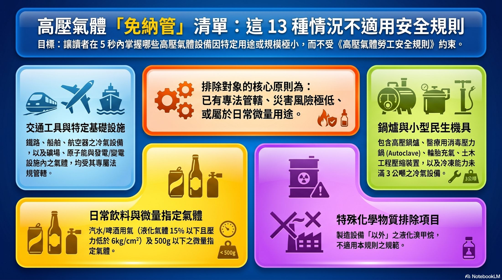{.lightbox}

# 第二部：起重升降機具安全規則

## 危險性機械定義

### (危險性機械及設備安全檢查規則 第3條)

下列容量以上之危險性機械，未經檢查合格不得使用：

| 機械種類         | 檢查基準                             |
|------------------|--------------------------------------|
| **固定式起重機** | 吊升荷重 ≥3 公噸，或斯達卡式 ≥1 公噸 |
| **移動式起重機** | 吊升荷重 ≥3 公噸                     |
| **人字臂起重桿** | 吊升荷重 ≥3 公噸                     |
| **營建用升降機** | 設置於營建工地者                     |
| **營建用提升機** | 導軌或升降路高度 ≥20 公尺            |
| **吊籠**         | 載人用吊籠                           |

## 危險性機械

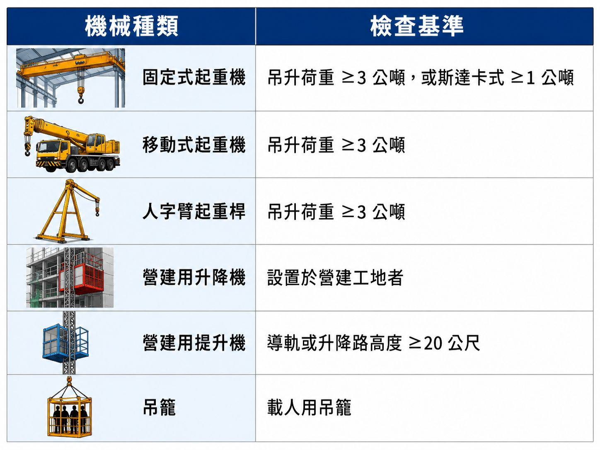{.lightbox width="50%"}

ChatGPT產出，**第3及6圖有誤**，課堂展示正確圖示

## 中型起重升降機具 (第3條)

| 機具                 | 容量範圍                                 |
|----------------------|------------------------------------------|
| **中型固定式起重機** | 吊升荷重 0.5\~3 公噸 (斯達卡式 \<1 公噸) |
| **中型移動式起重機** | 吊升荷重 0.5\~3 公噸                     |
| **中型人字臂起重桿** | 吊升荷重 0.5\~3 公噸                     |
| **中型升降機**       | 積載荷重 0.25\~1 公噸                    |
| **中型營建用提升機** | 導軌高度 10\~20 公尺                     |

> 吊升荷重未滿0.5公噸的固定式起重機、移動式起重機及人字臂起重桿，以及積載荷重未滿0.25公噸的升降機、營建用提升機及簡易提升機，均不適用《起重升降機具安全規則》。
>
> 這類未達容量標準的起重升降機具，依法適用《職業安全衛生設施規則》來辦理各項安全衛生管理與防護措施。

## 《職業安全衛生設施規則》之起重升降機具

安全管理與防護措施重點如下：

1.  **標示與負荷管制**。

2.  **指揮與人員避險：**防止吊掛物通過人員上方，並禁止人員進入吊掛物下方。

3.  **設備安全防護裝置：**

    - **起重機具：** 設有防止物體脫落、過捲預防裝置（\>0.25公尺，直動式\>0.05公尺），鋼索設置顯著標示或警報裝置。

    - **升降機：** 各樓層出入口應裝設連鎖功能之安全門，終點極限開關與緊急剎車等各項安全裝置。

4.  **吊具強度與安全係數：** 吊鉤、鉤環及附屬零件之安全係數\>4；吊掛用鋼索之安全係數\>6。

5.  **吊具汰換與禁用限制：**

    - 鋼索如有一撚間素線截斷達10%以上、直徑減少達7%以上、扭結、顯著變形或腐蝕等任一情況，一律禁用。

    - 吊鏈如延伸長度超過原長度5%、斷面直徑減少超過10%或產生龜裂，禁止使用。

    - 已變形或龜裂之吊鉤與鉤環、斷股或損傷腐蝕之纖維索及帶，均不得供作吊掛使用。

## 重要名詞定義

- **吊升荷重**：依構造及材質，所能吊升之**最大荷重**。
- **額定荷重**：吊升荷重扣除吊鉤、抓斗等吊具重量後之荷重。
  - 具伸臂者依傾斜角、長度、吊運車位置決定最大荷重後再扣除吊具重。
- **積載荷重**：升降機、提升機、吊籠等乘載人員或荷物上升之**最大荷重**。
- **額定速率**：額定荷重下之最高運行速率 (上升、直行、迴轉、橫行)。

|                                                               |
|---------------------------------------------------------------|
| 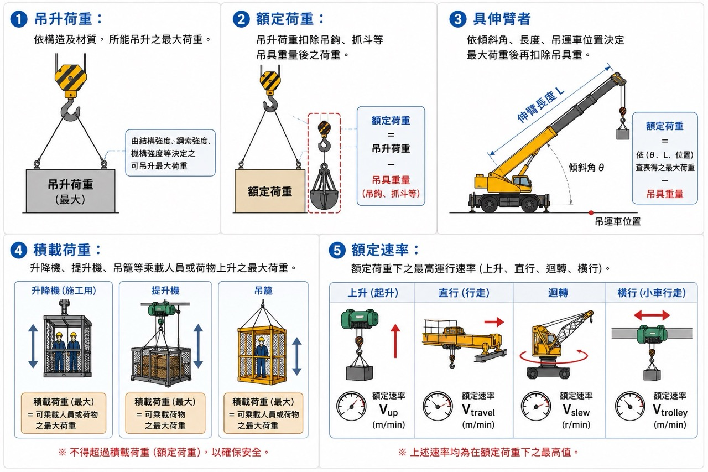{.lightbox width="50%"} |
| **AI產出，部分可能有誤，課堂講解。**                          |

## 固定式起重機使用限制

- **不得超過額定荷重** (第10條) – 必要時可經荷重試驗(1.25倍)並報准放寬。
- **搭乘設備：**吊物為限，不得乘載或吊升勞工 (第19條)。但特殊情況例外：
  - 貨櫃裝卸、船舶維修、高煙囪施工等無替代方法
  - 臨時性、小規模、短時間、作業性質特殊
  - 且已採取防止墜落措施

## 移動式起重機防止翻倒措施 (第29\~32條)

作業前應調查地形、地質、作業空間、荷重，決定：

- 作業方法、吊掛方法、運搬路徑
- 軟弱地盤鋪設鐵板、墊料，使用外伸撐座
- 指派指揮者，建立作業指揮體系

**外伸撐座使用原則**：

- 應伸至**最大極限位置** - 若受限無法全伸，需有過負荷預防裝置對應外伸寬度自動降低額定荷重，或明細表已提供較低額定荷重值。

## 搭乘設備乘載勞工之特殊許可 {.smaller}

**移動式起重機**允許乘載勞工之條件 (第35條但書)： **（搭乘設備）**

1.  貨櫃裝卸、船舶維修、高煙囪施工等**無其他安全作業替代方法**
2.  或 **臨時性、小規模、短時間、作業性質特殊**
3.  且經採取防止墜落措施：
    - 搭乘設備防止翻轉及脫落
    - 設安全母索，勞工佩戴全身背負式安全帶 (CNS 14253-1)
    - 最大荷重 (自重+人員+積載) ≤ 作業半徑對應額定荷重之 **50%**
    - 下降採動力下降
    - **垂直高度＞20公尺** 禁止使用直結式搭乘設備 (除非設無線電及防碰撞警報)



## 搭乘設備之構造要求 (第20條、第36條)

- 足夠強度，無損傷、變形、腐蝕
- 周圍設置高度 **90 公分以上**扶手、中欄杆及腳趾板
- 懸吊用鋼索安全係數 ≥ **10**；吊鏈、吊帶及其支點 ≥ **5**
- 明顯標示 **自重**及 **最大荷重**

::: callout-note
為防止墜落與翻覆事故，雇主及作業人員必須嚴格遵守勞動部「[**起重機吊掛搭乘設備搭載或吊升人員作業注意事項**](https://laws.mol.gov.tw/FLAW/FLAWDAT0202.aspx?id=FL050724)」及相關安全規範。
:::

::: callout-note
## 勞動部修訂「起重升降機具安全規則」，[強化搭乘設備作業安全](https://www.osha.gov.tw/48110/48417/48419/87013/){.blank}。
:::

## 吊掛作業人員資格

- 應僱用**曾受吊掛作業訓練合格**者 (第62條)
- 但已受吊升荷重 **3 公噸以上**起重機具操作人員訓練合格或具技能檢定技術士資格者，可擔任吊掛作業。
- 起重機操作及吊掛作業應**分別指派**，例外：
  - 地面按鍵操作之固定式起重機
  - 積載型卡車起重機 → 可由操作者一人兼任。

## 吊掛用具安全係數

| 用具   | 安全係數                                             |
|--------|------------------------------------------------------|
| 鋼索   | ≥ **6**                                              |
| 吊鏈   | ≥ **4** (符合特定伸長率及抗拉強度) 或 ≥ **5** (其他) |
| 吊鉤   | ≥ **4**                                              |
| 馬鞍環 | ≥ **5**                                              |

安全係數（Safety Factor, SF）之計算：

$安全係數=\frac{斷裂荷重}{最大荷重}$

::: callout-note
[吊運角度與吊索操作負荷上限的關係](https://www.oshc.org.hk/oshc_data/files/greencross/2021/Oct%202021%20-%2012_%20OSH%20Science%20%E2%80%93%20The%20Relationship%20Between%20Lifting%20Angle%20and%20Upper%20Limit%20of%20Working%20Load%20of%20the%20Slings.pdf)
:::

## 禁止使用之鋼索、吊鏈 (第68、69條)

**鋼索**有下列情形之一不得使用： （[示意圖](https://www.goingec.com.tw/news-inner.php?news_id=41)）

- 一捆間 **10% 以上**素線截斷

- 直徑減少 ≥ **7%**

- 顯著變形或腐蝕

- 已扭結

**吊鏈**有下列情形之一不得使用：（[示意圖](https://cima.org.tw/expert/blog202201-18/)）

- 延伸長度 \> 製造時 **5%**

- 斷面直徑減少 \> 製造時 **10%**

- 有龜裂

## 升降機與吊籠安全重點

- **升降機** (第77條)：
  - 終點極限開關。
  - 緊急停止裝置須維持效能。
  - 不得擅自自外部開啟門扉。
- **吊籠** (第99、102條)：
  - 懸吊於建築物應固定於足夠強度處。
  - 勞工於工作台作業時，應佩戴安全帽及全身背負式安全帶。
- **營建用提升機** (第87條)：不得乘載人員 (檢修調整除外)。

# 第三部：鍋爐及壓力容器安全規則

## 危險性設備定義

### (危險性機械及設備安全檢查規則 第4條)

下列容量以上之危險性設備，未經檢查合格不得使用：

**鍋爐**

- 最高使用壓力 \>1 kg/cm² 或 傳熱面積 \>1 m² (特定條件 \>3.5 m²)

- 水頭壓力 \>10 m 或 傳熱面積 \>8 m² (熱水鍋爐/熱媒鍋爐)

- 貫流式：最高使用壓力 \>10 kg/cm² 或 傳熱面積 \>10 m²

**壓力容器 (第一種壓力容器)**

- 最高使用壓力 \>1 kg/cm² 且 內容積 \>0.2 m³

- 胴體內徑 \>500 mm、長度 \>1000 mm

- 壓力數值 × 內容積數值 \>0.2



## 鍋爐種類與小型鍋爐

- **蒸汽鍋爐**：產生超過大氣壓之蒸汽，供給他用。
- **熱水鍋爐**：加熱有壓力之水或熱媒。

**小型鍋爐** (非危險性設備)：

- 最高使用壓力 ≤1 kg/cm² 且 傳熱面積 ≤1 m² (蒸汽)

- 水頭壓力 ≤10 m 且 傳熱面積 ≤8 m² (熱水)

- 貫流式：最高使用壓力 ≤10 kg/cm² 且 傳熱面積 ≤10 m²

::: callout-note
# [工業鍋爐可分為哪些種類？](https://www.otboiler.com.tw/post/%E5%B7%A5%E6%A5%AD%E9%8D%8B%E7%88%90%E5%8F%AF%E5%88%86%E7%82%BA%E5%93%AA%E4%BA%9B%E7%A8%AE%E9%A1%9E%EF%BC%9F) 參考用（非廣告）
:::

## 鍋爐操作人員分級

| 級別     | 傳熱面積             |
|----------|----------------------|
| **甲級** | 500 m² 以上          |
| **乙級** | 50 m² \~ 未滿 500 m² |
| **丙級** | 未滿 50 m²           |

> 雇主應指派**鍋爐作業主管** (具對應級別以上資格) 負責指揮、監督複數鍋爐之操作管理。
>
> 據法規明定，僅有當「同一鍋爐房內或同一鍋爐設置場所中」設有二座以上鍋爐時，才必須以各鍋爐之傳熱面積合計，來指派統籌負責該場所之鍋爐作業主管。（鍋壓則 第16條）

## 鍋爐操作人員應實施事項 (第16條)

- 監視壓力、水位、燃燒狀態
- 避免急劇負荷變動
- 防止壓力超過最高使用壓力
- 保持壓力表、安全閥及其他安全裝置機能正常
- **每日檢點水位測定裝置一次以上**
- 確保水質，適時沖放鍋爐水
- 保持給水裝置正常
- 檢點低水位燃燒遮斷裝置、火焰檢出裝置等
- 發現異狀立即採取必要措施

## 鍋爐安全閥管理 (第17條)

- 安全閥應調整於**最高使用壓力以下**吹洩。
- 設有二具以上安全閥：
  - 至少一具調整於最高使用壓力以下，其他得調整至最高使用壓力之 1.03 倍以下。
- 貫流鍋爐具釋壓裝置者，安全閥得調整至最高使用壓力之 **1.16 倍**以下。
- 經檢查固定設定壓力後，**不得變動**。

::: callout-note
**貫流式鍋爐**（Once-through Boiler）是一種特殊設計的水管式鍋爐，其核心特點是水在單向流動的加熱管中，一次性通過即可完全汽化生成蒸汽。
:::

## 進入鍋爐內部作業安全規定 (第23條)

1.  將鍋爐/燃燒室/煙道**適當冷卻**
2.  實施**通風換氣**
3.  移動電線使用**可撓性雙重絕緣電纜**；電燈裝護罩
4.  與其他使用中鍋爐或壓力容器有管連通者，**確實隔斷或阻斷**
5.  設置**監視人員**，保持連絡，隨時採取必要措施

::: callout-warning
## 自問：這是局限空間嗎？ `if YES, then ...`
:::

## 壓力容器分類

**第一種壓力容器**

- 加熱器類、反應器類、蒸發器類、飽和液類 (溫度超過大氣壓沸點)

**第二種壓力容器**

- 壓力 ≥2 kg/cm² 且 (內容積 ≥0.04 m³ 或 內徑≥200 mm、長度≥1000 mm)

**小型壓力容器** (非危險性)

- 最高使用壓力 ≤1 kg/cm² 且 內容積 ≤0.2 m³ - 或 壓力×容積 ≤0.2

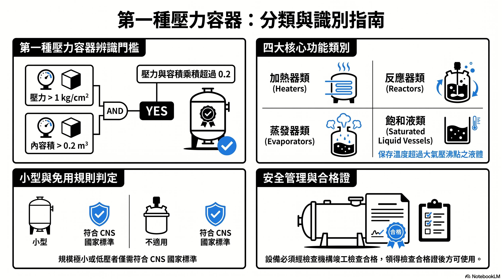{.lightbox style="width:80%"}

## **第一種壓力容器**

- 加熱器類、反應器類、蒸發器類、飽和液類 (溫度超過大氣壓沸點)

+---------------------------------------------+---------------------------------------------+
|                                             |                                             |
+=============================================+=============================================+
| 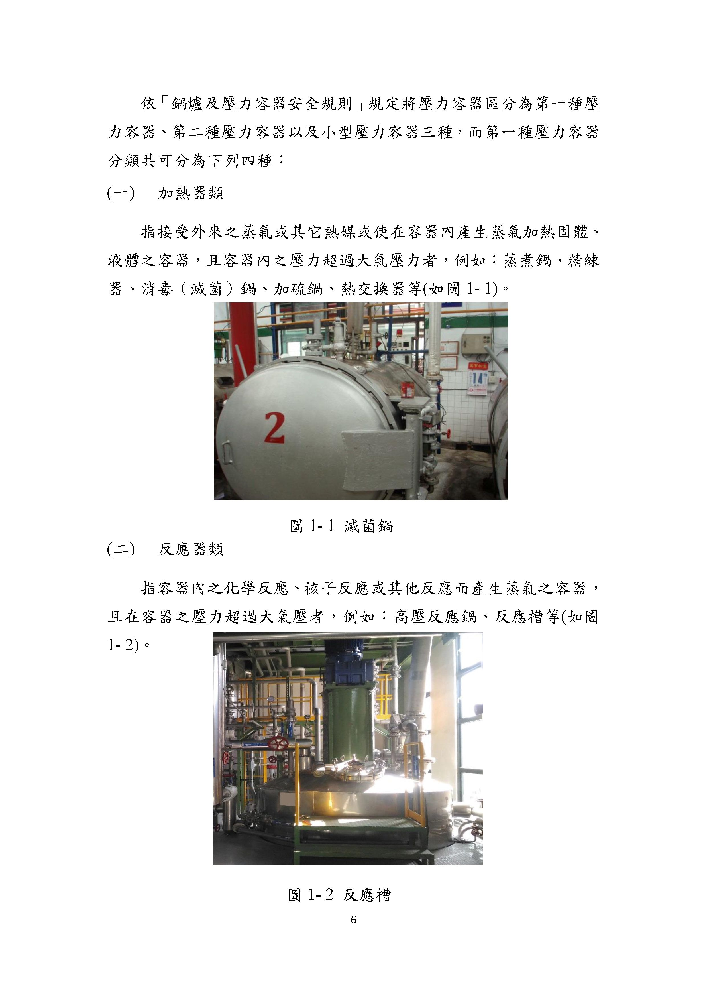{.lightbox} | 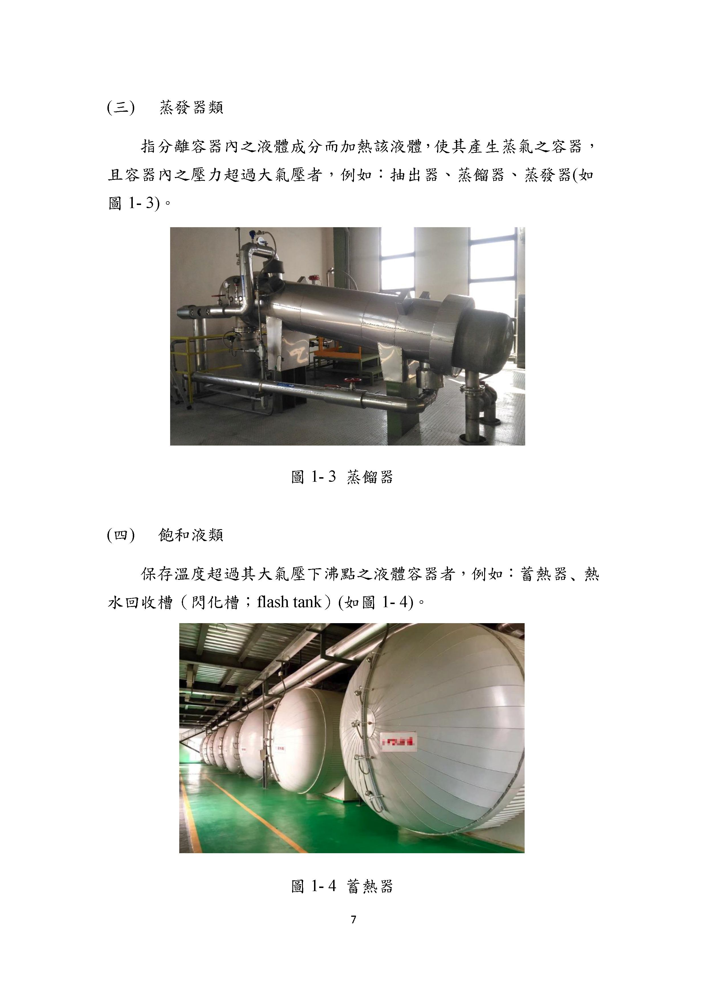{.lightbox} |
+---------------------------------------------+---------------------------------------------+

## 第一種壓力容器操作管理

- 應僱用**專任操作人員** (經訓練合格或技能檢定)。
- 同一作業場所有二座以上，應指派**第一種壓力容器作業主管**。
- 操作人員應監視溫度、壓力，防止超壓，保持安全裝置正常，並保持冷卻裝置正常。

## 壓力容器安全閥管理 (第30條)

- 安全閥應調整於**最高使用壓力以下**吹洩。
- 設有二具以上者，至少一具於最高使用壓力以下，其餘可調整至最高使用壓力之 1.03 倍以下。
- 壓力表刻度板應**明顯標示最高使用壓力**位置。
- 壓力表應防止振動、凍結及超過 80℃。

------------------------------------------------------------------------

## 問題研討

1.  **高壓氣體**

    (1) 哪些設備應設置防液堤？\
    (2) 儲存能力5公噸液化溴甲烷儲槽，防液堤外距離L值？\
    (3) 防液堤內側得設置之設備 (列舉6項)。

2.  **鍋爐及壓力容器**：勞工從事壓力容器清掃、修理、保養，雇主應辦理事項？

3.  **起重升降機具**：移動式起重機乘載勞工從事超過20公尺作業，允許之特殊情況 (列舉4種)？

4.  **起重升降機具**：特殊條件下允許乘載勞工時，搭乘設備應符合哪些規定 (列舉2項)？

5.  **移動式起重機**：垂直高度20公尺以上高處作業，允許乘載勞工之但書規定為何？

------------------------------------------------------------------------

## 參考文獻

1.  職業安全衛生法 (108年)
2.  高壓氣體勞工安全規則 (111年)
3.  起重升降機具安全規則 (109年)
4.  鍋爐及壓力容器安全規則 (103年)
5.  危險性機械及設備安全檢查規則 (105年)
6.  起重機吊掛搭乘設備搭載或吊升人員作業注意事項
7.  危險性設備(第一種壓力容器、高壓氣體特定設備)自動檢查參考手冊

------------------------------------------------------------------------

## 知識傳遞完成

有任何問題歡迎討論，**TKS**.

😎
