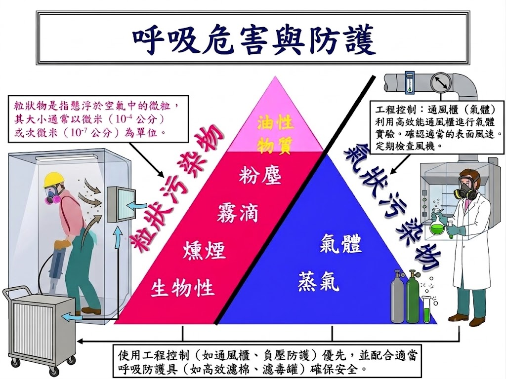
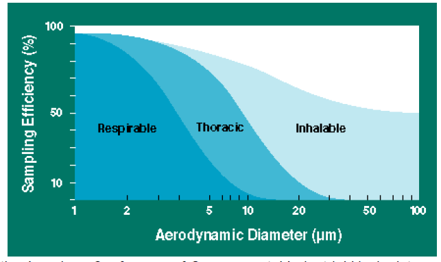
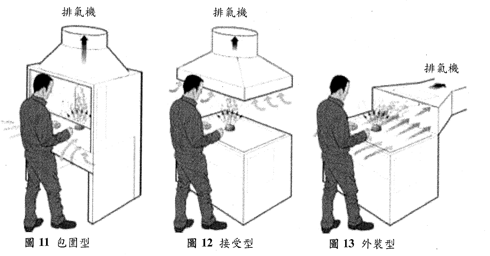
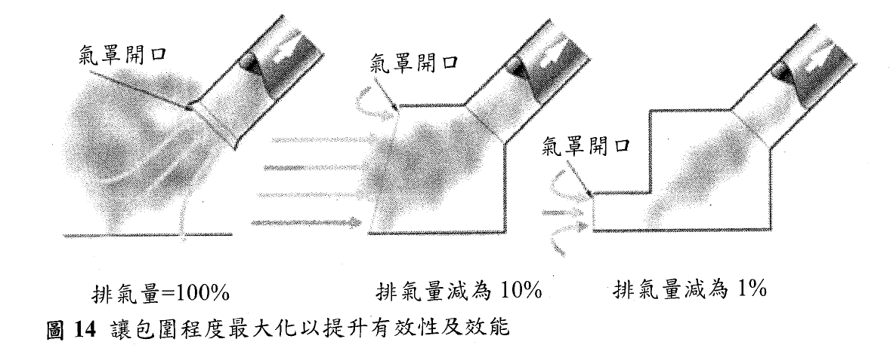
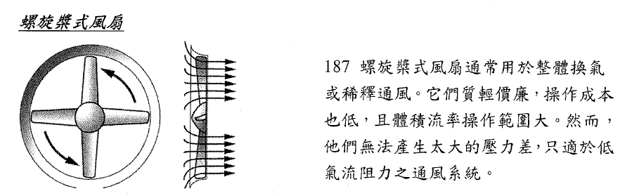
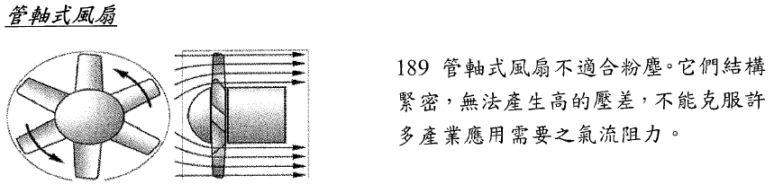
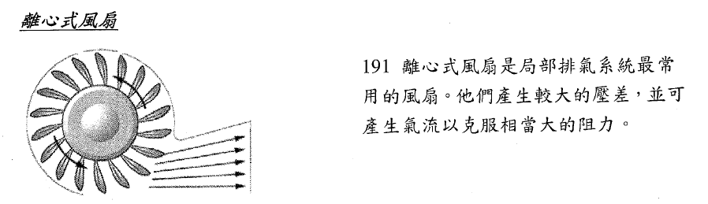

## 講師簡介

- 姓名：何明信

- 學歷：成大環醫所 、職安衛技師

- 經歷：檢查員30年 (製造、危機設、營造、化工職衛科、專委)

- 現職：114年退休

- E-mail：msho7336959\@gmail.com

# 第四十五章 局部排氣控制與設計

::: callout-important
**防止呼吸危害 (空氣中汙染物)**
:::

{.lightbox width="50%"}

## 參考資料

1.  HSE, [Controlling airborne contaminants at work]{.underline} [- A guide to local exhaust ventilation (LEV)]{.underline}, 2017,[HSG 258](https://www.hse.gov.uk/pubns/books/hsg258.htm)

2.  

## 一、 局部排氣目的、使用時機

- 局部排氣（Local Exhaust Ventilation, LEV）
  - **指藉動力強制吸引並排出已發散有害物之設備**。(有機/粉塵)
  - LEV is an engineering control system to reduce exposures to airborne contaminants such as dust, mist, fume, vapour or gas in a workplace. (HSG 258)

### A、 局部排氣的核心目的與優勢

- **集中高濃度捕集與排除**：作業場所產生**可能散布空氣中有害物質**(粉塵、氣體、蒸氣或煙霧等)時，處於高濃度狀態且尚未擴散、混合至廠區清潔空氣前，利用吸氣氣流在局部範圍內將其**有效捕集並抽離**，後續再經由空氣清淨裝置處理後排放至大氣。

- **經濟性與高效性**：不是稀釋有害物(整體換氣)，是直接針對污染源進行排除污染物，在設備運轉與能源消耗上也更具經濟效益。

::: callout-important
## LEV ?

[What is Local Exhaust Ventilation?](https://youtu.be/Ky8y2jDk6i8 "What is Local Exhaust Ventilation?")
:::

## B、局部排氣裝置使用時機

- 缺乏更佳替代方案時

- 實測數據或勞工體感反映危害時

- 符合我國法規強制規範時

  - 《有機溶劑中毒預防規則》、《鉛中毒預防規則》、《四烷基鉛中毒預防規則》、《特定化學物質危害預防標準》及《粉塵危害預防標準》等法規

- 追求綜合效益提昇時

- **發生源具備小、固定或易散布特性時**

- **發生源緊鄰勞工呼吸區（Breathing Zone）時**

- 發生量呈動態不穩定時

- **高危害或低容許暴露濃度（PEL）之化學品作業時**

## 合理可行? \[1\]

### 危害控制階層

在某些狀況下，局部排氣不見得是 可行的控制措施，例如有太多有害物發生源或規模大到局部排氣難以控制的有害物雲團。其它控制選項包括：

\(1\) 消除有害物發生源； (2) 以較安全的物料取代現有物料； (3) 減少製程中有害物發生源之規模； (4) 調整製程以減少排氣頻率或時段； (5) 減少每一製程的勞工人數； (6) 採用簡易控制措施，例如設備加蓋密合。

### 設計安裝LEV前，應評估事項？

(1) 空氣中有害物之重要性質。
(2) 氣體丶蒸氣、粉塵、及霧滴如何逸散到空氣中。
(3) 有害物雲圍如何隨氣流移動。
(4) 工作場所中有害物發生源之可能製程。
(5) 操作者在有害物發生源附近工作之必要性。
(6) 需要多少控制措施。
(7) 如何準備規格給LEV設計者。
(8) 要告訴局部排氣供應商什麼。

(HSG 258)

## 空氣中有害物? (部分特性)

+-----------------+-----------------------------------------------------------------------------------------------------------------+---------------------------------------------------------------------------------------------------------+--------------------------------------+
|                 |                                                                                                                 |                                                                                                         |                                      |
+=================+=================================================================================================================+=========================================================================================================+======================================+
| **名稱 (Name)** | **說明與粒徑 (Description and size)**                                                                           | **可見度 (Visibility)**                                                                                 | **範例 (Examples)**                  |
+-----------------+-----------------------------------------------------------------------------------------------------------------+---------------------------------------------------------------------------------------------------------+--------------------------------------+
| **粉塵**        | 固體微粒－由物料處置提供（例如粉體搬運），或由製程產生（例如粉碎與研磨）。                                      | 在一般光線下：                                                                                          | 穀物粉塵、木屑、矽粉。               |
|                 |                                                                                                                 |                                                                                                         |                                      |
| (Dust)          | • **可吸入性微粒粒徑**：$0.01\ \mu\text{m}$ 至 $100\ \mu\text{m}$                                               | • 可吸入性粉塵雲為**部分可見**。                                                                        |                                      |
|                 |                                                                                                                 |                                                                                                         |                                      |
|                 | • **可呼吸性微粒粒徑**：$10\ \mu\text{m}$ 以下                                                                  | • 可呼吸性粉塵雲在濃度高達數十 $\text{mg/m}^3$ 時，**實際上仍看不見**。                                 |                                      |
+-----------------+-----------------------------------------------------------------------------------------------------------------+---------------------------------------------------------------------------------------------------------+--------------------------------------+
| **燻煙**        | 固體蒸發（汽化）後再冷凝而成之微粒。                                                                            | 燻煙雲往往較為密集。它們是**部分可見**的。燻煙及煙霧（smoke）通常比相同濃度的粉塵**更容易被肉眼看見**。 | 橡膠燻煙、銲錫燻煙、焊接燻煙。       |
|                 |                                                                                                                 |                                                                                                         |                                      |
| (Fume)          | • **微粒粒徑**：$0.001\ \mu\text{m}$ 至 $1\ \mu\text{m}$                                                        |                                                                                                         |                                      |
+-----------------+-----------------------------------------------------------------------------------------------------------------+---------------------------------------------------------------------------------------------------------+--------------------------------------+
| **霧滴**        | 液態微粒－由製程所產生（例如透過噴塗）。                                                                        | **同粉塵**                                                                                              | 電鍍、噴漆、水蒸汽。                 |
|                 |                                                                                                                 |                                                                                                         |                                      |
| (Mist)          | • **微粒粒徑範圍**：$0.01\ \mu\text{m}$ 至 $100\ \mu\text{m}$，但當揮發性液體蒸發時，其粒徑分布可能會發生改變。 |                                                                                                         |                                      |
+-----------------+-----------------------------------------------------------------------------------------------------------------+---------------------------------------------------------------------------------------------------------+--------------------------------------+
| **纖維**        | 固體微粒－其長度為直徑的數倍。                                                                                  | **同粉塵**                                                                                              | 石綿、玻璃纖維。                     |
|                 |                                                                                                                 |                                                                                                         |                                      |
| (Fibres)        | • **微粒粒徑**：**同粉塵**                                                                                      |                                                                                                         |                                      |
+-----------------+-----------------------------------------------------------------------------------------------------------------+---------------------------------------------------------------------------------------------------------+--------------------------------------+
| **蒸氣**        | 物質的氣相狀態，該物質在常溫（室溫）下通常為液態或固態。                                                        | **通常看不見**。                                                                                        | 苯乙烯、汽油、丙酮、汞（水銀）、碘。 |
|                 |                                                                                                                 |                                                                                                         |                                      |
| (Vapour)        | • 其行為表現如同氣體。                                                                                          | 在極高濃度下，充滿蒸氣的雲霧**可能勉強可見**。                                                          |                                      |
+-----------------+-----------------------------------------------------------------------------------------------------------------+---------------------------------------------------------------------------------------------------------+--------------------------------------+
| **氣體**        | 在常溫（室溫）下即為氣態的物質。                                                                                | **通常看不見**－有些氣體在高度濃縮時**會帶有顏色**。                                                    | 氯氣、一氧化碳。                     |
|                 |                                                                                                                 |                                                                                                         |                                      |
| (Gas)           |                                                                                                                 |                                                                                                         |                                      |
+-----------------+-----------------------------------------------------------------------------------------------------------------+---------------------------------------------------------------------------------------------------------+--------------------------------------+

::: callout-note
## 註:

粒徑超過100 微米之粉塵為不可吸入性，因大到無法被吸入，它們會自空氣中沉降到樓池板及製程附近表面。
:::

## 粉塵

- 大部分來自有機物，例如木材或麵粉的粉塵塵雲中的粒狀物，主要是可吸入性的，少部分屬可呼吸性粉塵。

- 大部分來自礦物（例如石頭、混凝土）的粉塵塵雲中的粒狀物，主要是可呼吸性的，少部分屬吸入性粉塵，但此較大粒狀物佔了大部分之粉塵重量。

- 肉眼很難看得見氣懸塵雲的全貌，有些狀況下，例如當所有粒狀物粒往都小於可吸入性"時，此塵雲將完全不可見

- 較小之粒狀物會懸浮在空氣中（可達數分鐘），並隨氣流運動，意即，如果製程產生快速氣流（如畊磨輪或圓盤鋸），細微粉塵將會被帶至離有害物發生源較遠處，使粉塵控制變得困難。

- 製程產生的與製程相關之物質（粉塵丶燻煙、霧滴）可能具磨損性或黏性，或容易冷凝，有些可能具易燃性，這些特性要納入局部排氣設計考量。

## 粒狀物粒徑與吸入沉降位置

- **粉塵危害**在於**顆粒大小**以及**在呼吸道中的沉積位置**

  - 遵循國際標準化組織（ISO）、歐洲標準化委員會（CEN）與美國政府工業衛生師協會（ACGIH）共同制定的國際共識。

- **吸入性分率 (Inhalable Fraction)：** 通過鼻子和嘴巴吸入的總空氣懸浮物質量分率。 D50​=$100\ \mu\text{m}$

- **胸腔性分率 (Thoracic Fraction)：** 吸入的顆粒中，能穿透超越喉部的質量分率。D50=$10\ \mu\text{m}$

- **可呼吸性分率 (Respirable Fraction)：** 吸入的顆粒中，能穿透到無纖毛氣道（肺泡區）的質量分率。D50​=$4\ \mu\text{m}$

> **Brown等人的研究論文：** 指出**現行的採樣標準（設** D50=10μm 與 4μm）是為了「保護」而故意高估的真實沉積量。他們根據真實生理參數（成人/兒童、鼻/口呼吸比例）重新計算後發現，**真正的胸腔性分率** D50​ 其實大約在 3−5μm（成人約 3μm，兒童約 5μm），遠小於現行標準的 10μm。這解釋了為什麼空氣污染研究中，**細懸浮微粒（**PM2.5​） 的健康效應遠比粗顆粒明確。

[@brown2013]

## 二、 為何要取 50% cut-size？

- 取 50% cut-size（也就是某粒徑的顆粒有 50% 能穿透進入該區域，50% 被攔截在外）有兩個主要理由：**一個是生理統計分布，另一個是風險管理妥協(保護勞工)。**

+--------------------------------------------------------------------------------------------------------------------------------------------------+
|                                                                                                                                                  |
+==================================================================================================================================================+
| {.lightbox}{.lightbox}{.lightbox} |
+--------------------------------------------------------------------------------------------------------------------------------------------------+

## 為何要取 50% cut-size？ {visibility="hidden"}

- 取 50% cut-size（也就是某粒徑的顆粒有 50% 能穿透進入該區域，50% 被攔截在外）有兩個主要理由：**一個是生理統計的必然性，另一個是工程與政策的妥協。**

#### 1. 生理事實：粒徑分離不是一刀切

- 人體呼吸道對於顆粒的過濾不是「10μm 以上的進不去，以下的全部進去」。實際上，這是一條**平滑的 S 型曲線（累積對數常態分佈）**。

  - 一個 12μm 的顆粒，**有極低的機率（例如 \< 20%）** 會穿過鼻腔到達胸腔。

  - 一個 8μm 的顆粒，**有較高的機率（例如 \> 70%）** 會到達胸腔。

- D50=10μm意味著：直徑 10μm的顆粒，恰好有 **50%** 的機率會穿過喉部進入胸腔區域，另外 50% 會被攔截在外部。

- **用 50% 作為代表值，是統計分佈的標準做法**（類似國民身高中位數）。這給出了一個簡潔、易懂的特徵粒徑，用來描述複雜的過濾行為。

#### 2. 政策保護的妥協：故意把標準訂得更嚴

現行國際標準（ACGIH、ISO、CEN）的 50% cut-size 是 **「有意識地保守」**（保守在此意味著更安全）。

- **參考對象：** 標準制定時，考慮的是 **「口呼吸」** 狀態。因為人在運動或重體力勞動時會改用嘴巴呼吸，鼻腔過濾效率歸零，此時大顆粒更容易進入肺部。雖然一般人日常多是鼻呼吸，但為了保護那些在工作中張嘴呼吸的勞工，標準選用了**最糟糕的情況（worst-case scenario）**。

- **目的：** 為了確保即使在最不利的呼吸模式下，採樣標準也能涵蓋所有可能造成危害的顆粒，因此刻意將 D50​ 向**更大的粒徑**偏移（例如把胸腔性分率訂在 10μm，即使實際穿透率可能低很多）。這樣做會**高估**（overestimate）實際進入肺部的粉塵質量。

**簡單總結：**\
之所以用 **50% cut-size**，是因為它能簡潔地描述一條複雜的 S 型過濾曲線。而之所以把胸腔訂在 10μm、可呼吸性訂在 4μm，是因為**政策上決定要保護那些張嘴呼吸的人**，這是一種工程上的安全係數。Brown 等人 2013 年的論文正是想提醒大家：實際生理情況可能比現行標準嚴格得多（實際 D50更低）。

## 50% cut-size 的本質：為什麼是 50%？ {visibility="hidden"}

### 1. 統計上的必然選擇

人體呼吸道對粒徑的分離不是「全有或全無」，而是一條 **S 型曲線（累積對數常態分佈）**。用 **50% 穿透率** 作為特徵值，是統計學上描述這種平滑過渡曲線最簡潔的方式，類似於「中位數」。

### 2. 生理上的「分界點」

- D50=4μm：小於此粒徑的顆粒有超過 50% 的機率進入肺泡區；大於此粒徑則多半卡在氣道。

- D50=10μmD50​=10μm：小於此粒徑的顆粒有超過 50% 的機率穿過喉部進入胸腔。

這個數字讓人能快速理解：**什麼粒徑「開始」進入某個區域，什麼粒徑「開始」被擋在外面**。

## 二、 除了呼吸保護，50% cut-size 還有哪些用途？

### 1. 採樣儀器的設計基準（工程錨點）

這是 **最核心的衍生用途**。採樣器（如旋風分離器、衝擊器）無法完美複製人體過濾曲線，但工程師可以設計一個裝置，使其在某個流量下對某個粒徑達到 **50% 捕集效率**，並使整條曲線盡量接近人體 S 型曲線。

**例子：**

- **IOM 採樣器**（吸入性）：設計目標 D50=100μm，實際操作流量 2L/min。

- **GK2.69 旋風分離器**（胸腔性）：設計目標 D50=10μm，操作流量 1.6L/min1.6L/min。

- **Higgins-Dewell 旋風分離器**（可呼吸性）：設計目標 D50=4μm，操作流量 2.2L/min。

**沒有 50% cut-size 這個數字，工程師就沒有目標可以對準。** 它讓採樣器的設計從「亂猜」變成「有依據的逼近」。

### 2. 法規標準的比較基準（合規判定）

各國法規（OSHA、MSHA、NIOSH、HSE）在設定粉塵容許濃度時，必須指定是哪一種分率：

- 煤塵：可呼吸性分率（D50=4μm），容許濃度 2mg/m。

- 木屑粉塵：吸入性分率（D50=100μm），容許濃度 5mg/m3。

**若沒有統一的 50% cut-size 定義，不同實驗室的數據無法比較，也無法判定工廠是否超標。**

### 3. 流行病學研究的暴露指標（健康效應歸因）

流行病學研究需要一個 **可操作的暴露指標**，來與疾病發生率進行統計分析。粒徑分率（以 50% cut-size 為代表）提供了這樣的指標。

**經典案例：**

- 美國 PM2.52.5​ 空氣品質標準的制定，部分基礎來自將 **粒徑 \<2.5μm** 的暴露量與心肺疾病死亡率進行統計迴歸。

- 煤礦工人的塵肺症研究證明，**可呼吸性分率（**D50=4μm） 比總粉塵更準確地預測疾病。

**若沒有以 50% cut-size 定義的分率，流行病學家就無法回答：「到底是哪個粒徑區間在殺人？」**

### 綜合總結：50% cut-size 的角色

+-----------------------+--------------------------------+----------------------------------+
| 用途                  | 說明                           | 例子                             |
+:======================+:===============================+:=================================+
| **呼吸保護**          | 定義哪些粒徑進入呼吸道哪個區域 | 肺泡只允許 \<4μm                 |
+-----------------------+--------------------------------+----------------------------------+
| **採樣儀器設計**      | 提供工程設計的目標粒徑         | 旋風分離器設計目標 D50=4μm       |
+-----------------------+--------------------------------+----------------------------------+
| **法規合規判定**      | 統一標準，讓數據可比較         | 煤塵容許濃度 2mg/m3（可呼吸性）  |
+-----------------------+--------------------------------+----------------------------------+
| **流行病學研究**      | 將暴露量與疾病關聯             | PM2.5與心肺疾病                  |
+-----------------------+--------------------------------+----------------------------------+
| **風險評估調整**      | 依族群、呼吸模式調整           | 兒童的 D50比成人高               |
+-----------------------+--------------------------------+----------------------------------+
| **爭議焦點**          | 定義相同不等於測值一致         | Bartley：標準太寬，測值可差 6 倍 |
+-----------------------+--------------------------------+----------------------------------+

### 一句話總結

> **50% cut-size 是一個「務實的妥協」：它讓科學家、工程師、法規制定者與工業衛生師能夠用一個共同的數字溝通，但同時也必須記住——它只是一個近似值，真實的人體比任何一條曲線都複雜。**

## 氣體與蒸氣－空氣混合物

- 蒸氣與氣體在空氣中混合並隨空氣移動。

- 蒸氣－空氣混合物，與氣體－空氣混合物可被深深吸入肺部中。

- 飽和蒸氣－空氣混合物（雲）存在於液面上方，一開始蒸發後，它是比空氣重而 往下沉，遠離有害物發生源。如杲周遭不易稀釋，例如此蒸氣－空氣混合物流入 局限空間，此蒸氣－空氣混合物將會沉降，如此會產生中募風險，視蒸氣本質， 可能還有火災爆炸風險。

- 局部排氣控制措旄應該在蒸氣－空氣混合物與作業瓖境空氣混合前，就將其包圍並捕集。

## 製程與有害物發生源

- 為使局部排氣能有效運作，應妥善瞭解製程與有害物發生源。

- 有害物發生源可分成4 種型態： (1) 具浮力的，如熱燻煙； (2) 噴射至流動空氣中，如以噴槍噴出； (3) 逸散至作業環境空氣中，如跟箸側風流動；以及 (4) 具方向性的。

- 局部排氣系統設計者應瞭解製程如何產生有害物發生源，以及有害物雲團如何自有害物發生源流出。

- 同一製程在不同階段都會產生有害物發生源。

{.lightbox}

::: {.callout-note appearance="minimal" icon="false"}
Common processes , sources and possible controls (see HSG 258 Table 2)
:::

## 二、 局部排氣結構及各元件功能

**一、 局部排氣系統總體架構與壓力配置原則**

- **系統組成**：標準的局部排氣裝置由前端至後端依序為：氣罩（hood）、吸氣導管（duct）、空氣清淨裝置（air cleaner）、排氣機（fan）、排氣導管及排氣口（stack）。

+--------------------------------------------------------------------------+
|                                                                          |
+:========================================================================:+
| {.lightbox} |
+--------------------------------------------------------------------------+
| 圖1 單一導管局部排氣系統之共通元件 (引自 HSG258)                         |
+--------------------------------------------------------------------------+

- **管內壓力變化**：以排氣機為分界，其前方的所有導管稱為「**吸氣導管**」，內部氣流處於**負壓狀態**；排氣機之後的所有導管稱為「**排氣導管**」，內部氣流則處於**正壓狀態**。

- **清淨裝置之位置**：在工程實務上，空氣清淨裝置通常配置於排氣機「之前」。

## 二、 各核心元件功能

### **1. 氣罩 (Hood)**

- **功能**：作為系統的入口部分，其設計須包圍污染物發生源的圍壁，或在無法包圍時盡量貼近發生源設置開口面，利用產生的吸氣氣流，將污染物引導入氣罩內部。

- **型式分類**：實務上依據製程特性，通常分為五大類：包圍式（enclose）、崗亭式（booth）、外裝型氣罩（exterior）、接收式（receiver）以及吹吸式（push-pull）。

+--------------------------------------------------------------------------------------------------+
|                                                                                                  |
+:================================================================================================:+
| {.lightbox}                                      |
+--------------------------------------------------------------------------------------------------+
| {.lightbox} |
+--------------------------------------------------------------------------------------------------+
| 圖10 局部排氣型式分類 (引自 HSG258)                                                              |
+--------------------------------------------------------------------------------------------------+

## 二、 各核心元件功能 (續)

### **2. 導管 (Duct)**

- **功能**：負責流體運輸，包含從氣罩、空氣清淨裝置至排氣機的「吸氣管路」，以及從排氣機至排氣口的「搬運管路（排氣導管）」。

- **設計權衡（Trade-off）**：設計導管尺寸時，必須同時考量「排氣量」與污染物流經時所產生的「壓力損失」，導管截面積與長度是重要影響因子。

  - ::: {.callout-note appearance="minimal" icon="false"}
    導管截面積若設計較大，雖能有效降低壓力損失，但會導致管內流速減低；若流速不足，極易造成大粒徑粉塵沉降並堆積於導管內。
    :::

### **3. 空氣清淨裝置 (Air Cleaner)**

- **功能**：利用物理或化學方法將氣流中的污染物予以清除，以符合排放大氣標準。

- **設備分類**：

  - **除塵裝置**（粒狀物）：如重力沉降室、慣性集塵機、離心分離機、濕式洗塵器、靜電集塵器及袋式集塵器等。

  - **廢氣處理裝置**（氣態物）：如充填塔（吸收塔）、洗滌塔、焚燒爐等。

## 二、 各核心元件功能 (續)

### **4. 排氣機 (Fan)**

- **功能**：通常為排氣風扇，是局部排氣裝置的動力來源，藉由在導管前後產生不同壓力來帶動氣流。

- **常見型式**：

  - **軸流式 (Axial)**：排氣量大但靜壓低，形體較小且可直接置於導管內。

  - **離心式 (Centrifugal)**：體積較大，涵蓋低靜壓至高靜壓的廣泛範圍。

### **5. 煙囪 / 排氣口 (Stack)**

- **過濾與排放設計**：排氣煙囪在排氣前應通過高性能過濾材（HEPA）的過濾。

- **避免回流 (Re-entry)** ：防止排出的污染空氣再次被吸入廠房

  - 排氣孔必須高於建築物屋頂 3 公尺以上，且垂直排氣速度須高於 15 米/秒。

  - 排氣口與新鮮空氣引入口保持 15 公尺以上的水平距離，不得回流至進氣口。

## 三、 局部排氣控制原理

::: {.callout-tip appearance="minimal" icon="false"}
雇主應評估是否有可能消除有害物發生源，或減少它的規模。沒有經過前述 的事先評估，就貿然採用局部排氣到製程中，這是不好的作為。
:::

**一、 法定通風控制設備之三大分類**

- 一般工業通風領域，通常分為「整體換氣」與「局部排氣」兩大類，但若結合我國職安衛相關法規的嚴格定義，危害控制設備實則分為三種層級：

1.  **密閉設備**：指將有害物的發生源完全密閉，這是防護層級最高的設備。

2.  **局部排氣裝置 (LEV)**：指利用強制吸引氣流，將有害物發散源予以捕集並排出。

3.  **整體換氣裝置 (Dilution Ventilation)**：指利用動力引入新鮮空氣，將已經發散於工作場所的有害物予以「稀釋」的設備。

## 三、 局部排氣控制原理 (續)

**二、 防護效率與我國法規的優先順序**

局部排氣的控制汙染效率遠大於整體換氣，因此，在我國的各項危害預防法規中，皆明文要求事業單位必須「優先」設置密閉設備或局部排氣裝置：例如

- **《有機溶劑中毒預防規則》**：當勞工於室內或儲槽等場所從事高危害的「第一種有機溶劑（或其混存物）」作業時，依法必須強制設置密閉設備或局部排氣裝置。

- **《鉛中毒預防規則》**：針對毒性極高的鉛危害，除了在「通風不充分之場所從事鉛合金軟焊作業」這一特定情況下可特許設置整體換氣外，其餘所有的鉛作業皆全面禁止採用整體換氣，必須依賴局部排氣或密閉設備。

**三、 局部排氣系統具工程經濟優勢**

**四、 危害控制階層 (Hierarchy of Controls) :** 源頭管理思維。

## **局部排氣之有效性?**

可以用下列方式來判斷：

\(1\) 氣罩如何制約有害物雲圍；

\(2\) 局部排氣引起之氣流如何將有害物雲圍帶入系統中；

\(3\) 有害物雲圍進入製程操作者呼吸區的量少到什麼程度。

## 四、 氣罩與風管設計原則與要件

### **一、 氣罩的核心功能與系統地位**

- **第一道防線**：氣罩設置於有害物發生源附近，其核心功能是在有害物逸散至作業環境或到達勞工呼吸帶之前，將其有效捕集。

- **決定系統效能的關鍵**：氣罩是受污染空氣進入局部排氣系統的「入口」，因此氣罩的**型式選擇**、**規格設計**以及**安裝位置**，將影響整個系統的運作與捕捉效率。

**二、 氣罩的五大基本型式與分類**

- 工業氣罩主要分為五大類型：**包圍式**、**崗亭式**、**外裝側吸式**、**接收式**及**吹吸式**。要正確選用，必須釐清以下兩大分類邏輯：

1.  包圍式 vs. 外裝式（依「發生源**相對位置**」區分）：

    - **包圍式**：有害物發生源完全或部分位於氣罩「內部」 (**氣罩包圍發生源**)。

    - **外裝式**：發生源位於氣罩「外部」，氣罩裝設於發生源的附近進行抽氣。

2.  外裝式 vs. 接收式（依「有害物**初始動力**」區分）：

    - **外裝式**：有害物產生時「無明顯動力」，必須完全仰賴局部排氣系統提供的抽氣動力。
    - **接收式**：有害物產生時本身已「具有動力」。例如：高溫熔爐產生的熱煙，或是研磨機產生的粉屑；此時氣罩設計只需「順勢接收」即可。

{.lightbox}

## 四、 氣罩與風管設計原則與要件 (續)

**三、 包圍式氣罩（Enclosing Hood）**

- 包圍式氣罩的防護層級最高，依其包圍程度與開口面數目，可細分為三類：

1.  **完全包圍式（最高防護層級）**：

    - 平常操作時幾乎沒有開口（或僅留極小開口），只有在停止操作或維修時才會打開。

    - 常見設備如覆蓋型氣罩、手套箱（glove hood）。

    - **法規實務**：我國職安衛法規（如特定化學物質、有機溶劑法規）中所優先要求設置的「密閉設備」，它是有害物暴露量最低的設計。

2.  **單面開口式**

    - 僅留一個操作面，例如實驗室常見的抽氣櫃（laboratory hood），或是採用崗亭型（booth）設計的噴塗室。

3.  **雙面開口式**

    - 兩端皆有開口，通常稱為隧道型氣罩，最常應用於具有輸送帶的乾燥或冷卻流程。

## 包圍型氣罩 (HSG 258)

- 設計原則：

  - 包圍型氣罩內部壓力必須始終是低於包圍型氣罩外部的工作室。包圍型氣罩應該足夠大，以維持負壓並包圍任何突然逸散的有害物。

  - 在正壓大時提供警示。

  - 能最大化單向順暢氣流。

  - 作業人員往往需要有效的呼吸防護。

  - 通風需要持續有效運轉。

  - 良好人因設計。

{.lightbox}

## 部分包圍型（崗亭式）(HSG 258)

- 設計原則：

  - 使有害物污染源或產生的有害物，朝向一個固定的方向高速移動。

  - 應標註正確的工作位置。

  - 留意尾流效應，尾流效應最具影響力的情況，出現在小崗亭、作業員在氣罩開口作業且接近有害物產生源。

  - 設計消除/減緩尾流效應，讓作業員之暴露降到最低。

  - 使受外部側風影響最小， 可行的語，使用可調式開口，以儘量減少氣罩開口面積。

+-----------------------------------------------------------------+----------------------------------------------------------------------------+------------------------------------------------------------------------------+
|                                                                 |                                                                            |                                                                              |
+=================================================================+============================================================================+==============================================================================+
| {.lightbox} | {.lightbox}     | {.lightbox} |
+-----------------------------------------------------------------+----------------------------------------------------------------------------+------------------------------------------------------------------------------+
| {.lightbox} | {.lightbox} | 側吸式及下抽式崗亭氣罩可減少尾流效應(HSG 258)                                |
+-----------------------------------------------------------------+----------------------------------------------------------------------------+------------------------------------------------------------------------------+

## 四、 氣罩與風管設計原則與要件 (續)

**四、 包圍式氣罩之排氣量推估**

- 通風設計者必須學會計算所需的排氣量（Q）。對於包圍式氣罩（以崗亭式為例），其排氣量推估公式為：

- **基本公式**：$Q = V \times A = V \times W \times H$

  - Q：排氣量（m³/s）； V：氣罩開口面的平均風速（m/s）

  - A：氣罩開口面積（m²），即 開口寬度 ($W$) $\times$ 開口高度 ($H$)

- **下方吸引式氣罩的特殊考量**

  - 若氣罩直接與工作臺面緊密相連（空氣100%從工作臺面上方被吸入），可直接使用上述式 (4-1) 計算。

  - 若氣罩未與工作臺面密合（部分空氣從工作臺面旁側被吸入，產生洩漏），這時氣罩的流場行為已退化為「外裝式氣罩」，必須改用外裝式氣罩的公式 (4-2) 來進行推估，所需的排氣量將大幅增加。

::: {.callout-important icon="false"}
氣罩設計的最高指導原則就是「盡可能包圍發生源」。在設計通風系統時，請優先思考如何將製程做到「完全包圍（密閉設備）」，若不可行再退而求其次考慮「部分包圍（如崗亭式）」，最後才選擇「外裝式」。
:::

## 四、 氣罩與風管設計原則與要件 (續)

**一、 外裝式氣罩之應用時機與型式分類**

- **應用時機**：為配合製程或物料進出的操作需要，在現場無法裝設包圍式氣罩時，退而求其次所採用的通風工程設計。

- **吸氣方向分類**：依據氣流捕捉的方向，可分為側吸式（side-draft）、上方自由懸吊式（freely suspended）以及下方吸引式（down-draft）。

- **開口形狀分類**：常見有圓形、矩形、狹縫型、百葉型及格條型。

  - 「狹縫型（槽溝型，slot）」定義：指矩形氣罩開口的展弦比（aspect ratio，即長寬比 H/W）小於 0.2。一旦小於此比例，其流場特性將不同於一般氣罩，不能再套用傳統的點源或球面流場公式。

{.lightbox}

## 外裝型氣罩 (HSG 258)

- 外裝型氣罩(Capturing hood)也被稱為捕捉型、外加型或捕集型氣罩。

- 外裝型氣罩的有效性， 受到以下因素影響： (1) 有效捕集區當常太小； (2) 有效捕集區會被側風打亂； (3) 有效捕集區並未涵蓋作業區； (4) 工作本質會把作業區移出有效捕集區； (5) 捕集有效性會被高估； (6) 缺乏有效捕集區大小之資訊。

- 設計原則：

  - 選擇或開發其他類型的局部排氣氣罩，讓氣罩對有害物發生源的包圍度更大。

  - 經驗法則：在距離外裝型氣罩開口1個氣罩直徑處，其風速已銳減為氣罩開口表面風速之**1/10**。

  - 清楚標示有效捕集區之範圍，或是標示具有最遠有效捕集距離之氣罩。

  - 外裝型氣罩加上凸緣。

- **捕集風速**指在有害物發生源處所需之氣流速率，以克服有害物雲圍之向外運動，並將其抽進氣罩內。

+------------------------------------------+------------------------+-----------------------+
| 有害物雲團逸散方式                       | 製程例                 | 捕集風速m/s           |
+==========================================+========================+=======================+
| 以很少或根本沒有能量的方式進入靜止空氣中 | 蒸發、來自電鍍槽之霧滴 | 0.25～0.5             |
+------------------------------------------+------------------------+-----------------------+
| 以低能量的方式進入相當靜止的空氣中       | 焊接、焊錫、轉移液體   | 0.5～1.0              |
+------------------------------------------+------------------------+-----------------------+
| 以溫和能量的方式進入流動的空氣中         | 碎石、塗布             | 1.0～2.5              |
+------------------------------------------+------------------------+-----------------------+
| 以高能量的方式進入紊流空氣中\*           | 切割、噴砂、打磨       | 2.5～\>10             |
+------------------------------------------+------------------------+-----------------------+

> \*這類型的有害物雲團是難以用外裝型氣罩控制的。

+------------------------------------------------------------------------------+
|                                                                              |
+==============================================================================+
|               |
+------------------------------------------------------------------------------+
|  |
+------------------------------------------------------------------------------+
|                    |
+------------------------------------------------------------------------------+

## 四、 氣罩與風管設計原則與要件 (續)

**二、 排氣量 (Q) 推估與公式**

- 外裝式氣罩的排氣量推估，必須考量「捕捉風速 (V)」、「捕捉點與氣罩開口的垂直距離 (X)」以及「開口面積 (A)」。X 距離愈遠，所需的排氣量將呈指數級增加。

**1. 一般自由懸吊外裝式氣罩 (基本型)**

- **適用條件**：當 X 小於氣罩開口特性長度（圓形直徑或方形邊長）的 1.5 倍，且展弦比（H/W）大於 0.2 時。

- **推估公式**：$Q = V(10X^2 + A)$

  - Q：排氣量 ($m^3/s$)

  - V：捕捉點所需之氣罩開口面平均風速 (m/s)

  - X：捕捉點與氣罩開口面之垂直距離 (m)

  - A：氣罩開口面積 ($m^2$)

## 四、 氣罩與風管設計原則與要件 (續)

**2. 具有實體阻隔邊界之氣罩 (置於工作臺或地板)**

- **工程考量**：當氣罩平放於工作臺面或地板上時，桌面/地面會阻擋來自氣罩下方或後方的無效空氣被吸入，這種「半球面」的流場能**大幅提升抽氣的幾何效率**。

- **推估公式**：因為減少了無效抽氣，所需排氣量係數減半，公式修正為 $Q = V(5X^2 + A)$。

**3. 狹縫型氣罩 (Slot Hood)**

- **流場特性**：當展弦比小於 0.2，流場呈現柱面狀分佈，其排氣量推估依循特定的經驗公式。

- **推估公式**：$Q = 3.7 \times V \times W \times X$（其中 W 為狹縫長度，單位 m）。

## 四、 氣罩與風管設計原則與要件 (續)

**三、 凸緣 (Flange / 法蘭) 的節能工程效益**

- **凸緣的流體力學功能**：在氣罩開口四周加裝一塊擋板（凸緣寬度一般建議為氣罩開口或狹縫面積的平方根值）。其核心作用在於**物理性地阻隔來自氣罩開口後方的無效氣流**，迫使吸氣流場更集中於前方的污染發生源。

- **節能效果**：加裝凸緣通常可**減少約 25% 的所需排氣量**，也就是排氣量可降為原設計的 75%。這在廠房整體通風系統的風機動力計算上，具有極大的經濟價值。

- **公式修正**：

  - **具凸緣之一般氣罩**：排氣量由 (4-2) 式修正為 $Q = 0.75 \times V(10X^2 + A)$。

  - **具凸緣之狹縫式氣罩**：排氣量由 (4-3) 式修正為 $Q = 2.8 \times V \times W \times X$（因為 $3.7 \times 0.75 \approx 2.8$）。

::: {.callout-important appearance="minimal" icon="false"}
外裝式氣罩的設計重點在於「如何以最小的排氣量，在 X 距離外精準建立足夠的捕捉風速」。

實務上，在評估現場改善方案時，必須盡可能將**氣罩貼近污染源（縮小 X）**、**利用桌面等邊界阻擋無效氣流**、並建議加裝**凸緣**，藉由這三大工程手段來確保系統運轉效能符合保護勞工與節約能源的雙重標準。
:::

## 四、 氣罩與風管設計原則與要件 (續)

**一、 外裝式氣罩的距離衰減效應與「升級」設計-「實體阻隔」**

- **風速急遽衰減現象**：外裝式氣罩的流場特性在於，抽氣氣流的風速在離開氣罩開口後會極速遞減。因此，通風設計的**鐵律是氣罩必須盡可能貼近污染發生源**。

- **臨界距離評估**：實務上，氣罩與發生源的距離最好不要超過氣罩開口的規格尺寸（特性長度）。流體力學經驗指出，在距離氣罩開口等於該開口尺寸的位置，其捕捉風速大約只剩下開口處風速的**1/10**散。

- **工程升級（加裝擋板）**：若外裝式氣罩設置於作業區正上方，在不干擾勞工原先作業的前提下，強烈建議在氣罩開口邊緣往下加裝擋板。若能將擋板往下延伸至作業區甚至作業區下方來盡量包圍污染源，這個等同於直接升級為高防護層級的「包圍式氣罩」。

- **擋板材質與設計彈性**：擋板的選擇相當彈性，可採用**塑膠布或壓克力材質**；設計上可以是完整的一面，或是為配合物料進出與手部操作而裁切成的**垂簾條式**；固定方式亦可依現場需求設計為固定式或活動式。

## 四、 氣罩與風管設計原則與要件 (續)

**二、 常溫敞篷型懸吊式氣罩 (Canopy Hood) 之排氣量推估**

- 當有害物發生源「**不是熱源**」（即常溫情況，無明顯向上的熱浮力）時，若採用敞篷型懸吊式氣罩，其所需的排氣量推估必須考量污染源的周長與氣罩的懸吊高度。

- **推估公式**：$Q = 1.4 \times V \times P \times Y$。

- **參數定義**：

  - Q：所需之排氣量。

  - V：捕捉風速。在一般常溫作業下，依據危害物的發散特性，捕捉風速通常應設計在 0.25 至 2.5 m/s 之間。

  - P：作業面的周長 (m)。

  - Y：作業面與氣罩開口面之間的垂直高度差 (m)。

## 四、 氣罩與風管設計原則與要件 (續)

**三、 懸吊式氣罩的實體阻隔改良與防護升級**

- 為了強化捕集效果、**抵抗側風干擾**並節約能源，我們通常建議在懸吊式氣罩的下方加裝塑膠布幕或實體圍板，藉由**減少無效的開放面積**來優化流場。

- **加裝兩面圍板（轉變為部分包圍式）**：如果將懸吊式氣罩圍住兩面，氣罩的流場特性即轉變為「包圍式氣罩」。此時排氣量的推估大幅簡化，所需排氣量公式修正為 $Q = V(W+H)Y$。（公式中的 W 及 H 為開口面的邊長，而 (W+H)Y 則代表了氣罩與作業面之間剩餘尚未被封閉的開口面積）。

- **加裝三面圍板（轉變為崗亭式）**：若進一步圍蔽三面，僅留下一面供勞工作業操作，此時氣罩即形成防護極佳的「崗亭式氣罩 (Booth)」。其排氣量推估即可比照單面開口包圍式氣罩的基本公式，變成 $Q = VWY$ 或 $Q = VHY$。

::: {.callout-note appearance="minimal" icon="false"}
工業通風控制的核心哲學始終圍繞著「盡可能包圍」。透過簡單的實體擋板或布幕進行改造，不僅能大幅提昇氣罩對有害物的捕集效率，更能顯著降低系統所需的總排氣量，達成保護勞工呼吸帶安全與企業節能減碳的雙贏目標。
:::

## 四、 氣罩與風管設計原則與要件 (續)

**一、 接收式氣罩 (Receiving Hood) 的運作機制與熱源考量**

- **基本原理**：接收式氣罩專門針對「已具備初始動力」的有害物雲團進行捕集。常見的應用有兩種：一是利用研磨輪切線動力捕集粉屑的「**研磨輪型氣罩**」；二是利用熱浮力**捕集熱煙的「敞篷型懸吊式氣罩 (Canopy Hood)」**。

- **熱效應流場流體力學**：在高溫熔爐作業時，熱效應會使熱空氣產生向上的熱浮力（例如高達 2 m/s 的上升速度）。在熱空氣上升的過程中，會不斷捲吸並與周圍冷空氣混合，導致這個污染空氣柱的直徑與總流率不斷增加，濃度隨之變稀薄。

- **排氣量推估的複雜性**：因為熱源流場會隨高度擴大，其排氣量推估公式與一般常溫或低溫操作完全不同。實務設計上，必須依據氣罩是高吊式、低吊式、矩形或圓形，以及熱源規模大小來精算，這部分需仰賴進階的工業通風專書來進行設計。

## 接受型氣罩 (HSG 258)

- 設計原則：(Receiving hoods)

  - 氣罩，特別是開口面，要大到足以接收有害物雲圍。

  - 抽氣速率至少要和氣罩被污染空氣填滿的速率相當。

  - 懸吊式氣罩設計經驗法則：氣罩之排氣流率應該是煙流上升到氣罩開口面時的體積流率之**1.2倍**。氣罩凸出有害物發生源四周之寛度，應該是氣罩與有害物發生源距離的**0.4倍**。

  - 盡量靠近有害物發生源。

  - 吹吸型換氣裝置可能是開放液面槽的正瓘控制解決方案，它們還可用於具有大面積、低能量之有害物發生源。

    - 當工件在槽桶中上升或下降時，有互鎖裝置來關閉吹氣噴流。否則，含有害 物的吹氣噴流被工件改道而進入工作室中。

    - 物件可能被溶劑潤濕而產生蒸氣，需有控制方法。

    - 試驗及使用發煙法或其他檢查方法以檢點"吹氣"氣流的大小、方向及流率。

+------------------------------------------------------------------+---------------------------------------------------------------------------------------------+-------------------------------------------------------------------------+
|                                                                  |                                                                                             |                                                                         |
+==================================================================+=============================================================================================+=========================================================================+
| {.lightbox} | {.lightbox} | {.lightbox width="167"} |
+------------------------------------------------------------------+---------------------------------------------------------------------------------------------+-------------------------------------------------------------------------+

## 四、 氣罩與風管設計原則與要件 (續)

**二、 氣罩防護效能之優先位階 (Hierarchy of Effectiveness)**

- 有害物質在「氣罩內」的控制效果絕對遠優於「氣罩外」。在進行通風工程防護效益評估時，各型氣罩的效能優劣順序如下：

1.  **完全包圍式**（防護最佳）。

2.  **崗亭式**（部分包圍，優於外裝）。

3.  **吹吸式**（藉由吹氣流將作業區涵蓋於氣流中，優於單純抽氣的外裝式）。

4.  **外裝式**（防護效能最容易受干擾）。

- **實務**：以噴漆作業為例，因其含有高濃度的揮發性有機物(VOCs)及油漆霧滴，應在「噴漆室（崗亭式氣罩）」中進行施作。若將作業移出噴漆室，單靠一般外裝式氣罩，是很難達到噴漆室同等的捕集效能的。

## 四、 氣罩與風管設計原則與要件 (續)

**三、 檢驗指標：「捕捉風速」與「控制風速」**

- **法規演進** 局部排氣的終極目標是利用抽引能力，在發生源將有害物抽除，避免其逸散至作業環境。

- **捕捉風速 (Capture Velocity) 定義**：指由局部排氣裝置產生，其大小剛好「足以克服室內氣流干擾、捕捉有害物，並將其傳送至氣罩內」的**最小風速**。這是目前工業通風設計最核心的工程指標。

- **控制風速 (Control Velocity) -歷史名詞**：在過去的我國法規中，曾有「控制風速」的明確規定。

  - 對於**外裝型氣罩**：指在氣罩吸引範圍內，距離氣罩開口面最遠之「作業位置」的風速。

  - 對於**包圍型氣罩**：指氣罩開口任一點之「最低風速」。

  - 對於**回轉機械 (如磨床)**：舊版《粉塵危害預防標準》第 9 條曾規定，為回轉體於停止狀態下，氣罩開口面的最低風速。

## 四、 氣罩與風管設計原則與要件 (續)

**四、 我國職安衛法規刪除「控制風速」之理由**

- 我國已於民國 90\~92 年間，全面刪除了相關法規中關於「控制風速」的硬性數值規定，其核心考量如下：

1.  **缺乏暴露相關性**：依據勞動部勞動及職業安全衛生研究所 (ILOSH) 的研究證實，「控制風速」的大小與「勞工實際暴露濃度」之間，並沒有顯著的統計相關性。

2.  **無法反映系統整體性能**：單一的風速測點，無法代表整個局部排氣系統捕集與清淨的實際效能。且國外先進國家的職安衛法規，亦未強制規定控制風速。

- **回歸防護本質 (Performance-based)**：法規設計的精神，是要求事業單位確保局部排氣裝置具備足夠的吸引能力(**捕捉風速?**)，讓作業場所的有害物濃度能確實低於「容許暴露標準 (PEL)」等法定限值，而非盲目追求某一個風速數據。

::: {.callout-tip appearance="minimal" icon="false"}
在實務現場進行通風系統評估時，請務必將「包圍發生源」視為最高指導原則，精確計算「捕捉風速」，並以**勞工呼吸帶的「實際暴露濃度」**是否符合法規標準，作為檢驗通風工程成敗的最終依據。
:::

## 局部排氣氣罩之設計與應用基本原理

(1) 讓製程和有害物發生源之包圍程度最大化，因為如此之局部排氣將更為有效。
(2) 對外裝型及接受型氣罩而言，確保氣罩能愈接近製程和有害物發生源愈好。
(3) 調整氣罩位置，籍以利用有害物發生源產生氣流的速率和方向。
(4) 使氣罩的大小能符合製程及有害物雲團的大小。
(5) 儘量區隔有害物雲團與勞工的呼吸區。
(6) 儘量減少氣罩內之渦流。
(7) 在設計局部排氣氣罩之應用時，採用人體工學原理，並確認它有搭配勞工的實際作業模式。
(8) 嚐試選定的局部排氣裝置，做出原型並獲得使用者的回饋意見。
(9) 採用觀察法、取得良好控制作為之資訊，以及簡單的方法，例如發煙法或粉塵探燈，以評估暴露控制的有效性。在必要時，進行測量，例如空氣採樣。
(10) 局部排氣控制的有效性要搭配潛在的過度暴露程度。

## 控制有效性

- 局部排氣氣罩的效率和有效性，會因為氣流分流、迴流渦流、空氣紊流、側風而減少。

- 雇主需要瓘係局部排氣系統能持續正當工作。有幾種檢點方法，例如在作業程序運行中使用**風速計、粉塵探燈或發煙示蹤器**。但最簡單的方法可能是使用氣流顯示器。這將會給作業員一個簡單的指示，氣罩是否正常工作。當作業員不得不調整風門，以獲得足夠的氣流時，氣流顯示器就變得至關重要。氣流顯示器必須簡單、清楚比表明氣流何時是足夠的。最簡單的顯示器通常是**壓差計**。{.lightbox}

## **計算範例**

有一攜帶式局部排氣裝置（portable local exhaust ventilation device），具

有一15°鐘型氣罩，依序連接一1.5 公尺圓形吸氣導管，一空氣清淨裝置，

一0.5 公尺圓形排氣導管，一離心式排氣扇，及排氣扇出口。若鐘型氣罩之

氣罩進入損失係數Fh 為0.2，吸氣導管之動壓Pv 為25 mmH~2~O，所有導管之

單位長度壓力損失皆為Pduct = 2.5 mmH~[2]{.smallcaps}~O/m，空氣清淨裝置壓力損失Pcleaner

= 50 mmH~2~O，排氣導管之動壓Pv 為15 mmH~2~O，排氣扇出口處總壓PTOut =

25 mmH~2~O，導管平均直徑為15 公分，導管內平均風速為V = 12 m/s，而排

氣扇之機械效率為0.56，動力單位轉換係數為6120，試計算：（2015 年工

礦衛生技師考題）

（1） 該攜帶式局部排氣裝置之氣罩靜壓為多少mmH~2~O？

- 使用進入係數（$C_e$）與氣罩進入損失係數（$F_h$）的關係式來推導：

- $C_e = \sqrt{\frac{1}{1 + F_h}} = \sqrt{\frac{VP}{SP_h}}$ 將公式移項後，可得氣罩靜壓（$SP_h$）與導管動壓（$VP$）的直接關係為： $SP_h = VP \times (1 + F_h)$

- **代入數據**： 題目已知氣罩進入損失係數 $F_h = 0.2$，吸氣導管之動壓 $VP = 25 \text{ mmH}_2\text{O}$。 $SP_h = 25 \times (1 + 0.2) = 25 \times 1.2 = 30 \text{ mmH}_2\text{O}$

（2） 導管平均排氣量為多少m3/min？

- **計算公式**： \$\$\$\$$Q = A \times v$ 其中，圓形導管的截面積 $A = \frac{\pi \times D^2}{4}$。由於排氣量要求的單位是 $\text{m}^3/\text{min}$，因此計算時必須將風速從 $\text{m/s}$ 轉換為 $\text{m/min}$。

- **代入數據**： 題目已知導管平均直徑 $D = 15 \text{ 公分} = 0.15 \text{ 公尺}$，導管內平均風速 $v = 12 \text{ m/s}$。 $Q = \left(\frac{\pi \times 0.15^2}{4}\right) \times (12 \times 60)$， \$$Q = \frac{\pi \times 0.0225}{4} \times 720 \approx 12.72 \text{ m}^3/\text{min}$

## 五、 導管壓力損失介紹

::: {.callout-caution appearance="minimal" icon="false"}
在工業通風的管路工程中，導管（Duct）的設計與壓力損失（Pressure Loss）評估，是決定整套通風系統能否達成預期危害控制效能的命脈。
:::

**一、 導管系統之結構定位與傳輸功能**

- **系統分段**：在局部排氣裝置中，導管系統以排氣機（風扇）為界，可分為兩大區段。**前端為「吸氣導管」**（自氣罩、空氣清淨裝置延伸至排氣機的運輸管路），**後端為「排氣導管」**（自排氣機延伸至排氣口的搬運管路）。

**二、 導管設計的關鍵權衡因子（Trade-off）**

- 在規劃廠房的導管配置時，工程師必須**同時考量**「系統排氣量」以及「污染物流經導管時所產生的壓力損失」。

- **幾何尺寸的影響**：導管的**「截面積」**與**「長度」**是影響系統壓力損失的最重要幾何因子。在實務上，導管的佈線方式、長度以及流速，直接決定了管內粉塵是否會堆積，以及風機能否有效克服阻力。

## 五、 導管壓力損失介紹 (續)

**三、 截面積過大 / 風速過低之工程危害** 在流體力學連續方程式（$Q = A \times V$）的基礎下，若為了降低管內摩擦壓力損失而一味將導管截面積設計得過大，雖然壓損降低了，但管內流速（V）會隨之急遽減低。**會造成**

1.  **微粒沉降**：流速不足以維持粉塵的懸浮狀態，大粒徑的粉塵容易因重力沉降並堆積於導管底部。

2.  **效能惡化與保養負擔**：導管中一旦堆積粉塵，會直接減少導管的有效排氣截面積，進而增加摩擦損失係數，不僅使得抽氣效能大幅衰退，更會加重廠務人員清理與維護的工作負擔，嚴重時甚至會完全阻塞導管。

3.  **火災爆炸風險**：若沉積的粉塵屬於可燃性粉塵（如鋁粉、鎂粉、木屑或有機粉塵），管內的大量堆積將成為潛在的燃料源，極易引發廠房的火災或粉塵爆炸危害。

**四、 風速過高之能源與設備代價**

- 相反地，為了絕對避免粉塵沉降而將導管風速設計得過高，同樣是不良的工程設計。

- **動壓與壓損的連鎖效應**：導管內的**動壓（Velocity Pressure, VP）與風速的平方成正比**。當導管風速過高時，動壓會急遽變大，進而導致系統中各式各樣的壓力損失（包含摩擦損失、彎管損失等，其計算皆為動壓的函數）**全面倍增**。

- **能源浪費**：壓力損失的劇增，意味著需要更高功率的排氣機才能克服系統阻力，這將引起顯著的能源損耗，並大幅增加排氣機的電力負荷與事業單位的營運成本。

## 五、 導管壓力損失介紹 (續)

::: {.callout-tip appearance="minimal" icon="false"}
在工業通風的管路設計中，氣流的流動行為主要是由流體力學的兩大基本定律——「質量守恆」與「能量守恆」來描述。
:::

工業通風計算在應用定律前，通常會先設定「四項簡化假設」，以排除溫度、濕度、密度及流率的微小變動。

**一、 氣流狀態的四大工程簡化假設**

- 身為通風設計者，必須清楚這些假設的適用條件，以及何時需要進行校正：

1.  **假設管壁無熱傳現象**：一般廠房環境下，導管內外溫差不大，可忽略熱傳遞。(高溫會影響氣流的密度與流率)。

2.  **假設為不可壓縮氣流**：一般局部排氣導管內的壓差不大，空氣可視為不可壓縮。但實務上當系統壓差高達 **50 cm H~2~O** 時，空氣密度將產生約 **5% 的變化**，導致流率改變，此時就必須當作可壓縮流體處理。

3.  **假設為乾燥氣流（不含水蒸氣）**：水蒸氣的存在會降低空氣的整體密度。若處理的是高濕度製程（如電鍍槽、洗滌塔廢氣），必須查閱「濕度圖（Psychrometric chart）」來進行氣流密度的校正。

4.  **假設有害物體積與質量可忽略**：在絕大多數的作業環境中，粉塵或氣體的濃度相對於龐大的空氣體積而言微乎其微。但若在極高濃度的物料輸送或特殊製程中，有害物濃度高到足以影響整體氣流密度時，則必須加以校正。

## 五、 導管壓力損失介紹 (續)

**二、 質量守恆定律與連續方程式 (Continuity Equation)**

- 在確認上述假設後，我們即可套用質量守恆定律，即「進入流體系統的質量流率，必等於離開該系統的質量流率」。

- **質量流率方程式**：單位時間內通過導管截面積的流體質量，公式為 $\dot{M} = \rho \times A \times v$ （其中 $\dot{M}$ 為質量流率，$\rho$ 為密度，$A$ 為截面積，$v$ 為平均風速）。

- **推導過程**：根據質量守恆，上游(1)與下游(2)的質量流率相等，即 $\dot{M}_1 = \dot{M}_2$，展開為 $\rho_1 A_1 v_1 = \rho_2 A_2 v_2$。

- **不可壓縮流體的體積流率 (Q)**：基於前面第二項「不可壓縮氣流」的假設，上下游的空氣密度不變（$\rho_1 = \rho_2$），因此方程式可進一步大幅簡化為工程上最常用的連續方程式：$Q = A_1 v_1 = A_2 v_2$。

- **工程實務**：公式中的 $Q$ 代表體積流率，依據不同場合可指通風量、排氣量或抽氣量等。這個公式告訴我們一個極為重要的通風設計觀念：**在排氣量（Q）固定的情況下，導管截面積（A）與管內平均風速（v）成反比**。當導管截面積縮小時，風速必然增加；截面積增大時，風速則會降低。

::: {.callout-note appearance="minimal" icon="false"}
透過改變導管的管徑來精準控制各管段所需的「搬運風速」，以確保粉塵不會在中途沉降。
:::

## 五、 導管壓力損失介紹 (續)

::: {.callout-tip appearance="minimal" icon="false"}
**「能量守恆」**，也就是著名的「伯努利方程式（Bernoulli’s equation）」。在工業通風領域，理解管路中壓力的變化與能量的損耗，是我們評估系統阻力以及選擇排氣機的根本基礎。
:::

**一、 伯努利方程式與理想流體特性**

- **適用條件**：伯努利方程式的成立，必須建立在「不可壓縮流體（incompressible fluid）」、「沒有黏滯力」且為「穩定流體」的假設前提下。

- **能量守恆方程式**：若忽略能量損耗，單位體積流體的能量守恆可表示為 $P + \frac{\rho V^2}{2} + \rho gh = \text{定值}$。

- **流速與壓力的互換原理**：在一般廠房導管中，兩點之間的高度變化通常不大（$h$ 可忽略），此時伯努利方程式告訴我們一個極為重要的現象：**當流體流速（**$V$**）增加時，其壓力（**$P$**）必然變小，反之亦然**。這是流體力學中最經典的物理現象。

## 五、 導管壓力損失介紹 (續)

**二、 工業通風的三大核心壓力指標：靜壓、動壓與全壓**

- 伯努利方程式中的各項皆可轉換為通風工程上的壓力單位，進而定義出以下三種壓力：

1.  **靜壓 (Static Pressure, SP)**

    - 定義：代表流體所受的壓力強度（方程式中的 $P$ 項）。

    - 物理特性：其作用方向是**四面八方均勻分布**的。若管內為正壓，導管會有向外膨脹的趨勢；若為負壓，導管則會有向內凹陷的趨勢（這也是為什麼吸氣導管需要足夠的管壁厚度以防壓扁）。

2.  **動壓 (Velocity Pressure, VP)**

    - 定義：代表流體單位體積的動能（方程式中的 $\frac{\rho V^2}{2g}$ 項）。

    - 物理特性：由空氣移動所造成，因此它只受氣流方向影響，作用方向恆為流動之方向，且**動壓一定為正值**。

3.  **全壓 (Total Pressure, TP)**

    - 定義：全壓是**動壓與靜壓的代數和**，公式為 $TP = SP + VP$。

    - 物理特性：代表流體的總能量，依據靜壓的正負大小，全壓的值可能為正，也可能為負。

## 五、 導管壓力損失介紹 (續)

**三、 實務工程計算：風速與動壓的轉換公式**

- 在一般通風裝置計算中，壓力單位通常使用毫米水柱（mmH~2~O）。

- **標準狀態假設**：在一般溫濕度及大氣壓力下（即 20°C，70% 相對濕度，1 大氣壓），空氣密度約為 $1.2 \text{ kg/m}^3$。

- **工程轉換公式**：代入密度後，動壓與風速（m/s）的關係可簡化為我們在現場最常使用的經驗公式：

  - $V = 4.04 \sqrt{VP}$

  - $VP = \left(\frac{V}{4.04}\right)^2$

- ::: {.callout-tip appearance="minimal" icon="false"}
  實務提醒：在現場使用皮托管（Pitot tube）量測動壓（VP）後，就是利用這個公式直接換算出管內的平均風速（V）。
  :::

## 五、 導管壓力損失介紹 (續)

**四、 真實系統的能量守恆：能量損失與風機作功**

- **理想狀態（無損耗）**：在單一導管中**若無能量損耗與加入，全壓保持不變**，即 $TP_1 = TP_2$，展開為 $SP_1 + VP_1 = SP_2 + VP_2$。

- **真實狀態（摩擦與作功）**：在實際流體狀態下，空氣流經導管一定會與管壁摩擦產生能量損失（$h_L$），同時我們也會裝設排氣機（風扇）對氣流作功（$w$）來補充能量。

- **修正後的伯努利方程式**：

  - $TP_1 + w = TP_2 + h_L$

  - $SP_1 + VP_1 + w = SP_2 + VP_2 + h_L$

  - 公式中的 $w$ 就是排氣機為克服系統阻力所必須提供的能量，而 $h_L$ 則是點 1 與點 2 之間所損失的能量總和。

- ::: {.callout-important appearance="minimal" icon="false"}
  工業通風設計的核心使命：我們設計通風系統，本質上就是在精算氣流經過氣罩、直管、彎管與清淨裝置時會產生多少壓力損失（\$h_L\$），然後選配一台作功能力（$w$）足夠的排氣機，來彌補這些損失並維持所需的動壓（$VP$）。
  :::

## 五、 導管壓力損失介紹 (續)

::: {.callout-tip appearance="minimal" icon="false"}
工業通風管路設計中的關鍵工程考量—「導管壓力損失（Duct Pressure Loss）」。氣流在導管內傳輸時，其攜帶的能量必然會產生耗損，精確掌握這些損失的來源，並在設計中予以最小化。
:::

**一、 壓力損失的兩大核心來源** 導管中空氣氣流所具有的能量（包含靜壓或全壓），在傳輸過程中會不可避免地產生損耗。主要可歸納為以下兩大類：

1.  **摩擦損失（Friction Loss）**：這是導管中最主要、基本的壓力損失型式。當空氣在導管內流動時，主要是受到「流體速度梯度（Velocity Gradient）」以及「導管內壁粗糙度（Roughness）」的影響而產生摩擦阻力。

2.  **動態／局部損失（Dynamic Loss）**：當氣流遭遇「方向改變（如流經彎管）」或是「截面積變化（如導管直徑發生縮小或擴大）」時，流場將無法保持平順。這些幾何條件的改變會引發管內產生紊流（Turbulence）以及流速的劇烈增減，進而造成額外的壓力損失。

**二、 降低壓力損失之工程設計原則**

- **法規規範**：在《特定化學物質危害預防標準》、《有機溶劑中毒預防規則》以及《粉塵危害預防標準》等三大核心危害預防法規中，皆對導管的設計提出了明確的規範。

- **通風設計之兩大鐵律**

  1.  **導管長度宜儘量縮短**：藉由縮短總管路長度，能直接減少氣流與管壁的接觸面積與距離，從根本上大幅降低「摩擦損失」。

  2.  **減少彎管（肘管）數目**：透過減少氣流方向的改變次數，能極小化因紊流與流速變化所造成的「動態損失」。

::: {.callout-tip appearance="minimal" icon="false"}
秉持「**最短距離、最少彎折**」的佈線原則
:::

## 五、 導管壓力損失介紹 (續)

::: {.callout-caution appearance="minimal" icon="false"}
最常造成顯著壓損的元件—「肘管（Elbow，即彎管）」。在實務建廠或改善工程中，管路無可避免地需要轉彎來避開廠房樑柱或設備，但每一次的轉彎都是系統能量的耗損。
:::

**一、 肘管壓力損失機制與累積效應**

- **成因**：肘管導致導管中氣流「改變方向」，當氣流被迫改變原本的直線運動時，會產生流場的擠壓、分離與二次渦流，進而導致動能消耗與壓力損失。

- **累積效應**：管路系統中設置的肘管數目越多，整體累積的壓力損失就越大。

**二、 肘管壓力損失之推估** 在工程計算上，單一肘管所造成的靜壓損失（$\Delta SP$）可透過以下公式精確計算： $\Delta SP = h_{L,elbow} = C_{elbow} \times \left(\frac{\theta}{90}\right) \times VP$

- $C_{elbow}$：代表 90 度轉彎肘管的壓力損失係數。

- $\theta$：代表肘管實際的彎曲角度。

- $VP$：代表管內的動壓（Velocity Pressure）。

**實務意義**：此公式清楚表明，肘管的壓損與「轉彎角度大小」成正比（例如 45 度彎管的損失約為 90 度彎管的一半），並且是「管內動壓（VP）」的倍數函數。若導管風速極高（VP 很大），即使是一個小小的彎管，也會造成驚人的壓力損失。

## 五、 導管壓力損失介紹 (續)

**三、 影響損失係數 (**$C_{elbow}$**) 的幾何關鍵：轉彎程度 (R/D)** 決定 $C_{elbow}$ 大小的最關鍵幾何參數，在於肘管的「曲率半徑與管徑比（R/D）」：

- **R/D 定義**：$R$ 代表肘管中軸的轉彎曲率半徑；$D$ 代表導管的直徑（或矩形管沿轉彎半徑方向的邊長）。

- **工程規律**：R/D 的數值越小，代表肘管的轉彎程度越「陡峭（即俗稱的急彎或死彎）」，流體經過時產生的擾動與撞擊越劇烈，壓力損失也就越大。在實務設計上，我們通常會要求 R/D 至少大於 1.5 到 2.0，採用「緩彎」來取代「急彎」，以維持氣流的平順。

**四、 圓形與矩形斷面之流體力學差異**

- **圓形斷面肘管**：其壓力損失係數單純僅與轉彎程度（R/D）有關。因為其流場對稱、無死角，加上阻力較小，這也是為什麼工業通風實務上建議採用圓形導管的原因。

- **矩形斷面肘管**：除了受轉彎程度（R/D）影響外，流場還會受到「導管截面展弦比（W/D，即長寬比）」的強烈交互影響。由於矩形管的角落極易產生無效的渦流區，其壓損計算與流場複雜度遠高於圓形管。

- ::: {.callout-note appearance="minimal" icon="false"}
  在審圖或繪製通風管路佈局（Layout）時，應盡可能將路徑「直線化」。若不可避免必須轉彎，請務必嚴格要求承包商採用「大曲率半徑（大 R/D 值）」的圓形肘管，並將轉彎角度（$\theta$）降至最低。這是確保排氣機效能不被白白耗損、節省廠務能源的專業堅持。
  :::

+------------------------------------------------------------------------------------+------------------------------------------------------------------------------------+
|                                                                                    |                                                                                    |
+====================================================================================+====================================================================================+
| {.lightbox width="100%"} | {.lightbox width="100%"} |
+------------------------------------------------------------------------------------+------------------------------------------------------------------------------------+

## 五、 導管壓力損失介紹 (續)

::: {.callout-caution appearance="minimal" icon="false"}
導管管路系統中另一個造成顯著「動態／局部損失」的關鍵樞紐—「合流管（Merge / Junction）」。
:::

**一、 合流管之結構**

- **物理定義**：合流管是指兩條導管交會連結的位置。

- **主管與支管的區分**：

  - **主管（Main Duct）**：通常是指在合流後，氣流「方向不改變」的導管；為了容納匯入的額外氣體，**合流後的主管管徑通常會增加**。

  - **支管（Branch Duct）**：指從側邊以特定角度（即「合流角 $\theta$」）匯入主管的另一條導管。

**二、 合流壓力損失之成因與累積效應**

- **流場擾動機制**：在合流處，由於管徑發生變化，氣流的動壓必然會隨之改變。同時，兩股不同方向、不同流速的氣流在此交匯，會導致流場發生劇烈改變（產生擠壓、碰撞與紊流），進而產生能量的消耗與壓力損失。

- **系統累積效應**：基於上述物理現象，管路系統中設計的「合流管數量越多，整體系統累積的壓力損失就越大」。這在多支管局部排氣系統的平衡設計上是極大的挑戰。

## 五、 導管壓力損失介紹 (續)

**三、 靜壓損失推估** 在進行工業通風管路壓力損失計算時，工程上通常將合流所造成的靜壓損失**「假設發生於支管」**來進行保守推估。

- **計算公式**：$SP_2 - SP_3 = C_{merge} \cdot VP_2$

  - **下標定義**：下標 $2$ 代表「匯入支管的末端」，下標 $3$ 代表「合流交會點」。

  - $VP_2$：代表支管末端匯入時的「動壓 (Velocity Pressure)」。

  - $C_{merge}$：代表「合流壓力損失係數」。

**四、 決定損失大小的關鍵：合流角 (**$\theta$**)**

- **幾何函數關係**：公式中的合流壓力損失係數（$C_{merge}$），完全是支管匯入主管之「合流角 $\theta$」的函數。

- **設計規律**：依據流體力學數據（如教材表 5-3 所示）證實，**合流管的流入角度越大（即支管以越陡峭的角度匯入主管），其造成的壓力損失就越大**。

+--------------------------------------------------------------------------------------+
|                                                                                      |
+======================================================================================+
| {.lightbox} |
+--------------------------------------------------------------------------------------+

::: {.callout-tip appearance="minimal" icon="false"}
為了降低系統阻力、節省排氣機耗電，**嚴禁採用 90 度垂直的「T型三通管」來做為合流設計**（因為 90 度匯流的 $C_{merge}$ 係數極大，能量幾乎全部轉換為紊流碰撞損失）。在標準的工業通風設計規範（如 ACGIH 工業通風手冊）中，我們通常要求支管必須以順向的角度匯入主管，**最佳的合流角** $\theta$ **建議設計在 30 度至 45 度之間**，最大絕對不可超過 45 度。這就是利用物理原理來引導流場平順匯合，展現職業衛生工程師專業價值的所在。
:::

## 五、 導管壓力損失介紹 (續)

::: {.callout-important appearance="minimal" icon="false"}
在實務廠房中，為了因應排氣量變化或銜接不同設備，導管管徑往往需要改變。當氣流由大管徑進入小管徑時，流速會被迫加快，流場的擠壓會造成顯著的能量耗損。
:::

- 依據管徑縮小的幾何設計，主要分為「漸縮管」與「驟縮管」兩種

**一、 漸縮管 (Tapered Contraction) 之壓力損失**

- **定義**：漸縮管是指導管截面積「逐漸」縮小之處。這種設計提供了一個過渡空間，讓氣流得以較平順地加速。

- **壓力損失推估公式**：$SP_1 - SP_2 = (1 + C_{tapered}) \cdot (VP_2 - VP_1)$。

  - 下標 $1$ 代表上游點，下標 $2$ 代表下游點。

  - 由於截面積縮小，依據連續方程式，下游動壓必然大於上游動壓 ($VP_2 > VP_1$)。

- **關鍵影響因子（縮角** $\theta$**）**：公式中的漸縮管壓力損失係數 ($C_{tapered}$) 是「縮角 $\theta$」的函數。

- **設計規律**：圓形縮小管的縮角度越大（即管徑變化越劇烈），對氣流造成的擠壓與擾動越嚴重，其壓力損失也就越大。在實務通風設計上，我們通常建議將漸縮角控制在 $30^\circ$ 以內，以維持流場穩定並減少耗能。

## 五、 導管壓力損失介紹 (續)

**二、 驟縮管 (Abrupt Contraction) 之壓力損失原理**

- **定義**：驟縮管是指兩段不同截面積的導管「直接」連接，完全沒有過渡段，且下游截面積小於上游截面積。

- **壓力損失推估公式**：$SP_1 - SP_2 = (VP_2 - VP_1) + C_{abrupt} \cdot VP_2$。

  - 式中的 $VP_2$ 為氣流進入狹窄下游段後所產生的高動壓。

- **關鍵影響因子（截面積比** $A_2/A_1$**）**：驟縮管的壓力損失係數 ($C_{abrupt}$) 是由「上下游導管截面積比值」所決定。上下游截面積差異越大，氣流撞擊管壁及產生「開口縮流 (Vena contracta)」的現象就越劇烈，導致極大的擾動損失。

- ::: {.callout-important appearance="minimal" icon="false"}
  應盡極大可能**避免使用「驟縮管」**。驟縮的設計不僅會產生龐大的壓力損失，急遽的流場變化更易在管內產生嚴重的紊流與噪音。
  :::

+--------------------------------------------------------------------------------------+
|                                                                                      |
+======================================================================================+
| {.lightbox} |
+--------------------------------------------------------------------------------------+

## 五、 導管壓力損失介紹 (續)

::: {.callout-tip appearance="minimal" icon="false"}
在工業通風實務中，擴張管（Expansions）通常應用於空氣清淨裝置的前端降速，或者是系統末端的排氣口設計。

理解擴張管的流體力學，核心在於掌握「動能（動壓）轉換為位能（靜壓）」的「壓力回復（Pressure Recovery）」概念。
:::

**一、 擴張管的流體力學機制與能量轉換**

- **物理定義與流速變化**：擴張管是指通風導管截面積增加的區段。依據連續方程式（$Q=A \times V$），當導管截面積增加時，管內的空氣流速必然降低，連帶使得氣流的動壓（VP）也隨之降低。

- **理想與現實的能量守恆差異**

  - **理想狀態（無耗損）**：若氣流在擴張過程中沒有任何能量損失，依據伯努利方程式，擴張管前後因風速降低而減少的動壓量，應該會百分之百轉換為增加的靜壓量（亦即動壓降低量恰好等於靜壓增加量）。

  - **實際狀態（有耗損）**：在實際的工業通風管路中，當氣流進入較大截面的空間時，極易產生邊界層分離與渦流（紊流）。因此，靜壓的實際增加量會「小於」動壓的降低量。這部分未能成功轉換為靜壓而平白耗損的能量，會造成系統「全壓（TP）」的下降，此全壓下降量正是擴張管真正的壓力損失。

**二、 壓力回復與全壓損失之推估公式** 對於連接兩段不同截面積導管的內部擴張管，我們在工程計算上使用「擴張管壓力回復係數（$C_{expansion}$）」來評估其能量轉換效率：

- **靜壓變化（回復量）公式**：$SP_2 - SP_1 = C_{expansion}(VP_1 - VP_2)$。

  - 下標 $1$ 與 $2$ 分別代表擴張管的上游點與下游點。

- **全壓損失公式**：$TP_1 - TP_2 = (1 - C_{expansion})(VP_1 - VP_2)$。

- **係數的極限意義**：當 $C_{expansion} = 1$ 時，代表這是一個完美無能量損失的理想擴張管，動壓的減少量完全回復成靜壓。但在實務中，由於摩擦與擾動，$C_{expansion}$ 永遠小於 1。

## 五、 導管壓力損失介紹 (續)

**三、 影響壓力回復係數的幾何關鍵**

- 公式中的擴張管壓力回復係數（$C_{expansion}$）之大小，取決於兩個幾何參數：「擴張角度（$\theta$）」以及「上下游導管管徑比值（$d_2/d_1$）」。

- **設計規律**：對圓形擴大管而言，擴大角度越大（意即管徑變化越劇烈、越陡峭），氣流的擠壓、分離與擾動就越嚴重，造成的壓力損失也就越大（亦即 $C_{expansion}$ 數值越低，能量轉換效率越差）。

**四、 導管末端擴張口（排氣口）之特殊考量** 在局部排氣系統末端，有時會將排氣管口做成擴張狀以降低排氣流速。

- **邊界條件簡化**：對於排入大氣等開放空間的導管末端擴張口，由於離開管口後風速迅速消散，在工程計算上可將其下游動壓視為零（$VP_2 = 0$）。

- **末端靜壓變化公式**：帶入上述條件後，公式大幅簡化為 $SP_2 - SP_1 = C_{expansion} \times VP_1$。

- **末端擴張口係數影響因子**：此時的 $C_{expansion}$ 數值（如教材表 5-7 所示），是擴張口「長徑比（$L/d_1$）」與「前後端管徑比（$d_2/d_1$）」的函數。同樣地，管徑變化越大，造成的壓力損失越大。

::: {.callout-note appearance="minimal" icon="false"}
當我們為了配合空氣清淨裝置（如袋式集塵器）的低表面風速需求，或是為降低管內風速而必須放大管徑時，**絕對不可採用截面積突然放大的「驟擴」設計**。我們必須嚴格規範承攬商採用具有平緩擴張角（\$\\theta\$）的「漸擴管」。
:::

|                                                                   |
|-------------------------------------------------------------------|
| {.lightbox} |

## 五、 導管壓力損失介紹 (續)

::: {.callout-note appearance="minimal" icon="false"}
氣罩是局部排氣系統的入口，空氣從靜止的大氣被抽入導管的過程中，會經歷劇烈的能量轉換。理解這段能量變化，是我們計算系統總壓損（也就是決定排氣機規格）的第一步。
:::

**一、 空氣進入氣罩的能量轉換（理想與實際狀態）**

- **基準點假設**：在工程計算上，我們一般認定大氣環境中的靜壓（SP）、動壓（VP）與全壓（TP）均為零（$SP_1 = VP_1 = TP_1 = 0$）。

- **理想狀態（能量守恆）**：當空氣流進氣罩時，風速從零增加至導管內的風速，動壓也隨之相對增加。若在此過程中完全沒有能量損失，依據伯努利方程式，靜壓必須以「等量」下降至負值（形成負壓抽氣），而氣罩前後的系統全壓（TP）會完美維持於零。

- **實際狀態（能量耗損）**：實際上，空氣在進入氣罩邊緣時會產生擠壓、摩擦與開口縮流（Vena contracta），這些擾動會造成能量平白耗損，我們稱之為「氣罩進入損失（Hood Entry Loss, $h_e$）」。

|                                                        |
|--------------------------------------------------------|
|  |

## 五、 導管壓力損失介紹 (續)

**二、 氣罩靜壓 (**$SP_2$**) 的兩大組成要素**

- 在考慮能量損失後，緊接在氣罩後方的導管靜壓（$SP_2$）實際上是以下組成： $SP_2 = - VP_2 - F_h \cdot VP_2 = - (1 + F_h) VP_2$

1.  $-VP_2$**（氣罩加速靜壓損失，Acceleration loss）**：這部分**不是**真正的浪費，而是為了將靜止的空氣加速到導管風速，必須將靜壓轉換為動能（動壓）的必要代價。

2.  $-F_h \cdot VP_2$**（氣罩進入損失，**$h_e$**）**：這部分則是空氣流經氣罩邊緣時，因為擾動與摩擦而真正「浪費」掉的能量（$F_h$ 為氣罩進入損失係數）。

- 實務提醒：在通風工程中，氣罩靜壓 ($SP_h$)為了方便計算，通常取絕對值（$SP_h = -SP_2$）來計算氣罩靜壓的大小。

## 五、 導管壓力損失介紹 (續)

**三、 評估氣罩空氣動力性能的指標：進入係數 (**$C_e$**)**

- 除了用損失係數 ($F_h$) 來評估外，工程上更常使用「進入係數（Hood flow coefficient, $C_e$）」來直觀判斷氣罩的流體力學設計優劣。

- **物理定義**：進入係數是指在一定的氣罩靜壓下，氣罩入口的「實際體積流率」與「理想體積流率（即假設靜壓 100% 完美轉換為動壓，無任何損失時的流率）」的比例。

- **計算公式**： $C_e = \frac{Q_{real}}{Q_{ideal}} = \sqrt{\frac{VP}{SP_h}} = \sqrt{\frac{1}{1+C_{hood} (或 F_h)}}$

- **係數間的轉換關係**： 將公式移項後，損失係數 $F_h$ 與進入係數 $C_e$ 有絕對的數學關係：$F_h = \frac{1 - C_e^2}{C_e^2}$。 同時，氣罩靜壓也能直接用 $C_e$ 來表示：$SP_2 = -SP_h = -VP_2 / C_e^2$。

::: {.callout-important appearance="minimal" icon="false"}
**【實務】** $C_e$ 的數值永遠介於 0 到 1 之間。一個設計不良、邊緣銳利的外裝型氣罩，其氣流擾動極大，$C_e$ 值可能只有 0.6 左右（代表效率差、$F_h$ 壓損極大）；而一個經過優良流體力學設計、帶有平順鐘形開口（Bell-mouth）的氣罩，其 $C_e$ 值可高達 0.98，幾乎沒有能量浪費。
:::

身為職業衛生設計者，我們在現場的任務，就是透過加裝凸緣（法蘭）、改良氣罩開口形狀（如漸縮形），來極大化這個進入係數 ($C_e$)，從而在源頭大幅降低風機必須克服的系統總阻力。

+----------------------------------------------------------------------+----------------------------------------------------------------------+
|                                                                      |                                                                      |
+======================================================================+======================================================================+
|  |  |
+----------------------------------------------------------------------+----------------------------------------------------------------------+

## 五、 導管壓力損失介紹 (續)

- 前面探討了各個單一通風元件（如氣罩、直管、彎管與漸縮管等）的壓力損失原理，現在我們要將視野放大，從宏觀的系統角度來看整套「局部排氣裝置」在運作時，管路內部壓力的動態變化情形。

- 掌握系統各區段的壓力變化，是我們在實務上繪製「系統壓力梯度圖（Pressure Gradient Diagram）」與診斷系統洩漏危害的理論基礎。

**一、 氣罩入口段：能量的初始轉換**

- **壓力變化**：當靜止的空氣流進氣罩時，氣流從零加速至導管內的設計風速，因此其「動壓（VP）」會逐漸增加。

- **能量守恆體現**：為了提供這股動能，在無能量損失的理想狀態下，大氣的「靜壓（SP）」會以等量下降至負值（形成抽氣的負壓環境），連帶使得氣罩前後的「全壓（TP）」也隨之下降。

**二、 吸氣導管段（排氣機上游）：持續遞減的負壓環境**

- **動壓恆定**：在排氣機之前的吸氣導管中，如果我們假設導管管徑固定（即截面積不變），依據連續方程式，管內的風速將保持固定，因此動壓（VP）也維持不變。

- **摩擦損耗與靜壓下降**：氣流沿著導管流動時，無可避免地會受到導管內壁的摩擦損失影響，這會導致靜壓（SP）沿著氣流方向逐漸減少。

- **全壓同步衰減**：因為全壓是動壓與靜壓的總和（TP = SP + VP），在動壓不變但靜壓持續下降的情況下，全壓也會沿氣流方向逐漸減少。

- **極端負壓點**：在排氣機上游的整段管路中，靜壓及全壓皆維持在負壓狀態；且「越接近排氣機，壓力越小」（也就是負壓的絕對值達到最大）。這也是為何吸氣導管需要足夠的管壁厚度（如鍍鋅鋼板），以防被強大負壓吸扁。

## 五、 導管壓力損失介紹 (續)

**三、 排氣機（風扇）段：系統能量的挹注中心**

- **動能作功**：當氣流經過排氣機時，流體力學的狀態發生劇烈反轉。排氣機的葉輪對氣流作功，提供了龐大的能量來克服前面的累積阻力。

- **壓力驟升**：這股外加能量會使系統的靜壓與全壓「驟增為正值」，這也是區分吸氣導管（負壓）與排氣導管（正壓）的絕對分界點。

**四、 排氣導管段（排氣機下游）：帶有耗損的正壓傳輸**

- **管徑縮小之動壓變化**：實務設計上有時排氣機下游的導管管徑會小於上游管徑；此時依據流體力學，下游排氣段的流速會加快，使得下游動壓將高於上游動壓。

- **維持正壓的衰減**：即使獲得了風機的能量，氣流在排氣導管內流動時依然會產生摩擦損失，因此靜壓與全壓同樣會隨氣流方向逐漸減少。但請注意，從排氣機出口一直到系統的最終排氣口，管內皆會維持在「正壓」狀態。

- **工程防護考量**：正因為排氣導管內部是「正壓」，萬一管路破損，含有害物的廢氣會直接向外「吹出」逸散。因此，這也呼應了我國職安衛工程實務的強烈建議：**排氣機與排氣導管應盡可能設置於廠房室外**，避免正壓段的廢氣洩漏回作業環境中。

## 五、 導管壓力損失介紹 (續)

**五、 煙囪與排氣口：系統的終點**

- **末端流速決定因素**：當氣流到達系統末端的排氣口時，其排氣口風速及動壓數值，完全由系統的「總排氣量」及「排氣口截面積」來決定。

- 身為設計者，我們在此處必須確保排氣口的截面積設計能產生足夠的垂直排放初速（例如法規常見要求的 15 m/s 以上），以利有害物衝破建築物邊界層，順利逸散至大氣中而不回流。

這一段壓力變化的邏輯（負壓逐漸變大 $\rightarrow$ 風機加壓轉正 $\rightarrow$ 正壓逐漸變小），是所有工業通風系統檢測與故障排除（Troubleshooting）的核心。未來在現場如果發現某段管路的壓力讀值與這個梯度不符，通常就代表該處發生了嚴重的阻塞或破漏。

## **六、 空氣清淨裝置與排氣機選用**

- 進入局部排氣系統的「末端防線」—空氣清淨裝置（Air Cleaner）。我們必須確保排放出去的廢氣不會對大氣環境造成二次污染。

**一、 空氣清淨裝置之設置目的**

- **設置時機與目的**：當局部排氣裝置捕集的有害物濃度或總排放量過高，直接排放會危害人體健康時，必須在排至室外大氣前，先經過空氣清淨裝置進行有效處理。

- **環保法規之強制性**：在實務建廠上，除了符合職安衛法規，排放口的設計更必須嚴格遵守我國環保署的《固定污染源空氣污染物排放標準》等環境保護相關法規。

- **工程經濟考量**：除了防制污染，設計優良的清淨裝置還能用來回收有經濟價值的製程原料或成品，為企業創造額外效益。

**二、 危害物型態分類與對應控制設備** 在選擇設備前，必須先釐清空氣污染物的物理型態，主要分為兩大類：

1.  **粒狀有害物（Particulate Matter）**：包含粉塵、燻煙（fume）等，必須對應裝設「除塵裝置」。

2.  **氣狀有害物（Gaseous Matter）**：包含有毒氣體及揮發性有機蒸氣（VOCs），則必須配置「廢氣處理裝置」（如洗滌塔、活性碳吸附塔等）。

## **六、 空氣清淨裝置與排氣機選用 (續)**

**三、 粒狀物除塵裝置之六大分類與工程定位** 針對粉塵等粒狀物，依據捕集的操作物理原理，工業上主要分為六大類除塵裝置：重力沉降室、慣性分離器、旋風器（Cyclone）、靜電除塵裝置（ESP）、過濾式除塵裝置（袋式集塵器，Bag filter）以及洗滌器（Scrubber）。

在系統設計佈局上，我們通常將設備分為兩個層級：

- **前處理設備（初級過濾）**：例如「重力沉降室」與「旋風器」。它們的特點是處理負荷高（能容納大量粉塵），但對微小粒徑的捕集效率較低。實務上常配置在系統最前端，用來先削去大量粗顆粒。

- **主除塵設備（精密過濾）**：例如「過濾式除塵裝置」、「靜電除塵裝置」與「洗滌器」。這類設備集塵效率極高，能處理微細粉塵，常被作為系統的最終把關設備。先用前處理設備擋下大顆粒，能有效延長這些精密主設備的壽命並減少維護成本。

+-------------------------------------------------------+------------------------------------------------------------------------+-------------------------------------------------------+
|                                                       |                                                                        |                                                       |
+=======================================================+========================================================================+=======================================================+
| {.lightbox} | {.lightbox} | {.lightbox} |
+-------------------------------------------------------+------------------------------------------------------------------------+-------------------------------------------------------+

## **六、 空氣清淨裝置與排氣機選用 (續)**

**二、 氣狀有害物之廢氣處理裝置 (Gas/Vapor Treatment)** 處理氣狀污染物（如有毒氣體、VOCs）一般來說比除塵單純，核心任務在於精確「確認廢氣組成」，從而對症下藥選擇適當的設備，以符合職安法規對勞工作業環境的保護以及環保署的排放標準。工程上主要分為三大核心技術：

**1. 吸收塔 (Absorption Tower) — 氣液相的質量傳遞**

**2. 吸附塔 (Adsorption Tower) — 氣固相的表面捕捉**

**3. 化學反應器 (Chemical Reactor) — 熱破壞與氧化**

## **六、 空氣清淨裝置與排氣機選用 (續)**

- 確認了局部排氣系統的各項管路壓損與空氣清淨裝置後，我們最終的任務是要「選配一台馬力足夠的排氣機（風扇）」。

**一、 排氣機動力學的核心方程式** 在流體力學中，要驅動一定體積的流體克服阻力，就必須對其作功。公式 (6-1) 正是這個概念的具體化： $\eta = \frac{Q \times FTP}{CF \times PWR} = \frac{Q \times (FSP + VP_{outlet})}{CF \times PWR}$

在現場實務中，我們通常會將其移項，用來求取「排氣機所需動力 (PWR)」： $$                                                                                                                                                                                                                                                                                                                                                                                                                                                                                                                                $$\$PWR = \frac{Q \times FTP}{CF \times \eta} \$\$

**二、 關鍵參數與物理意義解析**

1.  $\eta$ **(排氣機機械效率)**：沒有一台排氣機能將馬達的能量 100% 轉換給氣流，因為風機內部的氣流摩擦、擾動及機械傳動都會產生能量耗損。一般而言，工業用離心式排氣機的效率約落在 0.5 到 0.8 之間，這個數值需由排氣機製造商的性能曲線提供。

2.  $Q$ **(排氣量，m³/min)**：這是系統設計時為了有效捕捉有害物所設定的總搬運體積流率。

3.  $FTP$ **(排氣機全壓，Fan Total Pressure，mmH~2~O)**： 排氣機全壓代表排氣機必須賦予氣流的「總能量」。依據公式，它等於「排氣機靜壓 (FSP)」加上「排氣機出口動壓 ($VP_{outlet}$)」。

    - **排氣機靜壓 (FSP)**：用來克服從氣罩入口一路到排氣煙囪出口為止，整個系統（包含直管、彎管、清淨裝置等）所累積的系統總壓力損失。

    - **排氣機出口動壓 (**$VP_{outlet}$**)**：除了克服系統阻力，排氣機還必須額外賦予廢氣足夠的動能（動壓），使其能以特定的速度從煙囪口噴射出去（例如法規要求的垂直排放流速 15 m/s 以上），這部分能量即轉換為出口處的動壓。

4.  $PWR$ **(排氣機所需動力，kW)**：代表馬達必須輸出的實際軸功率。

## **六、 空氣清淨裝置與排氣機選用 (續)**

**三、 工程單位的轉換係數 (CF)** 這是一個在設計計算時極容易出錯的陷阱。因為各參數的單位不同，必須靠常數 $CF$ 來平衡等式：

- **公制計算 (CF = 6120)**：當排氣量使用 $\text{m}^3/\text{min}$，壓力使用 $\text{mmH}_2\text{O}$，且求出的動力單位為「千瓦 (kW)」時，常數固定為 6120。

- **英制計算 (CF = 6362)**：在實務現場，我們也常遇到美規的設備或原廠型錄。當壓力單位改為英吋水柱 ($\text{inH}_2\text{O}$)，排氣量單位改為 CFM ($\text{ft}^3/\text{min}$)，且動力單位改為「馬力 (hp)」時，轉換係數必須配合修正為 6362。

**【實務】** 計算系統各管段的局部壓損與摩擦壓損，目的就是求出公式中的 $FTP$ (或 $FSP$) 與 $Q$。算出理論所需的 $PWR$ 後，在實際採購馬達時，我們還會依據現場的變異性乘上一個適當的安全係數，以避免排氣機在管路濾網微塞或系統老化阻力增加時發生過載燒毀。

## **計算範例**

一施工中之負壓隔離病房，長5 公尺，寬4 公尺，高3 公尺，病房內

有一浴廁長2 公尺，寬1.5 公尺，高3 公尺。病房入口處上方有一供氣口

（supply air opening）及病床床頭側有一排氣口（exhaust air opening），而排

氣口沿著空氣柱接連排氣導管，並延伸至屋頂的空氣清淨裝置、排氣機及

排氣煙囪，已知排氣機初始排氣量設定為470 m3/hr，排氣機機械效率為0.55。

（102 工礦衛生技師考題）

\(1\) 病房內若要符合每小時換氣8 次之規範，請問供氣口每小時需供給

之氣體體積為何？

\(2\) 經試運轉後，發現需調整排氣機轉速至原先設計轉速之1.2 倍，才

有足夠排氣量，請問排氣機經調整後之排氣量為多少m3/hr？

\(3\) 呈上題，若經排氣機轉速調整後，病房對大氣之壓力差符合標準值

-8 pa，而排氣機靜壓提昇至50 mmH2O，排氣機出口動壓提昇至60

mmH2O，請問排氣機所需動力為多少kW？

## 風扇特性（HSG 258 Fan characteristics）

- 風扇的**效率**與**噪音特性**因風扇類型、尺寸、轉速及使用方式而有顯著差異。

- 風扇所需的**功率**及其**效率**會隨著**體積流量**而變化。

- **壓力、功率、效率**對**體積流量**的關係曲線，稱為「**風扇曲線（fan curves）**」。

- 風扇製造商的型錄會提供每種風扇的曲線及相關資訊，以協助選擇合適的風扇。

### 系統曲線與風扇曲線的配合

- **系統曲線**：顯示在空氣輸送裝置（風扇）的任一給定壓力下，系統所能移動的空氣體積。

- 應選擇的風扇，必須能在該壓力差下**至少移動此設計要求的空氣體積**—即符合風扇曲線。

- 風扇的選擇應使**系統曲線與風扇曲線**在**設計壓力與流量點（工作點，duty point）** 相交。

- 通常需要透過**變速控制器**或**限制閥（restriction valve）** 來移動風扇曲線，使兩者相交於所需的工作點。

## 風扇特性（HSG 258 Fan characteristics）續

{.lightbox}

- **X軸**：**體積流量 (Volume flow rate)**，單位通常為 m³/s 或 cfm。代表 LEV 系統實際抽走的空氣量。

- **Y軸**：**壓力 (Pressure)**，單位通常為 Pa 或 in w.g.。\
  代表風扇能產生的壓力（風扇曲線）或系統所需的壓力（系統曲線）。

圖中包含三條線：

+-----------------------+-----------------------------+------------------------------------------------+
| 線條                  | 名稱                        | 意義                                           |
+:======================+:============================+:===============================================+
| 向下傾斜的曲線        | **風扇曲線 (Fan curve)**    | 風扇在不同流量下能提供的壓力（風扇性能）       |
+-----------------------+-----------------------------+------------------------------------------------+
| 向上彎的拋物線        | **系統曲線 (System curve)** | 系統在不同流量下需要的壓力（壓損）             |
+-----------------------+-----------------------------+------------------------------------------------+
| 鐘形曲線              | **功率曲線 (Power)**        | 風扇在不同流量下的軸功率（可省略，重點在交點） |
+-----------------------+-----------------------------+------------------------------------------------+

### 1️⃣ 風扇曲線是「供應面」

- 風扇的「能力」：給定轉速下，流量越大，能提供的壓力越小（物理限制）。

- 不同風扇有不同的曲線（離心、軸流、前傾、後傾…）。

### 2️⃣ 系統曲線是「需求面」

- 系統（風管、排氣櫃、濾網、彎頭…）的「阻力」：流量越大，需要的壓力越大（壓損 ∝ 流量²）。

- 每一個 LEV 系統**只有一條系統曲線**（除非改管或濾網堵塞）。

### 3️⃣ 工作點 = 風扇提供的壓力 = 系統需要的壓力

- 系統會**自動**運轉在風扇曲線與系統曲線的**交點**。

- 設計者的責任：**確保這個交點的流量 ≥ 法規或設計要求**（例如排氣櫃捕獲速度達標）。

## 🛠 職業衛生師現場會遇到的三種情境

+---------------------------+-----------------------------------------------+------------------------+--------------------------+
| 情境                      | 圖上變化                                      | 後果                   | 該做什麼                 |
+:==========================+:==============================================+:=======================+:=========================+
| **濾網堵塞**              | 系統曲線變陡（需求壓力↑），工作點**向左移動** | 流量下降，捕獲速度不足 | 檢查壓差計，更換濾網     |
+---------------------------+-----------------------------------------------+------------------------+--------------------------+
| **風門關太小**            | 同上（人為增加系統阻力）                      | 流量下降、能耗浪費     | 調整風門或改用 VFD變頻器 |
+---------------------------+-----------------------------------------------+------------------------+--------------------------+
| **風扇皮帶鬆 / 轉速下降** | 風扇曲線**向下移動**                          | 流量與壓力都下降       | 檢查皮帶、馬達轉速       |
+---------------------------+-----------------------------------------------+------------------------+--------------------------+

### 實務

- 現場實測流量 ≥ 設計流量（捕獲速度達標）

  - 用熱線式風速計在風扇「上游」或「下游」的一段筆直、無干擾的風管，再計算體積流量。

- 風扇運轉聲音平穩（無異常振動或噪音）

- 風扇外殼溫度正常（無過熱）

## 「排氣機定律（Fan Laws）」

- 學會了如何計算排氣機的所需動力，接下來我們必須了解當排氣機實際安裝到管路系統後，它的「真實運作狀態」是如何決定的，以及當系統條件改變時，我們如何利用流體力學的「排氣機定律（Fan Laws）」來預測與調整效能。

**一、 決定系統真實排氣量的關鍵：「操作點 (Point of Operation)」** 當排氣機連接到通風管路後，它並不會隨意輸出任意風量，而是會**自然達到一個平衡狀態**，工程上稱之為**「操作點」**。這個操作點是由「排氣機性能曲線」上的兩條關鍵曲線交會而決定的：

1.  **系統曲線 (System Curve)**：這是一條隨著排氣量增加而上升的曲線，代表在不同排氣量之下，管路系統對排氣機所產生的阻力以及所需的動力（PWR）。

2.  **排氣機曲線 (Fan Curve)**：代表該台排氣機本身在不同排氣量下，所能輸出的壓力變化（此壓力可為排氣機靜壓 FSP 或排氣機全壓 FTP，依製造商提供的數據而定）。

- **工程規律**：系統實際運作的**正確操作點，必然落在排氣機曲線與系統曲線的「交會點」上**。這代表排氣機輸出的能量，剛好克服了系統在該排氣量下的所有阻力。

|                                                                   |
|-------------------------------------------------------------------|
| {.lightbox} |

## 「排氣機定律（Fan Laws）」(續)

**二、 排氣機定律 (Fan Laws) 之三大核心方程式** 當我們需要改變系統的排氣量（例如更換風機尺寸、調整馬達轉速，或是處理不同溫濕度導致的空氣密度改變）時，我們不需要重新做複雜的管路壓損計算，而是直接套用基於「幾何相似 (geometrically similar)」原理的排氣機定律。

定律中包含六大參數：排氣機大小 (SIZE)、轉速 (RPM)、氣體密度 ($\rho$)、排氣量 (Q)、壓力 (P) 及所需動力 (PWR)。當大小、轉速或密度改變時，會遵循以下三大公式：

1.  **排氣量 (Q) 的變化公式**： $Q_2 = Q_1 \times \left(\frac{SIZE_2}{SIZE_1}\right)^3 \times \left(\frac{RPM_2}{RPM_1}\right)^1$

    - 意義：排氣量變化不受空氣密度影響。它與排氣機尺寸的 3 次方成正比，與轉速的 1 次方成正比。

2.  **壓力 (P) 的變化公式**： $P_2 = P_1 \times \left(\frac{SIZE_2}{SIZE_1}\right)^2 \times \left(\frac{RPM_2}{RPM_1}\right)^2 \times \left(\frac{\rho_2}{\rho_1}\right)^1$

    - 意義：此處的壓力泛指全壓、動壓或靜壓。壓力變化與尺寸的 2 次方、轉速的 2 次方，以及密度的 1 次方成正比。

3.  **所需動力 (PWR) 的變化公式**： $PWR_2 = PWR_1 \times \left(\frac{SIZE_2}{SIZE_1}\right)^5 \times \left(\frac{RPM_2}{RPM_1}\right)^3 \times \left(\frac{\rho_2}{\rho_1}\right)^1$

    - 意義：動力消耗的增長極為驚人！它與尺寸的 5 次方、轉速的 3 次方成正比。這提醒我們在現場調高風機轉速時，必須極度注意馬達是否會因負荷急遽呈 3 次方飆升而過載燒毀。

## 「排氣機定律（Fan Laws）」(續)

**三、 排氣量與風扇尺寸 3 次方成正比的物理推導**

- 排氣量 Q（單位：$\text{m}^3/\text{min}$），在物理本質上等於「排風機有效體積（$\text{m}^3$）」與「轉速（$1/\text{min}$）」的乘積。

- 有效體積是一個三維（3D）的空間概念，因此它是單一維度長度（SIZE）的立方（3次方）。例如：如果我們將排氣機的幾何長度放大為 2 倍，其內部可容納的有效體積將會激增為 $2^3 = 8$ 倍。

- 因此，我們可完美推導出：風量（Q）必然與「風扇大小的 3 次方」成正比，並與「風扇轉速的 1 次方」成正比。

**【實務】** 前面題目要求將排氣機轉速調整為原先設計的 1.2 倍來求新的排氣量。在那個情境中，因為我們是用「同一台風機」在「同樣的空氣環境」下操作，所以 $SIZE_2 = SIZE_1$ 且 $\rho_2 = \rho_1$。我們當時就是直接套用了第一條定律：$Q_2 = Q_1 \times (1.2)^1$，這就是排氣機定律最典型且最核心的實務應用。

## 「排氣機（風扇）的種類與選用實務」

- 常會聽到各種稱呼（如風車、鼓風機、抽風機等），但身為專業的職業衛生工程師，我們必須精確定義並根據製程特性來開立設備規格（Specification）。

**一、 空氣驅動裝置之定義與壓力分級** 在工程界，能使空氣持續流動的設備總稱為「空氣驅動裝置（air driving device）」。我們實務上常依據設備能產生的「壓力大小」來進行嚴格的等級區分：

1.  **風扇 (Fan)**：產生的壓力通常未滿 $0.1 \text{ kg/cm}^2$。

2.  **鼓風機 (Blower)**：產生的壓力介於 $0.1 \sim 1 \text{ kg/cm}^2$ 之間。

3.  **壓縮機 (Compressor)**：產生的壓力大於 $1 \text{ kg/cm}^2$（如廠務常用的空壓機 CDAR）。

- **定位**：在我們工業通風（包含局部排氣與整體換氣）領域中，最主要使用的空氣驅動裝置是風扇及排風機，為了溝通一致，本章節將其統稱為「排氣機」。

## 風扇和其他排氣機 (HSG 258)

- 風扇是最當見的排氣機。它從氣罩吸入空氣和有害物，通過導管系統到排放口。**風扇一般可分成5 大類：** (1) 螺旋槳式propeller； (2) 軸流式axial； (3) 離心式centrifugal； (4) 渦輪抽風機turbo exhauster； (5) 壓縮空氣驅動之排氣機compressed-air-driven air mover。

+--------------------------------------------------+------------------------------------------------+------------------------------------------------+
|                                                  |                                                |                                                |
+==================================================+================================================+================================================+
| {.lightbox} | {.lightbox} | {.lightbox} |
+--------------------------------------------------+------------------------------------------------+------------------------------------------------+

## 「排氣機（風扇）的種類與選用實務」(續)

**二、 排氣機的兩大基本型態與應用場合** 排氣機的氣動力學設計主要分為兩類，其適用場合完全不同：

1.  **軸流式 (Axial)**：

    - **型式**：包含螺旋槳式（propeller）、管狀軸流式（tube-axial）以及導流板軸流式（vane-axial）。

    - **特性與應用**：氣流流向與風機轉動軸「同方向」（類似家裡的電風扇）。由於其排氣量大但能克服的靜壓低，通常專門應用於裝設在廠房屋頂及周邊牆壁的「整體換氣裝置」。

2.  **離心式 (Centrifugal)**：

    - **型式**：包含前曲風葉型（forward curved）、後曲風葉型（backward curved）以及輻射風葉型（radial impeller）。

    - **特性與應用**：氣流沿軸向吸入後，藉由離心力沿切線方向甩出,。因為它能克服極大的管路與濾網阻力，被廣泛且絕對地應用於「局部排氣系統」以及帶有長管路的空調系統中。

## 「排氣機（風扇）的種類與選用實務」(續)

**三、 職業衛生設計實務：排氣機選用的 10 大評估要件**

- 選用排氣機絕不能只看「風量」，我們必須全面評估廢氣特性、操作環境與機械結構。在審查供應商報價單與規格時，逐一檢核以下 10 點：

- **【效能匹配】**

  1.  **排氣量**：必須具備足夠的所需體積流率 ($Q$)。

  2.  **壓力克服**：排氣機提供的動力必須足以克服全系統（包含氣罩、管路、清淨裝置）累積的必要靜壓或全壓。

- **【廢氣特性對策】（關鍵職衛考量）**

  - 3\. **廢氣性質與污染程度**： \* **粉塵負荷**：若僅含少量粉塵或燻煙，可選用高效率的「後曲風葉離心式」或軸流式；若粉塵濃度較高，則「必須」選用類似水車槳葉的「輻射風葉型（Radial impeller）」，以避免粉塵積聚導致葉輪不平衡,。 \* **火災爆炸危害**：當處理易燃或爆炸性物質（如 VOCs 溶劑蒸氣）時，風機結構必須使用防微火花材質（如鋁合金葉輪），且驅動馬達必須為「防爆型馬達（Explosion-proof motor）」。 \* **腐蝕性物質**：處理酸鹼廢氣時，應使用防蝕塗層，或直接指定使用不銹鋼、玻璃纖維（FRP）、塑膠（PVC/PP）等耐腐蝕材質。 \* **高溫氣流**：針對熔爐等高溫製程，需選擇耐高溫材質以防材料強度衰退。

- **【機械傳動與控制】**

  - 4\. **幾何與安裝限制**：評估吸入口尺寸、設備重量、安裝位置及維護的便利性。

  - 5\. **傳動方式選擇**： \* **直結傳動式 (Direct drive)**：馬達與葉輪直接相連，組合緊密，轉速固定不變。 \* **皮帶傳動式 (Belt drive)**：藉由皮帶輪驅動，最大的優勢在於**具備改變排氣機轉速的彈性**。當未來廠房擴建管路或製程變更時，我們只需更換不同直徑的皮帶輪即可調整風量（這正是我們前面所學「排氣機定律」的完美應用）。

  - 9\. **風量控制**：在風機入口或出口處是否需裝設調節風門（baffle / damper）來微調風量。

  - 10\. **動力參數**：確認排氣機回轉數 (RPM)、機械效率、傳動效率及馬達所需功率 (kW 或 HP)。

- **【環安衛與維護要求】**

  - 6\. **噪音控制**：評估設備產生的白噪音（由框內擾流產生），特別注意輻射風葉型排氣機特有的「風葉經過頻率（BPF）」純音噪音，必要時需加裝隔音罩或消音管。

  - 7\. **機械防護**：確保吸入口、排出口、傳動軸及皮帶驅動位置設有安全護罩，符合機械安全防護規範。

  - 8\. **維護附屬裝置**：針對可能積水或積塵的系統，風機外殼應具備排水孔（Drain）、清潔孔（Cleanout door）、便於拆卸的接合外框（Split housing）及軸封（Shaft seal）。

::: callout-note
排氣機就是整套局部排氣系統的「心臟」。作為職衛工程師，我們不僅要讓這顆心臟夠力（風量、風壓足夠），更要確保它在面對廠房嚴苛的「血液（腐蝕、易燃、高溫廢氣）」時，能夠安全、穩定且持久地跳動。
:::

## **七、 簡易煙囪設計原則**

**一、 法規要求與例外**

- **防止回流（Re-entry）**：依據《有機溶劑中毒預防規則》、《特定化學物質危害預防標準》及《粉塵危害預防標準》，**排氣口原則上必須置於室外**，且應直接朝向大氣開放，絕對要避免排出的有害物再次回流至作業場所。

- **醫療**：在《醫院設置標準》及負壓隔離病房的規範中，給出了非常明確的工程數據：排氣孔必須**高於建築物屋頂 3 公尺以上**，**垂直排氣速度必須大於 15 m/s**，且排氣口與新鮮空氣引入口（外氣空調箱 MAU 等）必須保持 **15 公尺以上的水平距離**。這些數據在實務上常被我們直接借用為高科技廠房建廠的設計標竿。

- **室內排放的法定例外**：依據《粉塵危害預防標準》的但書，如果你的系統具備極高效率的「過濾除塵方式（如袋濾機搭配 HEPA）」或「靜電除塵方式」，排氣口是可以合法置於室內的。這在無塵室或高價金屬回收製程非常常見。

## **七、 簡易煙囪設計原則 (續)**

**二、 煙囪效能：ACGIH 設計原則** 煙囪的實際排氣高度，在工程上稱為「有效高度（Effective Stack Height）」，它等於「煙囪實體高度」加上「排氣動能造成的衝流高度」與「熱氣的浮力高度」。**排氣出口風速必須「至少為大氣風速的 1.5 倍」**。

1.  **克服下吹效應（Downwash / Wake Effect）**：

    - 當大氣風速吹過建築物或煙囪時，會在背風面產生負壓的「尾流（Wake）」。如果排氣動能不足，廢氣會被直接捲入這個尾流中往下吹。

    - **理想風速設計值**：ACGIH 建議最佳的出口風速設定為 **15.24 m/s**（約 3000 fpm）。因為這足以抵抗高達 10.8\~13.8 m/s（相當於 6級強風）的大氣風速造成的下吹效應。同時，如果前方的清淨裝置破漏，這個風速也足以作為搬運風速，避免粉塵沉積在煙囪口。

2.  **高度與風速不可互相完全取代**：

    - 不能用極高的出口風速來彌補煙囪高度的不足。

    - 煙囪必須盡可能設在「建築物的最高屋頂上」，並避開高架棚、閣樓、甚至是為了美觀而設置的「建築屏風」，因為這些障礙物都會產生龐大的尾流區。

## **七、 簡易煙囪設計原則 (續)**

**三、 防雨罩（Rain Cap）**

- **排氣煙囪不可使用傳統的「傘狀防雨罩」或「彎頭向下」設計**。

- **防雨罩的危害**：防雨罩會直接破壞排氣的向上動能，將含有害物的廢氣強制「往下」導向屋頂。

- **流速抗雨**：雨滴落下的最終沉降終端速度大約是 10.16 m/s。只要我們的煙囪出口風速設計高於 **13.20 m/s**，強大的向上氣流就足以將雨水阻擋在外。

- **停機時的防雨對策**：當排氣機關閉時，雨水確實會直接落入呈「直圓柱體」的煙囪內。因此，正確的設計是在排氣機底部或煙囪最下方的轉折處，設置「排水孔（Drain）」，並讓導管朝排氣機方向稍微傾斜以防積水，將收集到的雨水導引至廠區廢水系統。研究指出，防雨罩只能擋掉約 16%\~45% 的雨水。

::: {.callout-tip appearance="minimal" icon="false"}
「**高煙囪不足以代替良好的汙染排放控制**」。

源頭減量**+**選用正確高效的空氣清淨裝置**+排放速度+煙囪的設計**(高度、垂直排放與遠離進風口)
:::

# LEV 職安衛法規重點

**1. 職業安全衛生設施規則**

- **濃度控制**：當工作場所內發散有害氣體、蒸氣、粉塵時，雇主應視其危害性質，採取密閉設備、**局部排氣裝置**或整體換氣裝置等適當措施，強制要求作業環境空氣中之有害物濃度不得超過勞工作業場所容許暴露標準（PELs）,。

2.  **有機溶劑中毒預防規則**

- **依危害分級設置**：對於毒性及危害性較高的「第一種有機溶劑」，法規強制要求於室內或儲槽作業時，必須設置密閉設備或局部排氣裝置。若為「第二種」或「第三種」有機溶劑，除局部排氣外，視作業環境條件可放寬允許使用整體換氣裝置。

- **氣罩與排氣口設計**：局部排氣裝置之外裝型氣罩應儘量接近有機溶劑蒸氣發生源，並應儘量縮短導管長度、減少彎曲數目。排氣口必須直接向大氣開放，排出物不得回流至作業場所內,。

**2. 特定化學物質危害預防標準**

- **高毒性物質之包圍型氣罩**：在從事製造或處置乙類、丙類（第一種或第二種）特定化學物質時，若因計量、投入容器、裝袋等作業特性而無法完全密閉，法規要求應採用不致使勞工身體直接接觸之方法，並強制於作業場所設置「包圍型氣罩」之局部排氣裝置,。

- **排氣機位置限制**：為防止高危害氣體或粉塵腐蝕設備或引發意外，局部排氣裝置若設有除塵或廢氣處理裝置，其排氣機必須設置於該除塵或廢氣處理裝置之「後方」（即負壓側）。

**3. 粉塵危害預防標準**

- **特定粉塵發生源控制**：針對礦物搗碎、粉碎、研磨、裁切等「特定粉塵發生源」，雇主必須依規定設置密閉設備或局部排氣裝置。

- **濕式作業之替代性**：在部分粉塵作業中，若設備能以「連續注水或注油」操作，維持粉塵發生源的濕潤狀態，可依法免除設置局部排氣裝置之規定。

## LEV 職安衛法規重點 (續)

**三、 系統專業設計、測試與管理機制** (有機/特化)

局部排氣系統並非安裝即可，法規對於其設計資格與驗證留存有嚴格的專業要求：

- **專業人員設計制度**：雇主設置局部排氣裝置時，必須由經中央主管機關訓練合格之「專業人員」進行妥善設計，並製作**「局部排氣裝置設計報告書」**。

- **原始性能測試與建檔**：系統完工後，雇主必須實施「原始性能測試」，以驗證其控制風速或捕捉風速是否達到設計與法規標準，並製作原始性能測試報告書。相關文件與紀錄依法必須保存**十年**，以供後續稽核與追蹤。

**四、 運轉維持與定期自動檢查**

- **嚴禁停機與阻礙**：於有機溶劑、粉塵等有害作業時間內，局部排氣裝置依法「不得停止運轉」，且周圍不得有阻礙其排氣功能之物品，以確保污染物質能被連續且有效地排除。

- **定期實施自動檢查**：為避免系統性能因導管破損、粉塵堆積或風扇皮帶鬆弛而衰退，局部排氣裝置、空氣清淨裝置依法**每年**應定期實施自動檢查 1 次。檢查項目包括氣罩與導管之磨耗及損壞、排氣機及馬達之運轉狀況、皮帶鬆弛度，以及最重要的吸氣與排氣能力量測。

## 局部排氣之設計與應用考量

**需妥善瞭解：**

\(1\) 有害物雲圍如何自有害物發生源逸散出來；

\(2\) 有害物雲圍規模、速率及方向；

\(3\) 局部排氣引起的氣流，及其對有害物雲團和其他製程之效應；

\(4\) 氣罩大小與形狀對捕集與圍堵有害物雲團之影零；

\(5\) 工作場所氣流對局部排氣之效應；

\(6\) 勞工（製程操作者）及含有害物之空氣流經呼吸區之位置。

## 局部排氣系統設計 (HSG 258)

::: {.callout-tip appearance="minimal" icon="false"}
局部排氣系統之"工作"在於抽取來自氣罩的正確氣量，設計局部排氣系統之關鍵議題包括導管、排氣機、空氣清淨裝置，以及大氣排放口與循環空氣。
:::

- 系統需達到其特定效能，且耐磨損。

- 系統維件應容易且安全地檢點、檢視、清潔、測試及維修。

- 局部排氣系統應清淨廢氣中之有害物，並予以排放。除了單一導管系統外， 都應該在設計過程中運用迭代演算法，設計者應該：

  - \(1\) 初步設計：規劃空間配置；

  - \(2\) 訂定每一氣罩所需排氣量；

  - \(3\) 建立每一合管之排氣量與全壓；

  - \(4\) 以標準尺寸之導管畫出設計圖；

  - \(5\) 重新計算各氣罩與合管之排氣量；

  - \(6\) 利用**漸縮管或滑動閥**調整流量到所需值；

  - \(7\) 重新計算以產生**系統阻抗曲線**，以顯示已知排氣機全壓下，局部排氣系統之排氣量(在空氣輸送裝置的任一給定壓力下，系統能移動的空氣體積)。

  - 對設計者有用之計算數值，如：

    - \(1\) 空氣密度－温度修正； (2) 由動壓換算成風速； (3) 圓形導管截面積； (4) 液體最大蒸氣濃度； (5) 蒸氣與氣體之Pa 、ppm 、及mg/m3 之單位換算。

## 接管工程 (HSG 258)

- 設計原則：

  - **保持設計盡可能簡單**

  - 使用**光滑內壁風管**，內部無障礙物，以便抽取粒狀物

  - 風速需**足夠高**以維持顆粒懸浮於氣流中，同時**足夠低**以控制噪音在可接受範圍

  - 風管路徑規劃應**最小化噪音困擾**

  - 盡可能保持建築物內**風管壓力為負壓**

  - 阻力與幾何形狀

    - 採用**最少數量的彎頭與接點**，以最小化流動阻力

    - 必要改變方向時，應**平滑過渡**；接點與斷面變化處也應平滑\
      → **不宜使用 T 型三通**

    - 當風管斷面需要改變時，應採用**漸縮／漸擴段（tapered sections）**

  - 維護、安全與特殊考量

    - 在 LEV 系統的任何**低點**設置**排水點(**針對氣膠、霧氣或可能冷凝、助燃的物質)

    - 適當設置**檢修口（access points）**，以便清潔與排除堵塞(些位置 需方便接近且易於打開)

      - **提供測試孔**，至少在導管中有個"靜壓接頭"可監測系統或診斷惡化或局部堵塞： (1) 在每個氣罩或包圍型氣罩之後； (2) 在導管系統中之關鍵點； (3) 在一些組件量測壓差，例如風扇及濾材前後。 (在導管上**標記**以顯示這些點的位置)

    - 對於顆粒輸送，**盡量縮短水平管段長度**

    - 根據預期的溫度範圍，風管應能**承受熱脹冷縮**

    - **避免使用長段軟管**（軟管流阻高、回彈性低，且易磨損、裂開、損壞）

    - **避免急彎**（會導致顆粒積聚並堵塞風管）

  - 防火要求

    - **風管不得破壞建築物的防火區劃（fire compartments）**

  - 導管（運輸）速率

    - 參考表12 最低搬運風速之建議值

+-----------------------------------------------------------------+-----------------------------------------------------------------------------------+-----------------------------------------------------------------+
|                                                                 |                                                                                   |                                                                 |
+=================================================================+===================================================================================+=================================================================+
| {.lightbox} | {.lightbox} | {.lightbox} |
+-----------------------------------------------------------------+-----------------------------------------------------------------------------------+-----------------------------------------------------------------+

## 補氣（Make-up air）— HSG 258

- **抽出的空氣需要有計畫地補充**，否則會產生強烈氣流（ draughts），削弱 LEV 系統效能。

- 若無足夠補充空氣，LEV 將無法按設計運轉。

- **補充空氣是 LEV 系統的組成部分**，加熱補充空氣是重要的運轉成本。

- 補充空氣量 **必須等於** 系統抽出的空氣量。

### 補氣的設計

- 補充空氣 **不得產生氣流（draughts）** 或 **干擾 LEV 氣罩的氣流**。

- 進氣口的尺寸應**足夠大**，以最小化氣流干擾。

- 進氣口應**設置在遠離氣罩的位置**。

## 局排或整體換氣？

局部排氣可能不是下列情境之最佳解決方案：

\(1\) 太多遍布各處之有害物發生源；

\(2\) 有害物發生源太大使局部排氣無法涵蓋整個有害物發生源；

\(3\) 有害物發生源位置不固定；

\(4\) 有害物發生源散發的有害物量太少；

\(5\) 逸散之物質具厭惡性但無害。

雇主與設計技師合作，可決定以局部排氣控制主要的有害物發生源，並用整體換氣來控制較小的有害物發生源或是由大型有害物發生源逸散之任何有害物。

整體通風涉及以淨化或新鮮的空氣來取代工作場所含有害物之空氣。稀釋或混合通風和置換通風是整體換換氣的兩種形式。

## 局部排氣系統其他事項 (HSG 258)

- 設計原則

+--------------+-----------------------------------------------------------+
| 分類         | 設計原則                                                  |
+:=============+:==========================================================+
| **位置**     | 能在室內安靜地運作。                                      |
+--------------+-----------------------------------------------------------+
| **導管**     | 提供氣流顯示器，例如壓差計，設在氣罩導管及其他必要之處。\ |
|              | 盡量減少肘管且接管平順。\                                 |
|              | 在需要之處予以耐腐蝕處理。\                               |
|              | 要設置排水處以排掉由滴形成之液體。\                       |
|              | 可能導管都處於負壓狀態。\                                 |
|              | 預期易磨耗處，並規劃易於更換。\                           |
|              | 要能方便接近以清除堵塞處。                                |
+--------------+-----------------------------------------------------------+
| **氣流**     | 設計能安靜地運作。\                                       |
|              | 讓氣流及微粒傳運順暢。\                                   |
|              | 提供足夠的補充空氣。\                                     |
|              | 排放到安全的地方。                                        |
+--------------+-----------------------------------------------------------+
| **可用性**   | 確保能安全、方便地接近系統中必需接近之組件。\             |
|              | 將噪音、照明及熱舒適納入考量。\                           |
|              | 更換零件要維持一定量的庫存。                              |
+--------------+-----------------------------------------------------------+

## HSG 258 確認 LEV 控制有效性的方法

+-----------------------+-----------------------+--------------------------------------------------------------------------------------------------------------------+
| 類別                  | 方法                  | 說明 / 應用時機                                                                                                    |
+:======================+:======================+:===================================================================================================================+
| **定性**              | 目視觀察              | 檢查氣罩、風管、風機是否有可見損壞、腐蝕、堵塞；確認補充空氣是否足夠；必要時使用內視鏡檢查風管內部。               |
+-----------------------+-----------------------+--------------------------------------------------------------------------------------------------------------------+
|                       | 發煙測試              | 使用發煙管或煙霧產生器，觀察煙霧是否被順暢吸入氣罩、有無洩漏或渦流、是否進入操作者呼吸帶。測試前需關閉煙霧警報器。 |
+-----------------------+-----------------------+--------------------------------------------------------------------------------------------------------------------+
|                       | 粉塵燈測試            | 使用強力平行光束照射，觀察粉塵或霧滴的形狀、大小、密度與移動方向，評估氣罩控制效果。                               |
+-----------------------+-----------------------+--------------------------------------------------------------------------------------------------------------------+
|                       | 氣流指示器            | 使用壓差計等簡單裝置，讓操作者即時確認氣罩氣流是否足夠。                                                           |
+-----------------------+-----------------------+--------------------------------------------------------------------------------------------------------------------+
| **定量**              | 面速度測量            | 於氣罩開口面進行多點測量，計算平均面速度（如排煙櫃、局部氣罩）。                                                   |
+-----------------------+-----------------------+--------------------------------------------------------------------------------------------------------------------+
|                       | 捕捉速度測量          | 於污染源發生點測量風速，確認是否落在設計捕捉區內。                                                                 |
+-----------------------+-----------------------+--------------------------------------------------------------------------------------------------------------------+
|                       | 風管內風速與流量測量  | 在直管段使用皮托管或熱線式風速計測量風速，計算體積流量。                                                           |
+-----------------------+-----------------------+--------------------------------------------------------------------------------------------------------------------+
|                       | 靜壓測量              | 在氣罩、風管、風機、過濾器兩側測量靜壓，與試車基準值比對。                                                         |
+-----------------------+-----------------------+--------------------------------------------------------------------------------------------------------------------+
|                       | 風機性能測試          | 測量風機轉速、馬達電流、功率消耗，確認工作點是否在最佳效率區。                                                     |
+-----------------------+-----------------------+--------------------------------------------------------------------------------------------------------------------+
|                       | 過濾器效率測試        | 測量過濾器上下游壓差；對HEPA過濾器需依標準進行現場洩漏測試。                                                       |
+-----------------------+-----------------------+--------------------------------------------------------------------------------------------------------------------+
|                       | 濕式洗滌器測試        | 測量進出口靜壓及水質pH值（若影響洗滌效果）。                                                                       |
+-----------------------+-----------------------+--------------------------------------------------------------------------------------------------------------------+
| **空氣採樣**          | 人員個人採樣          | 讓操作者佩戴採樣泵，測量呼吸帶空氣中污染物濃度，為控制有效性的最終證明。                                           |
+-----------------------+-----------------------+--------------------------------------------------------------------------------------------------------------------+
|                       | 區域空氣採樣          | 在工作場所特定位置（如氣罩附近、休息區）設置採樣器，測量污染物濃度。                                               |
+-----------------------+-----------------------+--------------------------------------------------------------------------------------------------------------------+
|                       | 排放採樣              | 於排放口測量污染物濃度，確認是否符合環保法規。                                                                     |
+-----------------------+-----------------------+--------------------------------------------------------------------------------------------------------------------+

## HSG 258 局部排氣（LEV）量測方法

+----------------------------------------+--------------------------------------------------+-------------------------------------------------------------------------------------------+
| 目標對象                               | 量測方法                                         | 說 明                                                                                     |
+:=======================================+:=================================================+:==========================================================================================+
| **完全氣罩 (Full enclosure)**          | 量測靜壓差                                       | 測量氣罩內部與工作間的靜壓差，內部壓力必須 **低於** 工作間壓力。                          |
+----------------------------------------+--------------------------------------------------+-------------------------------------------------------------------------------------------+
| **部分氣罩 (Partial enclosure)**\      | 量測面速度 (Face velocity)                       | 於氣罩開口面進行 **多點量測**，讀值不得過度變異。應依英國或歐洲標準進一步測試。           |
| （排煙櫃、塗裝櫃）                     |                                                  |                                                                                           |
+----------------------------------------+--------------------------------------------------+-------------------------------------------------------------------------------------------+
| **接收型氣罩 (Receiving hood)**\       | 量測面速度                                       | 大型氣罩需於開口面 **多點量測**，讀值不得過度變異。                                       |
| （含頂篷）                             |                                                  |                                                                                           |
+----------------------------------------+--------------------------------------------------+-------------------------------------------------------------------------------------------+
| **捕集型氣罩 (Capturing hood)**        | 量測面速度                                       | 大型氣罩需於開口面 **多點量測**，讀值不得過度變異。                                       |
+----------------------------------------+--------------------------------------------------+-------------------------------------------------------------------------------------------+
| **捕集型氣罩 – 狹縫型 (Slot)**         | 量測空氣速度                                     | 沿狹縫 **全長等距** 測量多點風速，計算平均值，讀值不得過度變異。                          |
+----------------------------------------+--------------------------------------------------+-------------------------------------------------------------------------------------------+
| **氣罩靜壓 (Hood static pressure)**    | 量測靜壓                                         | 若氣罩有安裝氣流監測器，應 **核對讀值是否正確**。                                         |
+----------------------------------------+--------------------------------------------------+-------------------------------------------------------------------------------------------+
| **靜壓箱 (Plenum)**                    | 量測靜壓                                         | 除了氣罩導管測量外，也應測量靜壓箱（某些氣罩後方的壓力均衡室）的靜壓。                    |
+----------------------------------------+--------------------------------------------------+-------------------------------------------------------------------------------------------+
| **風管 (Duct)**                        | 量測風管內風速                                   | 在 **每個氣罩的風管**（若可行）進行測量。測點應位於 **直管段**，且 **遠離彎頭與擾流源**。 |
+----------------------------------------+--------------------------------------------------+-------------------------------------------------------------------------------------------+
| **風機／空氣輸送裝置 (Fan/air mover)** | 1\. 量測風機入口靜壓\                            | • 靜壓於風機入口測量。\                                                                   |
|                                        | 2. 量測體積流量\                                 | • 體積流量於風機入口或出口的 **直管段** 測量，遠離彎頭與擾流。\                           |
|                                        | 3. 量測風機轉速                                  | • 皮帶驅動風機需使用 **轉速計** 測量風機軸轉速，並參照製造商說明。                        |
+----------------------------------------+--------------------------------------------------+-------------------------------------------------------------------------------------------+
| **過濾器 (Filter)**                    | 量測過濾器 **上下游靜壓差**                      | • 若為袋式過濾器且有振打清潔裝置，應先 **啟動振打後再測量**。\                            |
|                                        |                                                  | • 若通過過濾器的空氣量與風機相同，則不需重複測流量。\                                     |
|                                        |                                                  | • 檢查所有壓力錶的功能與準確度。                                                          |
+----------------------------------------+--------------------------------------------------+-------------------------------------------------------------------------------------------+
| **特殊過濾器 (Special filter)**\       | 依 **英國、歐洲或ISO標準** 進行 **現場洩漏測試** | 適用於過濾「毒性」微粒，需高效能過濾器。                                                  |
| （HEPA／絕對過濾器）                   |                                                  |                                                                                           |
+----------------------------------------+--------------------------------------------------+-------------------------------------------------------------------------------------------+
| **濕式洗滌器 (Wet scrubber)**          | 1\. 量測入口與出口靜壓\                          | pH值僅在 **影響洗滌性能** 時才需測量。                                                    |
|                                        | 2. 量測水質pH值                                  |                                                                                           |
+----------------------------------------+--------------------------------------------------+-------------------------------------------------------------------------------------------+

## 研究文獻
