## 講師簡介

- 姓名：何明信

- 學歷：成大環醫所 、職安衛技師

- 經歷：檢查員30年 (製造、危機設、營造、化工職衛科、專委)

- 現職：114年退休

- E-mail：msho7336959\@gmail.com

## 參考書籍

Burgess, W. A., Ellenbecker, M. J., & Treitman, R. D. (2004). *Ventilation for control of the work environment*. John Wiley & Sons.

- **本書定位與目標對象** ：包含廠務工程師、工業衛生師（即我國的職業衛生管理人員）以及學習工業通風的學生。

  - **對工程師而言：** 提供通風原理的理論背景，彌補他們雖熟悉硬體設備，卻可能對通風學理認識不足的缺點。

  - **對工業衛生師而言：** 將通風的觀念與原理實際帶入工業環境中，這正是各位未來在職場上確保作業環境控制符合職安法規所需的關鍵能力。

  - **對學生而言：** 本書是一本兼具理論與實務的教科書。

- **學習指引與搭配教材** ：本書不是一本獨立的參考手冊，而是設計用來與美國政府工業衛生學會 (ACGIH) 出版的《工業通風手冊》(Industrial Ventilation Manual) 及其學習指南搭配使用。

## 1 Ventilation for Control

### **1.1 Control Options**

- 危害控制層級 (Hierarchy of Controls)

### **1.2 Ventilation for Control of Air Contaminants**

- 利用通風來移除這些污染物，在學理上主要分為「整體換氣裝置 (General Exhaust Ventilation)」與「局部排氣裝置 (Local Exhaust Ventilation)」。

### **1.3 Ventilation Applications**

- 電腦輔助製造與設計 (CAM/CAD)：在通風系統應用上的角色。

- 錄影與濃度同步監測技術 (Video-concentration tape)，這是一種結合錄影畫面與直讀式儀器濃度數據的技術，能讓職業衛生人員清楚看到勞工的特定動作如何影響污染物濃度，進而評估通風控制的有效性。

## **1.4 Case Studies**

1.  **佛蒙特州花崗岩工人 (Vermont granite workers)**：這是一個經典的職業衛生案例。花崗岩切割與打磨會產生大量游離二氧化矽粉塵，過去常導致勞工罹患不可逆的矽肺症 (Silicosis) 甚至併發結核病 (Tuberculosis)。透過通風工程的介入，大幅降低了這些肺部疾病的發生率。

    - **結果與成效：** 局部排氣通風對粉塵濃度的抑制產生了立即性的影響，在1937年至1940年間，粉塵濃度大幅降低了10%至80%，所有四個職業組別的暴露濃度都成功降至10 mppcf以下。隨著越來越多製程實施粉塵控制，到了1967年，矽肺症在佛蒙特州的花崗岩廠中已幾乎被根除。

2.  **蘇必略湖鐵礦場 (Lake Superior iron-ore mines)**：探討鐵礦開採過程中的粉塵通風控制 (引入濕式鑽孔以及「中度通風控制」計畫)。

    - **結果與成效：** 透過通風與濕式作業的結合，在1920年至1945年間，礦坑內的粉塵濃度從50 mppcf 大幅下降至5 mppcf。圖表數據明顯指出，1930年代後期的「通風改善」對粉塵濃度的迅速下降產生了極為顯著且直觀的成效。

3.  **造船廠焊接作業 (Shipyards - welding)**：造船廠在局限空間或複雜環境內進行焊接作業時，會產生大量金屬燻煙與有害氣體，本案例探討了造船廠焊接的通風控制經驗。

    - **結果與成效：**

      - 在沒有機械通風的情況下，空氣中含有高達4.4 mg/m3的鉛燻煙以及超過100 mg/m3的鋅燻煙。

      - 當引入排氣管並將其放置於距離電弧20英吋處時，空氣中的濃度驟降至0.16 mg/m3的鉛燻煙和1.8 mg/m3的鋅燻煙。

      - 進一步將排氣管拉近至距離電弧6英吋處時，濃度出現更驚人的下降，鉛燻煙降至0.044 mg/m3，鋅燻煙降至0.92 mg/m3。

      - 此案例完美印證了局部排氣裝置「氣罩應盡可能靠近污染源」的設計鐵則，距離越近，所需的捕集風量越小，且能最大幅度地降低勞工的危害暴露。

## 2.1 AIR FLOW

- 空氣的流動主要可分為「受限（restrained）」與「非受限（unrestrained）」兩種形式。
- 探討氣流原理時，通常會建立以下三個核心假設：
  1.  **空氣視為不可壓縮流體（Incompressible fluid）：** 空氣的密度（density）並不會產生顯著的變化，簡化後續連續方程式（質量守恆）的推導與應用。
  2.  **處於標準環境條件（Standard conditions）：** 我們假設作業環境的參數僅會微小地偏離標準狀態，即溫度20°C、1 大氣壓。
  3.  **空氣為均質流體（Homogeneous fluid）**。
- 通風工程的核心在於「流體運動（fluid motion）」，當空氣處於運動狀態時，其他動態屬性便會成為我們關注的焦點，包含流速（velocity）、流體的黏滯度（viscosity），以及氣流在風管內因摩擦所產生的能量損失（frictional energy losses）。

## 2.2 DENSITY

- 單位體積內所含的質量。在標準環境條件（溫度為 20°C，1 大氣壓）下，乾空氣的密度 $ρ_{air}$​ 為 1.2 kg/m3。
- 包含空氣在內的任何氣體，其密度都是該氣體所處溫度與壓力的函數，兩者的物理關係遵循理想氣體方程式（Ideal gas law）：$ρ=P/(R_aT)$
  - ρ 代表質量密度，P 為絕對壓力，T 為絕對溫度，而 $R_a$​ 則是空氣的氣體常數。
- 工業通風系統中流體特性
  - 壓力對密度的影響（實務上通常可忽略）
  - **溫度對密度的影響與密度修正時機：**排氣氣流或作業環境的溫度落在 -5°C 至 50°C的常規範圍之內，溫度造成的密度改變就可以被安全地忽略。但在現場評估高溫作業，或是極低溫的製程環境時，則須修正。

## 2. **連續方程式（Continuity Relation）**

- 也就是物理學中的「質量守恆定律（Law of conservation of matter）」。

  - 在一個連續的封閉迴路（如風管系統）中，物質必須守恆，這意味著流經系統內各個截面的氣體總量必須保持一致。

- **基本積分式與質量流率（Mass Flow，M）**

  - 連續方程式最原始的數學表達式為：$∫ρVr​dA = constant$。這代表在風管的任意截面上，流體密度（ρ）、流體在截面上的軸向速度（Vr​）以及截面積（A）的積分乘積為一常數。

- **2. 體積流率（Volumetric Flow,** **Q）：**由於密度 ρ 在系統中視為常數，將等式兩邊同除以 ρ 後，便可推導出工業通風工程中最為實用且關鍵的體積流率（Q）公式：VA=Q=constant。 這表示在通風系統中，通過任何截面的空氣體積流率 Q，等於該截面積 A 與平均流速 V 的乘積，且該流率在系統中遵守以下兩種情境的守恆：

  - **非分支系統（Non-branching system）：** 在單一的連續風管中，無論風管的管徑或截面積如何變化，各點的體積流率皆相同，即 Q1​=Q2​=Q3​，亦可表示為 A1​V1​=A2​V2​=A3​V3​。這表示當風管截面積變大時，氣流速度必然下降；反之，若截面積縮小，氣流速度則必須相應提升以維持流量守恆。

  - **分支系統（Branching system）：** 在具有分支管路的系統中，連續方程式要求匯流後主風管（Main duct）內的總流率，必須等於匯流前所有平行次風管或分支風管（Submains and branches）流率的總和。數學公式表示為 $Q_{main}​=Q_{branch1}​+Q_{branch2}​$，或者寫成 A3​V3​=A1​V1​+A2​V2​。

::: {.callout-note appearance="minimal" icon="false"}
透過連續方程式 Q=V×A，當我們依據危害物特性決定了法規要求的管內風速 V，並透過氣罩控制邊界推算出所需的排氣量 Q 後，便能精準計算出適當的風管截面積 A（進而決定管徑）。
:::

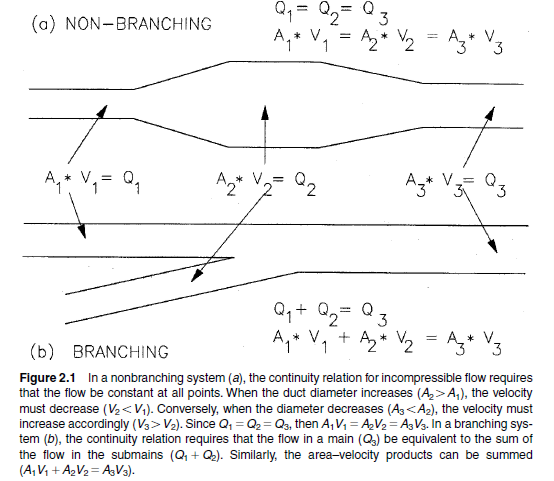{width="479"}

## 2.4 壓力（Pressure）

- 作用於單位面積上的垂直作用力，同時也可以被定義為單位體積內的能量。
- **絕對壓力與表壓（Absolute vs. Gage Pressure）**
  - 大氣壓力是由我們上方空氣質量的重量（力）所產生，通常以「完全真空（零壓力）」為基準來進行測量，這種測量方式稱為「絕對壓力（Absolute pressure）」。
  - 在工業通風系統中，管內空氣壓力與外界大氣壓力的差異通常非常微小，因此實務上我們更常使用「表壓（Gage pressure）」來表示系統壓力。
    - 表壓是以當時的環境大氣壓力為基準（歸零）所測得的相對壓力差。
- **壓力的測量單位（Pressure Units）**
  - **磅每平方英吋（psi）：** 在標準海平面條件下，大氣的絕對壓力為 14.7 psi，這也就是標準大氣壓（14.7 psia = 0 psig）。
  - **英吋汞柱（in. Hg）：** 源自於水銀氣壓計的測量。在標準條件下，大氣壓力會使水銀柱上升 29.92 英吋，因此標準大氣壓為 29.92 in. Hg。
  - **英吋水柱（in. H2O）：** 這是工業通風實務上**最重要且最常用**的單位。若將上述氣壓計改用水來填充，由於密度差異，標準大氣壓下水柱會上升至 407 英吋。由於通風系統中的壓力差異通常極小（常不到 1 英吋水柱），使用英吋水柱（或我國實務常用的毫米水柱 mmH2O）能提供比水銀更好的視覺解析度與測量精準度。
  - **帕斯卡（Pa，國際單位制 SI）：** 1 帕斯卡等於每平方公尺 1 牛頓。1 大氣壓相當於 1.01×105 Pa。

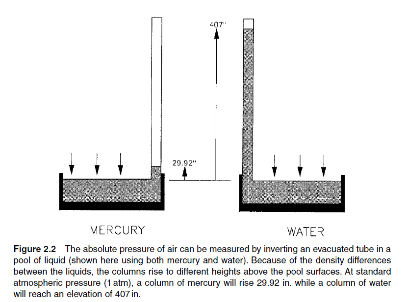

## 2.4 壓力（Pressure）續

- **壓力的種類（Types of Pressure）**
  - 壓力等同於單位體積的能量。對於靜止的空氣，我們只需要考慮由理想氣體方程式推導出的靜水壓力（與流體位能相關）；但通風工程的核心在於處理「運動中的空氣」，因此必須引入與流體動能相關的動態壓力。空氣在風管中流動時，存在三種物理特性截然不同的壓力：
  - **靜壓（Static Pressure,** ps​**）：** 靜壓代表氣流中與位能相關的成分，無論氣流方向或流速為何，它都會均勻地向四面八方作用。**靜壓同時存在於靜止與運動的空氣中。**在通風系統中，靜壓表現為一種傾向將風管撐破（當管內壓力大於外部環境，為正值）或使風管向內塌陷（當管內壓力小於外部環境，為負值）的壓力。實務上，靜壓幾乎都是相對於環境大氣壓力所測量的「表壓」。例如在抽風機（Fan）的前方（吸氣側），靜壓為負值；在抽風機的後方（排氣側），靜壓為正值。
  - **動壓（Velocity Pressure,** pv​**，或稱速度壓）：** 動壓與運動中氣流的「動能」有關，且**僅作用於氣流流動的方向**。動壓的大小主要取決於氣流速度，若空氣靜止，則動壓為零（pv​=0）。在物理本質上，動壓是一種絕對壓力，這意味著它**永遠是正值**，不可能為負數。動壓通常無法直接獨立測量，而是透過測量全壓與靜壓後，以數學或機械裝置相減得出,。
  - **全壓（Total Pressure,** pt​**）：** 全壓是靜壓與動壓的總和（pt​=ps​+pv​），代表流體在流動方向上施加的總壓力（或總能量）。對於流動的流體，全壓必定大於靜壓；對於靜止的流體（因為沒有動壓），全壓則等於靜壓。與靜壓相同，在通風系統中測量全壓時，它會依據相對於環境的壓力狀態而呈現正值或負值。

::: {.callout-note appearance="minimal" icon="false"}
透過垂直於氣流方向的靜壓孔測得「靜壓」，並透過平行迎向氣流的衝擊孔測得「全壓」。將兩者透過微壓計相減，即可得出「動壓」，進而依據公式精準換算出管內氣流流速。
:::

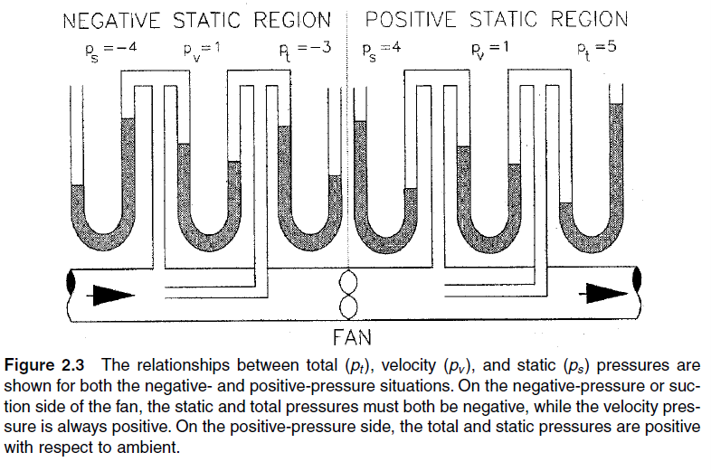

## 2.5 水頭（Head）

- **總水頭（Total Head）與能量守恆**
  - 總水頭（ht​）在物理上的定義是測量流體「每單位重量所具有的總能量」。依據流體力學的能量守恆概念，流體的總水頭方程式可以表示為：

    $h_t =p/ρg +V^2/2g +z$

    - **壓力水頭（Pressure head,** $p/ρg$​**）：** 代表流體因壓力差異所產生的位能（每單位重量）。
    - **速度水頭（Velocity head,** $V^2/2g$​**）：** 代表流體的動能（每單位重量）。其推導過程是將物體的動能公式 $Ek​=1/2​mV^2$兩邊同除以質量（m），並將質量轉換為重量（除以重力加速度 g）而得。
    - **高程水頭（Elevation head,** z**）：** 代表流體因處於某個基準點上方，由重力所賦予的位能（每單位重量）。
- **水頭的物理單位** 既然水頭代表的是運動流體的「能量／單位重量」，我們若以英制單位來看，能量的單位是英呎-磅力（ft-lbf），而重量的單位是磅力（lbf）。將兩者相除（ft-lbf / lbf），其單位便會直接簡化為單純的長度單位「英呎（feet）」。同理，在公制單位中，水頭的單位即簡化為長度單位「公尺（m）」。

## 2.5 水頭（Head）續

- **水頭與壓力的轉換關係**
  - 工業通風的實務探討上，我們通常更習慣使用「壓力（Pressure）」來表示流體單位體積的能量。為了將水頭公式轉換為我們熟知的通風壓力公式，我們可以進行以下假設與推導： 首先，假設系統中參考點的高程不變（亦即忽略高程變化，z=0）。接著，將水頭方程式等號兩邊同乘以流體密度（ρ）與重力加速度（g）的乘積，方程式便會轉換為：$ρgh_t =p+ρV^2/2$​ 此時，方程式中的每一項都已經轉換為「壓力」的物理項：
    - $ρgh_t$即為全壓（Total pressure, pt​）。
    - p 即為靜壓（Static pressure, ps​）。
    - $ρV^2/2$即為動壓（Velocity pressure, pv​）。 這項推導完美地證明了：壓力等同於「水頭」、「流體密度」與「重力加速度」三者的乘積。

::: {.callout-note appearance="minimal" icon="false"}
用來檢測管內靜壓、動壓的儀器（如以皮托管連接微壓計），其讀數單位通常是「英吋水柱（in. H2O）」或我國常用的「毫米水柱（mmH2O）」。

這些「水柱的長度」正是「水頭（Head）」的單位，而不是真正的壓力單位，但在實務上將其稱為壓力單位，是因為它是液柱所施加壓力的「替代指標（surrogate）」。透過上述公式，只要將水柱的「長度（即水頭）」乘上水的「密度」與「重力」，就能輕易換算出真正的壓力值。
:::

## 2.6 揚程 (Elevation)

- 若將流體位能（又稱高程，Elevation）的變化納入考量，並轉換為以壓力單位表示，方程式可完整寫為：$h_t =p/ρg +V^2/2g +ρgz$。

  - 其中 z 即代表高程。在工業通風系統的設計與檢測實務中，我們經常忽略高程的變化，

- **高程效應在一般通風系統中被忽略的原因**

  - 在標準環境條件下，空氣密度為 1.2 kg/m3，在海平面上，高度改變則大氣靜壓也會改變。 然而，在絕大多數的通風系統中，管內流動的空氣密度與管外的周遭環境空氣密度相同。因為這種隨著高度變化的壓力改變，同時發生在通風系統的「內部」與「外部」。例如，當通風管路垂直上升 70 英呎時，儘管理論上會產生約 1 in. H2​O 的壓力降，但外部的參考大氣壓同時也下降了 1 in. H2​O。由於我們在通風工程中所測量的靜壓（Static pressure）是相對於外部大氣壓的「表壓（Gage pressure）」，這兩者的變化互相抵銷，所以測量到的相對壓力並不受高程改變的影響。因此，當系統內部流體與外部大氣密度相同時，高程項 z 可以安全地被忽略。

## 2.6 揚程 (Elevation) 續

- **必須考量高程效應的特殊情況**
  - 只有當通風系統內部流體的「密度」與外部周遭環境的流體密度有顯著差異時，高程項 z 才具有工程上的重要性。這種密度差異通常發生在排氣系統抽引極高溫/極低溫氣體，或是輸送高濃度重質氣體的情境。

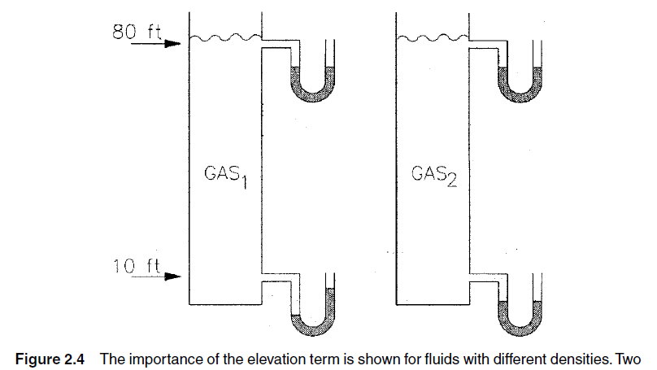{width="460"}

- 假設在 80 英呎高處，外部的大氣壓為 406 in. H2​O，而在 10 英呎低處，大氣壓因高度下降而增加為 407 in. H2​O。

+---------------------------+--------------------+-----------------------+
| 位置                      | GAS₂（密度同空氣） | GAS₁（密度 2 倍空氣） |
+:==========================+:===================+:======================+
| 80 ft 絕對壓力            | 406 in. H₂O        | 406 in. H₂O           |
+---------------------------+--------------------+-----------------------+
| 10 ft 絕對壓力            | 407 in. H₂O        | **408 in. H₂O**       |
+---------------------------+--------------------+-----------------------+
| 相對於外界的錶壓（80 ft） | 0                  | 0                     |
+---------------------------+--------------------+-----------------------+
| 相對於外界的錶壓（10 ft） | 0                  | **+1 in. H₂O**        |
+---------------------------+--------------------+-----------------------+

➜ **GAS₁ 腔室**：由於內部氣體密度較大，從頂部到底部的壓力增加量 **大於** 外部大氣壓力增加量，因此產生 **正的相對靜壓（錶壓）**。

- ::: {.callout-note appearance="minimal" icon="false"}
  - **系統流體密度 = 環境密度**（如一般空氣系統）：\
    ✅ 高程項可忽略，壓力量測不受垂直高度差影響（若參考點為外界大氣）。

  - **系統流體密度 ≠ 環境密度**（如特定氣體、高溫氣體、含微粒流體等）：\
    ⚠️ 高程項 **不可忽略**，尤其當系統的進出口有 **明顯垂直落差** 時，會產生靜壓差，影響風機性能、壓力平衡與流量控制。
  :::

## **2.7 壓力關係 (Pressure Relationships)**

- **速度壓與流速的轉換關係**

  - 速度壓（動壓，pv​）是由流體的動能所產生，其大小取決於流體的速度與密度，公式表示為 $P_v​=ρV^2/2$。 透過單位轉換與標準環境條件的代入，我們可以推導出實務上極為常用的簡化公式：
  - **英制單位：** $V=4000\sqrt{p_v}$ (V 為流速，單位為 fpm；Pv​ 為速度壓，單位為英吋水柱 in. H2​O）。
  - **公制（SI）單位：** $V=1.29\sqrt{P_v}$​​（V: m/s；Pv​ 單位為帕斯卡 Pa）。 在職衛現場進行通風系統檢測時，我們便是利用皮托管（Pitot tube）測得速度壓後，直接套用此公式來換算管內風速，以確認其是否達到要求的「控制風速」或「搬運風速」。

- **柏努利方程式（Bernoulli's Equation）與能量守恆**

  - 空氣在風管中流動時遵守能量守恆定律，即柏努利方程式。
  - 若以水頭（head）表示，流體從點1流至點2的方程式為： $p_1/ρg +V_1^2/2g=p_2/ρg +V_2^2/2g+Losses$ ​。
  - 在一般通風系統中，我們假設流體為不可壓縮（密度 ρ 不變）且忽略高程變化。將上述方程式同乘 ρg 轉換為壓力單位後，可得： ps,1​+pv,1​=ps,2​+pv,2​+Δpt​。 這代表在氣流流動的過程中，**靜壓（**ps**​）與速度壓（**pv**​）之間可以相互轉換**，但系統的總能量（全壓 pt​）必定會因為摩擦與擾流造成的能量損失（轉化為熱能）而持續下降（**Δ**pt**​ 即為全壓損失**）。

## **2.7 壓力關係 (Pressure Relationships) 續**

- **截面積變化對壓力的影響（漸縮管系統）**
  - 結合連續方程式（Q=V×A）與壓力關係，當氣流經過截面積縮小的風管（如風機前的漸縮管）時，會發生顯著的壓力變化。 由於流量 Q 在單一管路中保持恆定，當截面積減小（A2​\<A1​）時，流速必然增加，連帶使得速度壓上升：$Pv_2​=Pv_1​(A_1​/A_2​)^2$。 根據能量守恆，速度壓的急遽上升必須由靜壓來提供能量。因此，在漸縮管段，除了因摩擦與擾流引起的總壓下降外，靜壓（ps​）會出現更大幅度的驟降，以「補償」增加的動能（速度壓）。
  - 因為 QQ固定 → 面積越小，動壓越大（平方反比）。
- **雷諾數（Reynolds Number, Re）與流體流態**
  - 要精確計算流體在管內因摩擦所產生的能量損失，必須先判斷流體的流態是層流（Laminar flow）還是紊流（Turbulent flow）。
  - 雷諾數的計算公式為 $Re= ρVD/μ$（其中 D 為管徑，μ 為黏滯度）。
    - **層流：** 當 Re \< 2000 時，空氣分子遵循平行的流線運動，流體間沒有橫向混合。
    - **紊流：** 當 Re \> 4000 時，流線消失，流體呈現高度混沌與嚴重的交叉混合。
    - 以標準空氣代入計算，當 $V×D>40 ft^2/min(0.06 m^2/s)$ 時，流體即進入紊流狀態。
  - 在工業通風的實務中，為了避免有害粉塵沉積於管路內，法規及設計準則通常要求管內風速須大於 1000 fpm (5 m/s)，且工業風管管徑通常大於 0.25 呎 (1.2 公分)。這意味著**工業通風系統的氣流幾乎完全處於紊流狀態**（僅少數空氣清淨設備內部可能存在層流）。

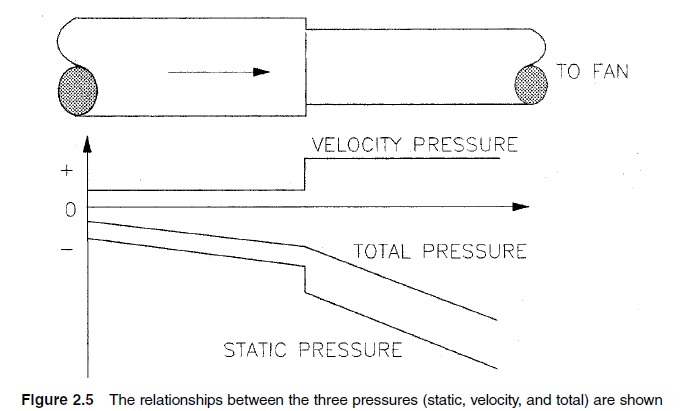

## 2.8 LOSSES

- 當空氣在工業通風系統的管線中流動時，必然會遭遇阻力，這些阻力會導致系統內各點的靜壓（Static pressure）與全壓（Total pressure）持續下降，而排氣機（Fan）的核心功能正是必須提供足夠的能量來克服這些壓力降。
- 流體在管路中流動時遭遇的阻力，主要可歸咎於兩種物理機制：「摩擦損失（Frictional Losses）」與「衝擊損失（Shock Losses）」。
- **摩擦損失（Frictional Losses）**
  - 摩擦損失源自於流體與風管管壁之間的「摩擦」，以及流體內部相鄰流層之間的剪應力（Shear stresses）。其損失幅度主要取決於系統的流體流態，即層流（Laminar flow）或紊流（Turbulent flow）。
  - **流速剖面與剪應力：** 在風管內部，緊貼管壁邊緣存在一層極薄的停滯空氣層（邊界層），此處的空氣流速為零；而在風管中心，空氣則以最大流速前進，兩者之間形成流速梯度（Velocity gradient）。這種急遽的流速梯度會在管壁產生極大的剪應力，導致紊流的摩擦能量損失遠高於層流。
  - **達西-魏斯巴赫方程式（Darcy-Weisbach relation）：** 在流體力學中，摩擦造成的**壓力損失**可透過此方程式精確計算：$ΔP_f​=f×(L/D)×P_v$。公式中的 Δpf​ 為摩擦壓力損失，f 為摩擦因數（Friction factor），L 為風管長度，D 為風管直徑，pv​ 則為動壓（Velocity pressure）。
  - **摩擦因數與實務應用：** 摩擦因數 f 的數值取決於雷諾數（Reynolds number）以及管壁的相對粗糙度，通常可透過穆迪圖（Moody chart）查得。然而，身為實務界的通風設計者，我們通常不會直接使用這個複雜的方程式與圖表。取而代之的，我們會使用建立在這些學理基礎上、並經過實證數據修正的圖表（例如 ACGIH 工業通風手冊中的摩擦損失圖），針對常用的鍍鋅鐵管等材質，直接查出每呎風管長度所對應的摩擦壓力降。這構成了我們目前通風設計最主流的「**動壓法**（Velocity pressure method）」，即**將壓力損失表示為動壓的倍數**來進行系統計算。

|                              |
|------------------------------|
| 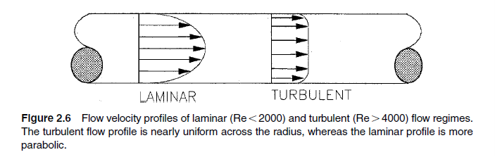 |
| 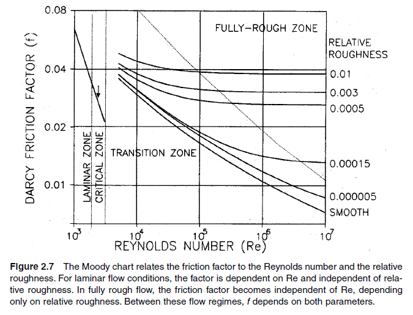 |

## 2.8 LOSSES 續

- **衝擊損失（Shock Losses）**

  - 第二種能量損失肇因於氣流中的紊流或「衝擊」，這會引發流體的劇烈混合與渦流（Eddy）的形成。
  - **發生位置與原因：** 衝擊損失通常發生在氣流被迫**改變方向，或風管截面積突然改變**（導致流速急遽變化）的地方，例如氣罩開口、風管分支（匯流）、漸縮管、漸擴管以及彎頭等。這些幾何變化會破壞原本穩定建立的流速剖面，進而產生壓力損失。
  - **氣流分離（Flow Separation）：** 衝擊損失的另一個主要原因是「氣流分離」，這主要發生在漸縮管與漸擴管中。當主流體無法繼續緊貼著管壁流動而產生剝離時，便會在剝離處後方的尾流區域形成不規則的渦流（如縮流頸現象），導致嚴重的能量耗損。
  - **數學表示與動靜壓轉換：** 各種擾動或管件造成的衝擊損失具有高度的變異性（取決於幾何形狀），但它們都有一個共通點：**損失大小與氣流的動壓成正比**。
    - 實務上我們將管件的壓力損失表示為：Δploss​=K×pv​， K 是取決於管件幾何形狀的損失係數。
    - 當氣流經過截面積縮小的漸縮管時（例如進入更小的管徑），依據連續方程式，流速必然增加，連帶使得動壓上升。根據能量守恆，靜壓必須下降以「補償」增加的動能（動壓），同時還要克服該管件的衝擊損失。因此，在該點的靜壓變化可表示為：Δps​=−(Δploss​+Δpv​)。

- 不論是直管中的「摩擦損失」，還是經過彎頭、漸縮管與氣罩時的「衝擊損失」，這兩種能量耗損在物理上均與系統內的「動壓（Velocity pressure, pv​）」成正比。這正是 ACGIH 所提倡的「動壓設計法」的核心學理。如果在設計局部排氣裝置時，低估了風管材質粗糙度帶來的摩擦，或是未盡量採用漸進式設計來減少氣流分離造成的衝擊損失，系統實際運轉時的總阻力將會大於設計值。

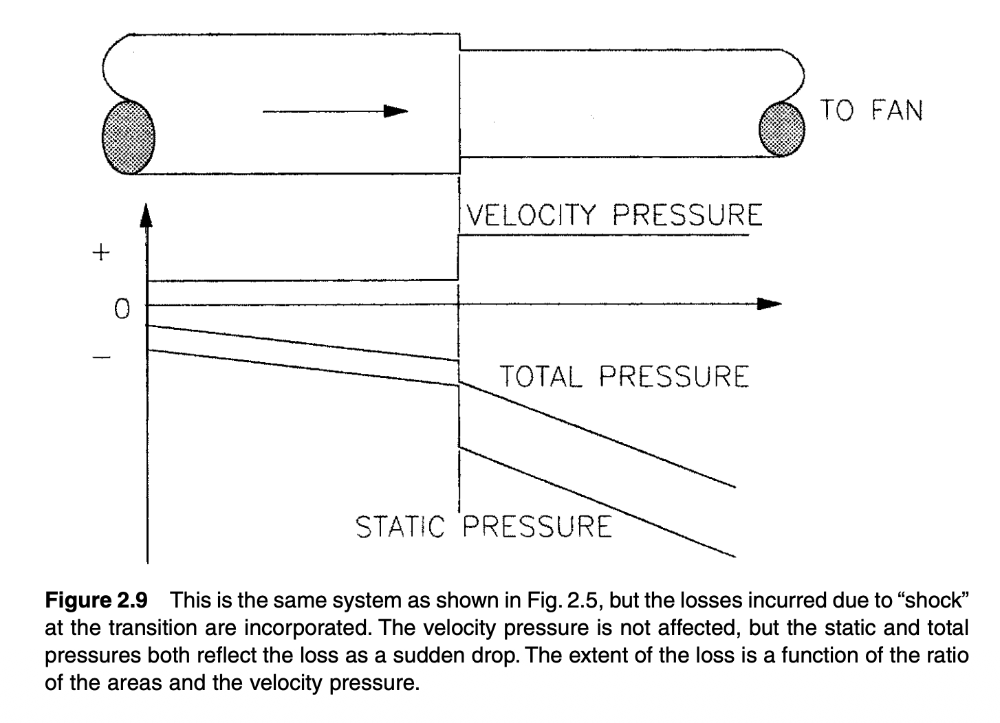{width="636"}

## 2.9 LOSSES IN FITTINGS

- 管件損失 (Losses in Fittings)聚焦在工業通風系統中不可或缺的各式管件，包含漸擴管、漸縮管、氣罩開口、彎頭與分支匯流管等。
- 精確計算這些管件的能量損失是極為關鍵的步驟，如果低估了管件損失，將導致風機抽氣能力不足，最終使得氣罩控制風速無法達到法規標準。
- 所有管件所造成的壓力損失，**主要取決於管件的幾何形狀**，並且與氣流的「動壓 (Velocity pressure, pv**​)」成正比**。因此，實務上我們通常將管件損失表示為動壓的倍數：Δploss​=K×pv​，其中 K 就是取決於管件幾何形狀的損失係數。有四種主要管件的流體力學特性與損失。

### 1. 漸擴管 (Expansions, 2.9.1節)

- 當風管的截面積變大時，氣流會從較小的管徑進入較大的管徑，此時流速必然會降低。
- **動靜壓轉換與靜壓復歸：** 依據能量守恆，當流速下降導致動壓減少時，這部分減少的動能理論上會轉換回位能（也就是靜壓上升），這在工程上稱為「靜壓復歸 (Static pressure regain)」。
- **突擴與漸擴的差異：** 如果管徑是「突然擴大 (Abrupt expansion)」，高速氣流撞擊低速氣流會產生強烈的氣流分離 (Flow separation) 與渦流，導致嚴重的衝擊損失。反之，如果採用「漸進式擴大 (Tapered expansion)」，則能大幅減少氣流剝離的現象，提高動壓轉換為靜壓的效率。在理想狀態下，漸擴管的效率**最高**可達 100%（當管徑變化比率為1時，即無擴大），而**最差**則是直接排入開放空間（效率為 0%）。

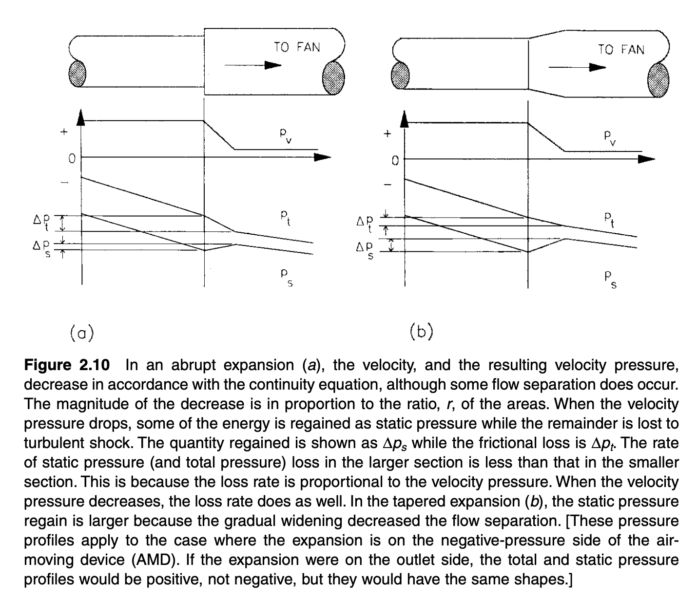{width="636"}

## 2.9 LOSSES IN FITTINGS 續

### 2. 漸縮管與氣罩開口 (Contractions, 2.9.2節)

- 管徑縮小或空氣進入氣罩的過程，在流體力學上都屬於漸縮的情況。當截面積縮小，流速會增加，動壓也隨之上升，因此靜壓必須下降以補償增加的動能及克服管件造成的衝擊損失。

  - **氣罩開口 (Hood Entries)：** 氣罩開口是一種特殊的漸縮管，將整個作業環境（房間）視為前方較大的管段，而排氣導管則是後方較小的管段。由於房間內的空氣靜壓與動壓皆視為零，因此氣罩的靜壓 (ps,h​) 必須提供足夠的能量來加速空氣（產生管內動壓 pv​）並克服進入氣罩時的「進入損失 (Hood entry loss, he​)」。其關係式為 ps,h​=pv​+he​，而進入損失 he​=Fe​×pv​。

    - **進入係數 (Coefficient of Entry,** Ce​**)：** 這是一個無因次的幾何指標，定義為「在特定氣罩靜壓下，實際的排氣量」與「若無任何進入損失時，該靜壓所能產生的最大理想排氣量」之比值。沒有凸緣的平口氣罩 (Plain) Ce​ 僅為 0.72，而具有優良流體力學設計的圓喇叭型開口 (Bell-mouth) Ce​ 則高達 0.98，這代表其能量損失極小。

  - **管路內漸縮 (In-Line Contractions)：** 與漸擴管類似，漸縮管也分為**突縮與漸縮**。[任何漸縮角度大於 60 度的管件都會被視為「突縮 (Abrupt contraction)」]{.underline}。突縮會造成氣流無法緊貼管壁，並在縮口後方產生「縮流頸 (Vena contracta)」現象，引發嚴重的流體擾動與能量耗損。身為設計者，應極力避免在系統中使用突縮管件。

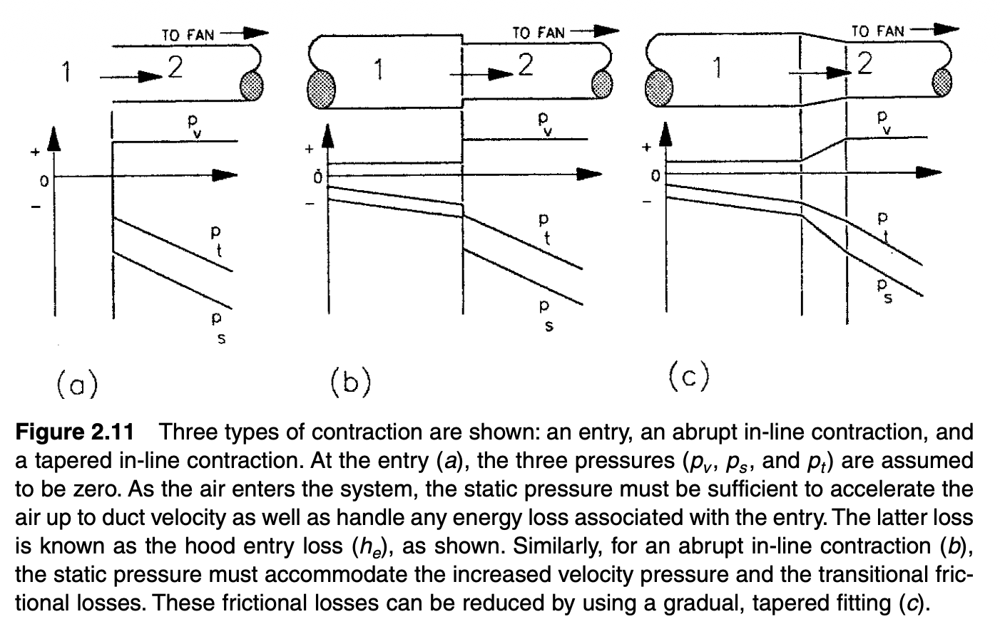

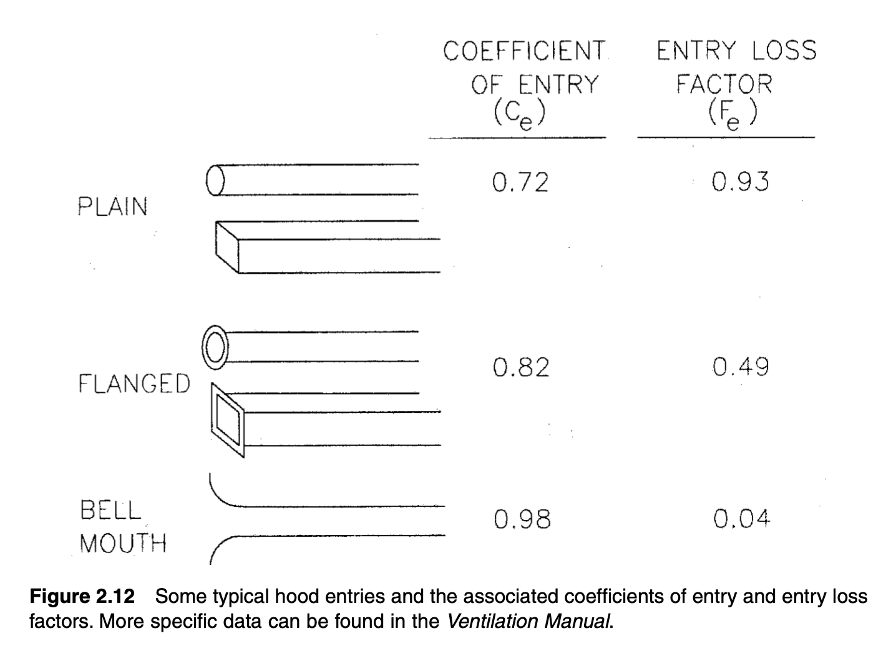

## 2.9 LOSSES IN FITTINGS 續

### 3. 彎頭 (Elbows, 2.9.3節)

- 氣流通過彎頭時因為被迫改變方向，會產生擾流及壓力損失。

  - 彎頭的壓力損失公式為 $Δp_{loss} =K_{90} ×(θ/90)×p_v​$。這表示損失的程度與彎折的角度 (θ) 成正比，一個 30 度的彎頭，其損失大約是一個 90 度彎頭的三分之一。

  - **決定損失係數的關鍵：** 對於圓形風管而言，K90​ 的大小完全取決於「彎管長徑比 (Elbow aspect ratio, R/D)」，也就是彎曲半徑 (R) 與管徑 (D) 的比值；比值越大（代表彎得越平緩），損失越小。矩形風管則同時受長徑比與風管長寬比的影響。

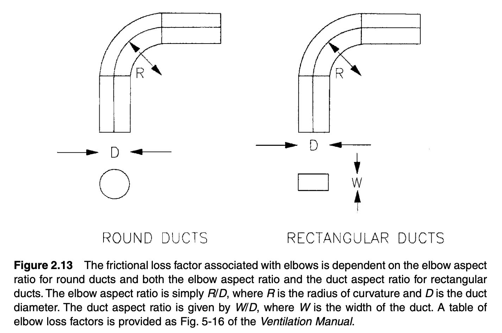

## 2.9 LOSSES IN FITTINGS 續

### 4. 分支管與匯流 (Branch Entries / Junctions, 2.9.4節)

- 在多氣罩系統中，分支管的氣流匯入主風管時所產生的亂流損失，在設計實務上是「歸算在分支管內」，因此計算損失時，使用的是**分支管內的動壓**，而不是主風管的動壓。

  - **匯流角度的準則：** 損失係數 K 的大小取決於匯流的夾角，角度越大，氣流撞擊與擾流越嚴重，損失也越高。實務上，若使用 90 度的T型三通管直接匯流，將產生高達 1.0×pv​ 的龐大靜壓損失。

  - **優化設計：** 在審圖或現場設計時，建議使用 30 度的斜口匯流；若現場空間受限，也應採用一個 60 度的彎頭加上 30 度的匯流口（總損失僅約 0.36×pv​），絕對要**避免超過 45 度的直接匯流**入主風管。

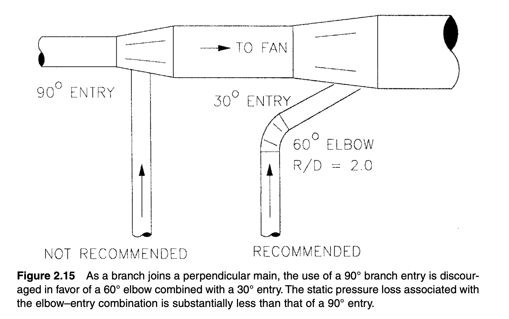

::: callout-important
通風系統中每一個管徑變化、每一個轉彎、每一次匯流，都在消耗風機所提供的寶貴能量。在執行我國法規所要求的通風系統設計與定期自動檢查時，若發現現場被包商任意安裝了 90 度的T型管匯流，或是使用了突縮、突擴的管件，身為職業衛生專家要能夠指出這些是造成系統總阻力大增、氣罩末端抽風量衰退的「元凶」。
:::

## 2.10 SUMMARY

- 氣流原理 (Principles of Airflow)點出了學習流體力學基礎對於工業通風工程的絕對重要性。

#### **1. 運動中空氣**（behavior of moving air）

- 在過去的實務界中，許多工程師或通風包商在設計系統時，往往過度依賴經驗法則、查表、繪圖或是既定的標準設計程序。掌握了本章的基本理論後，將不再只是盲目地套用公式，而是能知其然更知其所以然，精確理解每一個設計參數背後的流體力學意義。

#### **2. 壓力與流速之間的關係**

- **速度、靜壓與全壓的關係（Velocity, Static, and Total Pressure）：** 氣流在管路中流動時，代表動能的速度壓（或動壓）、代表位能的靜壓，以及代表總能量的全壓，三者遵循著柏努利能量守恆方程式相互轉換。
- 理解當管徑改變時這三者的變化（例如漸縮管處動壓上升、靜壓必然下降），以及摩擦與衝擊如何導致全壓無可挽回地耗損。
- **速度壓與流速的轉換關係（Velocity pressure and velocity）：** 動壓與流速的平方成正比，在現場利用皮托管量測到的速度壓（pv​），正確換算出管內的氣流流速（V）。

#### **3. 有效通風系統「設計」與「檢測」**

- 氣流與壓力關係，是「設計（design）」與「測試（testing）」有效通風系統的關鍵。

  - **在系統設計端：** 唯有精確計算出各個管件、氣罩與直管的能量損失，才能正確估算出整個系統的總阻力，進而選配出具有足夠靜壓與風量的排氣機（Fan）。

  - **在系統測試端：** 通風系統安裝完畢後，必須依賴準確的壓力與流速量測，來診斷系統是否達到設計標準、風管內部是否有粉塵沉積、或是管線是否發生破損洩漏。

## 我國法規規定

### 一、 設置局部排氣裝置與風速控制之規定

- 我國針對不同危害物質的特性，分別訂定特定危害預防標準，強制雇主在特定作業場所必須設置局部排氣裝置，並要求維持其有效性能（包含達到法定的控制風速與導管內的搬運風速）：

#### **1.《有機溶劑中毒預防規則》**

- **設置要求：** 雇主使勞工於室內作業場所或儲槽等作業場所從事有機溶劑作業時，應依據有機溶劑的種類（第一種至第三種），設置密閉設備或「局部排氣裝置」。
- **設計與效能：** 法規明訂局部排氣裝置之氣罩應設置於每一發生源，且外裝型氣罩應儘量接近發生源。**裝置必須由專業人員妥為設計，並於作業時間內有效運轉，將空氣中有害物濃度降低至容許暴露標準以下**。

#### **2.《特定化學物質危害預防標準》**

- **設置要求：** 對於散布有**丙類物質**（氣體、蒸氣或粉塵）之室內作業場所，或**處置甲類、乙類特定化學物質之加工作業**，雇主應於發生源設置密閉設備或「局部排氣裝置」。
- **設計與效能：** 氣罩應置於每一氣體、蒸氣或粉塵發生源，外裝型或接受型氣罩應儘量接近發生源，並應儘量縮短導管長度、減少彎曲數目。且**設備應由專業人員妥為設計，並維持其性能**。

## 我國法規規定 （續）

#### **3.《粉塵危害預防標準》**

- **設置要求：** 雇主為防止**特定粉塵發生源之粉塵發散**，必須設置局部排氣裝置等對應設備。
- **設計與效能：** 局部排氣裝置**應由專業人員妥為設計並維持其性能**。氣罩宜設置於每一粉塵發生源，導管長度宜儘量縮短，且於粉塵作業時間內不得停止運轉。

### 二、 實施「效能測試（原始性能測試）」之規定

- 局部排氣裝置在新建、改裝完成時，必須確認其設計是否達標，因此法規強制要求進行「原始性能測試」：

1.  **《有機溶劑中毒預防規則》第17條：** 局部排氣裝置設置完成後，雇主應實施「原始性能測試」，並依測試結果製作原始性能測試報告書，其相關文件與紀錄應保存十年。

2.  **《特定化學物質危害預防標準》第38條：** 同樣明訂局部排氣裝置設置完成後，應實施「原始性能測試」，並依測試結果製作原始性能測試報告書，相關文件及紀錄應保存十年。

    - 測試報告書的內容必須包含氣罩幾何形狀與尺寸、入口風速（即控制風速）、吸氣口與發生源之相對位置與距離，以及管道系統上下游靜壓等數據的測試結果，藉此核對是否與設計報告相符。

### 三、 實施「定期自動檢查」之規定

- 通風系統在長期運轉下，會因為粉塵沉積、管線破損或風機皮帶鬆弛而導致風速衰退，因此法規要求必須依法進行自動檢查：

#### **1.《職業安全衛生管理辦法》第40條（定期檢查）**

- 雇主對局部排氣裝置、空氣清淨裝置及吹吸型換氣裝置，應「每年定期實施檢查一次」，檢查項目必須包含：

  - 氣罩、導管及排氣機之磨損、腐蝕、凹凸及其他損害之狀況及程度。
  - 導管或排氣機之塵埃聚積狀況。
  - 連接電動機與排氣機之皮帶之鬆弛狀況。
  - **吸氣及排氣之能力**（此處即指透過量測靜壓、動壓來推算風量與管內搬運風速是否維持設計標準）。

#### **2.《職業安全衛生管理辦法》第47條（重點檢查）**

- 雇主對局部排氣裝置或除塵裝置，於開始使用、拆卸、改裝或修理時，應實施「重點檢查」，包含確認導管或排氣機粉塵之聚積狀況、導管接合部分狀況，以及吸氣及排氣之能力等。

::: callout-tip
職業衛生管理人員，必須清楚知道「設計」、「驗收（原始性能測試）」與「日常維護（定期自動檢查）」是維持工業通風系統效能的黃金三角。
:::

## 法規：控制風速（Capture velocity）與搬運風速（Transport velocity）？

- 我國過去的確在特定危害預防標準（如有機、特化、粉塵等）中，附有明確的法定控制風速與搬運風速數值表。然而，為了接軌國際趨勢並落實真正的暴露控制，**近年來法規已經進行了重大修正，刪除了這些僵化的數值規定，全面轉向「效能導向（Performance-Based）」的管理模式。**
- 目前法規不再硬性規定單一的風速數值，而是將責任交給受過訓練的專業人員。
  - **容許暴露標準為依歸：** 依據《有機溶劑中毒預防規則》第14條等規定，局部排氣裝置必須有效運轉，核心目標是「降低空氣中有害物濃度至勞工作業場所容許暴露標準（PEL）以下」。
  - **專業設計與性能維持：** 法規明訂這些控制設備「應由專業人員妥為設計，並維持其有效性能」。
  - **設計與測試報告的雙重驗證：** 雖然法規本文刪除了風速標準，但依據法規要求填寫的「局部排氣裝置設計報告書」與「原始性能測試報告書」，設計者仍必須明確交代並檢測「入口風速（即控制/面風速）」、「吸氣口與發生源之相對位置與距離」以及「管道系統上下游靜壓」。這代表你必須具備學理依據來設定並驗證這些風速。

### 建議設定方式：參考 ACGIH 準則

- 在缺乏法規絕對數值的情況下，設計人員可參考全世界工業通風設計最權威的參考依據 - **ACGIH 工業通風手冊 (Industrial Ventilation Manual)**。

## 問題與詳解 - 第二章：氣流原理

- 2.1 **問題：** 若氣體密度在恆溫下增加為兩倍，絕對壓力會增加為幾倍？\
  **公式來源：** 理想氣體定律 $P=ρR_aT$\
  **計算式：**$P2/P1=ρ2/ρ1=2$
- 2.2 **問題：** 直徑 6 英吋風管內之平均風速為 1500 ft/min，若風管直徑縮小為 4 英吋且流量不變，新風管之平均風速為何？\
  **公式來源：** 連續性方程式 $Q=A1V1=A2V2$\
  **計算式：**$V2 = V1(D2/D1)^2 = 3375 ft/min$
- **2.3 問題：** 直徑 30 公分風管內之平均風速為 12 m/s，若直徑擴大為 50 公分且流量不變，新風速為何？\
  **答案：** 4.3 m/s
- **2.4 問題：** 將以下風速轉換為對應之速度壓： 13.26 m/s\
  **公式來源：**$V=1.29P_v​​ (m/s, Pa) ≈ 106 Pa$
- **2.5 問題：** 空氣流經直徑 70 cm 之風管，風速 15 m/s。摩擦損失為 0.0225 pv​ .per m。流經 75 m 之靜壓損失為何？\
  **公式來源：** $ΔP_f​=(損失因子×P_v​)×L$\
  $Pv​=(15/1.29​)^2≈135.2 Pa$\
  $ΔPf=0.0225×135.2×75≈228 Pa$

## CH3 AIRFLOW MEASUREMENT TECHNIQUES

- 配合我國《職業安全衛生管理辦法》中對於局部排氣裝置「定期自動檢查」與「原始性能測試」的嚴格要求，我們必須精確量測系統的排氣能力（例如導管內的搬運風速）。

- **系統性能驗證不能僅靠設計計算，必須透過現場測量**。

### 3.1 **使用皮托管測量風速 (MEASUREMENT OF VELOCITY BY PITOT–STATIC TUBE)**

#### 一、 皮托管的基本原理與地位

- 皮托管（Pitot-Static Tube）是一種將「全壓管」與「靜壓管」整合在同一探頭上的量測儀器。它的內管開口迎向氣流以測量全壓（pt​），而外管側邊的一系列小孔則與氣流平行以測量靜壓（ps​）。將這兩端連接到微壓計的兩端，即可直接得出兩者的差值，也就是「速度壓（動壓，pv​）」。

  - **風速換算：** 測得速度壓後，我們可套用第2章學過的公式來換算風速。英制為 $V=4000\sqrt{P_v}$​​（單位：fpm, in. H2O）；公制為 $V=1.29\sqrt{P_v}​$（單位：m/s, Pa）。

- 皮托管在流體力學上被視為「一級標準（Primary Standard）」**，這意味著只要它的幾何形狀未受損，本身**不需要進行校正，甚至我們常會用皮托管來校正其他的風速計。目前美國（ASHRAE, 採暖、製冷與空調工程師學會）標準採用半球形端頭（Hemispherical nose），而英國（BSI）則採用改良型橢圓端頭，兩者在實務應用上的差異極小。

#### 二、 壓力測量儀器 (3.1.1 Pressure Measurements)

- 要讓皮托管發揮作用，必須搭配合適的壓力計。工業通風系統中的壓力差通常很小，因此儀器的解析度至關重要：

  - **傾斜式微壓計（Inclined Manometer）：** 傳統垂直水柱計在低風速下難以精確判讀（例如 0.5 in. H2O 對應高達 2832 fpm 的風速）。實務上常將量測管傾斜（如 10:1 的坡度），使微小的壓力變化能產生明顯的液面位移，最低可讀取至 0.05 in. H2O（對應 896 fpm）。

  - **測量液體：** 各位在現場常看到紅色的測量液，那是比重為 0.826 的紅色指示油，而非純水。這不僅能產生比水多出約 20% 的位移量以提高靈敏度，還能形成更清晰的彎月面，使讀數更快穩定。

  - **機械與電子感測器：** 雖然現場常使用 Magnehelic 機械式壓力表或電子微壓計（因為不需校平、無液體外漏問題），但請切記，**它們並非一級標準，必須定期使用標準液柱微壓計進行校正**。

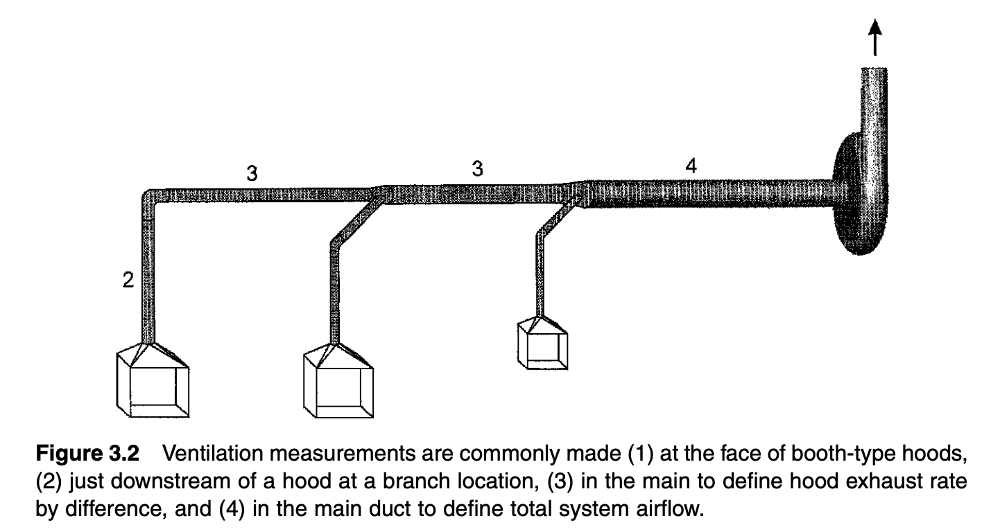

- 此為一個典型的**局部排氣通風系統（Local Exhaust Ventilation, LEV）**，包含排氣罩、風管、風機等元件，並標示了四個測量點：\

  +------------+----------------------+------------------------------------------------------------+--------------------------------------+
  | 位置       | 測量位置             | 目的                                                       | 常用儀器                             |
  +:===========+:=====================+:===========================================================+:=====================================+
  | **1**      | 排氣罩開口面         | 測定**面速度（face velocity）**，驗證設計風速              | 旋轉葉片風速計、熱線式風速計         |
  +------------+----------------------+------------------------------------------------------------+--------------------------------------+
  | **2**      | 排氣罩下游、分支管處 | 測定該**分支管之風量**，確認單一排氣罩性能                 | 皮托管（Pitot tube）搭配傾斜式壓力計 |
  +------------+----------------------+------------------------------------------------------------+--------------------------------------+
  | **3**      | 主風管中段           | 藉由**差值法**計算特定排氣罩之排氣量（總風量減去其他分支） | 皮托管                               |
  +------------+----------------------+------------------------------------------------------------+--------------------------------------+
  | **4**      | 主風管末端           | 測定**系統總排氣量**，評估整體通風能力                     | 皮托管、風速計、流量計               |
  +------------+----------------------+------------------------------------------------------------+--------------------------------------+

## CH3 AIRFLOW MEASUREMENT TECHNIQUES 續

### 3.1 **使用皮托管測量風速**

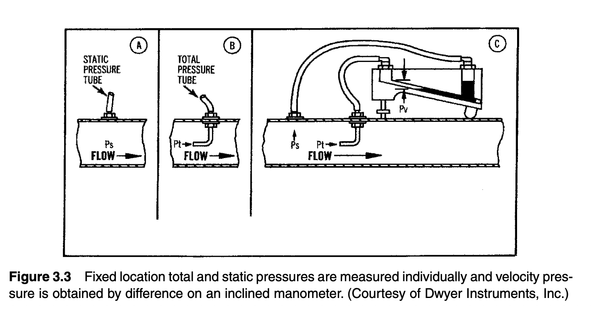

+-----------+--------------------------------+-----------+------------------------------------------------------------------------+
| 編號      | 名稱                           | 測量壓力  | 連接方式                                                               |
+:==========+:===============================+:==========+:=======================================================================+
| **A**     | STATIC PRESSURE TUBE（靜壓管） | 靜壓 ps​   | 僅連接靜壓孔（管壁開口）\                                              |
|           |                                |           | 靜壓代表氣流的**位能**                                                 |
+-----------+--------------------------------+-----------+------------------------------------------------------------------------+
| **B**     | TOTAL PRESSURE TUBE（總壓管）  | 總壓 pt​   | 僅連接面向氣流之開口\                                                  |
|           |                                |           | 總壓代表氣流的**總能量（位能 + 動能）**                                |
+-----------+--------------------------------+-----------+------------------------------------------------------------------------+
| **C**     | 兩管同時連接                   | 速度壓 pv​ | 同時連接靜壓管與總壓管至傾斜式壓力計\                                  |
|           |                                |           | 此差值即為\*\*速度壓（velocity pressure）\*\* 速度壓代表氣流的**動能** |
+-----------+--------------------------------+-----------+------------------------------------------------------------------------+

::: {.callout-note appearance="minimal" icon="false"}
- Ｑ：為何速度壓不能直接測量，而需透過計算？\
  靜壓管垂直於氣流，僅感應位能；總壓管平行於氣流，感應位能+動能。速度壓是兩者之差，沒有單一儀器可直接讀取 pvp。\
  **固定式測量裝置**適合長期連續監控，但僅能提供單點數據，無法取代皮托管之全斷面掃描測量。
:::

## CH3 AIRFLOW MEASUREMENT TECHNIQUES 續

### 3.1 **使用皮托管測量風速**

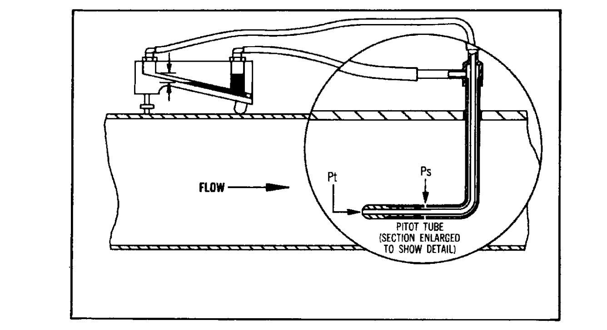

+--------------------+------------------------------------------------+---------------------+
| 圖中元件           | 說明                                           | 功能                |
+:===================+:===============================================+:====================+
| **內管**           | 總壓探針，開口端指向上游且平行於氣流方向       | 測量總壓 pt​         |
+--------------------+------------------------------------------------+---------------------+
| **外管**           | 套在內管外，兩端密封，形成一個封閉的環狀空間   | 提供靜壓量測之腔室  |
+--------------------+------------------------------------------------+---------------------+
| **外管周圍之小孔** | 在距離探針鼻端特定距離處，圍繞管壁鑽孔         | 測量靜壓 ps​         |
+--------------------+------------------------------------------------+---------------------+
| **兩個接頭**       | 分別連接內管（總壓）與外管腔室（靜壓）至壓力計 | 計算速度壓 pv=pt−ps​ |
+--------------------+------------------------------------------------+---------------------+

#### 實務問題：粉塵環境中的堵塞

+------------------------+--------------------------------------------------------------+------------------------------------------+--------------------------------------+
| 問題                   | 原因                                                         | 後果                                     | 解決方式                             |
+:=======================+:=============================================================+:=========================================+======================================+
| **靜壓孔與總壓孔堵塞** | 測量孔開在風管底部，而風管內輸送粉塵時若速度不足，粉塵會沉積 | 皮托管插入時會推擠沉積粉塵，導致孔洞堵塞 | 用壓縮空氣吹氣通過接頭，清除孔內粉塵 |
+------------------------+--------------------------------------------------------------+------------------------------------------+--------------------------------------+
| **頻繁堵塞**           | 風管內粉塵負荷高                                             | 無法獲得正確讀數                         | 更換為**孔徑較大之特殊皮托管**       |
+------------------------+--------------------------------------------------------------+------------------------------------------+--------------------------------------+

::: {.callout-tip appearance="minimal" icon="false"}
Ｑ：「測量孔不應開在風管底部」？這與粉塵輸送有何關係？\
在輸送粉塵的風管中，**皮托管插入孔應開在風管側面或頂部**，避開底部粉塵沉積區域，以減少堵塞風險。
:::

## CH3 AIRFLOW MEASUREMENT TECHNIQUES 續

### 3.1 **使用皮托管測量風速**

#### 導管內的風速剖面 (3.1.2 Velocity Profile in a Duct)

- 在現場不能只把皮托管插到風管正中央，量一個數值就當作管內平均風速。
  - **流速分佈不均：** 空氣在風管內流動時，管壁處風速為零，越往中心風速越快。在理想的「完全發展紊流（Fully developed flow）」下，流速剖面相對平坦。

  - **實務現場的擾動：** 工業現場充滿了彎頭、漸縮管與分支管。例如，氣流通過彎頭時，慣性會將氣流「甩」向外側管壁，導致流速剖面嚴重歪斜。

  - **量測位置法則：** 為了得到準確的平均風速，量測點應盡可能遠離這些擾流管件。經驗法則與研究皆強烈建議，量測孔應開設在擾流管件下游至少 **7 到 10 倍管徑（7D \~ 10D）**的位置。

#### 皮托管截面測定法 (3.1.3 Pitot–Static Traverse)

- 基於管內流速不均現象，必須進行「截面測定（Traverse）」，也就是在風管截面上選定多個特定點測量，再求取平均：

  - **圓形風管（對數線性法 Log-linear method）：** 這是目前 ACGIH 與 ASHRAE 推薦的標準方法。它將風管截面劃分為數個等面積的同心圓環區，並在這些區域的「平均風速點」進行量測（通常是在兩個互相垂直的直徑上，各測 10 個點，共 20 點）。這比早期的切線法（Tangential method）精準度高出一倍。

  - **矩形風管（對數契比雪夫法 Log Chebyshev procedure）：** 依據網格劃分，至少需要測量 25 個點，且量測點間距不得超過 6 英吋（約 15 公分）。

- **錯誤警告：** 在計算平均風速時，常犯的嚴重錯誤是「直接把各點的速度壓（pv​）加總平均」。**絕對不可以平均速度壓！** 因為風速與速度壓是平方根的非線性關係。正確的做法是：**將每一個點的** pv​ **開根號換算成風速** V **後，再將所有的風速** V **進行算術平均**。

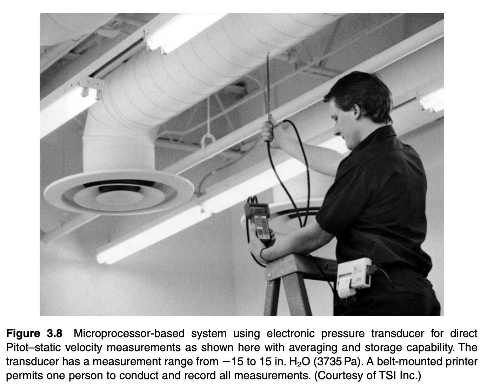

- **圖3.8的儀器是皮托管專用的電子讀數器，它顯示的是經過計算後的風速。**

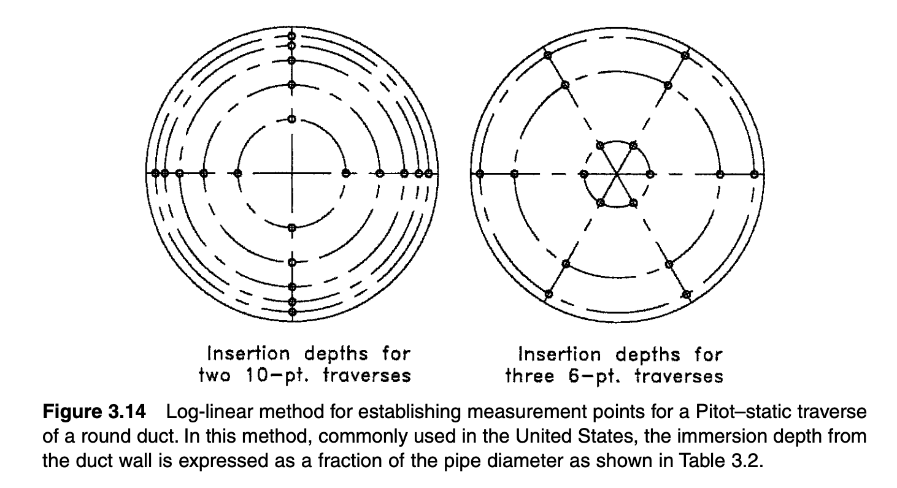

## CH3 AIRFLOW MEASUREMENT TECHNIQUES 續

### 3.1 **使用皮托管測量風速**

#### 皮托管的應用限制與潛在誤差 (3.1.4 Application and Potential Errors)

1.  **管徑過小的機械干擾：** 對於標準直徑 5/16 英吋的皮托管，因其探頭尺寸限制，若要在圓管邊緣測量第一個點（距離管壁 0.019D），風管直徑至少需要 8 到 11 英吋以上，否則皮托管彎頭會卡到管壁。對於極小的風管，必須改用直徑 1/8 英吋的微型皮托管。

2.  **迎風對準誤差（Pitch and Yaw）：** 皮托管必須平行迎向氣流。若傾斜或偏航角度在 15 到 20 度以內，速度壓的誤差約在 3% 到 5% 之間，主要影響的是靜壓孔的讀數。

3.  **粉塵堵塞：** 若導管內設計的「搬運風速」不足，導致高濃度粉塵沉積，皮托管在插入時極易被粉塵堵塞（尤其是靜壓孔）。若發生此情況，需吹氣清除或改用大孔徑的特製皮托管。

4.  **低風速限制：** 皮托管最大的缺點是無法準確測量低風速。除非使用精密微壓計，否則在風速低於 1000 fpm（約 5.08 m/s）時，一般的皮托管與傾斜壓力計將難以精確判讀。

::: {.callout-note appearance="minimal" icon="false"}
執行我國法規所要求的局部排氣裝置「效能測試」時，皮托管截面測定是最具公信力的量測手段。熟練掌握皮托管的原理、正確的截面選點（Log-linear）、避開亂流區，以及嚴守「先換算風速再平均」的數學原則。
:::

## 3.2 機械式測量儀器 （MECHANICAL DEVICES）

- 皮托管在測量導管內高風速（大於 1000 fpm）時極為精準且無需校正（一級標準），但我們在工業衛生現場，更常需要評估的是氣罩開口處的面風速（Face velocity）或發生源的控制風速（Capture velocity）。這些位置的風速通常較低（例如 50 到 300 fpm），且氣流橫截面積大，以下介紹適用的三種機械式風速計。

### 一、 旋轉葉片式風速計 (Rotating Vane Anemometers, RVA) (3.2.1節)

- 這是在礦業與一般工業界廣泛使用的儀器，自 1920 年代即開始應用。
- **基本原理與發展：** 旋轉葉片（風車）的轉速與氣流速度成正比，新型 RVA 使用滾珠軸承，並搭配光電或電容式感測器與數位顯示器，大幅提升了低風速下的靈敏度與操作便利性。
- **尺寸與應用範圍：** RVA 有 1、3、4 及 6 英吋等不同直徑的葉片規格。直徑越大，啟動扭矩越大，在低風速下越靈敏；小直徑則適用於高風速。實務上最常用的是 3 英吋與 4 英吋規格，其有效測量範圍約在 100 至 5000 fpm 之間。
- **測量位置與限制：** RVA **最適合用來測量氣罩面、排氣格柵與送風口的風速**。**它通常「不適合」用來測量導管（Duct）內的風速**；若真要在管口測量，導管直徑必須至少是 RVA 儀器直徑的 6 倍以上，才能將誤差控制在 1% 以內。
- **測量方法：** 測量氣罩開口平均風速時有兩種方式：
  1.  **定點測量法（Fixed-point survey）：** 將開口劃分為數個等面積區塊，在每個區塊中心點測量後平均。此法精密度高，但耗時。

  2.  **移動截面測定法（Hand traverse mode）：** 儀器在開口面上勻速移動掃描。研究指出此法準確度較高，但需要操作者良好的移動配速經驗。無論用哪種方法，測量時間都不應少於 100 秒。
- **潛在誤差來源（重要考點與實務地雷）：**
  - **方向性誤差（Yaw angle）：** RVA **必須與氣流方向平行**。若偏航角超過 10 度，誤差將大於 1%；若偏航角達 30 度，誤差將高達 10%。

  - **移動速度過快：** 在移動截面測定時，若移動速度達到真實風速的一半，將產生約 10% 的誤差。

  - **脈動氣流（Pulsating flow）：** 由於葉片具有慣性，在變動氣流中 RVA 會「高估」真實的平均風速。

  - **人員干擾：** 檢測人員的身體會改變氣流模式。實務上應將儀器安裝在連桿上，與操作者保持至少 2 呎 (0.62 m) 的距離。

## 3.2 機械式測量儀器 （MECHANICAL DEVICES）續

### 二、 偏轉葉片式風速計 / 測風儀 (Deflecting Vane Anemometers / Velometer) (3.2.2節)

- **基本原理：** 其感測器位於一個矩形通道內，是一個安裝在緊繃懸吊帶上的輕量葉片。當空氣流經探頭進入儀器撞擊葉片時，會產生與風速成正比的角偏轉。
- **實務應用：** 這種儀器（配備低速探頭時）的**主要應用是測量大型氣罩開口平面的空氣流速**，測量範圍約為 30 到 300 fpm。它也被用來搭配特殊遮罩（Canopy）測量 HVAC 系統送風口的排氣量。
- **特性與優缺點：** 它的視覺反應時間很快，在脈動氣流中操作者必須自行平均讀數。相較於 RVA，它對方向對準的容忍度較高，偏離真實氣流方向達 20 度時，誤差依然很小。然而，它在低於 100 fpm 的極低風速下準確度表現較差，且由於儀器體積與截面積，**不適合用於測量過小的氣罩開口**。

### 三、 束縛葉片式風速計 (Bridled Vane Anemometers) (3.2.3節)

- **基本原理：** 類似風車的葉輪，但受到彈簧提供反向扭矩的束縛，其旋轉角度與風速成正比。
- **特點與應用：** 測量範圍（通常為 50 到 100 fpm）取決於內部彈簧。它配備有一個煞車機制，可以將葉輪固定在最大角位置，提供即時的讀數。這個特性讓它非常適合裝在長桿上，用於遠距離測量高處的格柵或送風口風速，但在工業通風排氣檢測中的應用較為局限。

**所有機械式風速計「都需要定期校正」**。這些儀器的懸吊系統或葉片很容易因為工業現場的撞擊、化學腐蝕或粉塵堆積而受損，導致測量失準。

|                               |
|-------------------------------|
| 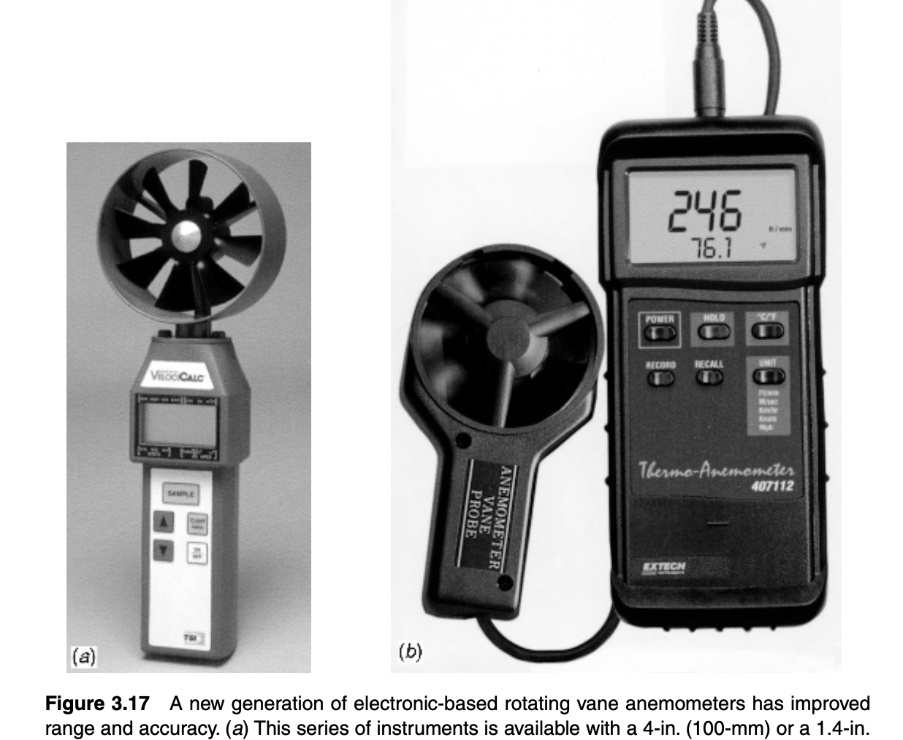 |
| 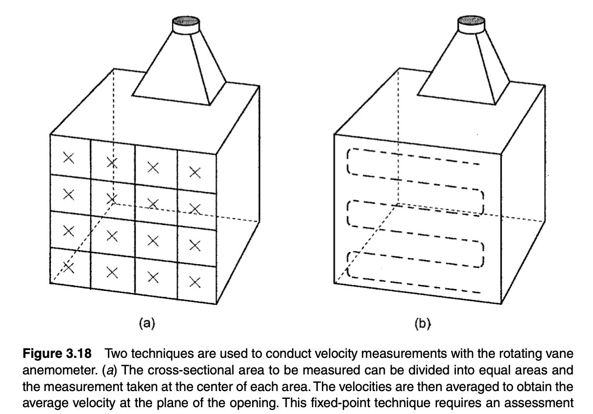 |

## 3.3 熱線式風速計（HEATED-ELEMENT ANEMOMETERS）

- 時機：皮托管（適合高風速）與機械式風速計（如旋轉葉片，受限於啟動風速），在工業衛生現場，經常需要精確測量氣罩開口處的微弱控制風速時。
- 基本原理與測量模式：**將一個加熱的元件置於流動的氣流中，氣流會將熱量帶走使其冷卻，而冷卻的速率與氣流的速度成正比**。
- 感測器（Sensor）的種類
  - **單純加熱線（Simple heated-wire sensor）：** 使用極細的鉑線或鎳鉻合金線（直徑小於 0.01 英吋），其運作溫度高達 250°F 至 700°F（121°C 至 370°C）。雖然這種設計的靈敏度極高，但金屬線極為脆弱，且容易因金屬老化而導致校正偏移。
  - **屏蔽型元件（Shielded-element）：** 為了適應工業現場的嚴苛環境，製造商將金屬線包覆在薄壁金屬管內，或是將細線圈塗上硬質塑膠塗層。雖然因為質量增加導致反應時間變慢（無法捕捉快速的亂流變化），但它堅固耐用，非常適合我們一般工業通風的現場檢測。
  - **熱敏電阻或熱電偶（Thermistors or thermocouples）：** 利用熱敏電阻作為感測元件（加熱至 93°C 至 204°C）是相當具吸引力的設計。因為熱敏電阻在單位溫度變化下所產生的「電阻變化量」，遠大於其他類型的感測器，這賦予了它**極佳的測量精準度**。
- 儀器特性與潛在限制
  - **非線性反應（Nonlinear Response）：** 這是熱線式風速計最重要的特徵。其輸出訊號呈非線性，這意味著儀器在「低風速區具有極高的靈敏度，但在高風速區的解析度則相當差」。這與皮托管恰好互補：皮托管在低於 1000 fpm (5.08 m/s) 時難以判讀，而熱線式風速計則是在這類低風速（例如氣罩口控制風速常在 50\~200 fpm）下表現最為優異。
  - **化學腐蝕風險：** 雖然屏蔽型探頭較為堅固，但若使用於具有高濃度腐蝕性化學物質（如電鍍槽、酸洗槽）的排氣氣罩測量，探頭仍可能遭到損壞。
  - **電池依賴：** 這類儀器需要持續供電來加熱元件，因此「電池壽命較短」是所有電池供電熱線系統的共同缺點，在現場長期檢測時必須備妥備用電源。
  - **方向性與校正：** 依據探頭幾何形狀的不同，儀器可能**具有測量方向性的限制**。更重要的是，與一級標準的皮托管不同，**熱線式風速計絕對需要「定期的保養與校正」**。

::: {.callout-important appearance="minimal" icon="false"}
執行職業衛生通風控制實務時，精準評估有害物發生源的控制風速是確保勞工免於暴露的關鍵。熱線式風速計完美解決了低風速測量的難題。然而，在現場使用時，務必要注意探頭的方向性、避免粉塵與水滴直接附著於加熱元件上（會改變冷卻速率導致嚴重誤差），並嚴格遵守儀器的定期校正規範。
:::

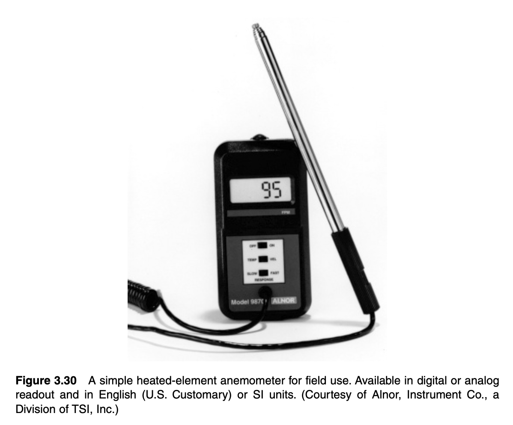

#### 3.4其他測量設備 (OTHER DEVICES) 略

## 3.5 氣罩靜壓法（HOOD STATIC PRESSURE METHOD）

- 在執行我國《職業安全衛生管理辦法》所要求的局部排氣裝置「定期自動檢查」時，若廠區內有數十個甚至上百個氣罩需要測量排氣量，逐一進行皮托管截面測定將會非常耗時。氣罩靜壓法提供了一個只要測量單一壓力數據，就能快速推算出氣罩排氣量的替代方案。

### 一、 氣罩靜壓法的學理基礎

- 局部排氣系統中一個主要的能量損失，發生在空氣進入氣罩與導管時的「進入損失（Entry loss, he​）」。在緊鄰氣罩下游的導管處測量到的「氣罩靜壓（ps​）」，在物理上必須提供兩部分的能量：一是將靜止空氣加速至導管流速所需的「速度壓（pv​）」，二是克服上述的「進入損失（he​）」。 其數學關係式為：ps=he​+pv​。
- 如果氣罩的幾何形狀完美（理想狀態），沒有產生任何擾流損失（he​=0），那麼氣罩靜壓將完全轉換為速度壓（ps=pv​）。然而，現實中必然存在擾流。為了量化這個空氣動力學品質，我們引入了「進入係數（Coefficient of Entry, Ce​）」的概念，它被定義為在給定氣罩靜壓下，「實際排氣量（Qactual​）」與「理想最大排氣量（Qideal​）」的比值。
  - **英制單位：** $Qactual​=4000×A×\sqrt{ps}​​×Ce​$（其中 A 為導管截面積，ps 為氣罩靜壓）。
  - **公制單位（SI）：** $Qactual​=1.29×A×\sqrt{ps}×Ce​$（其中 ps 單位為帕斯卡 Pa）。

### 二、 實務應用的優勢

- 氣罩靜壓法最大的優勢在於其「快速與便利性」，只要氣罩的 Ce​ 值已知，現場檢測人員只需測量氣罩下游導管的截面積（A），並鑽一個小孔測量其靜壓（ps​），帶入公式後便能立刻求出排氣量。 這種方法雖然在精確度上略遜於皮托管截面測定法，但對於現場檢測已相當足夠，**特別適用於測量同一排、多個幾何設計完全相同的氣罩**（例如一整排的研磨或拋光輪氣罩）。它能讓職業衛生管理人員在極短的時間內，迅速篩查出哪幾個氣罩的抽風量發生了異常衰退。

### 三、 潛在限制與專家建議

- 這個方法最大的弱點：**依賴於** Ce​ **值的準確性**。
  - **簡單氣罩的適用性：** 對於幾何形狀簡單的氣罩（如平口管、帶凸緣的氣罩），我們可以直接查閱 ACGIH《工業通風手冊》中公佈的 Ce​ 值，其準確度相當高，可放心使用。
  - **複雜氣罩的變異性：** 對於形狀複雜的氣罩（例如特定設備的研磨輪氣罩），即使是微小的製造或施工差異，都會導致實際的 Ce​ 值與手冊上公佈的數值產生落差。
- 如果在廠區內遇到複雜氣罩，或者該氣罩的 Ce​ 值無處可查，專業做法是： 首先，在導管的適當位置（避開擾流區）進行一次標準的**皮托管截面測定（Pitot-static traverse）**，精確計算出實際的排氣量（Q）。同時，測量氣罩後方的靜壓（ps,h​），並記錄導管面積（A）。接著，利用公式 $Ce​=Q/(4000×A×\sqrt{ps}​)$ 反向推算出該氣罩「專屬且真實的 Ce​ 值」。在完成這一次的「基準校正（Baseline calibration）」後，未來每年的定期自動檢查，就可以直接測量氣罩靜壓（ps,h​），套用這個專屬的 Ce​ 值來快速換算排氣量。

## 3.6 儀器校正 (CALIBRATION OF INSTRUMENTS)

- **校正的時機與影響頻率的風險因子** 儀器在剛從製造商出廠收到時、在規定的定期區間內，以及在現場遭受碰撞或不當使用後，都必須進行校正。決定校正頻率的高低，主要取決於儀器的「使用歷史」以及「應用的關鍵程度」：
- **建議的校正頻率** 基於上述風險因子，實務上我們可將校正頻率分為兩種情境：
  - **低度需求（年度校正）：** 如果儀器使用頻率較低（例如每月僅使用一次），且專屬於單一一位受過良好訓練的專業人員使用，那麼每年進行一次校正通常就已足夠。
  - **高度需求（月度校正）：** 相對地，如果儀器使用極為頻繁（例如每週使用），且作業環境相當惡劣、由多位人員共用，或是用於極度關鍵的法規合規性檢測，則可能需要每個月進行一次校正。
- **實務上的準確度要求** 在進行儀器校正與現場檢測時，必須對「準確度」有務實的認知。許多儀器製造商會宣稱其產品具有「滿刻度 ±2% ( ±2% of full scale)」的極高準確度，但在充滿亂流與干擾的工業現場，這種實驗室等級的準確度是不切實際的。由於在工業通風「設計計算」本身的誤差容忍度通常就在 ±5% 左右，因此，對於現場使用的風速測量儀器而言，能維持 ±5% 的準確度就已經非常足夠且符合工程標準了。

## 3.7 使用可見追蹤劑觀察氣流型態 (OBSERVATION OF AIRFLOW PATTERNS WITH VISIBLE TRACERS)」

- 關鍵的「質性」評估技術，利用「發煙管（Smoke tubes）」等可見追蹤劑來觀察氣流的真實走向，往往能最快、最直接地找出系統失效的真正原因。

- 理想的氣流追蹤劑應該具備以下特性：能在低成本、簡單的設備下產生持續且邊界清晰的視覺軌跡；不能對勞工造成健康危害；且不能干擾或污染產品製造過程。實務上常見的追蹤劑可分為以下幾類：

  - **粉塵燈 (Dust Lamp)：** 這是利用強光（平行光束）照射作業環境，透過微小粉塵的光散射效應來直接觀察污染物的運動軌跡。這在英國被成功應用於陶瓷業等具有微小粉塵釋放的場所，優點是直接利用現場的污染物作為追蹤劑，不需額外引入化學物質，但需要適當遮蔽環境背景光源才能獲得最佳觀察效果。

  - **發煙管 (Smoke Tubes)：** 這是目前職業衛生現場**最廣泛使用**的工具。常見的設計是在玻璃管內填充塗有氯化亞錫 (Stannic chloride) 或四氯化鈦的顆粒，當我們用橡皮球將含有水氣的環境空氣擠入管內時，會反應釋放出濃密的白色酸性煙霧（實際上是鹽酸或硫酸的微細液滴）。

    - 這種濃密的白煙具有呼吸道刺激性，且對金屬有腐蝕性。如果在無塵室或精密電子廠，或是人員密集的醫療環境中使用，必須極度謹慎以避免超過容許暴露標準或造成設備損壞。

  - **無毒/非破壞性追蹤劑：** 針對發煙管的缺點，業界也發展出其他替代方案。

## 3.7 使用可見追蹤劑觀察氣流型態 (續)

### 可見追蹤劑的實務應用 (3.7.2 Application of Visible Tracers)

- **通風系統設計階段 (Design of Ventilation System)：** 在設計氣罩前，先施放煙霧可以幫助設計者確認污染物的「釋放點」與「擴散動力學」。例如，確認高溫冶煉爐的熱上升氣流 (Thermal updraft) 走向以設計接受型氣罩；或是觀察現場的干擾氣流 (Cross-drafts)，甚至觀察操作員工站立位置是否會在身後產生「尾流渦流 (Vortex eddies)」而導致污染物逸散。
- **新系統的驗收與初勘 (Acceptance of a New System)：** 在花費大量時間進行皮托管截面測定之前，先用發煙管做快速的視覺檢查。
- **勞工教育訓練 (Education)：** 例如，銲接工人常高估可移動式吸氣罩（抽氣管）的控制範圍；透過現場打煙，能讓勞工「親眼看見」氣罩的有效抽風距離其實很短，進而促使他們養成隨時將氣罩移近銲接點的良好工作習慣。
- **系統維護與洩漏檢查 (Maintenance)：** 在執行法定「定期自動檢查」時，對於輸送帶轉運點或粉碎機的密閉氣罩，由於長期的機械震動極易造成接縫破損。利用發煙管沿著氣罩接縫或導管邊緣巡劃，是揪出系統洩漏點最有效的方法。
- **排氣重新進入評估 (Reentry)：** 當懷疑排氣煙囪的有害氣體被空調進氣口重新吸回廠房內時，可以將大量煙霧釋放於排氣系統深處（或煙囪口），由屋頂的觀察者追蹤排放羽流 (Plume) 的軌跡，以確認是否有短路循環的現象。
- **壓差檢測 (Differential Pressures)：** 在醫院（如負壓隔離病房）、實驗室或工業無塵室，必須維持嚴格的空間壓差以防止污染擴散。透過在門縫或傳遞箱邊緣施放少量煙霧，可以直觀地確認空氣是否確實從乾淨區流向污染區。
- **估算氣流流速 (Air Velocity)：** 雖然發煙管主要用於質性觀察，但在截面積固定且筆直的通道（如礦坑坑道或大型直管）中，可以釋放一團煙霧脈衝，並用碼錶測量其通過已知距離的時間，藉此粗略估算流速與流量。

::: {.callout-note appearance="minimal" icon="false"}
精密的風速計是我們驗證法規「控制風速」的度量衡，然而，符合法定的「風速數值」並不絕對等於「100%的捕集效能」。在真實的廠房中，人員走動、機台運轉、甚至是打開一扇門，都會產生擾動氣流。「眼見為憑」在工業通風中具有無可取代的地位。熟練地使用發煙管等可見追蹤劑，不僅能幫助執行相關通風檢測時快速進行故障排除（Troubleshooting），更是向雇主與勞工證明工程控制防護設施「是否真正有效」最具說服力的溝通工具。
:::

## CH5 HOOD DESIGN

### 5.1 氣罩分類

- 局部排氣氣罩依據「氣罩相對於有害物發生源的空間位置」分為三大類：包圍型氣罩（Enclosures）、外裝型氣罩（Exterior Hoods）以及接受型氣罩（Receiving Hoods）。

  - 包圍型氣罩 (Enclosures)

    包圍型氣罩的定義是「有害物是在氣罩的內部邊界中釋放或產生」。從通風工程的角度來看，這是最理想的設計，因為有害物被完全限制在氣罩內部，極易控制。依據包圍的完整程度，又可細分為三個子類別：

    - **完全包圍型 (Complete enclosures)：** 最典型的例子是手套箱（Gloveboxes）。這種設計將製程完全密封，對勞工提供最高等級的保護，且只需極小的排氣量來維持內部微負壓（negative pressure）即可防止有害物逸散，非常節省能源。在《特定化學物質危害預防標準》中，針對高毒性的甲類或乙類物質，法規的首要要求就是設置「密閉設備」，這對應的正是此類氣罩。其最大缺點是限制了操作的便利性，通常僅用於高毒性化學品或自動化製程。

    - **崗亭式氣罩 (Booths)：** 這是業界最常見的包圍型氣罩，具備一個部分或完全敞開的開口以供人員操作，例如噴漆房（Spray painting booths）或磨切作業房。雖然有害物在內部產生，但因為有開口，必須在開口處維持足夠的「面風速（Face velocity）」，以防止內部擾流或外部橫流將有害物帶出氣罩。

    - **隧道式氣罩 (Tunnels)：** 類似亭式氣罩，但具有兩個開口以供產線物料進出（如輸送帶上的零件）。其控制效能同樣取決於開口處的面風速。

## 5.1 氣罩分類 (續)

- 外裝型氣罩 (Exterior Hoods)

  外裝型氣罩的特徵是「有害物在氣罩外部產生，必須由氣罩將其吸入捕集」，例如可移動式的銲接抽風管。

  - **流體力學機制：** 外裝型氣罩必須主動「向外延伸（reach out）」，透過排氣機在氣罩前方製造局部真空，誘導空氣流動以產生足夠的「控制風速（Capture velocity）」，強迫有害物改變原本的路徑並吸入氣罩內。
  - **設計與實務上的致命傷：** 在學理上，外裝型氣罩的防護可靠度遠低於包圍型氣罩。首先，它極易受到作業環境中「橫向氣流（Cross-drafts）」的干擾；即使是沒有明顯氣流的房間，空氣也常有 30至50 fpm（0.15至0.25 m/s）的隨機流動，足以破壞外裝型氣罩的捕集流線。

- 接受型氣罩 (Receiving Hoods)

  接受型氣罩是一種特殊的外裝型氣罩，它的設計邏輯是「順勢而為」。若有害物的產生過程具有明確的「慣性方向」，氣罩的設計與擺放位置就會配合這個方向來「接收」有害物。不同於外裝型氣罩需要花費大量能量去拉動空氣，接受型氣罩讓有害物「順著氣流」直接進入氣罩。常見的兩種驅動力為：

  - **粒子動量 (Particle momentum)：** 例如砂輪研磨作業，研磨輪旋轉會賦予金屬或砂輪粉塵極大的初速度與動量，接受型氣罩會直接放置在粒子被拋射的路徑上來攔截它們。
  - **熱上升氣流 (Thermal updrafts)：** 高溫製程會使空氣密度變小而產生強烈的熱浮力（煙囪效應）。安裝於高溫冶煉爐上方的「天蓋式氣罩（Canopy hoods）」就是利用此原理接收向上衝的有害氣體。

::: {.callout-tip appearance="minimal"}
原則：**「盡可能使用包圍型氣罩（enclosing-type hoods）」**。
:::

## 5.2 包圍型氣罩的設計

- 包圍程度與開口面積的權衡
  - 多數製程需要人員操作或物料進出，因此廣泛使用的是「亭式氣罩（Booths，具一個開放面，如噴漆房或實驗室氣罩）」或「隧道式氣罩（Tunnels，具兩個開放面，如輸送帶）」。
  - 有了開口，就必須依賴「面風速（Face velocity, Vf​）」來防止有害物逸散，其數學關係式為 Vf​=Q/Af​（其中 Q 為總排氣量，Af​ 為所有開口的總截面積）。
  - 包圍型氣罩設計的第一黃金法則就是：**「盡可能使包圍更加完整（Make the enclosure as complete as possible）」**。
    - 透過加上擋板或垂簾來縮小開口面積（Af​），就能用最少的排氣量（Q）達到法規要求的面風速。
- 確保氣流均勻分佈（Airflow Distribution）
- 決定了開口面積與排氣量後，第二個設計重點是**「均勻的氣流分佈」**。
- 空氣會選擇阻力最小的路徑，設計者可透過增加內部阻力來「強迫」氣流均勻分佈，常見的方法有三種：
  1.  **增加氣罩深度：** 建議氣罩的深度至少應為其開口高度或寬度（取兩者較大值）的 75%。
  2.  **設置擋板（Baffles）：** 在氣罩後方設置實體擋板、斜角擋板或分離式擋板，透過幾何阻擋來平均分配各區域的抽風量。
  3.  **使用濾網（Filters）：** 在噴漆房後方裝設濾網，雖然其目的是捕捉漆霧，但它在流體力學上提供了相對較高的氣流阻力，實際上它作為「氣流均勻分佈器」的效果，往往比它作為空氣清淨設備的效果更好。

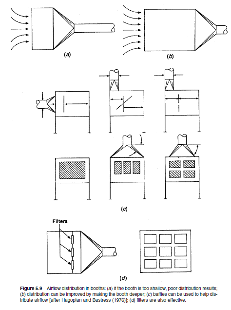

## 5.2 包圍型氣罩的設計 (續)

- 面風越高越好？
  - 計算排氣量時，我們需要決定設計面風速。在多數應用中，100 到 200 fpm（約 0.5 到 1.0 m/s）的面風速已經足夠。 **過高的面風速與過低的風速一樣，都會對氣罩效能造成破壞**。另也會**製程干擾及具有人體擾流效應**。
- 如何在建議範圍內決定最適風速？
  - ACGIH 提供了許多特定製程的建議風速範圍。當你們在現場需要決定具體數值時，應綜合考量以下因素來決定是否要採用範圍內的「上限（較高風速）」：
  - **干擾氣流（Cross-drafts）：** 如果作業環境有強烈的橫向干擾氣流（如電風扇、門窗冷氣直吹），就需要較高的面風速來抵抗干擾。
  - **高毒性物質：** 如果處理的是法規中具有極低容許暴露標準（PEL）的劇毒化學物質，我們必須採取更保守的設計，選擇較高的面風速以確保絕對控制。
  - **設備誘導氣流：** 如果氣罩內部有快速移動的物料搬運系統（如輸送帶、落料設備），這些機械運動會產生誘導氣流（induced airflows），此時必須提高面風速來克服這股向外衝的動能。

## 5.3 外裝型氣罩的設計

- 外裝型氣罩的先天劣勢在於它並沒有將污染物發散源包圍在氣罩內部；相反地，它必須透過抽風在氣罩外部製造局部真空，主動「向外延伸（reach out）」去捕捉已經釋放至作業環境空氣中的污染物。

- 外裝型氣罩的設計必須精準掌握三大核心要素：決定控制風速、決定氣罩排氣量，以及氣罩的物理形狀與位置。

  1.  決定控制風速（Determination of Capture Velocity） - 控制風速的定義是：在污染物釋放點，為了將污染物「捕捉」並帶入排氣氣罩內，所必須建立的空氣流速。 - 外裝型氣罩設計最大的敵人是「橫向干擾氣流（Cross-drafts）」。即使在看似無風的室內廠房，也存在約 30 到 50 fpm（0.15 到 0.25 m/s）的隨機氣流。 - 在選擇具體的控制風速時，通常參考 ACGIH 所提供的標準，依據污染物的散布狀況分為四個等級。

  |                               |                               |
  |-------------------------------|-------------------------------|
  | 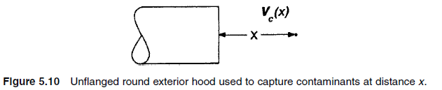 | 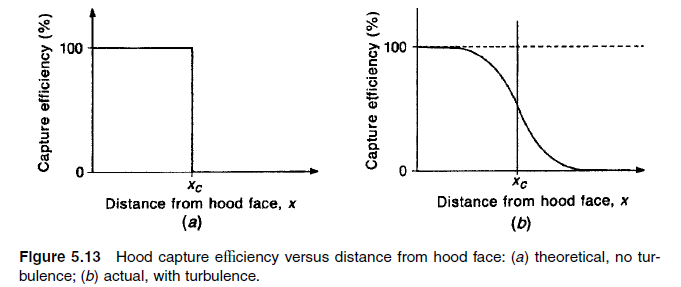 |

  1.  決定氣罩排氣量（Determination of Hood Airflow）
      - 決定了控制風速後，我們必須計算氣罩需要抽出多少風量（Q），才能在距離氣罩 x 處產生足夠的控制風速。
      - **點源抽氣與達拉瓦方程式（DallaValle's Equations）：** 理論上，一個微小的點抽氣源，其流速與距離的平方成反比($V=Q/4πx^2$)。DallaValle 透過大量實驗，推導出實務上極為著名的無凸緣（Unflanged）氣罩中心線風速經驗公式： $V=Q/(10x^2+A_f)​$這個公式告訴我們，外裝型氣罩的有效捕捉距離極短，通常在不到一個管徑的距離內，風速就會衰退到只剩開口面風速的 **10%**。
      - **凸緣（Flanges）功效：** 為了改善抽氣流速急遽衰退，必須在氣罩開口周圍加上「凸緣（Flange）」。凸緣在物理上的作用是「阻擋空氣從氣罩後方流入」。在總排氣量相同的條件下，空氣被迫完全從氣罩前方進入，這能大幅增加氣罩的「延伸捕捉距離（reach）」。DallaValle 的有凸緣氣罩公式為： $V=Q/[0.75(10x^2+A_f​)]$​，加上凸緣後，在相同距離下的控制風速提升了約 **33%**（即 1/0.75 倍），這代表我們可以節省約 25% 的風機排氣量。
      - **側吸式氣罩（Slot Hoods）：** 對於開放式槽體，我們常使用寬長比小於 0.2 的側吸式氣罩（Slot hoods）。在流體力學上，它被視為「線抽氣源（Line source of suction）」。線抽氣源的優勢在於其風速衰退是與「距離的次方」成反比（$V=Q/2πLx$），衰退幅度比一般氣罩的「距離平方」來得和緩。 Silverman 也為此提出了經驗公式（例如無凸緣為 $V=3.7Q/Lx$，有凸緣為 $V=2.8Q/Lx$）。實務設計上，為了確保長條形槽體各處的抽氣均勻，側吸式氣罩的狹縫風速（Slot velocity）通常必須設計在 1000 至 2000 fpm 之間。

  |                               |                               |
  |-------------------------------|-------------------------------|
  | 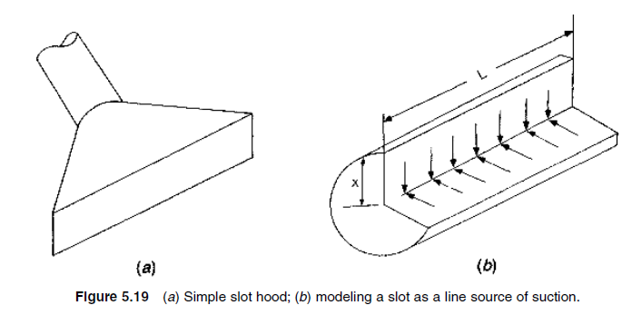 | 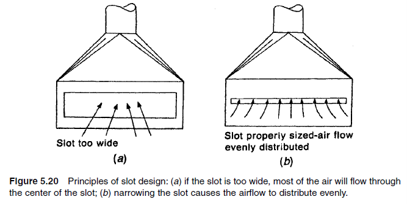 |

  1.  氣罩形狀與位置（Exterior Hood Shape and Location）

      外裝型氣罩設計的最高指導原則是：**「盡可能使其在物理形狀上接近包圍型氣罩」**。 在實際廠房中，即使我們無法將製程完全密封，我們也應該盡可能加上側擋板、頂罩或垂簾，將其改裝為「部分包圍型氣罩（Partial enclosure）」。例如在銲接工作台的兩側加上擋板，或是鑄造廠落砂機採用雙側抽風罩。

## 5.4 接受型氣罩的設計

- 接受型氣罩（Receiving Hoods）是一種特殊的外裝型氣罩。它的核心設計哲學是「順勢而為」，利用污染物流動的物理特性（如熱浮力或慣性）來輔助捕集。

一、 高溫製程的天蓋式氣罩 (Canopy Hoods for Heated Processes, 5.4.1節)

天蓋式氣罩在工業上極為常見（如鎔爐、熱處理槽上方），其運作原理完全仰賴高溫製程所產生的「熱上升氣流 (Thermal updrafts)」。

1.  **冷製程與熱製程的本質差異：** 天蓋式氣罩設置於「冷製程（室溫）」上方，它就只是一個單純的外裝型氣罩。但用於「熱製程」，高溫氣體會產生浮力向上衝，此時天蓋式氣罩便成為「接受型氣罩」，直接接收這股帶有污染物的熱氣流。

2.  **避免「溢出 (Spillover)」的排氣量設計法則：** 對於熱製程而言，排氣量 (Q) 的設計基準不再是單純的控制風速，而是取決於製程產生熱氣體的速率 (Qh​)。熱氣體產生率 (Qh​) 與熱源的尺寸、表面特性以及與環境的溫差（熱散失率）有關。**最核心的設計原則是：氣罩的總排氣量** Q **必須大於熱氣流的產生率** Qh​ **(**Q≥Qh​**)。**

3.  **高低位置的影響 (Low vs. High Canopy Hoods)：** Hemeon 學者將天蓋式氣罩依據距離熱源的高度分為兩類：

    - **低位天蓋式氣罩：** 距離熱源表面約 3 英呎（1 公尺）以內。這在實務上是強烈建議的設計，因為距離近，熱氣流與周遭冷空氣的擾流混合較少，也較不易受橫向氣流（Cross-drafts）干擾，能以較低的排氣量達到高捕集率。

    - **高位天蓋式氣罩：** 當氣罩設置過高時，熱氣流在上升過程中會大量卷吸（entrain）周圍的空氣，並受到廠房側流嚴重干擾，設計上會變得極為複雜且耗能，應盡量避免。

二、 研磨作業氣罩 (Hoods for Grinding Operations, 5.4.2節)

第二類接受型氣罩仰賴的物理特性是「粒子動量 (Particle momentum)」。例如砂輪研磨時，旋轉的砂輪會賦予粉塵極高的初速度與動量，將粉塵「拋射」出去。研磨氣罩的設計就是將氣罩開口放置在粉塵被拋射的路徑上來「接住」它們。

迷思：**研磨氣罩真的能「接住」所有粉塵嗎？**

1.  **粉塵的停止距離 (Stopping Distance, S)：** 微小粒子在空氣中高速飛行時，會受到極大的空氣阻力。所謂「停止距離」，是指粒子以特定初速射入靜止空氣中，直到因阻力而完全靜止所飛行的距離。依據物理計算，若以 2000 fpm (10 m/s) 的極高初速拋射：

    - 100μm 的大顆粒：停止距離為 12.7 公分。
    - 10μm 的粉塵：停止距離驟降至 0.23 公分。
    - 1.0μm 以下的微粒：停止距離僅有 3.6×10−3 公分，幾乎是一離開砂輪就立刻跟著氣流停滯了。

2.  **不同粒徑的飛行軌跡與捕集機制：** 基於上述物理特性，研磨產生粉塵的軌跡可分為三類：

    - **大顆粒 (**dp​\>30μm**)：** 循直線軌跡直接被拋入氣罩內。對於這些大顆粒，研磨氣罩確實發揮了「接受型氣罩」的功能。
    - **中顆粒 (**3μm\<dp​\<30μm**)：** 循中等軌跡前進，能稍微飛向氣罩，有助於捕集。
    - **小顆粒 (可呼吸性粉塵，**dp​\<3μm**)：** 這些對勞工肺部危害最大的微粒，**完全無法被拋射**。它們會緊貼著砂輪周圍的邊界層氣流一起旋轉，並不會主動飛向氣罩。

|                               |                               |
|-------------------------------|-------------------------------|
| 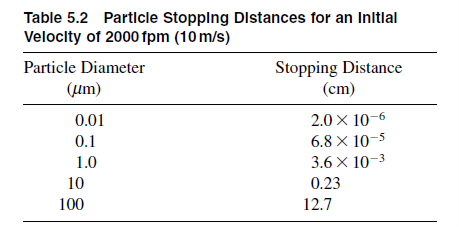 | 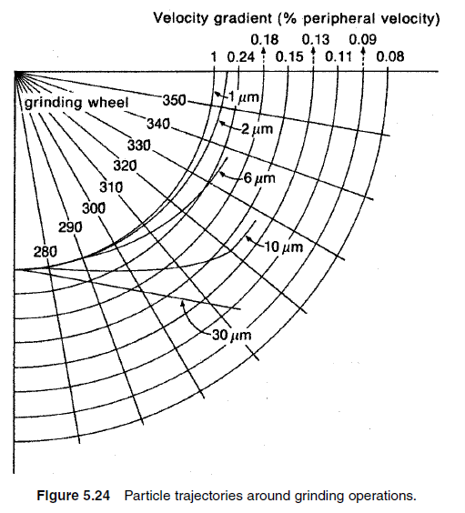 |

::: {.callout-warning appearance="minimal"}
對於危害最大的「可呼吸性粉塵」，研磨氣罩**完全失去了接受型氣罩的優勢**，它退化成一個普通的外裝型氣罩。我們必須依賴排氣機在砂輪表面產生「足夠的控制風速 (Capture velocity)」去主動把這些微粒「拉」進氣罩內。
:::

## 5.5 氣罩效能評估

- 進行效能評估以確認以下兩個核心問題：

1.  **氣罩的實際排氣量是否等於設計排氣量？**

2.  **氣罩是否真正捕集了製程所散發出來的有害物質？**

- 由於這些問題實際上評估的是「整個排氣系統」的綜合表現，而不單單只是氣罩本身，因此教材將具體的量化評估細節安排在**第13章**。

## 第6章 特殊氣罩設計

### 6.1 電鍍（ELECTROPLATING）

- 電鍍與各種金屬表面處理作業通常在「開放式槽體（Open-surface tanks）」中進行，製程中會釋放有毒的氣體、蒸氣與酸鹼微霧，因此必須依賴局部排氣裝置來控制。
- 電鍍槽通風設計的兩大核心：**氣罩設計（Hood Design）排氣量設計（Airflow）**。

#### 一、 氣罩設計 (6.1.1 Hood Design)

- 早期電鍍廠常使用牆壁風扇或是天蓋式氣罩（Open-canopy hoods），但這類設計的控制效能極差，現代設計已全面揚棄。目前針對開放式槽體，主要採用以下兩種氣罩：

1.  **包圍型氣罩 (Enclosing Hoods): 但受實務與技術限制**

2.  **側吸式氣罩 (Lateral Exhaust Hoods)**

    - **作用機制：** 當製程不允許包圍時，側吸式氣罩成為選擇。它的原理是在槽體液面上方製造一股水平的清淨氣流，將污染物「掃（sweep）」進氣罩內。

    - **幾何設計重點：**

      - **向上靜壓箱設計（Upward plenum）：** 這種具有魚尾狀漸縮管（fishtail taper）的設計，其靜壓箱本身就能作為一個實體擋板，有效阻擋廠房內干擾氣流對槽體表面的影響。

      - **周邊狹縫氣罩（Perimeter slot）：** 若採用此類氣罩，則必須額外安裝外部擋板，或將槽體緊靠牆壁放置，以達到相同的抗擾流效果。

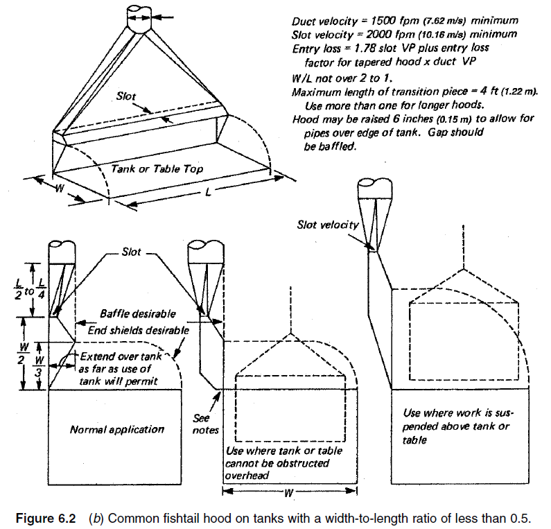{width="490"}

## 6.1 電鍍（ELECTROPLATING）續

### 二、 排氣量設計與氣流 (6.1.2 Airflow)

- 設計電鍍槽排氣系統時，槽體的「**寬度與長度比（width-to-length ratio）**」是決定排氣量的重要參數。如果槽寬小於 3 英呎，單側的側吸式氣罩即可勝任；對於更寬的槽體，則必須採用雙側狹縫氣罩、中央抽風氣罩，或是「**推挽式系統（Push-pull system）**」。但這類系統若設計不良（例如吹氣量與抽氣量不平衡）將導致污染物大量溢散，使得勞工處於極高風險之中。

#### **1. ANSI 兩階段評估** (另參考課本pp156-157)

- 過去常以固定的「每平方呎槽表面積需多少排氣量（cfm/ft²）」來設計。現代的專業設計則是依據 ANSI Z9.1 標準，採用一套涵蓋化學危害性與物理發散性的兩階段編碼系統來決定控制風速：
  - **第一階段 - 危害潛能 (Hazard Potential, A 至 D 級)：** 綜合考量槽內物質的毒性（容許暴露標準 TLV/PEL）以及火災爆炸特性（閃火點）來進行評定，取兩者中較高的危害等級作為設計依據。
  - **第二階段 - 發散速率 (Evolution Rate, 1 至 4 級)：** 評估污染物逸散到作業環境的能力，這取決於槽體的作業溫度、蒸發速率以及「產氣率（Gassing rate）」。
    - 電解槽（如電鍍或鹼性清洗槽）的產氣率極為關鍵。電解過程中，水會解離並在陰極產生氫氣、在陽極產生氧氣；當這些氣泡浮出液面破裂時，會將槽內有毒的液體化為「微霧（Mist）」散布至空氣中。此外，為了提升電鍍品質而使用的空氣攪拌（Air agitation），也會產生大量的粗粒微霧。

#### **2. 決定控制風速與排氣量**

- 結合上述的危害潛能與發散速率（例如 A-1 或 B-2），我們可以查表得出該槽體所需的「最低控制風速（Minimum Capture Velocity）」。對於高毒性且高發散率的製程，必然需要更高的控制風速。
- 取得控制風速後，再依據氣罩種類與槽體的寬長比（W/L ratio），即可精確計算出維持該控制風速所需的總排氣量（Q）。

## 6.2 噴漆作業 (SPRAY PAINTING)

- 傳統的空氣霧化噴漆作業會讓勞工暴露在兩大類危害物中：第一類是塗料與催化劑中揮發出來的「有機溶劑蒸氣」，第二類則是包含樹脂、填充物與顏料的「漆霧微粒 (Paint mist)」。

### 一、 氣罩與硬體設計 (6.2.1 Hood Design)

- 噴漆房設計的核心目標，是在勞工的呼吸帶建立一道「橫向且流速均勻的清淨氣流 (Lateral flow)」，藉此將有毒物質帶離勞工。若是針對汽車、火車頭或大型不規則鑄件等重工業噴漆，則常採用「下吸式氣罩 (Downdraft hoods)」。
- 在一般噴漆房的幾何與氣流分佈設計上，有以下幾個關鍵：
  1.  **開口面積與深度：** 噴漆房的面面積必須夠大，確保被噴塗的物件不會阻擋氣流而導致捕集效率下降。此外，「深度」是極為關鍵的設計元素；夠深的氣罩不僅能幫助建立平坦均勻的面風速剖面，還能有效防止噴漆打到平坦物件表面後產生的「反彈 (Rebound)」逸散出氣罩外。
  2.  **氣流均勻化機制（擋板與濾網）：**
      - **擋板 (Baffles)：** 在氣罩後方懸掛金屬擋板是改善氣流分佈最簡單的方法。擋板不僅阻力低、易於安裝與清洗，還能順便攔截少部分粗大的漆霧微粒。其數量與間距應依據氣罩的截面積來設計（如教材 Table 6.5）。

      - **濾網 (Filters)：** 在噴漆房後方設置拋棄式濾網可以創造出一個後方靜壓箱 (Plenum)，有助於面風速的均勻化。然而，這類粗濾網對傳統噴漆漆霧的收集效率通常不到 50%。身為職衛人員必須注意，濾網積漆後阻力會上升、風量會衰退，因此必須持續監控並定期更換。
  3.  **水洗式噴漆台 (Water-wash booths)：** 這是最能兼顧去除漆霧與維持良好氣流剖面的設計，通常包含水幕、逆向噴水與衝擊板等構造。**水洗台對大於 2 µm 的漆霧微粒具有 90% 以上的高去除效率**，**但請特別注意，這種設計對於去除「有機溶劑蒸氣」是無效的**。

## 6.2 噴漆作業 (續)

### 二、 排氣量設計與系統配置 (6.2.2 Airflow)

- **面風速的設定：** ACGIH、ANSI 與 OSHA 對於噴漆房的面風速有不同的建議值（通常介於 100 到 200 fpm 之間，取決於無氣噴漆/空氣霧化噴漆、以及有無側風干擾）。
  - 如果使用的漆料含有高毒性的重金屬（如鉛、鎘），或是使用環氧樹脂 (Epoxy)、聚氨酯 (Urethane) 等含有特殊催化劑的塗料，上述的常規面風速標準可能不足以保護勞工，必須採取更嚴格的防護對策。
- **排氣機 (Fan) 的選用：** 產業界常直接購買包含排氣機在內的「套裝噴漆房」。但這些附屬的排氣機通常是假設管路極短、沒有彎頭且直接排放到室外的情況下選配的。實務現場往往會加上複雜的管路，導致系統靜壓損失大增；例如原本在 0.125 吋水柱下能抽 5000 cfm 的風機，在加上現場管路阻力後，可能只剩下 3500 cfm。因此，**正確的做法應該是依照現場管路佈局「計算出總系統靜壓損失後，再獨立選配排氣機」**。
- **補給氣 (Replacement air) 的重要性：** 噴漆房的排氣量大，必須引進足夠的補給氣。為了產品品質，補給氣通常需要經過末端過濾；同時，**補給氣的引入位置必須遠離氣罩**，以避免空氣在進入氣罩前產生過長的移動距離而捲入微粒、污染了正在噴塗的表面。此外，**噴漆房絕對不能設置在廠房角落（會造成氣流不對稱）或靠近出入門口（會有穿堂風干擾）**。

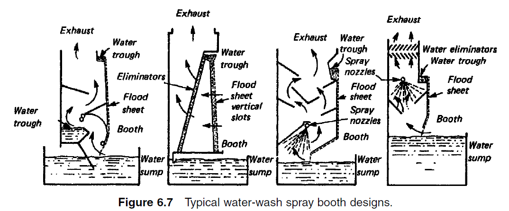{width="515"}

### 三、 勞工作業習慣 (Work Practices)

- 即使氣罩與風速設計得再完美，不良的作業習慣依然會導致勞工嚴重暴露。
  - **良好的操作守則：** 應盡量縮短噴槍與物件的距離、控制噴霧微粒大於 12 µm 以減少過度噴灑 (Overspray)、利用延長桿噴塗物件死角，並盡可能**採用機械手臂代替人工**。
  - **勞工站位與相對位置：**
    - **乾燥架的擺放：** 許多小型加工廠的勞工習慣將剛噴好的零件放在「自己身後的架子上」晾乾。這會導致高揮發性的溶劑蒸氣隨著氣流，先經過晾乾架、再經過勞工的呼吸帶，最後才進入氣罩，造成嚴重的溶劑暴露。

    - **迎風姿勢：** 勞工站在氣罩前方的姿勢對暴露有決定性的影響。研究與追蹤劑測試證實，勞工若採「側面迎風 (Side-to-flow)」的姿勢操作，其暴露量會比傳統「背對氣流 (Back-to-flow)」的姿勢產生令人驚豔的顯著下降（因為背對氣流會在勞工胸前產生擾流與渦流，將漆霧捲入呼吸帶）。

## 6.3 粒狀物料的處理與轉運 

- 礦業、採石業以及粉狀化學品的製造與分裝過程中，物料的輸送、儲存、加工與裝填會產生極大量的粉塵,。這正是我國《粉塵危害預防標準》所要防範的核心作業區域。這類製程的特點是「連續且多重」的轉運點（例如從斗式提升機到輸送帶、再到儲槽或漏斗），每一個落料點都是潛在的嚴重暴露源,。

### 一、 傳統設計的盲點與「誘導氣流」效應

- 早期許多工程師在設計粉粒體轉運點（如輸送帶落料口）的通風時，常直接套用一般氣罩的「面風速法則」，例如要求所有開口處維持 150-200 cfm/ft²，甚至包商會過度設計到 400-500 cfm/ft²。雖然 ACGIH《工業通風手冊》的 VS-50 系列設計圖引入了考量皮帶寬度、儲槽體積等參數的改良準則，但實務上仍常發現控制效果不彰,。

- **為什麼傳統的局部排氣會失效？** 流體力學學者發現了**「誘導氣流」**現象：當大量粒狀物料從高處落下時，物料群會像一個空氣幫浦，將頂部的空氣往下拖曳，並在底部將帶有粉塵的空氣強力擠出。如果系統（如儲槽）底部是密閉的，這股被誘導下來的氣流無處可去，就會**反向（U-turn）帶著高濃度的粉塵從上游的開口處「噴出」**至作業環境中（如教材 Fig. 6.9 所示）。

  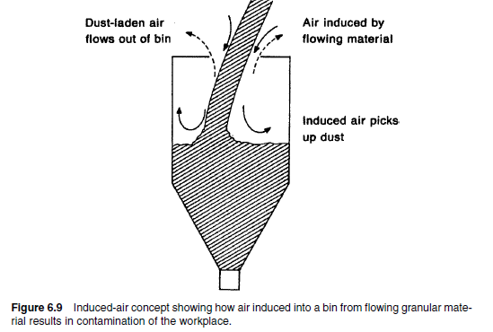{width="453"}

### 二、 誘導氣流的計算與排氣量設計法則

- 為了解決這個問題，Hemeon 提出了誘導氣流量的大小與固體質量流率、比重、粒徑、截面積以及落下距離等物理量成比例關係,。隨後，Anderson (1964) 依據實驗推導出一個極具實務價值的誘導氣流經驗公式：

$Qi​=10.0Au​(RS^2​/D)^{1/3}$

- Qi​ = 誘導氣流排氣量 (cfm)
- Au​ = 傾倒位置上游的開口面積 (ft²)
- R = 物料流率 (tons/h)
- S = 物料落下高度 (ft)
- D = 平均粒徑 (ft)(D\>1/8 ft)
- 身為專業的通風設計者，在評估任何粒狀物料轉運點的排氣量時，**不能只單純查閱 ACGIH 手冊。** 各位必須同時使用 ACGIH《工業通風手冊》的建議值，以及上述的「誘導氣流公式」分別計算出所需的排氣量，並且「取兩者中較大的數值」作為最終的設計排氣量。這樣才能確保排氣系統足以克服落料產生的強大向外氣流，真正防止粉塵逸散。

## 6.3 粒狀物料的處理與轉運 (續)

### 三、 裝袋與棧板堆疊作業的特殊控制 (Bagging and Pallet Loading)

- 在粉粒體處理流程的末端，通常是將產品裝入 50-100 磅（約 23-45 公斤）的紙袋中。這被公認是工業界「粉塵最嚴重、最難以控制」的作業之一。因為有效的控制不僅依賴硬體設備，更極度依賴勞工的「良好作業習慣」。
- 即使在標準的通風控制下，裝袋作業的粉塵暴露量仍可能高達 1 到 5 mg/m³。針對此難題，美國 NIOSH 提出了幾項實務創新技術：
  1.  **裝袋機的改良：** 採用「雙層袋嘴系統 (Dual-bag nozzle system)」，能有效減少隨袋內壓力升高而產生的粉塵「吹回 (Blowback)」現象，並搭配防塵袋夾，可使暴露量大幅減少 80% 至 90%。
  2.  **棧板堆疊區的控制 (Pallet loading)：** 當勞工將裝好的粉料袋堆疊至棧板時，NIOSH 建議可設置一個利用循環過濾空氣的「潔淨空氣島 (Clean-air island)」將操作者包圍，此法被證實能降低 86% 到 98% 的暴露，使濃度降至 0.04 mg/m³ 以下。
  3.  **推挽式排氣 (Push-pull exhaust)：** 在棧板裝載站使用推挽式系統（吹氣噴嘴提供 1200 fpm 射流，對面配置 2500 cfm 接收氣罩），或採用「由下往上」的整體換氣設計，皆能極有效地降低粉塵濃度。
- **總結：**在現場執行《粉塵危害預防標準》的防護對策時，請務必親自觀察物料的「落差高度」與「流率」。粉粒體的通風設計不是死板的幾何數學，而是必須與物料運動產生的空氣動力學（誘導氣流）對抗。精確計算誘導氣流、嚴格要求包裝作業習慣，並導入如雙層袋嘴或潔淨空氣島等創新工程控制，才是保護勞工免於塵肺症威脅的專業展現。

## 6.4 銲接、軟銲與硬銲作業 (WELDING, SOLDERING, AND BRAZING)

- 在金屬加工製造業中，銲接是最普遍的製程之一。然而，依據銲接工法、母材金屬成分、金屬被覆層以及作業空間的侷限程度不同，勞工所面臨的呼吸道危害差異極大。在我國的職業衛生實務中，這類作業的危害預防往往橫跨了《粉塵危害預防標準》（針對金屬燻煙）與《特定化學物質危害預防標準》（若母材或銲條含鈹、鎘等高毒性物質）。

### 一、 常見銲接製程與危害物生成特性

- 不同工法產生的氣膠與有害氣體截然不同，設計通風系統前必須先辨識危害：
  1.  **被覆金屬電弧銲 (SMA, Shielded Metal Arc)：** 最傳統的工法，使用消耗性被覆銲條。此工法會產生**大量的鐵氧化物及合金金屬燻煙**；若使用低氫銲條（Low-hydrogen electrodes），其被覆層含有可溶性氟化物，會釋放出具呼吸道刺激性與全身毒性的氟化氫 (HF) 氣體與可溶性氟化鹽微粒。
  2.  **鎢極惰性氣體銲 (TIG) 與 金屬惰性氣體銲 (MIG)：** 這兩類工法使用氬氣或氦氣等惰性氣體來屏蔽電弧。雖然金屬燻煙產生量相對較低，但由於紫外線輻射強烈，會將空氣中的氧氣**大量轉化為「臭氧 (Ozone)」**，特別是在使用 MIG 銲接鋁材時，臭氧與二氧化氮 (NO2) 的濃度極高。
  3.  **潛弧銲 (SAW, Submerged Arc Welding)：** 電弧被包覆在顆粒狀的銲劑（Flux）下方燃燒，因此幾乎不會產生空氣污染物，**通常不需要設置局部排氣裝置**。
  4.  **電漿弧銲 (PAW, Plasma Arc Welding)：** 電弧溫度高達華氏60,000度（約攝氏33,000度）以上，極高溫會導致**嚴重的臭氧、二氧化氮與金屬燻煙暴露**，絕對需要局部排氣控制。
  5.  **軟銲與硬銲 (Soldering and Brazing)：** 危害主要來自填料金屬或銲料的揮發物、助銲劑 (Flux) 的**熱裂解產物**，以及瓦斯噴燈燃燒產生的一氧化碳與氮氧化物。

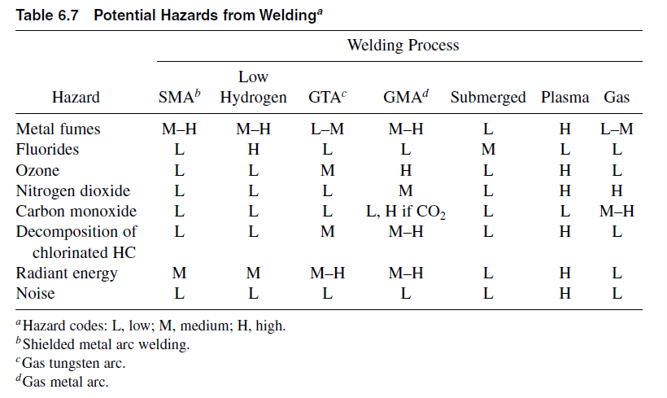{width="486"}

### 二、 危害物分級與控制策略

- 學者 Hagopian 與 Bastress (1976) 依據毒性（即我國的容許暴露標準 PEL），將銲接污染物分為三大類，這也是我們決定通風控制強度的重要依據：
  - **Class I (低危害)：** 暴露標準 ≥ 5 mg/m³ 的粉塵/燻煙，或 ≥ 100 ppm 的氣體。例如：氧化鐵燻煙。
  - **Class II (中危害)：** 暴露標準界於 0.1\~0.5mg/m3j霧滴，或1\~100 ppm 的氣體。例如：氟化物、一氧化碳、二氧化氮。
  - **Class III (高危害)：** 暴露標準 \< 0.1 mg/m³ 的極毒金屬，或 \< 1 ppm 的氣體。例如：鈹 (Beryllium)、鎘 (Cadmium)、臭氧。
- 針對上述危害，**絕對不建議單純使用「整體換氣 (General exhaust ventilation)」來控制銲接危害**。

## 6.4 銲接、軟銲與硬銲作業 (續)

### 三、 銲接局部排氣裝置之硬體設計實務

- 依據污染物的分級，工程實務上有四種主要的局部排氣 (LEV) 選擇：
  1.  **自由懸吊開放式氣罩 (Freely Suspended Open Hood)：** 這是業界（如修護廠）最常見的外裝型氣罩（象鼻管）。若能將氣罩精準定位在距離銲接點 6 英吋（15公分）以內，只需極小的排氣量即可達到控制效果。然而，此設備的致命傷是**「極度依賴銲接工人的配合」**，勞工必須隨著銲接位置不斷移動氣罩；且對於 **Class III** 的高毒性危害物，法規與工程標準均**不建議**使用此類氣罩。

  2.  **後側開槽式工作台 (Rear-Slot Bench)：** 適合中小型零件的量產或維修工作。其優勢在於不需勞工手動調整氣罩位置；若能在工作台兩側加上擋板（可使用鉸鏈式擋板或重型防火布簾以避免干擾長型管件進出），能大幅減少側風干擾並提升捕集效率。這也是軟銲與硬銲極佳的控制設計。

  3.  **低風量/高風速系統 (LVHV, Low-Volume/High-Velocity Hood)：** 這是將微型氣罩直接整合在 TIG 或 MIG 銲槍槍頭上的創新設計。它利用環繞銲槍的極高風速，在源頭直接抽走污染物，排氣量僅需 50 到 100 cfm，約為懸吊式氣罩的 10%。不過實務上，部分銲工會抗拒使用，因為他們擔心若排氣量設定過大，會把保護銲道的「惰性氣體」一併抽走而導致銲道瑕疵 (氣孔)。

  4.  **包圍型氣罩 (Enclosing Hood) 與下吸式工作台 (Downdraft Table)：** 當處理 **Class III** 的高毒性金屬（如含鈹、鎘材料）時，必須使用包圍型氣罩（例如將銲接工作台設置於改裝過的噴漆房內），並維持 150 fpm (0.76 m/s) 的高面風速以確保絕對控制。若是**進行氣割或電弧切割**，會產生大量高溫熔渣與燻煙，則應**採用下吸式工作台**，讓大顆粒熔滴掉落至靜壓箱，同時將燻煙往下抽離勞工呼吸帶。

|  |  |  |
|----|----|----|
| 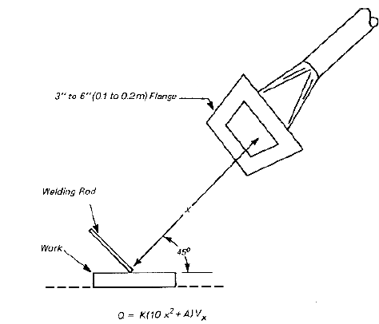 | 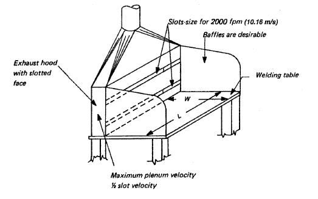 | 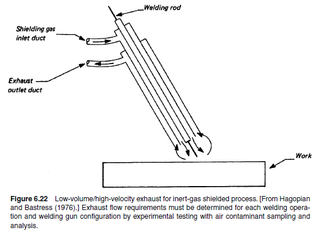 |

## 6.5 化學處理程序 (CHEMICAL PROCESSING)

- 在化學加工產業中，由於製程多樣且散發出的空氣污染物種類繁多，沒有任何其他工業環境會面臨如此複雜的危害物生成點，這也導致標準的通風設計僅能涵蓋有限的特定操作。

### 一、 原料處理與進料 (Material Input and Transfer)

- 化學製程的起始原料包含粒狀化學品、液態溶劑與反應性氣體。

  1.  **粒狀物料：** 少量使用的粒狀化學品通常以桶裝進貨，並需要進行預先秤重。若為大量使用的散裝物料，則通常採用密閉的氣力輸送系統 (pneumatic conveying) 直接送入混合槽或反應槽，對環境的粉塵釋放極少。

  2.  **液態溶劑：** 散裝溶劑在裝卸區透過管線傳輸時，即使是在戶外進行管線的連接與排空作業，勞工仍可能面臨顯著的揮發性液體暴露，因此也可能需要通風控制。

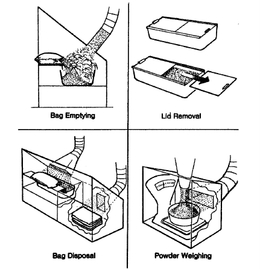{width="358"}

### 二、 反應槽作業 (Reactor Operations)

- 反應槽是化學廠第一個需要重點通風控制的加工設備。

  1.  **液體與固體加料：** 液體通常在關閉所有閥門並將反應槽抽真空的狀態下，透過密閉管線安全加入。通常必須在加料口設置「外裝型氣罩 (exterior hood)」，若幾何形狀與排氣量設計得當，對溶劑蒸氣與可呼吸性粉塵的捕集效率可達 95% 以上。

  2.  **槽桶幫浦抽液 (Drum pumping)：** 若需從鐵桶抽取少量溶劑加入反應槽，勞工在安裝幫浦或取出沾滿溶劑的抽液管時會產生暴露。針對此作業，可以在鐵桶桶口設置排氣氣罩 (bung hole exhaust hood)，或在反應槽旁設置一個專用的局部包圍型氣罩 (partial enclosure)，後者的控制效果通常更好。

  3.  **採樣作業 (Sampling)：** 為了確認反應狀態，勞工常會打開頂部開口並用量尺與採樣杯取樣。如果前述的加料口排氣氣罩有在運作，或者反應槽處於微負壓狀態，此處的暴露通常可忽略不計。另一種做法是從反應槽底部設置專用採樣管線，這種採樣點則必須設置一個小型的抽風包圍氣罩 (exhausted enclosure) 來控制暴露。

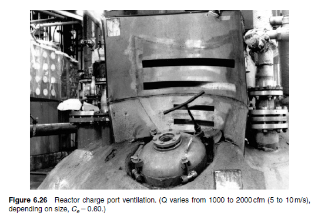{width="453"}

## 6.5 化學處理程序 (續)

### 三、 產品回收與過濾 (Product Recovery - Filtration/Separation)

- 反應完成後，懸浮的固體產品必須從溶劑中分離。常見的設備有紐式過濾器 (Neutsche filter)、離心機與板框式壓濾機，這些操作都帶有殘留溶劑暴露的風險：

  - **離心機 (Centrifuge)：** 懸浮液被泵入高速旋轉的過濾籃中，溶劑被甩出並流向儲槽，隨後濾餅會被新鮮溶劑沖洗。若溶劑具有火災爆炸危險，離心機內部必須充填氮氣或二氧化碳進行惰化。當洗滌完成，勞工打開檢修門以手動刮除濾餅或檢查濾網時，會發生嚴重的溶劑暴露；產品掉入收集桶時也會產生二次暴露。
    - **控制策略：** 由於很難在離心機頂部開口直接獲得良好的控制，一種方法是利用連接到儲槽的管線，從離心機內部將掃掠氣流 (sweep air) 往下抽；若不可行，則必須在檢修門處安裝外裝型排氣氣罩。產品收集桶處也應設置桶裝排氣站。
  - **板框式壓濾機 (Plate and Frame Filter)：** 這是由多片濾板並列組成的設備。當過濾與洗滌完成後，必須釋放夾緊壓力並將濾板一片片分開，勞工需手動刮除仍然濕潤的產品濾餅，使其掉入下方的回收車中。在這個過程中，濕濾餅蒸發出的溶劑會在工作場所造成極高濃度的氣流，需要強力的通風控制。
  - **控制策略：** 有效控制板框式壓濾機的溶劑蒸氣是「極度困難」的。較佳的作法是設置一個頂部排氣的靜壓箱 (plenum)，四周搭配塑膠垂簾或水平滑動拉門 (horizontal sliding sash) 包圍，且必須依賴操作者正確定位這些拉門以發揮效用。如果廠房上方空間不足，無法設置頂部靜壓箱，則可改在壓濾機的兩端設置兩個魚尾狀氣罩 (fishtail hoods) 進行側吸。

### 四、 乾燥與包裝 (Drying and Packaging)

- 最後的批次乾燥作業通常使用盤式乾燥機 (tray dryer)、錐形乾燥機或流化床乾燥機。勞工在將濕濾餅「裝載」進乾燥機時會面臨溶劑暴露；而在乾燥完成後「卸載」與包裝、搬運過程中，則會面臨可呼吸性粉塵的暴露危害，這兩者都需要配置對應的局部排氣防護。

## 6.6 半導體氣體櫃 (SEMICONDUCTOR GAS CABINETS)

- 在半導體製程中，經常會使用到如砷化氫 (Arsine) 與磷化氫 (Phosphine) 等劇毒氣體。依據我國《特定化學物質危害預防標準》，這類具有高度危害的氣體在儲存與供應時，必須採取嚴格的工程控制措施以防止勞工暴露。產業界用來控制這些氣體洩漏的標準設備，就是所謂的「氣體櫃 (Gas Cabinets)」。

### 一、 氣體櫃的基本設計與法規

- 氣體櫃內部通常可容納多達四支氣瓶，氣體透過配管與閥件將氣體精確計量後送至各個製程機台。

  - **傳統構造：** 傳統的氣體櫃設計，空氣會從櫃門底部的開口（進氣口）掃過櫃體內部，然後從櫃體頂部的直管排氣口抽出。進氣口有時會裝設初效濾網 (roughing filter) 作為氣流均勻分佈器 (diffuser) 使用。

  - 氣體櫃的排氣設計僅能用來控制儲存與輸送過程中發生的「微量逸散或洩漏 (fugitive emissions)」，它絕對無法應付整支鋼瓶氣體的劇烈洩放。

### 二、 進入損失與硬體幾何形狀 (6.6.1 Entry Loss)

- 儘管氣體櫃在業界被廣泛使用，但過去很少有關於其最佳設計的公開數據，甚至不同製造商對於相似設備所建議的排氣量也大相徑庭。為此，學者利用追蹤劑氣體（Tracer gas）針對包含雙氣瓶氣體櫃的不同進氣口與排氣口幾何形狀進行了測試。

  1.  **進氣口 (Inlet) 設計：** 研究測試了三種進氣口：(1) 門上的單純狹縫進氣口 (Slotted inlet)、(2) 櫃底的沖孔板進氣口 (Perforated plate inlet)、(3) 門上的均勻擴散進氣口 (Diffuser inlet)。

  2.  **排氣口 (Outlet) 設計的影響：** 測試了平頂排氣口、淺錐形與深錐形排氣口。

  3.  **測試結果 (進入係數** Ce​**)：** 研究發現，**「進氣口」的幾何形狀對進入係數 (**Ce​**) 有決定性的影響，而「排氣口」的形狀則幾乎沒有影響**。狹縫進氣口的 Ce​ 值僅有 0.44 到 0.47；而採用擴散進氣口與底部沖孔板進氣口的表現極佳，其 Ce​ 值可提升至 0.68 到 0.75 之間。這代表良好的進氣端設計能大幅減少亂流與能量損失。

## 6.6 半導體氣體櫃 (續)

### 三、 最佳排氣量的決定 (6.6.2 Optimum Exhaust Rate)

- 決定排氣量的關鍵，在於發生洩漏時氣體櫃能多快將污染物「清除 (Clearance)」。研究者在氣體櫃內部的關鍵洩漏點釋放追蹤劑，待濃度穩定後停止釋放，並測量下游濃度衰退至原始濃度 5% 所需的時間。
  1.  **進氣口形式決定清除速度：** 無論排氣量多寡，傳統的「狹縫進氣口 (Slotted inlet)」清除洩漏所需的時間總是比其他兩種進氣口長。

  2.  **排氣量的邊際效應：** 對於一個雙氣瓶的氣體櫃，將排氣量從 150 cfm (立方英呎/分鐘) 提升至 250 cfm 時，氣體清除的時間會「顯著縮短」。然而，如果進氣口使用的是底部沖孔板或擴散進氣口，將排氣量進一步增加到 350 cfm 時，清除效能的提升非常有限，幾乎沒有額外效益。

  3.  **排氣口頂部形狀不重要：** 測試證明，氣體櫃頂部採用哪一種排氣罩形狀（平頂或錐形），對於氣體的清除時間幾乎沒有影響。

  4.  **氣瓶實體阻擋的影響：** 即使將鋼瓶放入櫃中進行實測，上述的流體力學趨勢依然成立。
- 審查半導體廠房的氣體櫃規格，或是執行通風系統驗收時，不要盲目追求極高的排氣量。依據本節的科學實證，**雙氣瓶氣體櫃的最佳設計，是在氣體櫃門底部配置「擴散進氣口 (Diffuser inlet)」，並設定 250 cfm (**0.12m3/s**) 的排氣量**。這樣的設計不僅能以最快的速度清除劇毒氣體洩漏，同時也能避免過度抽風所造成的不必要空調能耗。

## 6.7 可攜式工具的低風量/高風速系統 (LOW-VOLUME/HIGH-VELOCITY SYSTEMS FOR PORTABLE TOOLS)

- 簡稱 LVHV 系統
- 在金屬加工、木作或石材加工現場，勞工經常使用手持式砂輪機、拋光機或氣動鑿刀。由於這些工具是可移動的，傳統的「外裝型氣罩（如象鼻管）」需要勞工在每次改變作業位置時手動調整氣罩位置，這在實務上幾乎不可能徹底落實，導致勞工嚴重暴露於粉塵危害中。
