## 講師簡介

- 姓名：何明信

- 學歷：成大環醫所 、職安衛技師

- 經歷：檢查員30年 (製造、危機設、營造、化工職衛科、專委)

- 現職：114年退休

- E-mail：msho7336959\@gmail.com

## 參考書籍

鍾基強，**工業通風設計概要(第二版)，**全華圖書，2011

## 第1章 基本概念

### 均勻混合模型 ((Well-mixed)

### 質量守恆原理

- 室內空間體積 V(m3)，內部污染物總質量 m(g)，則**平均濃度** C=m/V (g/m3)

- 污染物質量的變化率 = 流入率 − 流出率 + 內部產生率 (**汙染物質量守恆**)

+----------------------------+----------------------------------------------------------------+
|                            |                                                                |
+============================+================================================================+
| 汙染物質量守恆             | $\frac{dm}{dt} = \dot{m}_{in} - \dot{m}_{out} + \dot{m}_{gen}$ |
+----------------------------+----------------------------------------------------------------+
| (均勻混合假設) 微分方程式  | $V \frac{dC}{dt} = QC_0 - QC + G$                              |
+----------------------------+----------------------------------------------------------------+
| 當時間足夠長，濃度不再變化 | $C = C_0 + \frac{G}{Q}$                                        |
+----------------------------+----------------------------------------------------------------+
| 所需換氣量                 | $Q =  \frac{G}{C_{PEL}-C_0}$                                   |
+----------------------------+----------------------------------------------------------------+

::: {.callout-warning appearance="simple"}
## 重要

留意推演中隱含的假設：例如，均勻混合、**產生率**G為常數、**換氣量**Q為常數等等
:::

#### 應用範例：甲苯洩漏

- G=30 g/hr，容許濃度 100 ppm，室外 C0=0 ppm，分子量 M=92g/mol

- [定量暴露評估模式推估工具-完全混合模式](https://oemd.osha.gov.tw/exposure/content/tools/Tools4.aspx) (職安署)

## 空氣氣流狀態

整體換氣

+-----------------------------------------------+-----------------------------------------------+
|                                               |                                               |
+===============================================+===============================================+
| 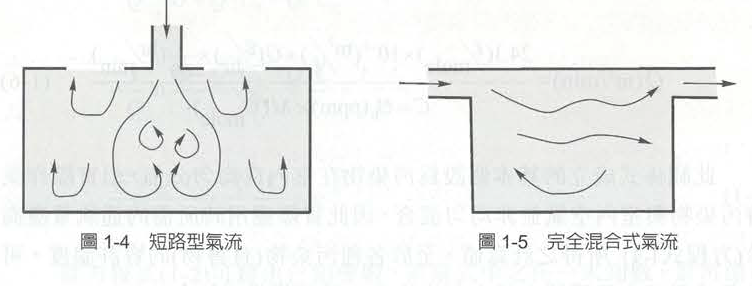{.lightbox} | 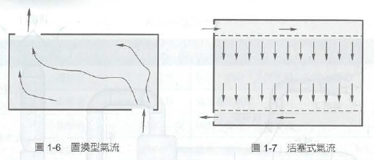{.lightbox} |
+-----------------------------------------------+-----------------------------------------------+

## 局部排氣

- 特別適用於高濃度、有毒性、腐蝕性、可燃性等空氣汙染物。

+-------------------------------------+--------------------------------+
|                                     |                                |
+:===================================:+================================+
| 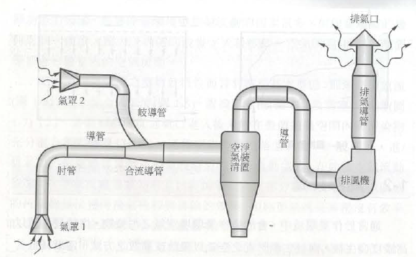 | 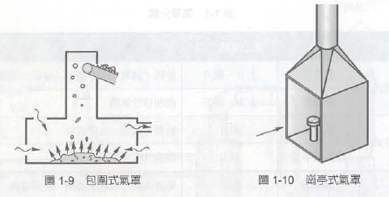 |
|                                     |                                |
|                                     | 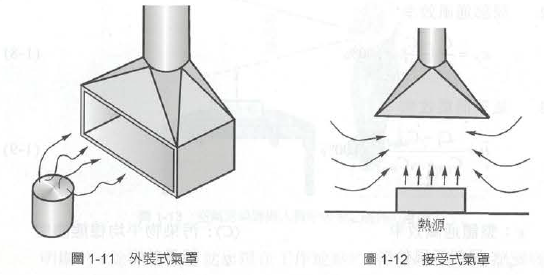 |
+-------------------------------------+--------------------------------+

## 第2章 空氣狀態

- 密度：空氣的密度為1.2 kg/m3 (標準狀態下)
- 比重：氣體或蒸氣質量 / 空氣的質量 (相同體積)
  - CO比重為0.968，
- 在標準環境中，假設空氣為理想氣體狀態，空氣的密度與壓力和温度有關。 理想氣體定律: $\frac{P_1 V_1}{T_1} = \frac{P_2 V_2}{T_2}$

### 空氣壓力

- 空氣會因為**壓力差**而流動： **由高壓區流向低壓區**

- 在通風系統中，空氣主要是靠**風機（風扇）所產生的壓差**來移動。

- 風機**入口負壓**(靜壓小於大氣壓)，出口正壓。

- **靜壓**（Static Pressure）指空氣對容器或風管壁垂直作用的壓力(可正可負)

  - 通常利用U型管壓力計（水柱壓力計）或氣壓計測量

  - 常用壓力單位：公厘水柱（mm H₂O）

::: {.callout-tip appearance="minimal" icon="false"}
「高壓往低壓流，風機入口負、出口正；靜壓測管壁，水柱量壓力。」
:::

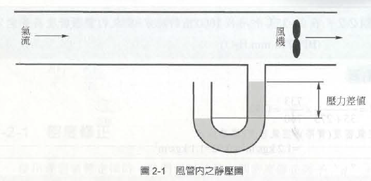

## 靜壓、全壓、動壓

- 靜壓（Static Pressure）：由**空氣本身重量（重力）及風機推動氣流**所形成的壓力，作用於風管壁面，且**各個方向皆存在且大小相同**。
- 動壓（Velocity Pressure）：因**空氣流動速度**所產生的壓力，也就是空氣分子撞擊測量探針所造成的壓力。若空氣停止流動動壓＝0 ，若風速增加動壓隨之增加。 動壓代表的是**氣流動能的大小**。
- 全壓（Total Pressure） **= 靜壓 + 動壓**

### 三種壓力比較

| 項目           | 靜壓         | 動壓         | 全壓         |
|----------------|--------------|--------------|--------------|
| 來源           | 空氣本身壓力 | 空氣流動速度 | 靜壓＋動壓   |
| 是否受風速影響 | 否           | 是           | 是           |
| 測量方向       | 與氣流垂直   | 正對氣流     | 正對氣流     |
| 單位           | mmH₂O、Pa    | mmH₂O、Pa    | mmH₂O、Pa    |
| **用途**       | 判斷系統壓力 | 計算風速     | 評估風機性能 |

::: {.callout-caution appearance="minimal" icon="false"}
量測動壓與全壓時，應取平均值，因為導管截面不同位置的風速並不完全一致。
:::

|                                      |
|--------------------------------------|
| 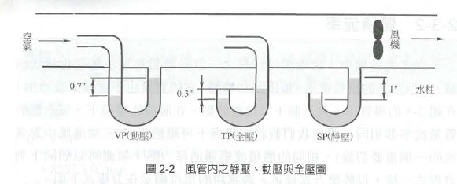      |
| 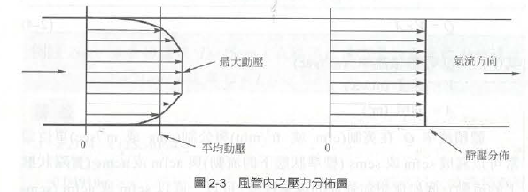  |
| 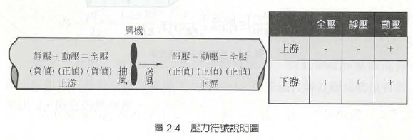 |

## 動壓與風速

#### 體積流率 Q = V \* A

**題目：**導管的直徑 $D = 25\text{ cm}$，在標準環境下管內氣流的平均速度 $V = 21\text{ m/s}$，流率 $Q = ?$ **解答：** $1.03\text{ m}^3\text{/s}$

#### 動壓（$P_v$）與風管中風速關係

- 動壓（$P_v$）與風管中速度關係可以以下式表示：

  $P_v = \frac{\rho V^2}{2g} = \frac{1.2 \times V^2}{2 \times 9.8} = \left(\frac{V}{4.03}\right)^2 \text{公制} = \left(\frac{V}{4005}\right)^2 \text{英制}$

- 在通風工程（如 ACGIH 標準）中，最常出現的經典公式：

+------------------+-----------------------+--------------------------+-------------------------------------+
|                  |                       |                          |                                     |
+==================+=======================+==========================+=====================================+
| **單位系統**     | 經典公式（d=1 時）    | 風速單位 (V)             | 動壓單位 (Pv​)                       |
+------------------+-----------------------+--------------------------+-------------------------------------+
| **英制**         | $V = 4005 \sqrt{P_v}$ | 英呎/分鐘 ($\text{fpm}$) | 吋水柱高 ($\text{in. wg}$)          |
+------------------+-----------------------+--------------------------+-------------------------------------+
| **公制 (標準)**  | $V = 1.29 \sqrt{P_v}$ | 公尺/秒 ($\text{m/s}$)   | 帕斯卡 ($\text{Pa}$)                |
+------------------+-----------------------+--------------------------+-------------------------------------+
| **公制系(傳統)** | $V = 4.04 \sqrt{P_v}$ | 公尺/秒 ($\text{m/s}$)   | 毫米水柱高 ($\text{mmH}_2\text{O}$) |
+------------------+-----------------------+--------------------------+-------------------------------------+

- **題目：**在管內蒸氣的平均動壓 $P_v = 1.0\text{ in H}_2\text{O}$，平均速度 $V = ?$

  - **解答：** $V = 4005\text{ ft/min}$

- **題目：**管內蒸氣的中心動壓 $P_v = 12\text{ mm H}_2\text{O}$，中心速度 $V = ?$

  - **解答：** $V \doteq 13.9 = 14\text{ m/s}$

## 空氣中氣膠（Aerosol）

- **氣膠（Aerosol）** 是指**固體或液體微粒懸浮於氣體介質中**所形成的穩定狀態(系統)。

  - 不是單純指「微粒」或「氣體」，而是 **微粒 + 氣體** 的兩相組合，常見例子：煙霧、灰塵、雲霧、PM₂.₅、病毒飛沫等。

  - 粒狀物 = 懸浮的固體或液滴本身，氣膠 = 粒狀物 + 承載氣體（如空氣）

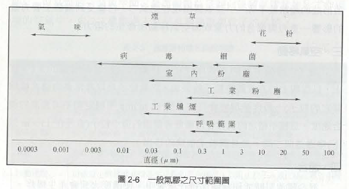

## 捕捉速度與管內氣流狀態

- （Capture Velocity）：逸散源附近空氣的速度，必須大到能夠捕捉逸散物，並能將其帶到通風管內。

  - 整體換氣：靠**稀釋；**局部排氣：靠**捕捉**（捕捉速度是LEV關鍵設計參數）

### 雷諾數（Reynolds Number, Re）-

- 用於判斷管內流態、混合、壓損等，是慣性力 / 黏滯力之比，​ 無因次 ​\
  $Re = \frac{\rho V D}{\mu}$

| Re 範圍    | 流態              | 特性               |
|:-----------|:------------------|:-------------------|
| \< 2000    | 層流（Laminar）   | 流線平穩、混合差   |
| 2000～4000 | 過渡區            | 不穩定             |
| \> 4000    | 紊流（Turbulent） | 混合良好、壓損較高 |

### 雷諾數實際計算範例

**已知條件（英制轉公制統一單位）：** \***管徑** $D = 12\text{ in} = 0.3048\text{ m}$ ，**流速** $V = 1000\text{ ft/min} = 5.08\text{ m/s}$ ，**室溫空氣物性**： \* 密度 $\rho \approx 1.2\text{ kg/m}^3$ \* 動力黏滯係數 $\mu \approx 1.8 \times 10^{-5}\text{ kg/(s}\cdot\text{m)}$； 雷諾數$Re  \approx 103,000$

### 雷諾數對通風設計的影響

+----------------+--------------------------------------------------+
| 影響項目       | 說明                                             |
+:===============+:=================================================+
| **混合效率**   | 紊流混合好 → 有利整體換氣                        |
+----------------+--------------------------------------------------+
| **壓力損失**   | 紊流壓損較高（需更大風機靜壓）                   |
+----------------+--------------------------------------------------+
| **粒狀物傳輸** | 紊流可懸浮微粒，避免沉降（但在風管內會撞擊管壁） |
+----------------+--------------------------------------------------+
| **量測穩定度** | 紊流造成速度、壓力波動（量測值變得不穩定）       |
+----------------+--------------------------------------------------+
| **捕捉能力**   | 紊流有助於將污染物帶入吸氣口（過強會干擾製程）   |
+----------------+--------------------------------------------------+

::: callout-note
**捕捉速度**確保污染物「進得去」吸氣口，\
**雷諾數**確保污染物在管內「送得走」且混合良好。
:::

## 捕捉速度、排氣量、與通風系統設計

- Q = 捕捉速度 × 有效吸氣面積

- 捕捉速度會隨距離迅速衰減，無法直接代簡單面積公式，需使用**經驗公式**。

### 完整設計流程（6步驟）

- Step 1：確認污染源與作業方式

- Step 2：選定捕捉速度 Vc (可參考ACGIH建議)

- Step 3：選擇吸氣口形狀與位置

- Step 4：套用對應公式計算Q

- Step 5：考慮安全係數與混合效率

- Step 6：驗證風管內速度

## 蒸氣濃度百分比（體積分率）

$$C (\%) = \frac{PP (飽和蒸氣壓)}{BP (大氣壓力)} \times 100$$

### ppm 與 mg/m³ 換算

$$\frac{\text{mg/m}^3}{\text{ppm}} = \frac{MW}{24.1}$$

- 例題：水銀蒸氣 ，已知條件：水銀（Hg）飽和蒸氣壓 PP=0.0013mmHg，大氣壓 BP=760mmHg，水銀分子量 MW=201g/mol，標準環境（25°C、1 atm）

##### 計算體積濃度（ppm）

##### $$C = \frac{PP}{BP} = \frac{0.0013}{760} \approx 1.71 \times 10^{-6} = 1.71\text{ ppm}$$

##### ppm 與 mg/m³ 換算 $$\text{ppm} \times MW = \text{mg/m}^3 \times 24.1$$

##### 

## 第5章 局部排氣通風系統

### 5.1 系統類型

- 局部換氣系統（Local Exhaust Ventilation, LEV）最基礎也最重要的目標，是在空氣污染物（如有害的煙、氣體或蒸氣）逸散並侵入工作場所、特別是勞工的呼吸帶之前，就預先在污染源附近將其捕捉或控制。

- 採用局部排氣系統的6大評估條件:

  - **無法實施合乎成本效益的控制時**。

  - **污染物具有高危害性**。

  - **員工位於污染源的鄰近區域**。

  - **逸散率隨時間而變**(不穩定或大量逸散)。

  - **污染源的特性與狀態明確**。

  - **法規規則或標準的要求**。

## 5-2 設備與元件

1.  氣罩 (Hood)：必須能容納或涵蓋污染逸散源。
2.  管路 (Piping / Duct)：(風管）扮演著傳輸的微血管與動脈角色 。
3.  空氣濾清器 (Air Cleaner)：常稱為空污防制設備。
4.  風機 (Fan)：是整個系統的「心臟」，功能是供應管路內一定的「靜壓（Static Pressure）」，並維持空氣的持續流動。
5.  排氣管 (Stack / 煙囪)：通風系統的最後一個出口。

::: {.callout-note appearance="simple" icon="false"}
五大元件（氣罩、管路、空氣濾清器、風機、排氣管）
:::

## 5-3 靜壓 (Static Pressure)

- 不了解靜壓，就無法正確地選擇風機，也無法確保氣罩端有足夠的抽氣量來保護勞工。
- 空氣之所以會流動，是因為「壓力差」，**風機在氣罩與管路上游創造了一個極大的低壓區**，大氣壓力便會將污染空氣推入氣罩與管路中。
  - 當系統想要讓空氣流動（購買空氣動力）時，就必須把**靜壓 (Ps)轉換成動壓或速度壓 (Pv)** 。
- **能量轉換的代價：靜壓損失 (**hL​**)**
  - 在理想狀態下，靜壓可以完全轉換為動壓；但靜壓轉換為動壓的過程中，有一部分的能量會因為摩擦、熱、震動或噪音而耗損，這就是所謂的「靜壓損失 (Static Pressure Loss, hL​)」。

    - $P_{s1​}+P_{v1​}=P_{s2}+P_{v2}​+h_L$

  - 設計人員的首要任務，就是盡可能地**減低系統的靜壓損失**，因為「減低靜壓損失就是節省經營支出」。
- 系統中造成靜壓損失的原件
  - 管路摩擦損失、配件造成的損失(例如經過肘管（彎管）、收縮管、擴張管或孔口時造成的流場變化)、歧管損失：氣流進入分支管或合流管處的損失、氣罩損失、風機系統效應造成的損失、特殊裝置造成的損失(如風門、閥、孔口、空氣濾清器等造成的阻力 )
- 靜壓損失的計算通式
  - 靜壓損失的基本方程式如下： $P_{SL}​=K_{loss}​×P_v​×d$
    - PSL​ = 靜壓損失 ( mm H2​O)，Kloss​ = 損失係數 (實驗經驗值，無單位，每種氣罩或管件都不同)，Pv​ = 管路中平均速度壓，d = 空氣密度修正係數 (無單位)。

## 肘管損失（Elbow Losses）

- 當空氣流經肘管或歧管時，會導致**靜壓被消耗**（能量耗損與擾流），這些損失主要來自於**氣流方向的改變、管壁摩擦力、震動造成的擾動等**。
- 要計算肘管的壓力損失，我們必須先求出其「損失係數（K 值）」，而 K 值的大小完全取決於肘管的幾何構造，其中最重要的參數就是 R/D **值。**

|                                         |
|-----------------------------------------|
| 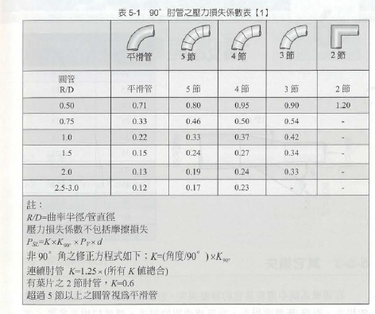 |

## 歧管損失 (Branch Losses)

- 當支管的氣流匯入主管時所產生的靜壓損失。

  - **損失係數與「匯入角度」成正比** 決定歧管損失大小最關鍵的幾何因素，就是支管匯入主管的「角度 (θ)」。

|                                         |
|-----------------------------------------|
| 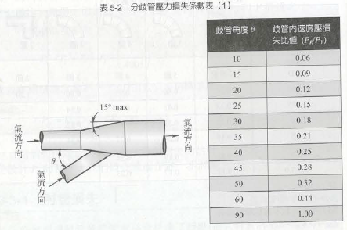 |

## 第 6 章「氣罩的選擇與設計」

### 氣罩 (Hood)

- 氣罩是局部排氣系統中相當重要的一環，其尺寸設計和安裝位置的選擇，將直接影響整個局部排氣系統的效率。
- 空氣被推入氣罩的過程，伴隨著能量的轉換。在氣罩內，所有氣罩內靜壓(SPh)都會轉換成維持空氣流動的速度壓 (Pv​)，以及空氣進入氣罩時因擾流與摩擦所產生的氣罩壓力損失 (he​)。
- 這個能量平衡關係，可以用以下流體力學方程式來描述：$∣SPh∣=Pv​+he​$
  - SPh：在風管裡提供給氣罩的靜壓（通常為負值），Pv​：風管平均速度壓，he​(hood entry loss)：進入氣罩的壓力損失。
- 在實務的檢測上，教量測靜壓值 (SPh) 的位置，通常是落在氣罩下游大約 4 到 6 個導管直徑的位置。

|                                             |
|---------------------------------------------|
| 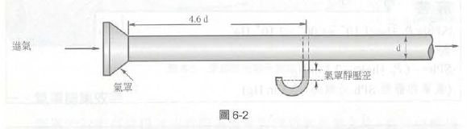 |

## 氣罩壓力損失的基本概念

- **he (hood entry loss)**：從氣罩開口面到風管內量測點之間，所有壓力損失的總和。

- 物理意義：

  - 空氣進入氣罩時，因形狀變化、摩擦、渦流等造成的能量損失

  - 表現為**靜壓的下降**

  - 無法恢復，以熱或噪音形式散逸

    - 氣罩進入損失 $he=K×Pv×d$

    - 靜壓 $∣SPh∣=Pv+K×Pv =(1+K)×Pv$

- 題目：風管內速度壓 Pv=18.5 mmHg，氣罩靜壓 SPh=−26.5 mmHg，求氣罩進入損失 he？

  - he=26.5−18.5=8.0 mmHg (1 mmHg≈13.6 mmH₂O)

  - 也就是13.6 mmH₂O的壓力損失消耗於氣罩入口處。

#### 實務應用重點

+---------------+----------------------------------------------+
| 項目          | 說明                                         |
+:==============+:=============================================+
| 設計時        | 需計算 he，才能決定風機所需靜壓              |
+---------------+----------------------------------------------+
| 量測時        | 可量測 SPh 與 Pv​，反推 he                    |
+---------------+----------------------------------------------+
| KK值          | 由氣罩形狀決定，銳緣入口 K 大，圓滑入口 K 小 |
+---------------+----------------------------------------------+
| 最小化 he     | 使用圓滑入口、導流板、減少急遽收縮           |
+---------------+----------------------------------------------+

## **6-2 束縮面 (Vena Contract)**

- 當氣流從廣大的開放空間，被強大的負壓吸入狹窄的氣罩與風管開口時，空氣分子無法立刻轉彎平順地貼著管壁流動。這種流體慣性會導致氣流在進入導管後，形成一個比實際管徑還要窄的「縮口」，這個現象與位置就稱為「束縮面」。

- 從物理學的角度來看，空氣被擠壓進入氣罩時會產生嚴重的擾流。

- 這個氣流縮口（束縮面）的中心點，通常會發生在進入導管內約**「半個直徑 (**d**/2)」深度的位置**。這意味著，氣罩與風管交接處的設計若不夠平順，此處的能量耗損將會非常驚人。

## **氣罩吸入係數 (**Ce**) 與捕集效率**

- 為了量化束縮面所造成的能量損失，使用**氣罩吸入係數 (Coefficient of Entry, 簡稱** Ce**)**。
  1.  **物理定義**： Ce 值可以描述成「實際氣流量 (Q實際​)」對應「理想氣流量 (Q理想​)」之比。 其公式為：Ce=Q(實際)​/Q(理想)​。

  2.  **能量轉換的觀點**： 在理想狀態下，如果將所有氣罩的靜壓（潛在能量）全部無損耗地轉變為速度壓（動能），則可以達到理想氣流量。但因為束縮面與擾流的存在，從來沒有靜壓轉換成速度壓是完美理想的。 因此，Ce 值也可以用壓力來估計，公式為：$Ce=\sqrt{Pv​/∣SPh∣}​​$。 （其中 Pv​ 是平均導管速度壓，SPh 是氣罩靜壓力的絕對值）

## 損失係數 (K) 與 吸入係數 (Ce) 的關係

- 管路配件的壓力損失是用「損失係數 (K)」來評估；而在氣罩端，我們常看到設備商提供 Ce 值。這兩個數值其實是一體兩面。

+---------------------------------------+------------------------------------------------------------------+
|                                       |                                                                  |
+=======================================+==================================================================+
| $C_e = \sqrt{\frac{1}{1 + K_{hood}}}$ | (氣罩進入損失 he​ 與 Ce 的關係)\                                  |
|                                       | $h_e = \frac{1 - C_e^2}{C_e^2} \times P_v = K_{hood}​ \times P_v$ |
+---------------------------------------+------------------------------------------------------------------+

- **「氣罩吸入係數** Ce**，跟氣罩的外型有關。**Ce **值不會改變，除非氣罩的外型改變」**。

  - 當我們在工廠現場，若隨意改變了氣罩的形狀（例如嫌礙事，把氣罩邊緣的凸緣或擋板切除，或是把原本漸縮平順的開口撞凹），氣罩的外型一旦改變，其 Ce 值就會跟著變差（下降），導致束縮面效應加劇、K 值（壓力損失）飆高。

  - 在風機能力固定的情況下，壓力損失一增加，氣罩開口處的實際抽氣量 (Q) 就會急遽下降。最後的結果，就是氣罩無法達到我國法規要求，有害氣體就會從這個無效的氣罩口溢散到勞工的呼吸帶。

::: {.callout-important appearance="simple" icon="false"}
**優良的氣罩設計（如加裝凸緣、設計平順的漸縮錐形入口），可以有效減緩束縮面的產生，提高** Ce **值，降低壓力損失。**
:::

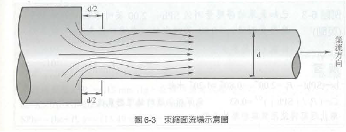

#### 問題1（求吸入係數 Ce​）

- 已知氣罩的靜壓測量值 SPh=−29.0 mmH₂O，平均導管速度壓測量值 Pv​=8.5 mmH₂O，求氣罩吸入係數 Ce​ 為多少？ 解答：Ce = 0.54

#### 問題2

- 已知導管內平均速度 V=10 m/s，氣罩損失係數 Khood​=2.2，求 he 及 SPh 為多少？（假設d=1）解答： he≈13.49 mmHg，SPh≈−19.65 mmHg

  ::: {.callout-tip appearance="minimal" icon="false"}
  ## hint

  1.  計算速度壓 Pv​，2.計算氣罩進入損失 he， 3.計算氣罩靜壓 SPh
  :::

#### 問題3

- 手握式研磨氣罩：SPh=−60 mmHg，V=20 m/s，導管直徑 D=45 cm(0.45 m)，d=1，求：流量 Q、he、Ce​、K？

  - 解答：P≈24.5 mmHg，Q≈3.18 m3/s，he=∣SPh∣−Pv​=35.5 mmHg，Ce​≈0.64，K≈1.44

::: {.callout-tip appearance="minimal" icon="false"}
## hint

1.計算速度壓 Pv​，2. 計算流量 Q，3.計算氣罩進入損失 he，4.計算吸入係數 CeC， 5.計算損失係數 K
:::

#### 問題4

- 在問題3中，原量測條件為：SPh=−60 mmHg，導管直徑 D=45 cm，計算得 Ce=0.64。假如在往後的日期，重新量測氣罩靜壓力為：SPh=−50 mmHg，假設 Ce​ 保持為常數（氣罩外形未改變），且d=1，求**此時氣體流率** Q 為多少？ 解答：Q≈2.906 m3/s (設計時Q≈3.18 m3/s)

::: {.callout-tip appearance="minimal" icon="false"}
**hint**

1.利用 Ce求新速度壓 Pv​，2. 計算導管內平均速度 V，3.計算流量 Q
:::

+----------------------+--------------------------------------------+
| 概念                 | 說明                                       |
+:=====================+:===========================================+
| Ce為常數             | 氣罩外形未變，吸入效率不變                 |
+----------------------+--------------------------------------------+
| SPh 下降（60 → 50）  | 系統阻力改變（如風門調整、濾網堵塞等）     |
+----------------------+--------------------------------------------+
| Q 下降（3.18 → 2.9） | 靜壓降低 → 流量降低 (流量下降了約 **9%**)  |
+----------------------+--------------------------------------------+
| 實務應用             | 可藉由量測 SPh 快速推算當前流量            |
+----------------------+--------------------------------------------+

::: callout-warning
這代表氣罩的 **捕捉能力下降**，可能導致污染物逸散。
:::

#### 改善前需確認原因（診斷）

+------------------------+------------------------------+------------------------+
| 可能原因               | 現象                         | 檢查方式               |
+:=======================+:=============================+:=======================+
| **風機性能下降**       | 轉速降低、皮帶鬆弛、葉輪磨損 | 量測風機轉速、電流     |
+------------------------+------------------------------+------------------------+
| **濾網或風管堵塞**     | 壓力損失增加 → 風量下降      | 檢查濾網壓差、風管內部 |
+------------------------+------------------------------+------------------------+
| **系統洩漏**           | 風管破損或接頭鬆脫           | 目視檢查、煙霧測試     |
+------------------------+------------------------------+------------------------+
| **風門或調節閥被調整** | 人為關小                     | 檢查風門開度           |
+------------------------+------------------------------+------------------------+
| **氣罩入口被異物阻塞** | 部分吸氣面積被擋住           | 目視檢查               |
+------------------------+------------------------------+------------------------+

## 6-3風罩設計方法

- 具備氣罩的基礎知識與流體力學中「束縮面」的概念後，接著是在實務工程上究竟該如何著手進行設計。

#### 1. 氣罩設計的指導原則：「六面減法」設計

- 六面：把污染源用一個具備四個側邊、一個上邊和一個下邊的「完整密閉箱」完全包圍起來。
- 再根據現場製程的需求、勞工操作的便利性，或是維修人員的檢修空間，開始以「減法」來移除最少的邊數。 需要強調「移除最少」？因為依據流體連續方程式 Q=VA（流量＝速度 × 面積），當氣罩的開放面積（A）愈大，空氣消耗的速度就愈快，為就必須提供極大的排氣量（Q）與補給氣流。

#### 2. 氣罩內部的能量轉換與靜壓損失 (he​) 物理機制

- 束縮面效應：當空氣被迫擠入風罩狹窄的縮口時，依據 Q=VA，面積 (A) 變小導致速度 (V) 劇烈上升。速度上升意味著「速度壓 (Pv​)」急遽增加，這就需要消耗系統中更多的「靜壓 (SPh)」來轉換。 當氣流通過縮口，導管管徑恢復原本的尺寸時，一部分額外的速度壓會再次轉換回靜壓，流體力學上稱之為「靜壓再得 (Static Regain)」。
- 然而，能量轉換在現實世界中絕對不可能達到百分之百的完美效率，這些在轉換過程中因為摩擦與劇烈擾流而永久消耗掉的能量，這就是「氣罩進口壓力損失 (he​)」。

#### 3. 氣罩設計的「六大關鍵參數」

- **最佳形狀**：決定氣罩外觀以配合製程並減低擾流。
- **控制污染源的流量 (**Q**)**：這與捕捉速度有關？
- **摩擦係數**：評估氣罩內部表面的阻力。
- **氣罩吸入係數 (**Ce**)**：評估氣罩外型設計的優劣程度。
- **速度**：包含開口面速度、補給氣流速度，以及能避免粉塵沉積的導管內傳送速度。
- **尺寸**：長、寬、高與導管銜接管徑。

#### 4. 實務設計的「三種途徑」與「硬紙板模型法」

- 要決定上述的設計參數，有三個基本的方法：**(1)使用全尺寸模型；(2)使用可利用的圖表（如工業通風手冊）；(3)使用方程式**。

- 能同時滿足「高捕集效率」與「勞工操作需求」這兩個條件。

::: {.callout-important appearance="minimal" icon="false"}
設計方法的核心精神就是：**在不影響勞工作業的前提下，盡可能增加氣罩的包圍面（趨近於六面）。**
:::

## 氣罩設計練習

#### **題目 6-9** 一個磨輪式氣罩，磨輪直徑 = 30 cm，試決定體積流率，傳送速度，導管直徑，摩擦係數 K，Ce，和 SPh？（公制）

#### **步驟一：查表取得氣罩的設計基準參數** 在實務工程上，不會憑空捏造這些流體力學數值。必須翻閱如工業通風手冊（附錄B）來尋找「金屬研磨氣罩」的標準規範值。 查表獲得以下資料：

- **氣罩壓力損失係數 (**K**)** = 0.4，**氣罩吸入係數 (**Ce**)** = 0.85，**導管內搬運速度 (**Vtrans​**)** = 23 m/s

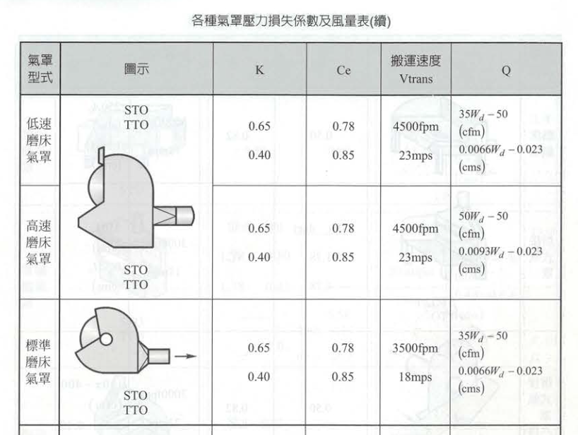{width="515"}

#### **步驟二：決定體積流率 (**Q**)** 依據標準氣罩的經驗公式，針對磨輪直徑（X=30 cm 輪寬），其所需的排氣量計算如下：

- Q=0.0093×30−0.023=0.256 m3/s （於標準空氣狀況下）

#### **步驟三：計算導管直徑 (**D**)** 我們已經知道必須抽走多少空氣 (Q)，也知道管內空氣必須跑多快 (Vtrans​)，接著利用流體連續方程式 Q=V×A 來反推導管的截面積與直徑。

- **截面積 (**A**)** = Q/Vtrans​=0.256/23=0.011 m2

- **導管直徑 (**D**)** = \$D = \sqrt{\frac{4 \times A}{\pi}} = \sqrt{\frac{4 \times 0.011}{3.14159}} = 0.119 \text{ m} = 11.9 \text{ cm} \$

::: {.callout-tip appearance="minimal" icon="false"}
在實際的工廠配管工程中，市面上並沒有剛好 11.9 cm 這種奇數規格的螺旋風管。因此，我們通常會選用標準規格尺寸（例如 12 cm 或 12.5 cm 的風管），然後再根據實際選用的管徑，重新微調計算管內的真實流速，以確保其不低於 23 m/s。
:::

#### **步驟四：計算導管速度壓 (**Pv​**) 與氣罩進入損失 (**he​**)** 接下來要計算能量轉換的數值。公制單位下，速度 (V) 轉換為速度壓 (Pv​) 的公式為 V=4.04Pv​​，移項後得：

- Pv​(導管)=(V/4.04​)2=(23/4.04​)2=32.4 mm H2​O
- **氣罩進入損失 (**he​**)** = K×Pv​=0.4×32.4=12.96 mm H2​O

#### **步驟五：計算氣罩靜壓 (**SPh**)** 氣罩靜壓是風機必須在風管與氣罩交界處提供的「負壓吸力」，它必須足以克服氣罩進入損失 (he​) 並提供流體動能 (Pv​)。

- SPh=−(1+K)×Pv​=−(1+0.4)×32.4=−45.36 mm H2​O

## 6-4體積流率及速度方程式

- 身為職業衛生專家，我們最常面臨的實務問題是：「為了解決眼前的污染源，我到底需要買抽氣量多大的風機？」或者反過來問：「現有風機的抽氣量，能不能在勞工作業的位置產生足夠的捕捉風速？」

#### **1. 面積方程式（理論球面模型）**

- 假設空氣是呈現一個「球狀」向氣罩中心匯集，而在這一個個同心球面上，每一個點的空氣移動速度都是相等的。依據流體連續方程式 Q=V×A：

  - Q = 體積流率（排氣量）

  - Vc​ = 氣流速度（我們在實務上關心的就是在距離 x 處的「捕集速度」）

  - A = 球形的表面積，其數學公式為 A=(4πx)2 （x 為距離氣罩中心的半徑距離）

  因此，最基礎的推估方程式即為：Vc​=Q/(4πx)2​ 或 Q=Vc​×(4πx)2。

  公式應用：當排氣量 Q=0.22 m3/s，在距離氣罩 12 公分（x=0.12 m）的位置，其捕集速度 Vc​ 約為 1.22 m/s。

#### **2. 美國職業衛生學會（ACGIH）實驗方程式** 《工業通風手冊》

- 查表

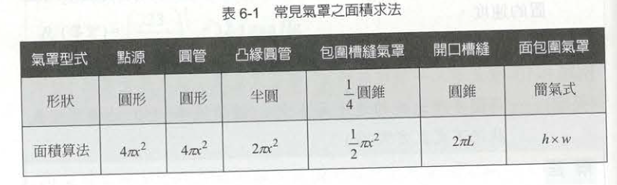{width="496"}

- 假設決定某作業所需的控制風速（Vc​）必須達到 0.4 m/s。 如果使用一般開口導管，所需的排氣量 Q=Vc​×(4πx)2。 如果運用職業衛生工程的專業，要求在氣罩周圍加上一片便宜的金屬「凸緣（擋板）」，公式就變成了 Q=Vc​×(2πx)2。**加上擋板後，維持相同的法定控制風速，所需的排氣風量 (**Q**) 直接節省了一半！** 這不僅大大降低了風機的建置成本，更能長久節省工廠的運轉電費。

#### 3. 決定捕集速度（Vc​）與外部干擾評估

- 有了（知道 Q 與 V 的關係）後，我們還必須決定一個關鍵數值：特定的污染源到底需要多大的捕集速度（控制風速）？及局部排氣系統最致命的殺手—**「干擾氣流（Cross Drafts）」**。
- 例如要求勞工改變電風扇的吹向，或在氣罩旁加裝膠簾擋風。唯有在沒有劇烈干擾氣流的環境下，我們利用體積流率方程式設計出的局部排氣系統，才能真正發揮保護勞工健康的作用。

## 6-5 實際操作狀況

- 氣罩通常必須根據工人在現場工作狀況而定

#### 四大氣罩型式之實務設計與操作建議

1.  包圍式氣罩 (Enclosing Hood)

    - **最小化開口**：僅在「必要」的地點提供讓物料或手部進入的通道。
    - **免費的效能提升**：通常不需要增加風機的流量（Q）或馬力，只要我們把氣罩盡可能包圍起來（減少開口面積 A），依據 Q=VA，其開口面速度（Vf​）就能輕易提升。

2.  接收式（天蓬式）氣罩 (Receiving / Canopy Hood)

    - **適用限制**：僅建議使用於「高溫作業場所」的上升氣流處理。
    - **抽氣量要求**：從氣罩抽出的空氣體積，必須「超過」抵達氣罩表面的熱空氣體積。
    - **擴散效應的對策**：當熱空氣上升時會有向外擴散的趨勢，因此氣罩的邊緣建議設計為 **45度傾斜**，且氣罩口的表面積應該要是熱空氣上升氣流截面積的 **125%**，才能確保完全罩住擴散的污染源。當然，氣罩位置要盡可能接近污染源。

3.  側吸式 / 槽縫式氣罩 (Lateral / Slot Hood)

    - 這是我國表面處理業、電鍍業與酸洗作業中最常見的氣罩型式（法規定義的側方外裝式氣罩）。

      - **充氣室 (Plenum)** ：狹長縫口的側吹式氣罩是個「複合式氣罩」，空氣需要進入兩次：先通過長縫口進入「充氣室」，再由充氣室進入導管。充氣室的作用是讓靜壓力均勻分布到整個長縫口的背後，確保槽體每一段的吸力都是均勻的。
      - **速度配置**：為了達到均勻抽氣的穩壓效果，長縫口內的氣流速度，必須設計成比充氣室內的速度大上 **2～3 倍**。
      - **壓力損失計算**：實用的槽縫氣罩靜壓力（SPh）估算方程式： SPh=2.78Pv(slot)​+(1+K)Pv(duct)​。 （其中 Pv(slot)​ 為槽縫速度壓，Pv(duct)​ 為導管速度壓）。
      - **有效捕集距離限制**：側吹式氣罩的吸力衰減極快，通常僅有助於捕捉前方大約「**兩呎（約 60 公分）**」以內的空氣。因此，如果在現場遇到一個四呎寬的電鍍槽，必須在槽的「兩個長邊」都設置長縫口氣罩，否則絕對無法達到法規要求的控制風速。

4.  下吸式氣罩 (Downdraft Hood)

    - **優點**：地心引力會幫助我們，因此非常有益於「大顆粒氣體（粉塵）」的傳送。

    - **致命缺點與限制**：絕對「**不適合高溫作業環境**」，因為這會與熱空氣自然上升的浮力產生嚴重對抗。此外，大型工件若擺放在氣罩（工作檯）面上，會直接阻礙空氣流動。

    - **維護需求**：由於大顆粒容易掉落，系統下方必須提供微粒物質捕捉器（沉澱池），並考量後續的清潔方法。

::: {.callout-important appearance="minimal" icon="false"}
局部排氣系統不僅需要生硬的流體力學公式（Q=VA、靜壓損失計算），更需要我們走入現場，觀察勞工的操作姿態、評估熱源浮力、檢視槽體尺寸，將「工程科學」與「現場實務」緊密結合。
:::

## 第7章 風管的種類與空氣流體行為

### 7-1 風管內之空氣流速

- 風管的基本任務是運送空氣污染物，並對從氣罩進入之污染物進行處理、操作和排出。同時，風管管路系統也必須提供從風機到氣罩，以及從風機到煙囪的必要壓力降（壓差）。
- **在工業通風系統中，管路系統通常是最常發生失敗的設計環節。** 風管必須承受極大的損耗。例如，粉塵或研磨碎屑會對管壁（特別是在彎曲的肘管處）造成嚴重的磨損與打掃不完全的堵塞問題。
- 思考一下：**為什麼風管內需要維持「高速紊流」？**

#### 風管內的邊界層（Boundary Layer）與摩擦力

- 從微觀的角度來看管內空氣流動，空氣流經管路時，會遭遇兩種摩擦力：空氣與管壁之間的相互摩擦，以及空氣流層與流層之間的摩擦。
- 在靠近風管內壁的地方，存在一個非常薄（只有幾微米厚）的區域，我們稱之為「邊界層（Boundary Layer）」**。流體力學在此有一個重要的假設，稱為**「無滑動條件（No-slip Condition）」：在固體表面（管壁）上，空氣是完全靜止不動的（速度 V=0）。而在這幾微米的邊界層內，雖然有極大的剪應力變化，但因為缺乏驅動力，空氣幾乎不會移動。

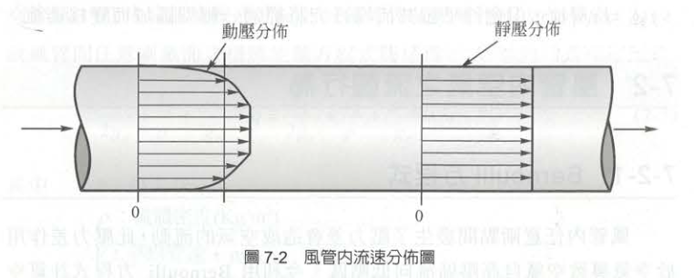{width="487"}

#### 風管橫截面的速度分佈與估算公式

- 從靜止的管壁往風管中心移動，空氣的流速會逐漸增加，直到管中心達到最大值。由於這種不均勻的速度分佈（管壁為零、中心最大），我們在實務量測與計算時，必須了解其相對關係。
- 預測「長直圓管」橫截面平均速度的經驗法則。
  - **平均速度 (**Vave​**)**：會稍微小於中心速度。其估算公式為： Vave​=**0.9**×Vcenter​ **(中心處)**
  - 如果利用白努力方程式（Bernoulli equation），將速度轉換為我們量測常用的「動壓（速度壓，Pv​）」，則動壓的關係式為： Pv(ave)​=**0.81**×Pv(center)​ **(中心處)**
- **五倍管徑法則**（現場檢測的鐵律）：上述的速度分佈規律與估算公式，**一般只指長直管段，且必須在彎管、阻塞物或過渡區域「下游五倍管徑長度」的地方才會成立**。

::: {.callout-tip appearance="minimal" icon="false"}
在職業衛生現場檢測實務中，常會拿著皮托管（Pitot tube）或風速計要測量風管內的風速。如果在風管轉彎後立刻開一個檢測孔檢測，此時管內的氣流充滿了極度混亂的擾流與偏向，你測得的中心風速絕對無法套用上述 0.9 的係數。在直管段（遠離擾流源）預留標準的檢測孔，如此才能精準確認系統的真實排氣量是否符合法規要求。
:::

## 7-2 風管內空氣之流體行為

- 在通風工程中，風機如同系統的心臟，而風管則是輸送污染空氣的血管。如果我們不懂得計算空氣在血管（風管）內流動時所消耗的能量，我們就無法為這套系統選配合適的心臟（風機）。
- 利用流體力學的能量守恆定律，精準計算出管路系統的「壓力損失」。

### 1. 基礎流體力學與穩態能量方程式

- 空氣為何流動？風管內任意兩點間只要產生了壓力差，就會造成空氣的流動，而這股壓力差是由風機所引導的。

  - **理想狀態的 Bernoulli（白努力）方程式：** 在最理想、沒有任何摩擦力干擾的情況下，空氣流動遵守白努力方程式。在工業通風的實務計算中，我們通常假設空氣為「不可壓縮流（密度 ρ = 常數）」。因此理想的能量方程式為： $\frac{v^2}{2} + \frac{P}{\rho} + gZ = \text{常數}$ （其中 v 是流速，P 是絕對壓力，Z 是高度）。
  - **真實管路的穩態能量方程式** 然而，現實中的風管是有阻力的。當空氣在真實的風管系統中流動時，必定存在摩擦力而產生壓力降。因此，「穩態能量方程式」，將熱量（q）、機械作功（w）以及極為關鍵的揚程損失（Head Loss, ΔH）加入計算。揚程損失代表了流體在風管截面 1 與 2 之間，因為機械損失所耗費的能量。（能量方程式公式推導略）

### 2. 三大壓力關係與能量的不可逆性

- 當我們把系統假設為絕熱、無外部作功，且忽略風管兩端的高低差時，上述複雜的**穩態能量方程式**就可以被大幅簡化，並引導出工業通風中最重要的三個壓力指標：
  - **靜壓（Static Pressure,** Ps​**）**：相當於熱力學上的絕對壓力（P），是系統中的潛在能量。
  - **動壓 / 速度壓（Dynamic / Velocity Pressure,** Pv​**）**：代表流速或動能的變化大小，公式為 ρV2/2。
  - **全壓（Total Pressure,** Pt​**）**：全壓就是靜壓與動壓的總和（Pt​=Ps​+Pv​），代表流體具有的總機械能。
- **流體在風管間流動的過程，由於能量具備不可逆性（Irreversibility），其「全壓」絕對會朝著流動的方向而減少。** 也就是，全壓損失（ΔPt​）永遠是正值。
- 但「靜壓」與「動壓」則不然。例如，當風管的管徑突然變大（漸擴管）時，流速變慢導致動壓（Pv​）下降；根據能量守恆，這部分減少的動壓會轉換成靜壓，造成靜壓反而上升，這個現象在流體力學中稱為「靜壓再得（Static Regain）」。儘管靜壓回升了，但轉換過程中必然伴隨亂流損耗，因此「全壓」依然是下降的。

### 3. 造成全壓損失的兩大元兇：摩擦與動態損失

- 我們在設計局部排氣系統時，必須計算系統到底消耗了多少全壓。這些全壓損失主要分成兩大類：

  - **摩擦損失（Friction Loss,** ΔPf​**）** 因為流體本身的黏滯性，以及流體與風管管壁摩擦所造成的能量損耗。
    - 計算公式採用 **Darcy 方程式**：ΔPf​=f×(L/Df​)×Pv​。

    - **摩擦因子（**f**）**：它取決於管內氣流的雷諾數（Reynolds Number, Re）以及管壁的相對粗糙度。在工業通風中，管內流速極快，雷諾數通常遠大於 4000，屬於「紊流（Turbulent flow）」狀態。

    - **材質的影響**：不同的風管材質有不同的絕對粗糙度（ε）。例如，常用的鍍鋅鐵管粗糙度約為 0.00015 m，而 PVC 塑膠管表面極度平滑，粗糙度僅有 0.0000015 m。(需另查)
  - **動態損失（Dynamic Loss,** ΔPd​**）** 當氣流通過彎管、分支管、閘門或風管截面積形狀改變時，會產生劇烈的「渦流（Eddy Current）」，進而造成機械能銳減，這就是動態損失。
    - 計算公式為：ΔPd​=C×Pv​。

    - 這裡的 C **稱為「局部損失係數」**，每種彎管或配件都有對應的實驗值，工程設計上通常直接查表取得。

- 最後，整個風管系統的**總全壓損失**，就是將所有的摩擦損失與動態損失加總起來：ΔPt​=ΔPf​+ΔPd​。

### 4. 實務設計的兩大轉換工具

- 在實際的工程計算上，為了解決形狀與配件複雜度的問題，兩個非常實用的轉換概念：
  - **矩形風管的當量直徑（Equivalent Diameter,** De​**）：** 工廠為了配合建築物樑柱或空間限制，經常會把圓形風管改成「矩形風管」。但所有的摩擦損失公式與圖表都是以圓形風管為基礎所建立的。因此，我們必須利用公式，將長寬分別為 a、b 的矩形風管，轉換成擁有相同摩擦阻力的「流量當量直徑（De​）」。其經驗公式為：De​=$1.3 \times \frac{(ab)^{0.625}}{(a + b)^{0.25}}$
  - **等效長度（Equivalent Length,** Le​**）：** 為了方便早期沒有電腦軟體時的手工計算，工程師會將配件（如彎管、T型管）所產生的動態損失，直接換算成一段「具有相同摩擦損失的直管長度」，這樣就可以把整個系統全部視為一條長的直管來快速估算壓力損失。（公式與表格另查）

::: {.callout-caution appearance="minimal" icon="false"}
在審查通風設計圖時，如果發現設計上沒有確實計算「摩擦因子（f）」與彎管的「局部損失係數（C）」，或者隨意把圓管壓扁成矩形卻沒有校正「當量直徑（De​）」，這將導致系統實際遭遇的「全壓損失」遠大於預期。最終的後果，就是原先選購的風機馬力不足，無法克服管路阻力，導致氣罩端的抽氣量大幅衰退。
:::

## 7-3 風管系統之守恆定律

- 在評估整個局部排氣系統時，風管網絡就像人體的血管般錯綜複雜，但無論管路如何分支與匯流，內部的空氣流動必定嚴格遵守兩大物理守恆定律：

### 1. 質量守恆 (Conservation of Mass)

- 在工業通風的實務計算中，我們通常假設空氣為不可壓縮流體。因此，對於風管系統中的任何一個交會「節點（Node）」，流入該節點的總體積流率（排氣量），必定等於流出該節點的總體積流率。
  - **方程式表示**：∑Qin​=∑Qout​。
  - **實務意義**：假設一條主風管（匯流後排向風機）連接了兩個分支氣罩，那麼主風管內的排氣量，必定等於這兩個分支氣罩排氣量的總和。如果我們在現場量測發現總風量對不上，就代表管路中必定有嚴重的破損漏氣，或者是檢測孔的位置（未遠離擾流源）發生了錯誤。

### 2. 能量守恆 (Conservation of Energy)

- 風管系統中流體的全壓（Total Pressure, Pt​），代表了流體所具有的總機械能。
  - **最佳化系統的能量分佈**：在一個設計良好的風管系統中，各個路徑的「總全壓損失」必須相等。
  - **節點壓力平衡**：對於系統中的某個節點 a 而言，流體在 a 點所具有的全壓，必定等於以 a 點為起點的所有子路徑上「總全壓損失的總和」，其能量守恆方程式可表示為：Pt,a​=∑ΔPi​。
  - **實務意義**：空氣非常「聰明」，它永遠會選擇阻力（壓力損失）最小的路徑走。如果兩個分支管連接到同一個主風管，但兩者的管路阻力設計不平衡，空氣就會大量從阻力小的那一端抽走，導致阻力大的那一端氣罩完全失去吸力。

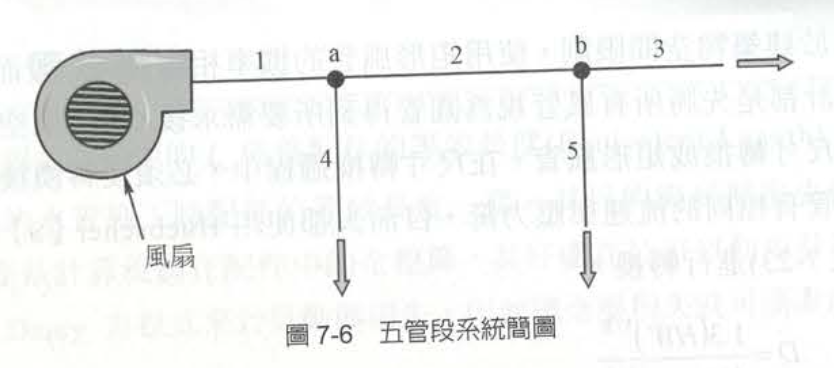{width="368"}

## 7-4 工業風管的組件及種類

- 知道守恆定律後，來看看構成系統阻力的硬體。工業用的通風管通常是由直管、肘管、漸擴或漸縮管、孔口、流量控制閥、歧管通道、開門與閥、防雨擋板或防雨罩以及空氣過濾器等零件所構成。 這些組件在空氣流動時**都會產生擾流或摩擦**，進而造成使用者會包含摩擦損失、肘管損失、歧管通道損失、孔口損失、漸擴損失、漸縮損失、風機入口損失、煙囪損失和其它擾流或系統的摩擦損失。

### 1. 摩擦損失與風管幾何設計

- 在所有損失中，直管的「摩擦損失」是最基礎也最常遇到的。
- 我們應該使用何種形狀的風管？ 在工業通風通常都是：**盡可能使用圓管**。使用圓管有三大絕對好處：
  - **阻力損失較小**。
  - **能提供較好的氣流傳輸環境**。
  - **相較於相等面積的方形/矩形管，使用較少的金屬（因此，它可能會便宜一點）**。
- 摩擦損失的六大關鍵參數關係
  - 空氣流過風管時都是呈現紊流並且會有摩擦損失。「損失」表示靜壓轉換成熱、震動和噪音。身為設計者，必須熟記摩擦損失（ΔP）與以下參數的絕對關係：
  - **與管的長度呈線性正比關係**（ΔP∝L）。
  - **與管壁的粗糙度與管的材質有很大的關係**（ΔP∝f）。
  - **與空氣的速度成二次方正比關係**：流速若變為 2 倍，摩擦損失會暴增為 4 倍（ΔP∝V2）。
  - **與管徑的關係**：
    - 當速度為常數時，與管徑的一次方程式成反比關係（ΔP∝1/D）。？？？

    - 當 Q（排氣量）為常數時，與管徑成五次方反比關係（ΔP∝1/D\^5）。這意味著若管徑縮為一半，損失會暴增 32 倍！
  - **與空氣密度呈線性正比關係**：密度減少 20%（例如在高海拔或高溫環境），摩擦力也會減少約 20%（ΔP∝ρ）。

## 第8章 風機（Fan）的選擇與操作

- 前面呈現如何計算氣罩需要的排氣量（Q），以及如何精算管路克服摩擦與配件阻力所需的靜壓（Ps​）。這兩個重要參數，正是設備商選擇合適風機時的最關鍵依據。

### 8-1 風機種類與實務選用

- 在職業衛生的局部排氣工程中，最常遭遇也最核心的是**離心式風機 (Centrifugal Type Fan)**。離心式風機又可細分為好幾類(略)。

### 8-2 風機測試與系統效應

- 在實務上，設備商型錄上的風機數據通常非常完美，但當把風機安裝到工廠管路上後，往往會發現風量達不到預期。為了解決這種性能爭議，風機測試分三種方式：**實驗室測試**、**現場直接量測(**真實反映)、**原機縮小模型測試**。

#### 1. 風機定律 (Fan Laws)

- 如果在現場測試發現風量不足，工程師最常做的就是「調高風機的轉速 (RPM)」。但在此之前，必須熟記**「風機定律」**。

- 當我們改變風機轉速（N）時，系統的風量（Q）、壓力（P）與所需功率（W）的變化關係如下：

  - **第一定律（流量）**：Q∝N （風量與轉速成「一次方正比」）。想增加 10% 的風量，轉速就調快 10%。

  - **第二定律（壓力）**：P∝N\^2 （壓力與轉速成「二次方正比」）。轉速增加 10%，壓力會增加 21% (1.1\^2=1.21)。

  - **第三定律（功率）**：W∝N\^3 （馬達功率與轉速成「三次方正比」）。這是最危險的一環！如果轉速增加 10%，馬達需要的動力會暴增 33% (1.1\^3=1.331)。

  - 審查或改善現場通風效能時，這三條定律是工程實務的鐵律。如果發現某個氣罩的控制風速不夠，千萬不要隨意把風機皮帶輪換小以大幅拉高轉速。 依據第三定律，假如你將轉速提高一倍（2倍），風量雖然變成 2 倍，但**馬達所需的電力將會變成 8 倍 (**2\^3**)**！這會導致馬達瞬間過載燒毀，甚至引發工廠火災。

## 2. 風機壓力與動力

- 精算了氣罩的排氣量以及管路的總壓力損失後，我們必須將這些需求「翻譯」成設備商聽得懂的語言，也就是決定風機的「壓力規格」與「馬達馬力」。

### 描述風機能力的兩大壓力指標

- 當我們翻開設備商的風機型錄，通常會看到兩種描述風機壓力的數值：**風機全壓 (FTP)** 與 **風機靜壓 (FSP)**。這兩者在工程上有著截然不同的意義。

#### 1. 風機全壓 (Fan Total Pressure, FTP)

- **物理意義**：風機全壓代表了空氣流過整個通風系統時，風機所必須提供的「總能量」。它在數值上等於管路內全壓損失計算的絕對值。
- **計算公式**：風機全壓等於風機出口處的全壓 (Pt,out​) 減去風機入口處的全壓 (Pt,in​)。 $FTP=Pt_{out}​−Pt_{in}​$（註：如果風機入口與出口的速度相同，即動壓 Pv​ 互相抵銷，則 FTP 也可簡化為 Ps,out​−Ps,in​）。

#### 2. 風機靜壓 (Fan Static Pressure, FSP)

- **物理意義與實務考量**：在實務上，風機靜壓被定義為風機全壓減去風機外吹的平均速度壓 (Pv,out​)。風機静壓力不完全等於靜壓力 out滅去静壓力in。但風機静可取代全壓損失如此更保守。FSP可定義為系統的損失,例 如,静壓力的能量轉變成沒有用處的熱或噪音。

- **計算公式**： $FSP=FTP−Pv_{out}​$ 或者是 $FSP=Ps_{out}​−Pt_{in}​=Ps_{out}​−(Ps_{in}​+Pv_{in}​)$

## 3.風機動力 (Fan Power / FHP)

- 決定了風機需要克服的壓力 (FTP) 以及輸送的風量 (Q) 之後，我們就必須計算出這台風機需要配置多大的「馬達 (馬力)」來驅動，這就是風機動力 (Fan Horsepower, 簡稱 FHP)。

  - **求取千瓦 (kW) 的公式**：$FHP = \frac{Q \times FTP}{6120 \times \eta}$​

  - **求取馬力 (HP) 的公式**：$FHP = \frac{Q \times FTP}{8204 \times \eta}$

    - Q：為風量（單位為 m3/min）。

    - FTP：為風機全壓（教材在此標示單位為 $mm H_2O$，但我稍後會作實務勘誤）。

    - η：為風機的傳動輸出效率。一般工業風機的機械效率大約落在 **0.6 \~ 0.7** 之間。

      - 如果高估了風機的機械效率（例如把 η 誤設為 1.0 的完美狀態），算出來的馬達馬力就會偏小。當這套設備安裝到工廠現場時，馬達會因為帶不動葉片克服管路阻力而發生過載跳機，或者只能以極低的轉速運轉。

## 風機動力 - 練習

### **題目1**

#### 風機風量為 100 m3/min，由下列各進口及出口的條件計算 FTP 及風機馬力各為多少？

- **給定條件 (US單位 / SI公制單位)**

  - Ps​ in **(入口靜壓)**: −5.00" Hg / −127 mm Hg 

  - Ps​ out **(出口靜壓)**: +0.40" Hg / +10 mm Hg

  - Pv​ in=Pv​ out **(進出口速度壓)**: +1.00" Hg / +25 mm Hg

- **計算過程**

1.  **計算風機全壓 (FTP)** 簡化為出口靜壓減去入口靜壓： FTP=Ps out​−Ps in​=0.4" Hg+5" Hg=5.4" Hg=137 mm Hg

2.  **計算風機動力 (FHP)** 已知風量 Q=100 m3/min，FTP=137 mm。假設風機的傳動輸出效率 η=0.65：

- **求取千瓦 (kW)**： FHP=3.44 kW， **求取馬力 (HP)**： FHP==2.57 HP

- **留意單位可能有誤 (Aq, not Hg)**

### **題目2** 

#### 從上題的條件中，估計風機的 FSP 為多少？ (US/SI)

- **計算過程**

1.  依據風機靜壓的定義，FSP 等於風機出口靜壓減去風機入口的全壓（即入口靜壓加動壓）： FSP=Ps out​−(Ps in​+Pv in​)

2.  代入數值計算（以 US 單位代入後換算為 SI 單位）： FSP=0.4−(−5+1)=4.4" Hg=112 mm Hg *(若直接以 SI 單位計算：*10−(−127+25)=112 mm*)*

## 風機壓力變化

|                                                      |
|------------------------------------------------------|
| 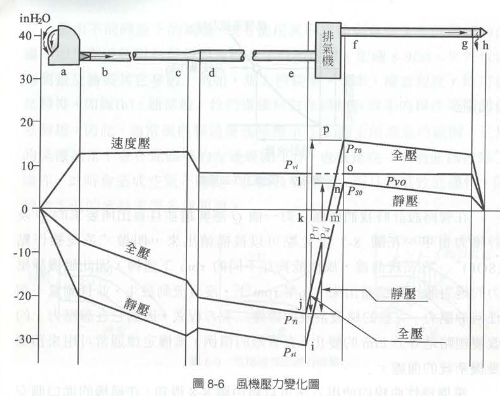{width="517"} |

- 原則：根據流體力學，全壓等於靜壓與速度壓之和：$P_T = P_S + P_V$

+-------------------------+----------------------------------+----------------------------------+
|                         |                                  |                                  |
+=========================+==================================+==================================+
| **參數**                | **吸氣側（e 點之前）**           | **排氣側（f 點之後）**           |
+-------------------------+----------------------------------+----------------------------------+
| **靜壓 (**$P_S$) 狀態   | **負壓**（低於大氣壓，吸入空氣） | **正壓**（高於大氣壓，推送空氣） |
+-------------------------+----------------------------------+----------------------------------+
| **速度壓 (**$P_V$) 狀態 | 永遠為**正值**（由風速決定）     | 永遠為**正值**（由風速決定）     |
+-------------------------+----------------------------------+----------------------------------+
| **能量變化**            | 沿流程因摩擦阻力而**遞減**       | 沿流程因摩擦阻力而**遞減**       |
+-------------------------+----------------------------------+----------------------------------+

- 壓力變化圖能透過量測風機進出口的壓力，精確計算出這台風機到底提供了多少**全壓升 (**$P_{Tf}$) 與**靜壓升 (**$P_{Sf}$)，進而評估風機效率或進行系統設計。

## 如何知道風機壓力變化（整理）及目的

- 要精確評估風機，**絕對必須同時量測入口e與出口f**。
- 從職業衛生（工業通風）專家的角度來看，局部排氣系統的設計與評估，不能只看風機本身，而是要看它「克服系統總阻力」的能力。
  - **出口壓力量什麼？**

    在實務量測上，我們在出口管路（f點）通常會量測到**全壓 (**$P_{To}$) 或 **靜壓 (**$P_{So}$)。因為出口流速通常已知，知道其中一個，就能透過公式換算另一個。

  - **一定要量入口嗎？**

    **是的，一定要量！** 因為風機前半段（吸氣側）的管路摩擦、氣罩損失，全部都會累積成入口處的負靜壓（$P_{Si}$）。不量測入口，就無法知道風機頂住了多少吸氣端的阻力。

### 如何進行系統設計與效率評估？

1.  系統設計（從需求出發）

    - **步驟 A：決定風量 (**$Q$) 根據有害物種類（如化學溶劑、粉塵），依據法規或 ACGIH 標準設定氣罩的「捕捉風速」，計算出系統所需的總風量。

    - **步驟 B：計算壓損（壓力的減項）**

      模擬空氣從氣罩吸入、經過直管、彎頭、空氣清淨裝置（洗滌塔/集塵器），一路到排出口的**總阻力（即系統全壓損失）**。

    - **步驟 C：選配風機**

      選用的風機，其提供的**風機全壓升 (**$P_{Tf}$) 必須大於或等於系統的總阻力，才能確保風量達標。

2.  現場量測與評估（實地健檢）

    - 在風機進出口的直管處鑽孔，使用皮托管（Pitot tube）與微壓計進行量測：
    - **量測入口 e 點：** 得到 $P_{Si}$（靜壓）與 $P_{Vi}$（速度壓），相加得到入口全壓 $P_{Ti}$。
    - **量測出口 f 點：** 得到 $P_{So}$（靜壓）與 $P_{Vo}$（速度壓），相加得到出口全壓 $P_{To}$。

3.  計算風機效率（評估效能）

    - 得到數據後，我們會計算**風機功率（空氣馬力,** $AHP$），並與電動機消耗的軸馬力（$BHP$）做對比：

    - $AHP = \frac{Q \times P_{Tf}}{常數}$

      - **風機全效率 (**$\eta_t$) $= \frac{AHP}{BHP} \times 100\%$

      > **實務建議：** 如果量測出來發現風機效率極低，通常代表**風機選錯型號（不在高效能操作區）**、**管路積塵嚴重阻力變大**，或是**風機葉片磨損**。在職業衛生上，這意味著控制風速可能不足，勞工暴露風險會隨之提高。

##  8-3 SOP 和風機曲線（風機匹配）

### 1. 系統需求：系統操作點 (SOP) 與系統曲線

- 管路設計目標：為了達到法規要求的控制風速，我們所需要的特定排氣量（Q），以及對應此風量下系統產生的總靜壓力(Ps)需求。
- **系統操作點 (System Operating Point, SOP)**：當我們把這組算出來的 (Q,Ps​) 座標標繪在圖表上時，這個點就稱為「系統操作點（SOP）」。這是我們通風系統設計的絕對目標。
- **系統曲線的形狀**：如果我們將系統在不同風量下的壓力需求全部描繪出來，這條「系統曲線」會呈現出類似二次方程式的拋物線形狀。根據風機定律，管路靜壓力的改變粗略地會與流量（cfm）變化的平方成正比。在零轉速（零風量）下，沒有空氣流動發生，自然也測量不到任何靜壓力。

### 2. 風機能力：風機特性曲線 （風機本身的性能）

- **最大靜壓點（A點）**：在風機進口側安裝一個蝴蝶閥，啟動風機（例如設定在 500 rpm）並將閥門「完全關閉」。此時沒有任何空氣流出（流量為零），但風機會產生最大的靜壓力，這就是曲線上的 A 點。
- **最大流量點**：接著，慢慢打開蝴蝶閥。隨著時間增加，會有越來越多的空氣流過導管，直到閥門完全打開時，將產生最大的流量，而此時用來克服阻力的靜壓力則降至最低。 將這些點連接起來，就形成了一條專屬於該台風機在特定轉速下的「風機特性曲線」。

+---------------------------------------+---------------------------------------+
|                                       |                                       |
+=======================================+=======================================+
| 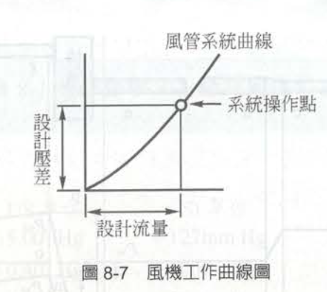 | 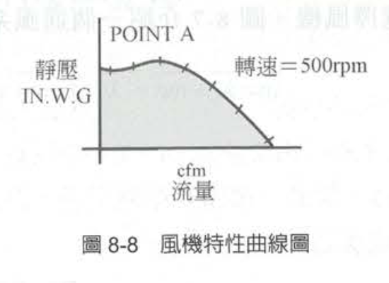 |
+---------------------------------------+---------------------------------------+

##  8-3 SOP 和風機曲線（風機匹配）續

### 3. 綜合評估：群組曲線與最佳效率區

- 在實務上，設備商不會只給我們一條線。
  - **群組曲線 (Family of Curves)**：藉由測試不同轉速下的風機，或者直接使用我們上一節學過的「風機定律（Fan Laws）」進行數學預測，我們可以畫出一整組在不同 rpm 下運轉的群組曲線（如圖 8-9a）。這讓工程師能知道若調整皮帶輪改變轉速，風機能力的變化範圍。
  - **附加性能參數**：除了風量與靜壓，專業的風機型錄還會在這張圖上疊加標繪其他的關鍵參數，例如「馬力消耗率 (B.D)」、「效率 (EFF)」，以及「噪音程度 (NOISE)」。
  - **操作範圍 (Operating Range)**：通常，我們僅僅只對曲線中「較有效率」的操作範圍部份感興趣，因此製造商通常只會標示出建議的操作區間（如圖 8-9c 中未被遮蔽的部分）。

### 4. 風機曲線後部 (Back of the Curve)

- **正常的風機通常不會在曲線區域的「左邊範圍」工作，也就是所謂在「風機曲線後部」操作**。會造成空氣極度不穩定，同時振動及噪音大幅增大，並且伴隨極低效能的運作與低下的流動率等各種嚴重問題。

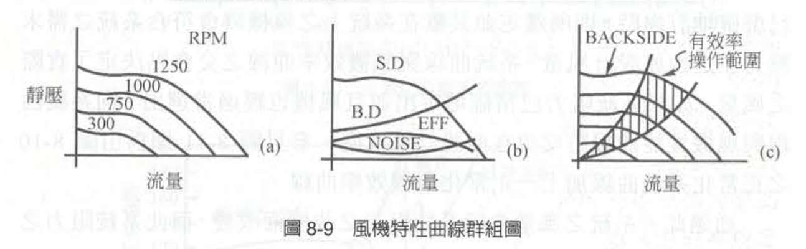{width="624"}

## **8-4 系統曲線 (System Curve)**

- 當一定之風量（排氣量）通過一組空氣風管系統時，必然會因為摩擦與配件干擾而產生壓力損失或阻力。而這個壓力損失的大小，會隨著我們抽氣量的多寡而產生劇烈的改變。
- **流體力學的壓力損失與速度的平方成正比**
  - 一個典型之「固定系統」的特性曲線，若將風量（橫軸）與壓力阻力（縱軸）標繪出來，會呈現一條向上彎曲的「拋物線」。 例如，假設原設計系統在 100% 的風量下，系統阻力為 100%；如果我們希望將風量增加至原來的 120%，根據公式，系統阻力將會暴增至 1.2＾2=1.44 倍（即 144%）。反之，若風量減到 50%，則風壓阻力亦會減至原來的 25% (0.5＾2=0.25)。
- **系統曲線與風機效率曲線之交會點決定了實際之風量**
  - 這個交會點，就是我們上一節提到的「系統操作點 (SOP)」。如果系統阻力已經精確確定，而且風機也選得適當，這兩條線的交會點就會剛好落在我們原先設計的目標風量處。
- **工廠的現場是動態的，系統的阻力隨時可能發生改變。**
  - 當系統阻力發生變化時，原先的系統曲線（曲線 A）會偏移：
    1.  **阻力增加（曲線往左上偏移至 B）**： 當系統中加入了額外的阻力，例如「風門被關小」、「空氣濾清器（集塵機）濾袋積滿粉塵阻塞」，或者「導管內積垢」時，系統阻力百分比會增加。這會使得系統曲線轉變成更陡峭的曲線 B。此時，新的交會點會落在風機曲線的左上方(點2)，**導致實際排氣風量大幅減少**。

    2.  **阻力減少（曲線往右下偏移至 C）**： 相反地，如果系統阻力減少（例如某段風管破洞漏氣、或者操作員把所有調節風門全開），系統曲線會變得平緩（轉變為曲線 C）。此時交會點會往右下方移動(點3)，使總排氣量增加。

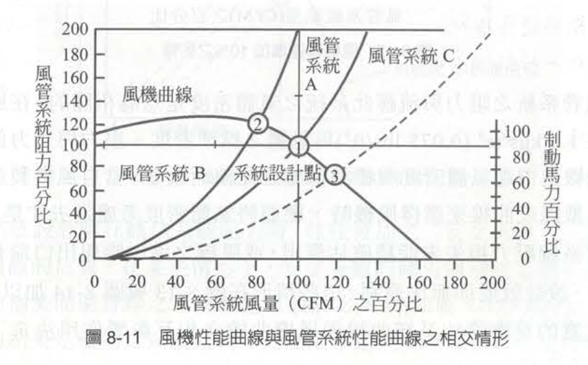{width="595"}

- 預期之外的阻力：安全係數與系統影響 (System Effect)

  - 在設計階段，工程師在紙上算出的阻力，往往與實際安裝後的阻力有落差。教材在 8-4-1 與 8-4-2 節中，點出了兩個導致「風機系統效能不足」的致命原因：

    - **低估系統阻力與「安全係數」**： 有時候實際系統壓力損失大於原設計時之估算，為了彌補這種不精確的估算，系統設計師在概估系統阻力時，往往必須加上一個「安全係數 (Safety Factor)」。如果沒有加安全係數，導致實際阻力過大時，工程師就必須被迫「增加風機轉速」以達到設計風量。但請記得風機定律，轉速增加 10%，馬達需要的動力會暴增 33%（即 1.1＾3=1.33），這極容易導致馬達過載燒毀。
    - **系統影響 (System Effect)**： 即使直管與彎管的摩擦損失都算對了，造成風機與系統組合效能不足最常見的原因有三項：**(1) 風機出口端銜接不當；(2) 風機進口端氣流不均勻；(3) 在風機進口端有旋轉渦流**。 這些因為安裝不良導致的空氣動力流場破壞，會讓風機無法發揮潛能，在工程上我們必須將這種額外損失估算為「系統影響因子」，並將其加入原本的壓力損失計算中，否則實際的風量絕對會低於設計值。

::: callout-note
解決方案絕對不是盲目地去換一顆更大的馬達（或硬拉轉速，這會燒毀設備），而是要求雇主**落實設備的維護保養、清理管路積塵與更換濾袋**。只要將系統阻力降回原先設計的曲線 A，交會點就會回到設計風量，控制風速自然就能恢復。
:::

## **8-5 風機選擇**

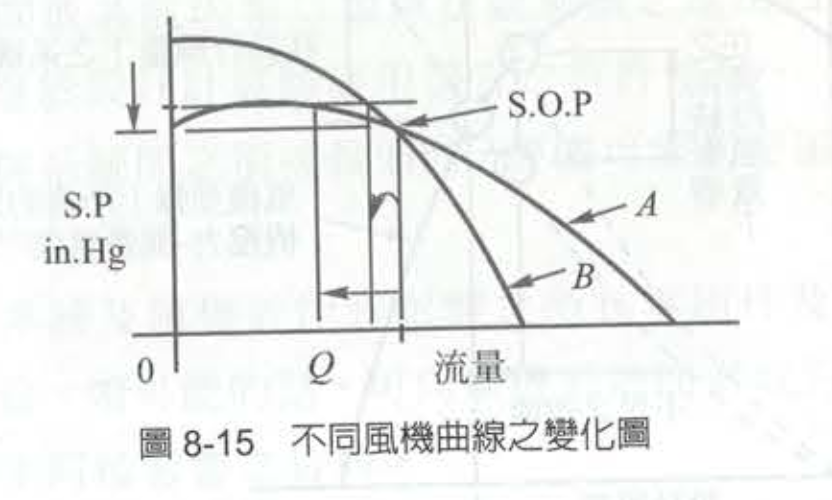{width="524"}

+------------------------------------------------+--------------------------------------------------------------------+------------------------------------------------------------------------+
| 實務評估面向                                   | 曲線 A：平坦型風機 (Flat Curve)                                    | 曲線 B：陡峭型風機 (Steep Curve)                                       |
+================================================+====================================================================+========================================================================+
| **曲線幾何特徵**                               | 壓力隨風量變化的斜率較平緩。                                       | 壓力隨風量變化的斜率較陡直。                                           |
+------------------------------------------------+--------------------------------------------------------------------+------------------------------------------------------------------------+
| **面對系統阻力增加時(如：濾袋阻塞、管路積垢)** | **操作點左移，風量 (**Q**) 產生巨大的衰退變化。** (呈現斷崖式下跌) | **操作點左移，但風量 (**Q**) 的減少幅度非常小。** (幾乎能維持原抽氣量) |
+------------------------------------------------+--------------------------------------------------------------------+------------------------------------------------------------------------+
| **系統操作點 (SOP) 穩定度**                    | **極低**。極易受現場動態干擾影響。                                 | **極高**。能抵抗預期外的系統壓力波動。                                 |
+------------------------------------------------+--------------------------------------------------------------------+------------------------------------------------------------------------+
| **能源效率與耗電表現**                         | 通常在設計點上的運轉效率較高，較為省電。                           | 操作上比較沒有效率，耗電量相對較大。                                   |
+------------------------------------------------+--------------------------------------------------------------------+------------------------------------------------------------------------+
| **法規落實與勞工防護後果**                     | **【高風險 / 易違規】**                                            | **【高防護 / 符法規】**                                                |
+------------------------------------------------+--------------------------------------------------------------------+------------------------------------------------------------------------+
| **職業衛生專家學者建議**                       | **不建議採用。**                                                   | **強烈建議優先選用。**                                                 |
+------------------------------------------------+--------------------------------------------------------------------+------------------------------------------------------------------------+

## 9-5設計範例

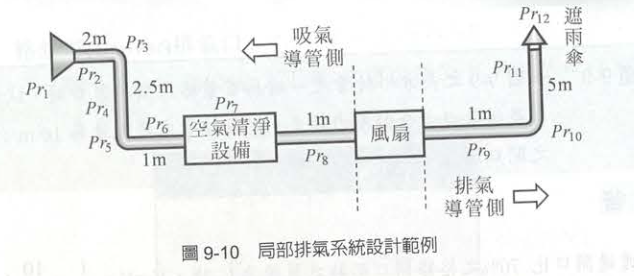{width="578"}

### 1. 第一階段：確立設計參數與決定管徑

- 畫出管路配置圖，根據法規要求與製程特性，訂出最基礎的流體力學參數。本範例假設了一個附有凸緣（面積 0.06 m2）的方形氣罩，為了有效控制污染，工程師設定了以下條件：

  - **捕集速度 (**Vc​**)**：0.4 m/s（這是為了確保在距離氣罩 0.2 m 處能有效抓取污染物）。

  - **搬運速度 (**Vtrans​**)**：15 m/s（確保粉塵在管內不會沉積）。

- **1. 計算所需排氣量 (**Q**)** 利用氣罩流量公式推算：Q=0.75(10X＾2+Af​)×Vc​≈10 m3/min。這就是系統的「目標抽氣量」。

- **2. 導管直徑的計算與「規格化修正」** 這是實務上極度重要的一環！算出所需風量後，我們利用 Q=VA 反推管徑：

  - **吸氣側導管（主管）**：算出來的精確管徑為 11.9 cm。但市面上沒有這種尺寸，所以我們必須選用標準規格的 12 cm 風管。因為管徑變大了，實際的管內搬運速度會微幅下降修正為 14.7 m/s。

  - **排氣側導管（主管）**：算出的管徑為 14.6 cm，實務上選用 15 cm，其排氣速度修正為 9.4 m/s

### 2. 第二階段：逐點精算壓力損失 (The Node-to-Node Calculation)

- 有了真實管徑與真實流速，接下來就是最考驗工程師細心程度的「逐段壓損計算」。從氣罩口開始（第1點），一路算到排氣煙囪口（第12點）。

1.  **計算動壓 (速度壓,** Pv​**)**： 利用公式 Pv​=(V/4.03)\^2，算出 12 cm 吸氣管的 Pv1​=13.2 mmH2​O。

2.  **氣罩端損失與靜壓 (**Ps1​**)**： 查表得知氣罩損失係數 K=0.7。氣罩壓力損失 Pr1​=K×Pv1​=0.7×13.2=9.3 mmH2​O。 因此，氣罩出口處的靜壓 Ps1​=−(Pr1​+Pv1​)=−22.4 mmH2​O。這代表風機必須在此處產生這麼大的負壓才能驅動空氣。

3.  **直管摩擦與配件動態損失**： 接著順著氣流，逐一計算每一段直管的摩擦力（例如第2點到第3點的直管損失為 4.4 mmH2​O）以及轉彎處的肘管損失（例如 90度肘管 K=0.55，損失 7.3 mmH2​O）。 另外，絕對不能忘記**空氣清淨設備（如洗滌塔或集塵機）的巨大壓損**。範例中直接假設其壓損為 50 mmH2​O。

4.  **排氣端損失與防雨罩**： 氣流通過風機後進入正壓區，計算排氣側 15 cm 管路的摩擦，以及煙囪末端「防雨罩（Weather cap）」的阻力（查表 K=1.1，損失 5.9 mmH2​O）。

### 3. 第三階段：決定風機動力與安全馬力

- 將上述所有管段、配件、空氣清淨設備與防雨罩的壓力損失全部加總，我們得出這個系統的「總壓力損失」為 99.8 mmH2​O。
- 接著，工程師必須決定採購多大的風機（心臟）：

1.  **風機全壓 (**PTf​**)**：考量吸氣側與排氣側動壓的差異，視為風力損失與動壓靜壓值，計算出風機全壓為 105.2 mmH2​O。

2.  **風機動力 (KW)**：代入公式 (Q×PTf​)/(6120×全壓效率)。假設風機機械效率為 0.6，算出所需的理論馬力為 0.29 KW。

3.  **馬達動力的「安全餘裕」**：這是工程上極度重要的一步！教材特別標示：「為安全起見，宜將排氣機馬達動力增加 20%」。因此實際採購的馬達馬力應為 0.29 KW×1.2=0.34 KW。

### 4. 第四階段：壓損分佈圖 (Pressure Loss Distribution Diagram)

- 計算完畢後，展示整個系統流體力學的「心電圖」—壓損分佈圖（圖 9-11）。

- 這張圖傳達了一個核心物理概念：**管路系統的壓力本身是平衡的**。

  - 空氣進入氣罩後，靜壓 (SP) 與全壓 (TP) 一路呈現往下的斜坡（因為摩擦損耗，負壓越來越大）。
  - 到了風機處，風機將「靜壓值 (點5)」瞬間拉升到正壓區，這就是風機所代入系統的能量。
  - 隨後在排氣管路中，壓力再次因摩擦而下降，直到排氣煙囪末端完美歸零，與大氣壓力達到新的平衡。

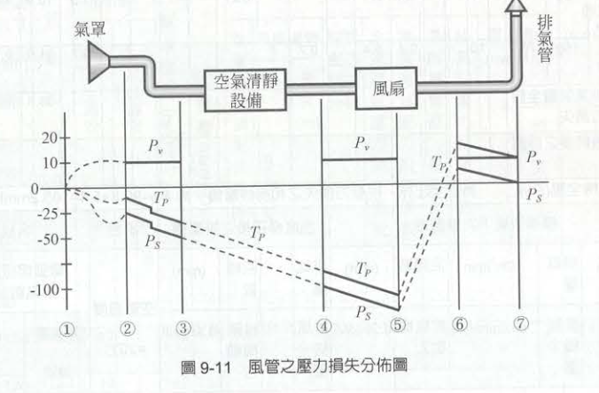{width="545"}

- 表 9-17 局部排氣系統之設計步驟（計算表）」**，其核心目的正是為了**方便記錄、呈現與修改。而且誠如你所言，在現代的通風工程實務中，工程師絕對是將這張表直接建置在 Excel 等試算表軟體中來進行自動化運算的。

|                                   |
|-----------------------------------|
| 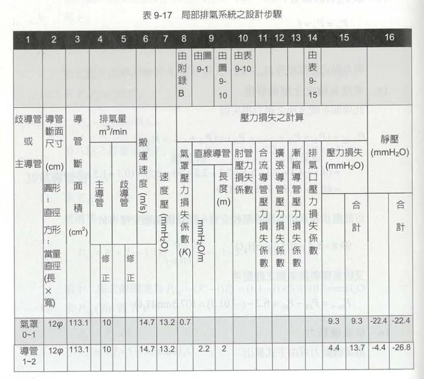 |
| 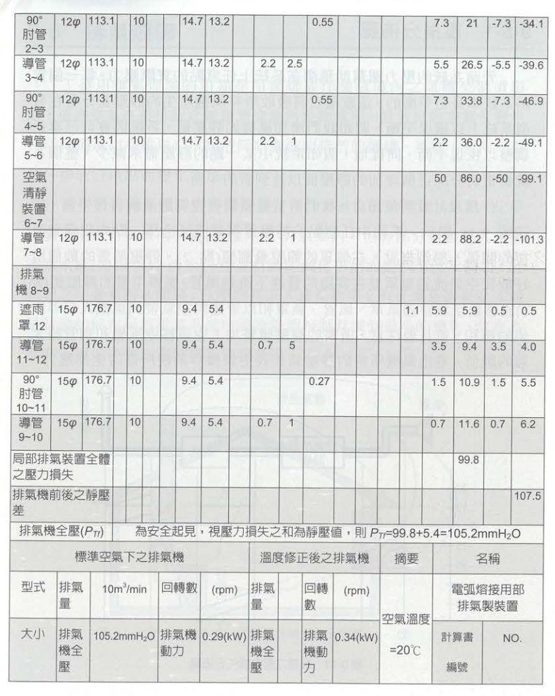 |

- 這張「計算表」在實務操作與法規審查上的重大意義：

  - 「嘗試錯誤 (Trial and Error)」的最佳工程載體

  - **系統化防呆：追蹤流體力學的動態軌跡**

  - **法規審查與工程驗收的共通語言**

## 其他範例

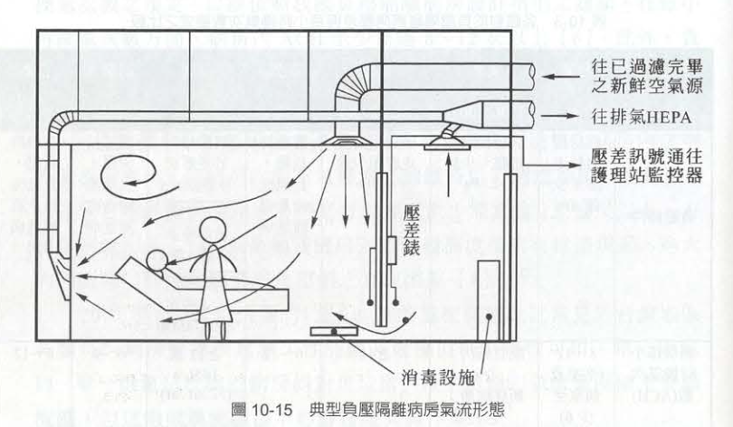

### 參考書籍：  鍾基強，**工業通風設計概要(第二版)，**全華圖書，2011
