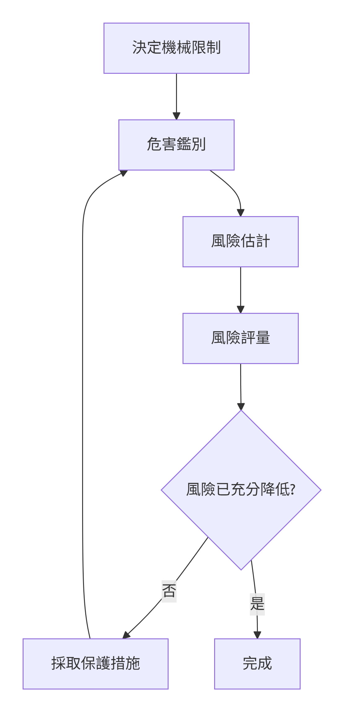

---
title: "機械設備器具安全與風險評估"
subtitle: "源頭管理法規、風險評估技術與實務案例"
author: "勞動部職業安全衛生署"
date: "2026-04-30"
format:
  revealjs:
    theme: simple
    transition: slide
    slide-number: true
    chalkboard: true
    footer: "勞動部職業安全衛生署 機械設備器具安全資訊網"
    logo: "https://tsmark.osha.gov.tw/favicon.ico"
    hash: true
    embed-resources: false
    slide-level: 2
    code-link: true
    incremental: false
    center: true
    controls: true
    controls-tutorial: true
    background-transition: fade
    width: 1280
    height: 720
---

```         
```{css} /* 自訂樣式 */ .reveal .footer {     font-size: 0.4em;     color: #6c6c6c;     background: none;     text-shadow: none; } .reveal h1, .reveal h2, .reveal h3 {     text-transform: none; } .reveal .slides section .subtitle {     color: #2c3e50;     font-weight: lighter; } .highlight-red {     color: #e74c3c;     font-weight: bold; } .highlight-green {     color: #27ae60;     font-weight: bold; }
```

# 機械設備器具安全與風險評估

## 課程目標

- 瞭解機械源頭管理法規架構 (職安法 §5, §7, §8, §9)

- 掌握機械安全風險評估方法 (ISO 12100)

- 學習實務防護案例與對策

> 本課程依據職業安全衛生法及機械設備器具安全標準編製

# 單元一：機械源頭管理法規

## 為何需要源頭管理？

過去僅靠雇主「末端管理」無法杜絕有缺陷機械流入市場

\<div class="fragment"\>

**國際公約核心原則**：

- 無適當防護裝置之機械禁止流通

- 勞工不應使用無安全裝置之機械

\</div\> \<div class="fragment highlight-green"\>

**職安法第5條第2項**：設計、製造、輸入者應於各階段實施風險評估

\</div\>

## 職業安全衛生法架構


## 第7條 – 指定機械申報登錄

> **製造者、輸入者、供應者或雇主**，對於中央主管機關**指定之機械、設備或器具**，其構造、性能及防護非符合安全標準者，不得產製運出廠場、輸入、租賃、供應或設置。

- 符合安全標準 → 應於**資訊申報網站登錄**，並於產品明顯處張貼**安全標示 (TD)**

- 但屬於公告列入型式驗證之產品，應依第8條及第9條辦理

**罰則**：違反第7條第1項 → 新臺幣20\~200萬元

## 第8條 – 型式驗證

> 製造者或輸入者對於中央主管機關**公告列入型式驗證**之機械、設備或器具，非經認可之驗證機構實施型式驗證合格及張貼**合格標章**，不得產製運出廠場或輸入。

- 目前公告項目：**交流電焊機用自動電擊防止裝置** (自107年7月1日起適用)

**免驗證情形**（第8條第2項）：

1.  依其他法律實施檢查、檢驗、驗證

2.  國防軍事用途

3.  科技研發、測試專用機型

4.  商業樣品或展覽品

5.  其他特殊情形經核准

## 第9條 – 標章管理與市場查驗

- 未完成登錄或未取得型式驗證合格者，**不得使用安全標示、驗證合格標章**或易生混淆之類似標章

- **製造者、輸入者應建立及保存產銷資料**

- 中央主管機關或勞動檢查機構得進行**抽驗及市場查驗**，業者不得規避、妨礙或拒絕

## 指定機械種類 (施行細則第12條)

| 項次 | 機械設備         | 項次 | 機械設備                       |
|:-----|:-----------------|:-----|:-------------------------------|
| 1    | 動力衝剪機械     | 7    | 防爆電氣設備                   |
| 2    | 手推刨床         | 8    | 光電式安全裝置                 |
| 3    | 木材加工用圓盤鋸 | 9    | 刃部接觸預防裝置               |
| 4    | 動力堆高機       | 10   | 反撥預防裝置及鋸齒接觸預防裝置 |
| 5    | 研磨機           | 11   | 其他經指定公告者               |
| 6    | 研磨輪           |      |                                |

## 申報登錄自我宣告流程


**佐證方式**：

1.  委託認可檢定機構實施型式檢定合格

2.  委託國內外認證產品驗證機構審驗合格

3.  製造者完成自主檢測及製程一致性查核

## 安全標示 與 合格標章

| 制度 | 標示 | 格式 | 適用 |
|:---|:---|:---|:---|
| 申報登錄 | TD | 圖式 + 識別號碼 (字軌TD + 指定代碼) | 指定機械 |
| 型式驗證 | TC | 圖式 + 識別號碼 (字軌TC + 代碼 + 機構代號) | 公告列入型式驗證產品 |

\<div class="fragment"\>

> 標示應使用不易變質材料、牢固張貼於本體明顯處（銘版上或鄰近商標）

\</div\>

## 先行放行機制

輸入產品因尚未取得測試合格證明而被通關限制時，符合下列情形得申請先行放行：

1.  已向國內檢定機構、驗證機構申請檢測試驗，尚未取得合格證明

2.  其他特殊情形經核准

> 須向勞動部職安署申請「輸入先行放行通知書」，海關憑以放行，產品須限制貯存地點，俟檢驗合格及完成申報後始得進入市場

## 監督查核與違規處分

**廢止或撤銷登錄之情事**：

- 購樣、取樣檢驗結果不符合安全標準

- 因瑕疵造成重大傷害或危害

- 以詐欺或虛偽不實方法取得登錄 → **撤銷**

- 未依規定保存符合性聲明書及技術文件

> 經撤銷或廢止登錄者，原申報文件不得再供申報之用

## 安全標準 – 機械設備器具安全標準

- 依職安法第6條第3項、第7條第2項、第8條第5項訂定

- 構造、性能及防護不得低於本標準之規定

- 涵蓋：

  - 動力衝剪機械（安全護圍、安全裝置、離合器、制動裝置等）

  - 手推刨床

  - 木材加工用圓盤鋸

  - 動力堆高機

  - 研磨機、研磨輪

  - 防爆電氣設備

  - 標示規定

# 單元二：風險評估與風險降低

## 風險評估法源依據

> **職業安全衛生法第5條第2項**\
> 機械、設備、器具之設計、製造或輸入者，應於設計、製造、輸入階段實施**風險評估**，致力防止此等物件於使用時發生職業災害。

**施行細則第8條**：風險評估指**辨識、分析及評量風險**之程序

## ISO 12100 核心流程

{width="100%"}

## 第一步：決定機械限制

**使用限制**

- 預期用途、可合理預見的誤用

- 操作模式：試運行、生產、維修、故障排除

**空間限制**：操作與維護所需空間

**時間限制**：機械/零件壽命 (通常設計20年)

**環境限制**：溫度、濕度、粉塵、室內/室外

**人員限制**：操作者、維修人員、一般人力的能力與訓練

## 第二步：危害鑑別 – 10大危害類別 (ISO 12100)

| 項次 | 類別                            | 項次 | 類別                           |
|:-----|:--------------------------------|:-----|:-------------------------------|
| 1    | **機械危害** (擠壓、剪切、捲入) | 6    | **輻射危害** (雷射、電弧)      |
| 2    | **電氣危害** (觸電、電弧)       | 7    | **材料/物質危害** (粉塵、氣體) |
| 3    | **熱危害** (燙傷、火焰)         | 8    | **人因工程危害** (姿勢、重複)  |
| 4    | **噪音危害** (聽力損失)         | 9    | **環境危害** (濕度、干擾)      |
| 5    | **振動危害** (骨骼病變)         | 10   | **組合危害** (高溫+費力)       |

## 機械危害常見情境

| 危害源         | 潛在後果               |
|:---------------|:-----------------------|
| 切削零件       | 切割、切斷             |
| 掉落物         | 擠壓、碰撞             |
| 移動元件       | 擠壓、剪切、捲入、摩擦 |
| 旋轉元件       | 纏繞、切斷             |
| 彈性元件、高壓 | 拋出、甩出             |
| 銳邊、粗糙表面 | 刺穿、摩擦             |

## 生命週期各階段均需考量

- 運輸、組裝、安裝、試運轉

- 設定、教導、程式編輯

- **操作** (正常、異常、微調、上/下料)

- 清潔、維護、故障排除

- 拆卸、停用、報廢

> 危害不僅發生在「操作」階段！

## 第三步：風險估計


| 參數 | 等級               | 說明                           |
|:-----|:-------------------|:-------------------------------|
| S    | S1 輕微 / S2 嚴重  | 可復原 vs 不可復原(死亡、截肢) |
| F    | F1 偶爾 / F2 頻繁  | 暴露 \<15min/班 vs \>15min/班  |
| O    | O1低 / O2中 / O3高 | 技術成熟 vs 定期故障           |
| A    | A1可能 / A2不可能  | 能否迴避危害                   |

## 風險矩陣與風險指數

| 風險指數 (RI) | 風險等級  | 對策優先權          |
|:--------------|:----------|:--------------------|
| **1, 2**      | 🟢 低風險 | 最低                |
| **3, 4**      | 🟡 中風險 | 次要                |
| **5, 6**      | 🔴 高風險 | **最高 (必須降低)** |

> 採用保護措施後，最終風險指數應降至 **1 或 2**

## 第四步：風險降低的三步驟策略


**優先順序**：設計階段措施 \> 使用者階段措施

## 1. 本質安全設計措施

- **幾何因素**：消除銳邊、尖角；最小間隙避免擠壓 (ISO 13854)

- **物理因素**：限制致動力、速度、動能；降低噪音、振動、有害物質排放

- **機械應力**：超載保護、限壓閥、疲勞設計

- **材料**：抗腐蝕、老化、磨損

- **穩定性**：地腳螺栓、鎖定裝置、傾倒警報

- **氣壓/液壓**：限壓裝置、洩壓閥、降壓標示

## 2. 安全防護裝置種類

| 類型                | 特性             | 適用時機               |
|:--------------------|:-----------------|:-----------------------|
| **固定式護罩**      | 需工具才能打開   | 正常操作不需接近危險區 |
| **移動式聯鎖護罩**  | 打開即停止機械   | 頻繁接近危險區         |
| **可調式護罩**      | 適用不同工件尺寸 | 加工特性需調整         |
| **光電式安全裝置**  | 光柵、雷射掃描器 | 需自由進出加工區       |
| **雙手控制裝置**    | 強制雙手操作     | 防止手部介入           |
| **安全地毯/壓敏邊** | 感應人員踏入     | 區域防護               |

## 安全距離計算 (ISO 13855)

$S=K×(t1​+t2​)+C$$

- **S**：安全距離 (mm)

- **K**：接近速度 (手部 2000 mm/s；身體 1600 mm/s)

- **t1**：防護裝置的反應時間

- **t2**：機械的反應時間 (停止效能)

- **C**：額外距離 (光束間距引起的穿透距離)

> 確保人員在機械停止前無法觸及危險區域

## 3. 使用資訊

- 安裝、操作、保養、維修說明書

- 危險對策說明

- 警告標示 (警報、標籤、象形圖)

- 教育訓練要求

> 即使採用了本質安全與防護措施，殘餘風險仍須透過使用資訊告知使用者

# 單元三：實務防護案例

## 案例1：油壓衝床 – 風險評估 (節錄)

| 危害區   | 危害來源       | 初始風險 | 保護措施                        | 殘餘風險 |
|:---------|:---------------|:---------|:--------------------------------|:---------|
| 高處作業 | 墜落           | 4        | 加裝樓梯、護欄、警告標示        | 2        |
| 壓力元件 | 高壓噴出、破裂 | 5        | 限壓閥、洩壓閥                  | 2        |
| 電氣箱   | 觸電           | 4        | 符合IEC 60204-1、上鎖掛牌、IP2X | 2        |

> 初始風險指數5 (高風險) 經保護措施後降為2 (低風險)

## 案例2：工業用機器人

**危害辨識**：

- 機械危害：人員誤入加工區與機械臂碰撞

- 電氣危害：維修時觸及帶電元件

- 熱/輻射：焊接弧光、高溫表面

**對策**：

- 安全光柵 + 移動式聯鎖護罩，斷開操作動力

- 電氣箱斷電連鎖、上鎖/掛牌、IP2X

- 防護門、護目鏡、防護手套、警告標語

## 案例3：射出成型機

**危害辨識**：

- 機械危害：模具夾傷、銳邊割傷

- 熱危害：加熱器、料管高溫燙傷

- 物質危害：塑膠加熱產生有毒氣體/煙霧

**對策**：

- 安全聯鎖護罩、安全擋塊、防護手套

- 高溫隔熱護罩、警告標示

- 局部排氣裝置(抽風)、口罩、選用低毒原料

## 綜合對策 – 本質安全設計實例

| 危害   | 本質安全設計             | 防護措施         | 使用資訊     |
|:-------|:-------------------------|:-----------------|:-------------|
| 捲入點 | 消除外露旋轉軸           | 聯鎖護罩         | 警告標誌     |
| 過載   | 限壓閥、扭力限制器       | 緊急停止         | 操作手冊     |
| 墜落   | 穩固底座                 | 護欄、安全帶     | 維修程序     |
| 觸電   | 低電壓控制回路、雙重絕緣 | 漏電斷路器、接地 | 上鎖掛牌程序 |

# 結語

## 建立安全文化從源頭開始


> 「無適當防護裝置之機械禁止流通」—— 共同實現源頭管理願景

## 法規命令彙整

| 法規名稱                             | 要點                           |
|:-------------------------------------|:-------------------------------|
| 職業安全衛生法 §5\~§9, §44           | 源頭管理制度法源               |
| 職業安全衛生法施行細則 §12, §13      | 指定機械種類、型式驗證定義     |
| 機械設備器具安全標準                 | 各機械構造、性能、防護最低要求 |
| 機械設備器具安全資訊申報登錄辦法     | 申報登錄程序、技術文件內容     |
| 機械類產品型式驗證實施及監督管理辦法 | 驗證申請、合格證明書、展延     |
| 機械設備器具監督管理辦法             | 市場查驗、不合格品處理         |

## 參考資料

1.  職業安全衛生法 (108年修正)

2.  職業安全衛生法施行細則 (109年)

3.  機械設備器具安全標準 (111年5月修正)

4.  機械設備器具安全資訊申報登錄辦法

5.  機械類產品型式驗證實施及監督管理辦法

6.  機械設備器具監督管理辦法

7.  ISO 12100:2010 機械安全 — 設計一般原則 — 風險評鑑與風險降低

8.  勞動部職業安全衛生署 機械設備器具安全資訊網

## Q&A

# 感謝聆聽

**勞動部職業安全衛生署**\
機械設備器具安全資訊網\
[https://tsmark.osha.gov.tw](https://tsmark.osha.gov.tw/)
