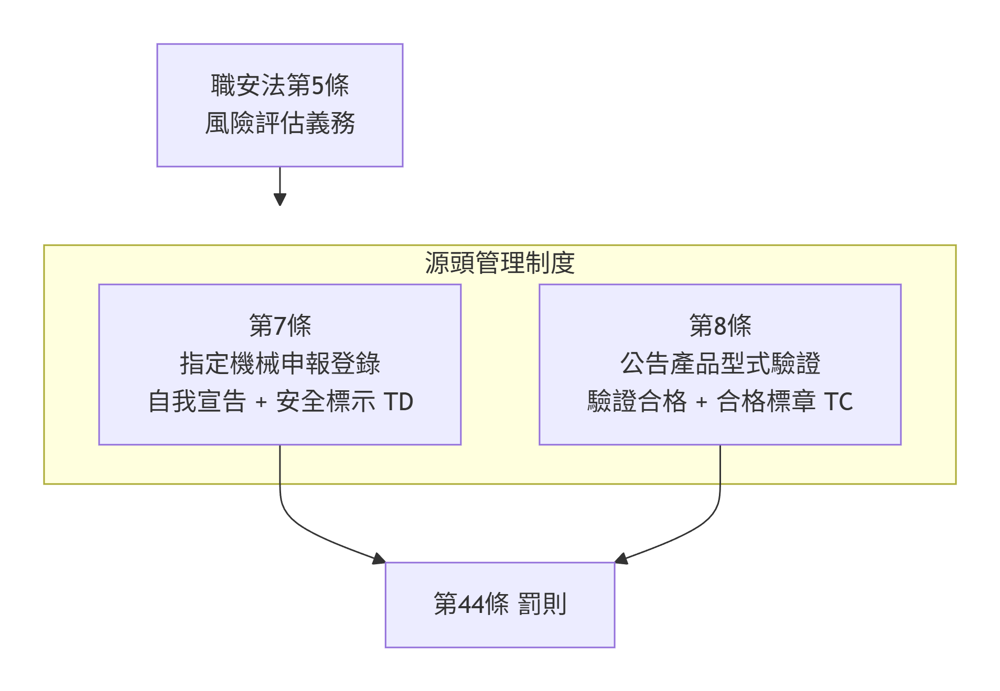
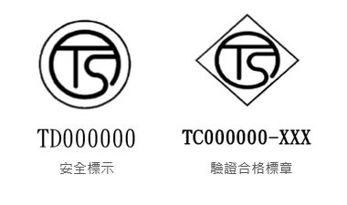
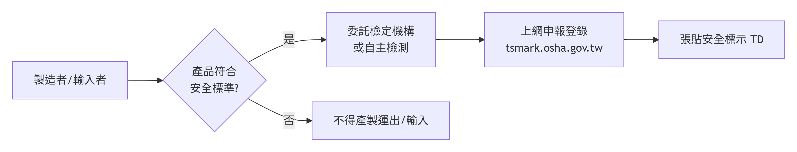
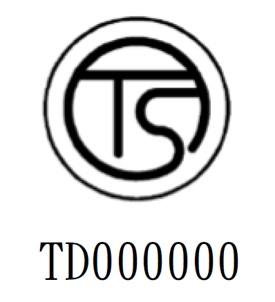
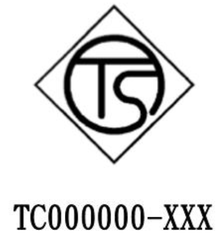
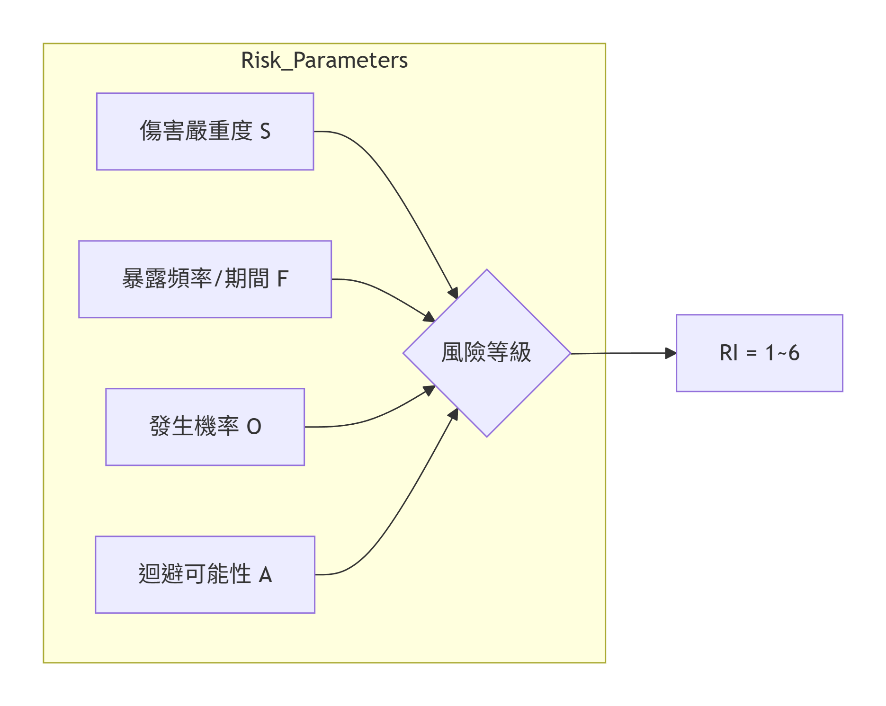
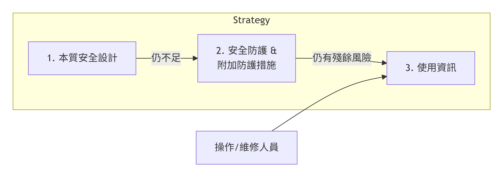
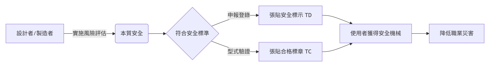

## 講師簡介

- 姓名：何明信

- 學歷：成大環醫所 、職安衛技師

- 經歷：檢查員30年 (製造、危機設、營造、化工職衛科、專委)

- 現職：114年退休

- E-mail：he.peter70\@gmail.com

# 機械設備器具安全與風險評估

## 課程目標

- 瞭解機械源頭管理法規架構 (職安法 §5, §7, §8, §9)

- 掌握機械安全風險評估方法 (ISO 12100)

- 學習實務防護案例與對策

> 本課程依據**"職業安全衛生法"**及**"機械設備器具安全標準"等**編製

## 單元一：機械源頭管理法規

### 為何需要源頭管理？

過去僅靠雇主「末端管理」，無法杜絕有缺陷機械流入市場

::: {.fragment .highlight-red}
國際公約核心原則：

- **無適當防護裝置之機械禁止流通**

- **勞工不應使用無安全裝置之機械**
:::

::: callout-note
國際勞工組織（ILO）第119號公約：機器防護公約（1963年）
:::

**職安法第5條第2項**：設計、製造、輸入者應於各階段實施風險評估

## 職業安全衛生法規架構

{.lightbox width="50%"}

## 第7條 – 指定機械申報登錄

> **製造者、輸入者、供應者或雇主**，對於中央主管機關**指定之機械、設備或器具**，其構造、性能及防護非符合安全標準者，不得產製運出廠場、輸入、租賃、供應或設置。

- 符合安全標準 → 應於**資訊申報網站登錄**，並於產品明顯處張貼**安全標示 (TD)**

- 但屬於公告列入型式驗證之產品，應依第8條及第9條辦理

**罰則**：違反第7條第1項 → **新臺幣20\~200萬元**

## 第8條 – 型式驗證

> 製造者或輸入者對於中央主管機關**公告列入型式驗證**之機械、設備或器具，非經認可之驗證機構實施**型式驗證**合格及張貼**合格標章**，不得產製運出廠場或輸入。

- 目前公告項目：**交流電焊機用自動電擊防止裝置** (自107年7月1日起適用)

**免驗證情形**（第8條第2項）：

1.  依其他法律實施檢查、檢驗、驗證

2.  國防軍事用途

3.  科技研發、測試專用機型

4.  商業樣品或展覽品

5.  其他特殊情形經核准

## 第9條 – 標章管理與市場查驗

- 未完成登錄申報或未取得型式驗證合格者，**不得使用安全標示、驗證合格標章**或易生混淆之類似標章

- **製造者、輸入者應建立及保存產銷資料**

- 中央主管機關或勞動檢查機構得進行**抽驗及市場查驗**，業者不得規避、妨礙或拒絕

{fig-align="center" width="68%"}

## 指定機械**申報**種類 (施行細則第12條)

| 項次 | 機械設備         | 項次 | 機械設備                       |
|:-----|:-----------------|:-----|:-------------------------------|
| 1    | 動力衝剪機械     | 7    | 防爆電氣設備                   |
| 2    | 手推刨床         | 8    | 光電式安全裝置                 |
| 3    | 木材加工用圓盤鋸 | 9    | 刃部接觸預防裝置               |
| 4    | 動力堆高機       | 10   | 反撥預防裝置及鋸齒接觸預防裝置 |
| 5    | 研磨機           | 11   | 其他經指定公告者               |
| 6    | 研磨輪           |      |                                |

## 申報登錄自我宣告流程

{.lightbox}

**佐證方式**：

1.  委託認可檢定機構實施**型式檢定合格**

2.  委託國內外認證產品驗證機構審驗合格

3.  製造者完成自主檢測及製程一致性查核

## 安全標示 與 合格標章

+----------------+-----------+----------------------------------------+---------------------------------------+----------------------+
| 制度           | 標示      | 格式                                   | 圖示                                  | 適用                 |
+================+===========+========================================+=======================================+======================+
| 申報登錄       | TD        | 圖式 + 識別號碼 (TD + 指定代碼)        | {width="30%"} | 指定機械             |
|                |           |                                        |                                       |                      |
| (**型式檢定**) |           |                                        |                                       |                      |
+----------------+-----------+----------------------------------------+---------------------------------------+----------------------+
| **型式驗證**   | TC        | 圖式 + 識別號碼 (TC + 代碼 + 機構代號) | {width="30%"} | 公告列入型式驗證產品 |
+----------------+-----------+----------------------------------------+---------------------------------------+----------------------+

> 標示應使用不易變質材料、牢固張貼於本體明顯處（銘版上或鄰近商標）

## 先行放行機制

輸入產品因尚未取得測試合格證明而被通關限制時，符合下列情形得申請先行放行：

1.  已向國內檢定機構、驗證機構申請檢測試驗，尚未取得合格證明

2.  其他特殊情形經核准

> 須向勞動部職安署申請「輸入先行放行通知書」，海關憑以放行，產品須限制貯存地點，俟檢驗合格及完成申報後始得進入市場

## 監督查核與違規處分

**廢止或撤銷登錄之情事**：

- 購樣、取樣檢驗結果不符合安全標準

- 因瑕疵造成重大傷害或危害

- 以詐欺或虛偽不實方法取得登錄 → **撤銷**

- 未依規定保存符合性聲明書及技術文件

> 經撤銷或廢止登錄者，原申報文件不得再供申報之用

## **安全標準** – 機械設備器具安全標準

- 依職安法第6條第3項、第7條第2項、第8條第5項訂定

- 構造、性能及防護不得低於本標準之規定

- 涵蓋：

  - 動力衝剪機械（安全護圍、安全裝置、離合器、制動裝置等）

  - 手推刨床

  - 木材加工用圓盤鋸

  - 動力堆高機

  - 研磨機、研磨輪

  - 防爆電氣設備

  - 標示規定

## 單元二：風險評估與風險降低

### 風險評估法源依據

> **職業安全衛生法第5條第2項** 機械、設備、器具之設計、製造或輸入者，應於設計、製造、輸入階段實施**風險評估**，致力防止此等物件於使用時發生職業災害。

**施行細則第8條**：風險評估指**辨識、分析及評量風險**之程序

## **ISO 12100** 核心流程

{.lightbox width="100%"}

## 第一步：決定機械限制

**使用限制**

- 預期用途、可合理預見的誤用

- 操作模式：試運行、生產、維修、故障排除

**空間限制**：操作與維護所需空間

**時間限制**：機械/零件壽命 (通常設計20年)

**環境限制**：溫度、濕度、粉塵、室內/室外

**人員限制**：操作者、維修人員、一般人力的能力與訓練

## 第二步：危害鑑別 – 10大危害類別 (ISO 12100)

+------------+---------------------------------+------------+--------------------------------+
| 項次       | 類別                            | 項次       | 類別                           |
+:===========+:================================+:===========+:===============================+
| 1          | **機械危害** (擠壓、剪切、捲入) | 6          | **輻射危害** (雷射、電弧)      |
+------------+---------------------------------+------------+--------------------------------+
| 2          | **電氣危害** (觸電、電弧)       | 7          | **材料/物質危害** (粉塵、氣體) |
+------------+---------------------------------+------------+--------------------------------+
| 3          | **熱危害** (燙傷、火焰)         | 8          | **人因工程危害** (姿勢、重複)  |
+------------+---------------------------------+------------+--------------------------------+
| 4          | **噪音危害** (聽力損失)         | 9          | **環境危害** (濕度、干擾)      |
+------------+---------------------------------+------------+--------------------------------+
| 5          | **振動危害** (骨骼病變)         | 10         | **組合危害** (高溫+費力)       |
+------------+---------------------------------+------------+--------------------------------+

## 機械危害常見情境

| 危害源         | 潛在後果               |
|:---------------|:-----------------------|
| 切削零件       | 切割、切斷             |
| 掉落物         | 擠壓、碰撞             |
| 移動元件       | 擠壓、剪切、捲入、摩擦 |
| 旋轉元件       | 纏繞、切斷             |
| 彈性元件、高壓 | 拋出、甩出             |
| 銳邊、粗糙表面 | 刺穿、摩擦             |

## 生命週期各階段均需考量

- 運輸、組裝、安裝、試運轉

- 設定、教導、程式編輯

- **操作** (正常、異常、微調、上/下料)

- 清潔、維護、故障排除

- 拆卸、停用、報廢

> 危害不僅發生在「操作」階段！

## 第三步：風險估計



## 風險估計參數

| 參數 | 等級               | 說明                           |
|:-----|:-------------------|:-------------------------------|
| S    | S1 輕微 / S2 嚴重  | 可復原 vs 不可復原(死亡、截肢) |
| F    | F1 偶爾 / F2 頻繁  | 暴露 \<15min/班 vs \>15min/班  |
| O    | O1低 / O2中 / O3高 | 技術成熟 vs 定期故障           |
| A    | A1可能 / A2不可能  | 能否迴避危害                   |

## 風險矩陣與風險指數

| 風險指數 (RI) | 風險等級  | 對策優先權          |
|:--------------|:----------|:--------------------|
| **1, 2**      | 🟢 低風險 | 最低                |
| **3, 4**      | 🟡 中風險 | 次要                |
| **5, 6**      | 🔴 高風險 | **最高 (必須降低)** |

> 採用保護措施後，最終風險指數應降至 **1 或 2**

## 第四步：風險降低的三步驟策略



**優先順序**：設計階段措施 \> 使用者階段措施

## 1. 本質安全設計措施

- **幾何因素**：消除銳邊、尖角；最小間隙避免擠壓 (ISO 13854)

- **物理因素**：限制致動力、速度、動能；降低噪音、振動、有害物質排放

- **機械應力**：超載保護、限壓閥、疲勞設計

- **材料**：抗腐蝕、老化、磨損

- **穩定性**：地腳螺栓、鎖定裝置、傾倒警報

- **氣壓/液壓**：限壓裝置、洩壓閥、降壓標示

## 2. 安全防護裝置種類

| 類型                | 特性             | 適用時機               |
|:--------------------|:-----------------|:-----------------------|
| **固定式護罩**      | 需工具才能打開   | 正常操作不需接近危險區 |
| **移動式聯鎖護罩**  | 打開即停止機械   | 頻繁接近危險區         |
| **可調式護罩**      | 適用不同工件尺寸 | 加工特性需調整         |
| **光電式安全裝置**  | 光柵、雷射掃描器 | 需自由進出加工區       |
| **雙手控制裝置**    | 強制雙手操作     | 防止手部介入           |
| **安全地毯/壓敏邊** | 感應人員踏入     | 區域防護               |

## 安全距離計算 (ISO 13855)

$S=K×(t1​+t2​)+C$\$

- **S**：安全距離 (mm)

- **K**：接近速度 (手部 2000 mm/s；身體 1600 mm/s)

- **t1**：防護裝置的反應時間

- **t2**：機械的反應時間 (停止效能)

- **C**：額外距離 (光束間距引起的穿透距離)

> 確保人員在機械停止前無法觸及危險區域

## 3. 使用資訊

- 安裝、操作、保養、維修說明書

- 危險對策說明

- 警告標示 (警報、標籤、象形圖)

- 教育訓練要求

> 即使採用了本質安全與防護措施，殘餘風險仍須透過使用資訊告知使用者

## 單元三：實務防護案例

### 案例1：油壓衝床 – 風險評估 (節錄)

+----------+----------------+----------+---------------------------------+----------+
| 危害區   | 危害來源       | 初始風險 | 保護措施                        | 殘餘風險 |
+:=========+:===============+:=========+:================================+:=========+
| 高處作業 | 墜落           | 4        | 加裝樓梯、護欄、警告標示        | 2        |
+----------+----------------+----------+---------------------------------+----------+
| 壓力元件 | 高壓噴出、破裂 | 5        | 限壓閥、洩壓閥                  | 2        |
+----------+----------------+----------+---------------------------------+----------+
| 電氣箱   | 觸電           | 4        | 符合IEC 60204-1、上鎖掛牌、IP2X | 2        |
+----------+----------------+----------+---------------------------------+----------+

> 初始風險指數5 (高風險) 經保護措施後降為2 (低風險)

## 案例2：工業用機器人

**危害辨識**：

- 機械危害：人員誤入加工區與機械臂碰撞

- 電氣危害：維修時觸及帶電元件

- 熱/輻射：焊接弧光、高溫表面

**對策**：

- 安全光柵 + 移動式聯鎖護罩，斷開操作動力

- 電氣箱斷電連鎖、上鎖/掛牌、IP2X

- 防護門、護目鏡、防護手套、警告標語

## 案例3：射出成型機

**危害辨識**：

- 機械危害：模具夾傷、銳邊割傷

- 熱危害：加熱器、料管高溫燙傷

- 物質危害：塑膠加熱產生有毒氣體/煙霧

**對策**：

- 安全聯鎖護罩、安全擋塊、防護手套

- 高溫隔熱護罩、警告標示

- 局部排氣裝置(抽風)、口罩、選用低毒原料

## 綜合對策 – 本質安全設計實例

| 危害   | 本質安全設計             | 防護措施         | 使用資訊     |
|:-------|:-------------------------|:-----------------|:-------------|
| 捲入點 | 消除外露旋轉軸           | 聯鎖護罩         | 警告標誌     |
| 過載   | 限壓閥、扭力限制器       | 緊急停止         | 操作手冊     |
| 墜落   | 穩固底座                 | 護欄、安全帶     | 維修程序     |
| 觸電   | 低電壓控制回路、雙重絕緣 | 漏電斷路器、接地 | 上鎖掛牌程序 |

## 結語

### 建立安全文化從源頭開始



> 「無適當防護裝置之機械禁止流通」—— 共同實現源頭管理願景

## 法規命令彙整

+--------------------------------------+--------------------------------+
| 法規名稱                             | 要點                           |
+:=====================================+:===============================+
| 職業安全衛生法 §5\~§9, §44           | 源頭管理制度法源               |
+--------------------------------------+--------------------------------+
| 職業安全衛生法施行細則 §12, §13      | 指定機械種類、型式驗證定義     |
+--------------------------------------+--------------------------------+
| 機械設備器具安全標準                 | 各機械構造、性能、防護最低要求 |
+--------------------------------------+--------------------------------+
| 機械設備器具安全資訊申報登錄辦法     | 申報登錄程序、技術文件內容     |
+--------------------------------------+--------------------------------+
| 機械類產品型式驗證實施及監督管理辦法 | 驗證申請、合格證明書、展延     |
+--------------------------------------+--------------------------------+
| 機械設備器具監督管理辦法             | 市場查驗、不合格品處理         |
+--------------------------------------+--------------------------------+

## 參考資料

1.  職業安全衛生法 (108年修正)

2.  職業安全衛生法施行細則 (109年)

3.  機械設備器具安全標準 (111年5月修正)

4.  機械設備器具安全資訊申報登錄辦法

5.  機械類產品型式驗證實施及監督管理辦法

6.  機械設備器具監督管理辦法

7.  ISO 12100:2010 機械安全 — 設計一般原則 — 風險評鑑與風險降低

8.  勞動部職業安全衛生署 機械設備器具安全資訊網

# 1. 機械設備器具安全標準

(民國111年5月11日修正)

## 法源依據

- 依 **職業安全衛生法第6條第3項、第7條第2項、第8條第5項** 訂定

- **第2條**：適用之機械、設備、器具：

  - 職安法施行細則第12條規定者

  - 中央主管機關依第8條第1項公告者

- **構造、性能及安全防護不得低於本標準之規定**

## 第一章 總則 (第1\~3條)

### 重要名詞定義 (第3條)

- **快速停止機構**：衝剪機械檢出危險或異常時，能自動停止滑塊、刀具或撞錘動作之機構

- **緊急停止裝置**：發生危險或異常時，以人為操作使滑塊等緊急停止

- **可動式接觸預防裝置**：手推刨床之覆蓋可隨加工材進給自動開閉之刃部接觸預防裝置

## 第二章 動力衝剪機械

### 第一節 安全護圍 (第4\~5條)

### 第4條

- 動力衝壓機械及剪斷機械應具有 **安全護圍、安全模、特定專用衝剪機械或自動衝剪機械**

- 無法設置安全護圍等 → 至少設有第6條所定安全裝置一種以上

### 第5條 – 安全護圍等性能要求

- **安全護圍**：手指無法通過或自外側觸及危險界限

- **安全模**：各構件間隙 ≤ 8 mm

- **特定專用衝剪機械**：身體不介入危險界限之構造

- **自動衝剪機械**：自動輸送、加工、排出成品

## 第二節 安全裝置 (第6\~15條)

### 安全裝置應具機能之一 (第6條)

1.  **連鎖防護式**：身體無法介入危險界限

2.  **雙手操作式**：

    - 安全一行程式：手離開操作部後至手到達危險前，滑塊停止

    - 雙手起動式：雙手操作，動作中手離開即無法達到危險界限

3.  **感應式**：光電、雷射等，身體接近即停止

4.  **拉開式或掃除式**：身體介入時強制脫離危險界限

## 安全距離公式 (第8條)

### 光電式安全裝置

D=1.6×(T1+Ts)+CD=1.6×(T1​+Ts​)+C

- DD：安全距離 (mm)

- T1​：手指遮斷光線至快速停止機構開始動作之時間 (ms)

- Ts：快速停止機構動作至滑塊停止之時間 (ms)

- CC：追加距離 (mm) – 依連續遮光幅查表

| 連續遮光幅 (mm) | 追加距離 C (mm) |
|:----------------|:----------------|
| ≤14             | 0               |
| \>14, ≤20       | 80              |
| \>20, ≤30       | 130             |
| \>35, ≤45       | 300             |
| \>45, ≤50       | 400             |

## 雙手操作式安全裝置規範 (第10條)

1.  雙手操作之左右手動作時間差 **超過0.5秒** → 滑塊無法動作

2.  兩按鈕外側距離 **≥300 mm** (有防護者得酌減)

3.  按鈕不得凸出按鈕盒表面或衝剪機械表面

4.  未離開一行程操作部時，無法再起動

## 感應式安全裝置 (第11\~12條)

### 光電式安全裝置要求 (第12條)

- 身體遮斷光線即檢出並停止滑塊

- 投光器及受光器須有 **有效防護高度**

- 光軸數 ≥2，連續遮光幅 ≤50 mm (具起動控制功能者 ≤30 mm)

- 剪斷機械之光軸高度與危險界限水平距離關係：\
  光軸高度 ≤ 水平距離 × 0.67 (但 ≤180 mm)

## 拉開式及掃除式安全裝置

### 拉開式 (第13條)

- 牽引帶切斷荷重 ≥150 kg

- 肘節傳送帶耐靜荷重 ≥50 kg

### 掃除式 (第14條及第14條之1)

- 防護板寬度 ≥ 金屬模寬度之1/2 (最小100 mm)

- 防護板高度 ≥ 行程長度 (最大300 mm)

- **限用確動式離合器且行程數 ≤120 spm**，不得使用腳踏式快速停止機構

## 安全裝置零配件要求 (第15條)

- 機械零件具充分強度

- 金屬零配件材料：CNS 3828 S45C 以上，硬度 HRC 45\~50

- 電氣回路電壓 ≤160 V

- 停電或電氣零件故障時，滑塊不致意外動作

- 切換開關須有明顯標示及保持位置之裝置

## 第三節 機構及裝置 (第16\~26條)

### 第16條 – 切換開關安全機能

任何切換狀態均應符合安全機能，包括：

- 行程切換開關 (連續/一行程/安全一行程/寸動)

- 操作切換開關 (雙手/單手/腳踏)

- 操作台數切換開關

- 安全裝置開關

### 第18條 – 一行程一停止機構

- 衝壓機械應具有一行程一停止機構

## 快速停止機構與緊急停止 (第19\~21條)

### 第19條 – 快速停止機構

- 衝壓機械應具快速停止機構 (但有例外：確動式離合器、不致使身體介入危險界限等)

- 快速停止機構作動後，未再起動操作無法使滑塊動作

### 第20條 – 緊急停止裝置

- 應備有緊急停止裝置，作動後未使滑塊返回起動狀態位置，無法再起動

- **操作部** (第21條)：紅色凸出型按鈕，設置於各操作區；台身兩側 \>1800 mm 者，正面及背面均應設置

## 寸動機構 (第22條)

衝壓機械應備有寸動機構，並應限制：

- 移動速度 ≤10 mm/s，或

- 每段移動行程 ≤6 mm，且未離開操作部無法再起動

## 防止滑塊意外下降 (第23條)

- 應具安全撞塊或固定滑塊裝置

- 使用安全撞塊時，滑塊無法動作之連鎖機構

- 摺床或小型衝床得使用安全插栓或安全鎖：

  - 安全插栓配置於每一操作區

  - 安全鎖能遮斷主電動機電源

## 第四節 機械系統 (第27\~44條)

### 離合器與制動裝置 (第27\~35條)

- 置有滑動銷或滾動鍵之離合器，行程數不得超過附表一 (例：壓力能力≤20噸 → 行程數≤150 spm)

- 摩擦式離合器之衝床應使用 **彈簧脫離式** 或同等安全功能

- 制動裝置避免油脂侵入 (濕式除外)

### 第38條 – 超限運轉監視裝置

- 曲軸轉速 ≤300 rpm 之衝床應設置

- 設定停止點之停止角度應 ≤25°

## 第五節 液壓系統 (第45\~49條)

- 液壓衝床：液壓泵起動後未進行起動操作，滑塊無法動作 (第45條)

- 快速停止機構作動後，慣性下降值不得超過附表四：

  - 液壓式摺床以外：壓力能力 ≤50噸 → 50 mm；\>300噸 → 150 mm

  - 液壓式摺床：≤100噸 → 20 mm；\>500噸 → 150 mm

- 應設安全撞塊支撐滑塊及上模重量 (第47條)

- 電磁閥應為常開型、彈簧回復型 (第48條)

- 防止液壓超壓之安全裝置 (第49條)

## 第三章 手推刨床 (第50\~58條)

### 刃部接觸預防裝置 (第50條)

- 覆蓋應遮蓋刨削工材以外部分

- **可動式接觸預防裝置**：覆蓋可隨加工材進給自動開閉

- 覆蓋下方與平台面間隙 ≤8 mm

## 制動裝置與動力遮斷 (第51\~53條)

- **第51條**：應設制動裝置，使刀軸在10秒內停止

- **第53條**：不離開作業位置即可操作之動力遮斷裝置

## 其他要求

- 刀軸旋轉部分應設覆蓋 (第55條)

- 刃部材料：刀片 CNS 2904 SKH2；刀身 CNS 2473 或 CNS 3828 (第56條)

- 刀軸應採圓形 (第58條)

## 第四章 木材加工用圓盤鋸 (第59\~70條)

### 安全裝置 (第60條)

應設置：

1.  **反撥預防裝置** (橫鋸用或因反撥不致引起危害者除外)

2.  **鋸齒接觸預防裝置** (製材用圓盤鋸及設有自動輸送裝置者除外)

## 反撥預防裝置 – 撑縫片 (第61、68條)

- 撑縫片與鋸齒前端間隙 ≤12 mm

- 厚度為圓鋸片厚度之 **1.1倍以上**

- 材料：CNS 2964 SK5 以上

- 安裝螺栓直徑依圓鋸片直徑不同 (附表八，例如鋸片直徑 ≤203mm → 螺栓直徑5mm)

## 反撥防止爪與鋸齒接觸預防裝置

- 反撥防止爪材料：CNS 2473 SS400 以上 (第69條)

- 鋸齒接觸預防裝置 (第70條)：

  - 可動式覆蓋應圍護鋸齒撑縫片部分與鋸切中部分以外區域

  - 攜帶式圓盤鋸之覆蓋應符合附圖一之尺寸

## 制動與動力遮斷 (第62\~64條)

- 應設制動裝置使圓鋸軸10秒內停止 (但攜帶式、自動輸送等除外)

- 動力遮斷裝置應於不離開作業位置即可操作

## 第五章 動力堆高機 (第71\~84條)

### 安定度要求

| 堆高機型式    | 對應條文         | 坡度要求範例 (配衡型)   |
|:--------------|:-----------------|:------------------------|
| 配衡型        | 第71條，附表九   | 靜止前後4%，運行前後18% |
| 側舉型        | 第72條，附表十   | 靜止左右6%              |
| 伸縮型/跨提型 | 第73條，附表十一 | 依負載狀態              |
| 窄道式        | 第74條，附表十二 | 靜止左右6\~8%           |

## 制動裝置 (第75條)

- 制止運行：依負荷狀態及初速度，停止距離 ≤5m (無負荷初速20km/h) / ≤2.5m (負荷初速10km/h)

- 保持停止：無負荷狀態坡度20% 仍可停止

## 頂蓬與後扶架 (第79\~80條)

- 頂蓬強度承受最大荷重2倍 (上限4公噸)

- 上框開口 ≤16 cm

- 座式操作：駕駛座上面至頂蓬下端 ≥95 cm

- 後扶架應設置 (但貨物掉落無危害者除外)

## 其他關鍵要求

- 方向指示器 (第76條)、警報裝置 (第77條)、前照燈/後照燈 (第78條)

- 液壓安全閥 (第81條)

- 貨叉應力 ≤ 鋼材降伏強度之 **1/3** (第82條)

- 鏈條安全係數 ≥5 (第83條)

- 座式駕駛座應配 **安全帶** 防止傾倒壓傷 (第84條)

## 第六章 研磨機、研磨輪 (第85\~109條)

### 研磨輪性能要求 (第85條)

- 最高使用周速度由 **破壞旋轉試驗** 決定

- 粗磨以外之機械研磨用：最高使用周速度 ≤ 破壞旋轉周速度 ÷ 1.8

- 其他研磨輪：≤ 破壞旋轉周速度 ÷ 2

- 普通速度使用時，不得超過附表十六所列限度

## 旋轉試驗與衝擊試驗 (第86\~87條)

- 直徑 ≥100mm 之研磨輪，每批應取10% (至少5個) 以 **1.5倍** 最高使用周速度試驗

- 定期破壞旋轉試驗 (至少每月一次)

- 盤形研磨輪應實施衝擊試驗 (98焦耳，兩處)

## 護罩規定 (第95\~104條)

### 材料與厚度

- 護罩材料：壓延鋼板 (抗拉強度 ≥28 kg/mm²，延伸 ≥14%)

- 厚度依研磨輪最高使用周速度、厚度、直徑查附表二十七～附表三十一

- 鑄鐵護罩厚度係數4倍、可鍛鑄鐵2倍、鑄鋼1.6倍 (附表二十八)

### 覆蓋範圍 (第97條，附圖六)

- 供研磨必要部分外，應覆蓋研磨輪周邊、兩側面

- 桌上用研磨機之護罩應設 **舌板**，調整間隙 ≤10mm (第104條)

## 其他要求

- 不離開作業位置即可操作之動力遮斷裝置 (第105條)

- 電氣絕緣與接地符合 CNS 3265 (第106條)

- 工作物支架間隙 ≤3 mm (第107條)

- 直徑 \<50mm 之研磨輪及其護罩不適用本章 (第109條)

## 第七章 防止爆炸及感電危害設備 (第110\~111條之1)

### 防爆電氣設備

- **氣體類防爆電氣設備** (第110條)：性能構造應符合 **CNS 3376系列** 或 **IEC 60079系列** (不一致時以IEC為準)

- **粉塵類防爆電氣設備** (第111條)：符合 CNS 3376、CNS 15591系列、IEC 60079、IEC 61241系列

## 交流電焊機用自動電擊防止裝置 (第111條之1)

- 構造及性能應符合 **CNS 4782**

## 第八章 標示 (第112\~119條)

### 衝壓機械安全裝置應標示 (第112條)

- 製造號碼、製造者名、製造年月

- 適用之機械種類、壓力能力、行程長度等

- **雙手操作式及光電式安全裝置**：

  - T1T1​ (手離開至快速停止開始時間) 或 TmTm​ (雙手起動式)

  - TsTs​ (停止時間)

  - 對應之安全距離

## 各機械標示事項

+----------------------+---------------------------------------------------------------------------+
| 機械                 | 應標示內容 (依據條文)                                                     |
+:=====================+:==========================================================================+
| 衝剪機械             | 第114條：製造號碼、年月、壓力能力、行程數、行程長度、模高、最大停止時間等 |
+----------------------+---------------------------------------------------------------------------+
| 手推刨床             | 第115條：製造者、年月、功率、電壓、無負荷轉速、有效刨削寬度               |
+----------------------+---------------------------------------------------------------------------+
| 圓盤鋸               | 第116條：同上，並標適用鋸片直徑、旋轉方向、撑縫片適用範圍                 |
+----------------------+---------------------------------------------------------------------------+
| 堆高機               | 第117條：製造者、年份、號碼、最大荷重、容許荷重                           |
+----------------------+---------------------------------------------------------------------------+
| 研磨機               | 第118條：製造者、年月、電壓、轉速、適用研磨輪尺寸、護罩之最高使用周速度   |
+----------------------+---------------------------------------------------------------------------+
| 研磨輪               | 第119條：製造者、結合劑種類、最高使用周速度、製造批號                     |
+----------------------+---------------------------------------------------------------------------+

## 第九章 附則 (第120\~121條)

### 特殊構造之同等安全認定 (第120條)

- 構造特殊致適用本標準有困難者 → 檢附產品安全評估報告及構造圖說，報請中央主管機關認定具有 **同等以上安全性能**

- 可委託學術機構或專業團體辦理

## 施行日期 (第121條)

- 本標準除第110、111條自100年7月1日施行外，自發布日施行

- 103年6月26日修正條文自103年7月3日施行

- 111年5月11日修正之 **第22條及第38條** 自發布後一年施行

## 重點彙整

### 機械類別安全關鍵字

+---------------+------------------------------------------------------------+
| 機械          | 關鍵安全要求                                               |
+:==============+:===========================================================+
| 動力衝剪機械  | 安全護圍、雙手操作、光電式安全裝置、安全距離計算、緊急停止 |
+---------------+------------------------------------------------------------+
| 手推刨床      | 可動式接觸預防裝置、制動裝置(10秒內停止)                   |
+---------------+------------------------------------------------------------+
| 圓盤鋸        | 反撥預防裝置(撑縫片)、鋸齒接觸預防裝置                     |
+---------------+------------------------------------------------------------+
| 堆高機        | 安定度(坡度)、制動距離、頂蓬強度、安全帶                   |
+---------------+------------------------------------------------------------+
| 研磨機/研磨輪 | 最高使用周速度、破壞旋轉試驗、護罩厚度及覆蓋               |
+---------------+------------------------------------------------------------+
| 防爆電氣設備  | 符合CNS/IEC 60079系列                                      |
+---------------+------------------------------------------------------------+

## 罰則呼應

- 依據職安法第7、8條：違反安全標準不得產製運出、輸入、租賃、供應或設置

- 未符合安全標準且未申報登錄或未通過型式驗證 → 處20\~200萬元罰鍰

## 常見問題與計算重點

### 安全距離計算 (第8條)

> 光電式安全裝置之安全距離 D=1.6×(T1+Ts)+CD=1.6×(T1​+Ts​)+C

**範例**：T1=20ms,Ts=50msT1​=20ms,Ts​=50ms，連續遮光幅=25mm → C=130mm\
D=1.6×(20+50)+130=1.6×70+130=112+130=242mmD=1.6×(20+50)+130=1.6×70+130=112+130=242mm

## 衝壓機械慣性下降值 (液壓)

- 摺床以外且壓力能力≤50噸 → 慣性下降值 ≤50mm

- 摺床壓力能力≤100噸 → ≤20mm

## 堆高機制動停止距離

- 無負荷初速20km/h → ≤5m

- 負荷初速10km/h → ≤2.5m

## 安全護圍間隙

- 安全模各構件間隙 ≤8mm

- 手推刨床覆蓋與平台面間隙 ≤8mm

## 結語

### 落實安全標準，從源頭防止災害

> 機械安全非僅靠使用者注意，而應由 **設計、製造、輸入者** 確保本質安全

- 遵守本標準最低要求

- 導入 ISO 12100 風險評估流程

- 透過申報登錄、型式驗證及市場監督，提升整體機械安全水準

# 2.機械設備器具安全三大管理辦法

## 法源依據

- **職業安全衛生法第7條、第8條、第9條**

- 為落實 **源頭管理** 及 **後市場監督** 而訂定

+--------------------------------------+--------------------------------------+
| 辦法名稱                             | 規範核心                             |
+:=====================================+:=====================================+
| 機械設備器具安全資訊申報登錄辦法     | 自我宣告、安全標示(TD)、技術文件保存 |
+--------------------------------------+--------------------------------------+
| 機械類產品型式驗證實施及監督管理辦法 | 強制驗證、合格標章(TC)、先行放行     |
+--------------------------------------+--------------------------------------+
| 機械設備器具監督管理辦法             | 產品監督、市場查驗、不合格品處理     |
+--------------------------------------+--------------------------------------+

## 第一部分：機械設備器具安全資訊申報登錄辦法

### 第1條～第3條 – 總則

**制定目的**：規範中央主管機關指定之機械、設備或器具之安全資訊申報登錄、安全標示及管理

**適用範圍**：

- 職安法第7條第1項指定之機械（施行細則第12條）

- 但已列入型式驗證公告者，依第8條辦理

**名詞定義**：

- **申報者**：製造者或輸入者

- **資訊網站**：中央主管機關指定之申報網站 ([tsmark.osha.gov.tw](https://tsmark.osha.gov.tw/))

- **安全標示**：完成登錄後張貼於產品之識別標示

## 第4條 – 免申報登錄情形

中央主管機關指定之產品有下列情形之一者，得免申報登錄：

1.  依其他法律有實施檢查、檢驗、驗證、認可或管理

2.  供國防軍事用途，並有國防部或其直屬機關證明

3.  限量製造或輸入僅供科技研發、測試用途之專用機型，經核准

4.  非供實際使用或作業用途之商業樣品或展覽品，經核准

5.  輸入供加工、組裝後輸出或原件再輸出，經核准

6.  其他特殊情形，經核准

## 第5條 – 符合安全標準之佐證方式

申報者宣告其產品符合安全標準，應以下列方式之一佐證：

```{mermaid}
flowchart LR
    A[佐證方式] --> B[型式檢定合格<br>（認可檢定機構）]
    A --> C[產品驗證機構審驗合格<br>（國內外認證組織認可）]
    A --> D[自主檢測 +<br>產品製程一致性查核]
    D --> E[檢測實驗室經認證<br>查核機構經認證]
```

**但書**：動力衝剪機械、木材加工用圓盤鋸、研磨機、防爆燈具、防爆電動機、防爆開關箱等六種產品，**僅限採型式檢定合格**。

## 第6條 – 自主檢測之特別規定

採自主檢測及產品製程一致性查核者，應符合：

- 自主檢測由**經認證之檢測實驗室**實施

- 產品製程一致性查核由**經認證之機構**實施

- 檢測人員資格符合法令規定

> **單品申報登錄者**：得免附產品製程符合一致性證明。

## 第7條 – 申報登錄應上傳之資料

申報者應上傳加蓋承辦者及負責人印章之資料（電子檔限不可編輯之圖檔或PDF）：

1.  **符合性聲明書**

2.  **設立登記文件**（工廠、公司或商業登記等）

3.  **測試證明文件**（型式檢定合格證明、審驗合格證明或自主檢測報告，效期3個月以上）

4.  **產品基本資料**（型式名稱說明書、安裝操作保養維修說明書、危險對策）

5.  **產品安全裝置及配備基本資料**（品名、規格、重要零組件驗證報告等）

6.  其他要求之技術文件

## 第8～12條 – 登錄與保存

- **第8條**：登錄內容有變更 → 30日內申請變更登錄

- **第9條**：申報者應確保產品符合聲明內容，內容異動應重新申報

- **第10條**：符合性聲明書及相關技術文件 → **保存至該產品停產後至少10年**

- **第11條**：登錄資訊得保密或限閱；可公開者以網路查詢下載或重製提供

- **第12條**：文件以中文為主；外文技術文件應有正體字中譯本（英文以外並附英譯本）

## 第13～14條 – 登錄完成與效期

- **第13條**：完成登錄 → 中央主管機關給予登錄字號及**登錄完成通知書**

  - 通知書內容：申報者資訊、產品基本資料、產製廠場資料、安全標準條款、登錄字號及日期、效期等

- **第14條**：登錄效期由中央主管機關依產品種類別定之，**3年以上7年以下**

  - 測試驗證證明文件效期屆滿 → 登錄失其效力

## 第15～17條 – 變更與重新登錄

- **第15條**：有下列情形之一，應**30日內重新申報登錄**：

  1.  安全標準修正，致原登錄不符規定

  2.  登錄之產品設計變更，致原申報資訊須更新

- **第16條**：效期屆滿前3個月內得申請展延

- **第17條**：同一申報者就同一型式產品不得重複申報（依第15條重新登錄者除外）

## 第18～20條 – 維持與抽查

- **第18條**：完成登錄之產品，實體不得與登錄事項相異

- **第19條**：中央主管機關必要時得要求備樣品，實施**複測、抽驗或赴生產廠場實地查核**

- **第20條**：申報登錄所附文件有保密必要者，得不公開

## 第21條 – 註銷登錄

有下列情形之一者，中央主管機關應註銷產品安全資訊登錄：

1.  自行申請註銷

2.  申報者設立登記文件經撤銷、廢止或註銷

3.  申報者之事業體經解散、歇業或撤回認許

4.  查核發現有其他不合規定之**重大情事**

> 註銷登錄者，其授權輸入放行通知書隨同喪失效力。

## 第22條 – 撤銷登錄

- 以**詐欺或虛偽不實方法**取得資訊登錄者 → 撤銷其登錄

- 有涉及刑責者 → 移送司法機關

## 第23條 – 廢止登錄

有下列情形之一者，中央主管機關應廢止產品安全資訊登錄：

1.  購樣、取樣檢驗結果不符合安全標準

2.  通知限期提供檢驗報告或樣品，屆期無正當理由未提供

3.  **因瑕疵造成重大傷害或危害**

4.  未符合標示規定，經通知限期改正未改正

5.  未依第10條保存符合性聲明書及技術文件

6.  未依第15條重新登錄

7.  產品型式違反第16或17條，經通知未改正

8.  產品品名或資料內容違反規定

9.  未維持產品實體與登錄相同，經通知未改正

10. 申報項目經公告廢止應實施申報登錄

11. 其他違反本辦法情節重大

> 經撤銷或因產品與申報資訊不符而廢止登錄者，原申報文件不得再供申報之用。

## 第二部分：機械類產品型式驗證實施及監督管理辦法

### 第1條～第3條 – 總則

**法源**：職安法第8條第5項、第9條第4項

**用詞定義** (第2條)：

- **機械類產品**：經中央主管機關公告應實施型式驗證者

- **產製**：生產、製造、加工或修改（包括組裝銷售、為銷售目的而修改）

- **驗證實施程序**：符合性評鑑程序（取樣、試驗、檢查、評估、登錄、認可等）

- **驗證機構**：經中央主管機關認可辦理型式驗證之機構

- **報驗義務人**：國內產製者、輸入者、委託產製/輸入之委託者、或銷售者（不明時）

## 第4條 – 型式驗證義務

> 依法應實施型式驗證之產品，未經驗證機構實施型式驗證合格，並取得型式驗證合格證明書及張貼合格標章者，**不得運出廠場或輸入**。

- 但依職安法第8條第4項申請核准先行放行者，不在此限

## 第5條 – 公告指定之產品

目前中央主管機關公告列入型式驗證之產品：

> **交流電焊機用自動電擊防止裝置**（自107年7月1日起適用）

## 第6條 – 申請型式驗證應檢附書件

報驗義務人應填具申請書並檢附：

1.  **符合性聲明書**

2.  **產品基本資料**：型式名稱說明書、同一型式理由說明書、主型式及系列型式清單、構造圖說（含安全裝置性能示意圖及安裝位置）、電氣/氣壓/液壓回路圖、性能說明書、安裝操作保養維修說明書及危險對策、安全裝置及安全配備清單（含品名、規格、重要零組件驗證報告等）

3.  **設立登記文件**影本

4.  **符合性評鑑證明文件**（或其他經同意替代之驗證證明）

> 文件為影本者應註明「與正本相符」並簽章；驗證機構得要求提供正本查對。

## 第7～8條 – 審查與補正

- 申請書件不符規定 → 驗證機構通知限期補正；屆期未補正 → 不予受理

- 驗證機構得要求提供電子檔

- 必要時得實施**工廠檢查** (第9條)

## 第10條 – 型式驗證實施程序

- 應依中央主管機關指定之型式驗證實施程序及標準辦理

- 驗證程序應包括 **產品設計及製造階段之符合性評鑑程序**，並依產品型式及製造技術能力分別為之

## 第11～12條 – 合格證明書

- **第11條**：審驗合格 → 發給附字號之**型式驗證合格證明書**，有效期間 **3年**

- **第12條**：有效期間屆滿前3個月內，得申請展延3年（但有第18、20條情形者除外）

  - 逾期申請展延 → 重新申請型式驗證

## 第13～16條 – 驗證機構之義務

- **第13條**：驗證合格後，驗證機構應每年至少實施一次 **不定期工廠檢查**；檢查發現不符，應命限期改正

- **第14條**：驗證機構應將型式驗證合格之資料登錄於中央主管機關指定之資訊網站

- **第15條**：驗證合格證明書遺失或毀損 → 申請補發或換發

- **第16條**：報驗義務人應確保產品符合型式驗證合格內容，實體不得與登錄事項相異

## 第17條 – 製程變更之報備

- 產品之製程或零組件變更，**不影響安全標準符合性且維持同一型式**者 → 報請驗證機構備查

- 涉及安全標準符合性之變更 → 應**申請換發**型式驗證合格證明書

## 第18條 – 標準修正時之換發

- 中央主管機關修正型式驗證實施標準時，型式驗證合格證明書名義人應於規定期限內依修正後標準申請**換發**

## 第19條 – 合格標章

- 製造者、輸入者、供應者或雇主，對於未經型式驗證合格或逾期者，**不得使用驗證合格標章**或易生混淆之標章

- 產品有其他標示者，不得與合格標章混淆

**合格標章格式**：

- 圖式由字軌 **TC** + 指定代碼 + 發證機構代號組成

- 顏色黑色 K0

- 應張貼於本體明顯處（銘版上或鄰近商標），使用不易變質材料、牢固標示

## 第20條 – 合格證明書之廢止

有下列情形之一者，中央主管機關得廢止型式驗證合格：

1.  經購樣或取樣檢驗結果不符合安全標準

2.  未依第13條第1項規定改正

3.  未依第17條或第18條辦理變更或換發

4.  產品與驗證合格內容不符

5.  其他違反本辦法情節重大

## 第21～23條 – 驗證機構之認可與管理

- **第21條**：中央主管機關得認可驗證機構辦理型式驗證；認可有效期間 **3年**，得申請展延

- **第22條**：驗證機構應具備之條件（人員、設備、管理系統等）

- **第23條**：驗證機構之認可得撤銷或廢止之事由

## 第24條 – 委辦與監督

- 中央主管機關得將型式驗證相關業務**委託**驗證機構辦理

- 驗證機構執行業務應受中央主管機關**監督**，並依要求提供資料

## 第25條 – 標示之禁止

- 未經型式驗證合格或型式驗證逾期者，不得使用驗證合格標章或易生混淆之類似標章揭示於產品

## 第26條 – 合格標章之管理

- 製造者或輸入者應依所定格式自行製作合格標章

- 合格標章之製作及張貼應牢固、清晰可辨且不易磨滅

## 第27條 – 規費

- 型式驗證之申請、換發、補發、展延、工廠檢查等，應繳納規費

- 規費收費標準由中央主管機關定之

## 第28條 – 施行日期

- 本辦法自發布日施行

## 第三部分：機械設備器具監督管理辦法

### 第1條～第2條 – 總則與用詞定義

**法源**：職安法第9條第4項

**用詞定義** (第2條)：

+----------------+------------------------------------------------------------------------------------------------------------------+
| 名詞           | 定義                                                                                                             |
+:===============+:=================================================================================================================+
| **產品監督**   | 對應申報登錄或型式驗證之產品，於生產廠場或倉儲場所，執行取樣檢驗、查核產銷紀錄完整性及製造階段產品安全規格一致性 |
+----------------+------------------------------------------------------------------------------------------------------------------+
| **市場查驗**   | 對應申報登錄或型式驗證之產品，於經銷、生產、倉儲、勞動、營業場所或其他場所，執行產品檢驗或調查                   |
+----------------+------------------------------------------------------------------------------------------------------------------+

## 第3條 – 受查驗者之義務

- 製造者、輸入者、供應者及經銷、生產、倉儲、勞動、營業場所之負責人（受查驗者），接受查驗、調查、檢驗或封存時，**非有正當理由，不得規避、妨礙或拒絕**

## 第4條 – 執行機關

- 中央主管機關、勞動檢查機構及型式驗證機構，得依業務需要執行產品之購樣、取樣檢驗或調查

- 中央主管機關得委託**專業團體**辦理市場查驗業務（職安法第52條）

## 第5條 – 型式驗證機構之年度執行計畫

- 型式驗證機構每年度應依據發證產品之**風險等級**，訂定執行計畫

- 執行計畫包括：

  - 工廠製程與產銷紀錄之查核

  - 取樣檢驗

- 風險等級得依違規紀錄、事故發生率、購樣或取樣檢驗不合格紀錄、工廠品保模式、產地等風險因素區分

## 第6條 – 產品監督之執行方式

型式驗證機構應指派適當專業人員於產品之**生產廠場或倉儲場所**執行：

1.  **產品實體監督**：取樣檢驗、查核產銷資料

2.  **製程監督**：檢查原物料、零組件管理、半成品及成品檢測，確保量產品與原型式驗證合格品安全規格一致

> 製程監督之地點以生產廠場為限。

## 第7～10條 – 監督紀錄與結果處理

- **第7條**：型式驗證機構應製作產品監督紀錄，妥存備查

- **第8條**：監督結果不符安全標準 → 依第20條至第25條處理

- **第9條**：監督執行人員應出示識別證

- **第10條**：受監督者應指派人員在場陪同

## 第11條 – 產銷資料之建立與保存

- 製造者或輸入者對於完成申報登錄或取得型式驗證合格之產品，應建立**產銷資料**：

  - 產製日期、型式、規格、數量

  - 出廠日期、銷售對象

  - 客戶抱怨處理紀錄、客戶服務紀錄

- 保存相關技術文件，供中央主管機關或勞動檢查機構**不定期查核**

## 第12條 – 市場查驗啟動事由

中央主管機關或勞動檢查機構得因下列事由辦理市場查驗：

1.  檢舉人、工作者或勞工團體反映

2.  產品發生**災害事故**，致有損害工作者生命、身體、健康或財產之虞

3.  依據其他資訊來源認有查驗之必要

## 第13條 – 市場查驗項目

市場查驗項目包括：

1.  產品是否符合第7條第1項及第3項（指定機械符合安全標準及張貼安全標示）

2.  產品是否符合第8條第1項（型式驗證合格）

3.  安全標示或驗證合格標章之樣式及張貼方式是否與法令相符

4.  違規產品經通知限期**改正**，是否如期改正

5.  違規產品經通知限期**回收**，是否如期回收

6.  產品登錄或型式驗證合格經註銷、廢止或撤銷者，是否有違法產製運出、輸入、租賃、供應或設置

## 第14條 – 查驗程序

- 查驗人員應出示識別證，說明查驗依據及目的

- 受查驗者或其指派人員應在場陪同

- 查驗後作成查驗紀錄，由受查驗者簽名或蓋章

## 第15條 – 違規產品之調查

發現疑有違規產品，調查方式如下：

1.  向受查驗者或相關業者查詢，要求提供佐證資料

2.  於所列場所進行調查，並得**取樣檢驗**，或要求提供同型式產品送驗

3.  必要時得**封存**疑有違規產品，並由受查驗者具結保管或運存指定處所

## 第16～18條 – 調查程序與協助

- **第16條**：調查時作成訪談紀錄，並將受查驗者陳述意見列入紀錄

- **第17條**：遇有規避、妨礙或拒絕，得請求**警察機關**派員協助

- **第18條**：調查取樣之樣品，得向受查驗者價購或要求無償提供

## 第19條 – 配合義務

- 受查驗者對調查應配合提供產品相關資料、文件或樣品，不得拒絕

## 第20條 – 不合格品通報與訪談

- 對於檢驗不符合安全標準之產品，應列入**追蹤處理**，向製造者、輸入者或供應者進行調查及製作訪談紀錄

- 認定有不安全情形者，應製作**不安全產品通知文件**，載明法令依據、產品名稱、型號、製造（輸入）日期及廠商等事項，並附佐證照片

## 第21～22條 – 改正與回收

- **第21條**：檢驗不合格但可改正 → 通知限期改正；改正後須再經檢驗合格

- **第22條**：檢驗不合格且已流通者 → 通知限期回收；回收方式應報中央主管機關核定

## 第23條 – 不能改正之處理

報驗義務人對於檢驗不合格之產品，**不能改正使其符合安全標準者**，應於接獲不合格通知書後**6個月內**，辦理：

- 退運

- 銷毀

- 拆解致不堪使用

- 其他必要處置

> 處置時應申請拆封或核准自行拆封，並由主管機關或驗證機構派員監督。

## 第24條 – 測試樣品之處理

- 報驗義務人應於接獲不合格通知書後 **3個月內** 領回測試樣品

- 逾期未領回 → 主管機關或驗證機構得予銷毀、拆解致不堪用或必要處置，費用由報驗義務人負擔

## 第25條 – 退運及銷燬程序

報驗義務人辦理退運或銷燬時：

+-------------+-----------------------------------------------------------------+
| 處理方式    | 程序                                                            |
+:============+:================================================================+
| **退運**    | 退運後3個月內檢附復運出口報單副本等文件，向中央主管機關申請銷案 |
+-------------+-----------------------------------------------------------------+
| **銷燬**    | 檢附銷燬計畫向中央主管機關提出申請，完成銷燬程序後辦理銷案      |
+-------------+-----------------------------------------------------------------+

## 第26條 – 施行日期

- 本辦法自發布日施行

## 綜合比較與重點提醒

### 三種辦法之關聯圖

```{mermaid}
flowchart LR
    subgraph 申報登錄辦法
        A[製造/輸入者<br>自我宣告] --> B[上網登錄]
        B --> C[張貼安全標示 TD]
    end
    subgraph 型式驗證辦法
        D[公告產品] --> E[驗證機構審驗]
        E --> F[取得合格證明書]
        F --> G[張貼合格標章 TC]
    end
    subgraph 監督管理辦法
        H[產品監督<br>（廠場/倉儲）] --> I[市場查驗<br>（經銷/使用場所）]
        I --> J[不合格品處理<br>改正/回收/退運/銷燬]
    end
    C --> H
    G --> H
```

## 比較表：申報登錄 vs 型式驗證

+---------------+--------------------------+--------------------------------------------------------------+
| 項目          | 申報登錄 (自我宣告)      | 型式驗證 (強制)                                              |
+:==============+:=========================+:=============================================================+
| 法源          | 職安法 §7                | 職安法 §8                                                    |
+---------------+--------------------------+--------------------------------------------------------------+
| 適用對象      | 施行細則第12條指定機械   | 中央主管機關公告之產品（目前僅交流電焊機用自動電擊防止裝置） |
+---------------+--------------------------+--------------------------------------------------------------+
| 方式          | 上網登錄佐證資料         | 驗證機構實施審驗                                             |
+---------------+--------------------------+--------------------------------------------------------------+
| 標示          | **安全標示 (TD)**        | **合格標章 (TC)**                                            |
+---------------+--------------------------+--------------------------------------------------------------+
| 效期          | 3\~7年                   | 3年（得展延）                                                |
+---------------+--------------------------+--------------------------------------------------------------+
| 免除機制      | 免申報登錄（第4條）      | 免驗證（職安法 §8Ⅱ）                                         |
+---------------+--------------------------+--------------------------------------------------------------+
| 先行放行      | 有（輸入先行放行通知書） | 有（依機械類產品申請先行放行辦法）                           |
+---------------+--------------------------+--------------------------------------------------------------+

## 監督管理機制總覽

+---------------+--------------------------------+--------------------------------+
| 階段          | 監督方式                       | 法源依據                       |
+:==============+:===============================+:===============================+
| 生產廠場      | 產品監督：製程查核、取樣檢驗   | 監督辦法 §5\~§10               |
+---------------+--------------------------------+--------------------------------+
| 市場流通      | 市場查驗：購樣、調查、封存     | 監督辦法 §12\~§18              |
+---------------+--------------------------------+--------------------------------+
| 不合格處置    | 改正、回收、退運、銷燬         | 監督辦法 §20\~§25              |
+---------------+--------------------------------+--------------------------------+
| 產銷資料      | 建立並保存至少10年（技術文件） | 申報登錄辦法 §10；監督辦法 §11 |
+---------------+--------------------------------+--------------------------------+

## 罰則提醒

- **未申報登錄** 或 **未張貼安全標示**：職安法第44條 → 新臺幣**3\~30萬元**

- **未符合安全標準** 而產製運出、輸入、租賃、供應：職安法第44條 → 新臺幣**20\~200萬元**

- **未經型式驗證合格** 而產製運出、輸入：職安法第44條 → 新臺幣**20\~200萬元**

- **規避、妨礙或拒絕** 查驗、調查：監督辦法第3條 → 依職安法相關罰則

## 執行要點與注意事項

1.  **單品申報**：免附產品製程符合一致性證明

2.  **外文文件**：技術文件須有正體字中譯本（英文以外附英譯本）

3.  **補正期限**：補正總日數不得超過60日

4.  **登錄失其效力**：所附測試驗證證明文件效期屆滿

5.  **先行放行之限制**：合格標章未張貼或未取得合格證明前，不得運出設置/儲存地點，不得啟用或移轉第三人

6.  **工廠檢查**：型式驗證合格後，驗證機構每年至少實施一次不定期工廠檢查

7.  **不安全產品通報**：應製作正式通知文件並附佐證照片

## 結語

### 落實三辦法，建構完整安全鏈

- **申報登錄辦法** → 確保指定機械上市前具備基本安全資訊

- **型式驗證辦法** → 確保高風險產品通過第三方驗證

- **監督管理辦法** → 確保上市後產品持續符合安全標準，並有效處置不合格品

> 製造者、輸入者、供應者、雇主應共同遵循，達成「無適當防護裝置之機械禁止流通」的終極目標。

## Q&A

**勞動部職業安全衛生署**\
機械設備器具安全資訊網\
[https://tsmark.osha.gov.tw](https://tsmark.osha.gov.tw/)

# 總複習

# 機械設備器具安全管理總覽

## 核心理念

> **「無適當防護裝置之機械禁止流通」**\
> **「勞工不應使用無安全裝置之機械」**

**從「末端管理」走向「源頭管理」**

- 過去：僅以雇主為責任主體（勞動契約存續中）

- 現在：製造者、輸入者、供應者共同承擔責任

## 一、法源依據（母法）

### 職業安全衛生法關鍵條文

+---------------+------------------------------------------------------------+---------------+
| 條文          | 核心內容                                                   | 管理階段      |
+:==============+:===========================================================+:==============+
| **§5Ⅱ**       | 設計、製造、輸入者應實施**風險評估**                       | 源頭          |
+---------------+------------------------------------------------------------+---------------+
| **§7**        | 指定機械須符合安全標準，**申報登錄**，張貼**安全標示(TD)** | 上市前        |
+---------------+------------------------------------------------------------+---------------+
| **§8**        | 公告產品須經**型式驗證**合格，張貼**合格標章(TC)**         | 上市前        |
+---------------+------------------------------------------------------------+---------------+
| **§9**        | 禁止使用未完成登錄/驗證之標章；**市場查驗**、抽驗          | 上市後        |
+---------------+------------------------------------------------------------+---------------+
| **§44**       | 罰則：違反§7Ⅰ或§8Ⅰ → 20\~200萬；違反§7Ⅲ → 3\~30萬          | 罰則          |
+---------------+------------------------------------------------------------+---------------+

> 施行細則第12條指定機械：動力衝剪機械、手推刨床、圓盤鋸、堆高機、研磨機、防爆電氣設備等

## 二、安全標準（符合性基準）

### 機械設備器具安全標準

- 依職安法第6條第3項、第7條第2項、第8條第5項訂定

- 規範構造、性能及安全防護之**最低要求**

| 章節 | 規範對象         | 關鍵要求                               |
|:-----|:-----------------|:---------------------------------------|
| 2    | 動力衝剪機械     | 安全護圍、安全裝置、緊急停止、安全距離 |
| 3    | 手推刨床         | 可動式接觸預防裝置、制動裝置           |
| 4    | 木材加工用圓盤鋸 | 反撥預防裝置、鋸齒接觸預防裝置         |
| 5    | 動力堆高機       | 安定度、制動距離、頂蓬、安全帶         |
| 6    | 研磨機、研磨輪   | 最高使用周速度、護罩、旋轉試驗         |
| 7    | 防爆電氣設備     | CNS/IEC 60079系列                      |
| 8    | 標示             | 各機械應標示事項                       |

## 三、實施路徑（雙軌制）

### 路徑一：申報登錄（自我宣告）

```{mermaid}
flowchart LR
    A[指定機械] --> B{符合安全標準?}
    B -- 是 --> C[佐證方式：<br>1.型式檢定<br>2.驗證機構審驗<br>3.自主檢測+製程查核]
    C --> D[上網申報登錄<br>tsmark.osha.gov.tw]
    D --> E[取得登錄字號<br>張貼安全標示 TD]
    B -- 否 --> F[不得產製運出/輸入]
```

- **法源**：職安法 §7

- **適用對象**：施行細則第12條指定機械（但公告型式驗證者除外）

- **效期**：3\~7年

- **免申報登錄**：國防、研發、樣品、加工再輸出等6種情形

## 路徑二：型式驗證（強制驗證）

```{mermaid}
flowchart LR
    A[公告產品] --> B[向驗證機構申請]
    B --> C[審驗合格]
    C --> D[取得型式驗證合格證明書<br>張貼合格標章 TC]
    D --> E[每年不定期工廠檢查]
```

- **法源**：職安法 §8

- **目前公告產品**：交流電焊機用自動電擊防止裝置（107.7.1起）

- **效期**：3年，得展延3年

- **免驗證**：國防、研發、樣品等5種情形

- **先行放行**：未取得合格證明前，可申請先行放行，於設置地點驗證

## 雙軌制比較

| 項目       | 申報登錄（自我宣告）       | 型式驗證（強制）       |
|:-----------|:---------------------------|:-----------------------|
| 法源       | §7                         | §8                     |
| 適用範圍   | 指定機械（細則12）         | 公告產品（目前1項）    |
| 符合性確認 | 製造者/輸入者自我宣告+佐證 | 第三方驗證機構審驗     |
| 標示       | **安全標示 (TD)**          | **合格標章 (TC)**      |
| 效期       | 3\~7年                     | 3年（得展延）          |
| 後續監督   | 不定期抽驗、市場查驗       | 每年工廠檢查、市場查驗 |

## 四、監督與後市場管理

### 監督管理辦法三大機制

```{mermaid}
flowchart TB
    subgraph 產品監督
        A1[生產廠場/倉儲] --> A2[取樣檢驗<br>製程一致性查核]
    end
    subgraph 市場查驗
        B1[經銷/勞動/營業場所] --> B2[購樣檢驗<br>標示檢查<br>改正/回收追蹤]
    end
    subgraph 不合格品處理
        C1[檢驗不合格] --> C2[可改正→限期改正]
        C1 --> C3[不能改正→6個月內<br>退運/銷燬/拆解]
    end
    A2 --> C1
    B2 --> C1
```

## 產銷資料保存義務

- 申報登錄或型式驗證合格之產品，製造者/輸入者應建立：

  - 產製日期、型式、規格、數量

  - 出廠日期、銷售對象

  - 客戶抱怨處理紀錄、服務紀錄

- **技術文件保存期限**：停產後至少10年

## 五、風險評估：貫穿全程的基石

### 職安法第5條第2項

> 設計、製造、輸入者應於設計、製造、輸入階段實施**風險評估**，致力防止使用時發生職業災害。

- **施行細則第8條**：風險評估 = 辨識、分析、評量風險之程序

## ISO 12100 風險評估流程

```{mermaid}
flowchart LR
    A[決定機械限制] --> B[危害鑑別]
    B --> C[風險估計]
    C --> D[風險評量]
    D --> E{風險已降低?}
    E -- 否 --> F[保護措施]
    F --> B
    E -- 是 --> G[完成]
```

> 風險降低三步驟：本質安全設計 → 安全防護 → 使用資訊

## 六、整體邏輯架構圖

```{mermaid}
flowchart TB
    subgraph 法源
        A[職安法 §5] --> B[§7 指定機械]
        A --> C[§8 公告產品]
    end
    subgraph 安全基準
        D[機械設備器具安全標準]
    end
    subgraph 實施路徑
        B --> E[申報登錄辦法<br>自我宣告+TD標示]
        C --> F[型式驗證辦法<br>強制驗證+TC標章]
    end
    subgraph 監督管理
        G[監督管理辦法<br>產品監督/市場查驗]
    end
    E --> G
    F --> G
    D --> E
    D --> F
    A -.->|源頭風險評估| D
```

## 角色與責任總結

+--------------------------+------------------------------------------------------------------------+--------------+
| 角色                     | 核心責任                                                               | 法源         |
+:=========================+:=======================================================================+:=============+
| **設計者/製造者/輸入者** | 實施風險評估、符合安全標準、申報登錄或型式驗證、張貼標章、建立產銷資料 | §5、§7、§8   |
+--------------------------+------------------------------------------------------------------------+--------------+
| **供應者**               | 不得供應未符合安全標準或未完成登錄/驗證之產品                          | §7、§8       |
+--------------------------+------------------------------------------------------------------------+--------------+
| **雇主**                 | 不得設置未符合安全標準之機械；使用已登錄/驗證合格之產品                | §7、§8       |
+--------------------------+------------------------------------------------------------------------+--------------+
| **驗證機構**             | 辦理型式驗證、每年工廠檢查                                             | §8           |
+--------------------------+------------------------------------------------------------------------+--------------+
| **勞動檢查機構**         | 市場查驗、抽驗、監督不合格品處置                                       | §9           |
+--------------------------+------------------------------------------------------------------------+--------------+

## 罰則一覽

+--------------------------------------------------------------+-------------------------+
| 違法行為                                                     | 罰則（新臺幣）          |
+:=============================================================+:========================+
| 未符合安全標準而產製運出、輸入、租賃、供應、設置（§7Ⅰ、§8Ⅰ） | **20萬 \~ 200萬元**     |
+--------------------------------------------------------------+-------------------------+
| 未申報登錄或未張貼安全標示（§7Ⅲ）                            | **3萬 \~ 30萬元**       |
+--------------------------------------------------------------+-------------------------+
| 未經型式驗證合格而使用合格標章（§9）                         | 依§44                   |
+--------------------------------------------------------------+-------------------------+
| 規避、妨礙或拒絕市場查驗                                     | 依職安法相關罰則        |
+--------------------------------------------------------------+-------------------------+

## 結語

### 建立完整的安全鏈

```{mermaid}
flowchart LR
    A[風險評估<br>§5] --> B[符合安全標準]
    B --> C{屬指定機械?}
    C -- 是 --> D[申報登錄+TD]
    C -- 公告產品 --> E[型式驗證+TC]
    D & E --> F[上市流通]
    F --> G[監督管理<br>市場查驗]
    G --> H[確保使用安全]
    H --> I[降低職業災害]
```

> **從設計、製造、輸入到使用，層層把關；源頭管理與後市場監督並重。**

**「無適當防護裝置之機械禁止流通」—— 共同守護工作者安全**

# 參考法規與辦法

1.  職業安全衛生法（§5、§7、§8、§9、§44）

2.  職業安全衛生法施行細則（§8、§12、§13）

3.  機械設備器具安全標準

4.  機械設備器具安全資訊申報登錄辦法

5.  機械類產品型式驗證實施及監督管理辦法

6.  機械設備器具監督管理辦法

7.  安全標示與驗證合格標章使用及管理辦法

8.  機械類產品申請先行放行辦法、申請免驗證辦法
