## 講師簡介

- 姓名：何明信

- 學歷：成大環醫所 、職安衛技師

- 經歷：檢查員30年 (製造、危機設、營造、化工職衛科、專委)

- 現職：114年退休

- E-mail：msho7336959\@gmail.com

# 1. 教材內容介紹

## 課程目標

- [理解]{style="color:#b31b1b;"} 營造工程風險特性與相關法規要求

- [掌握]{style="color:#b31b1b;"} 施工風險評估的完整流程（危害辨識、分析、評量、處理）

- [學會]{style="color:#b31b1b;"} 運用風險評估工具（風險矩陣、評估表單）於實務

- [區分]{style="color:#b31b1b;"} 設計階段、施工規劃階段、作業前的風險評估重點

- [建立]{style="color:#b31b1b;"} 風險資訊傳遞與追蹤管制的正確觀念

- [增加]{style="color:#b31b1b;"} 營造風險評估廣度（國際化）

::: callout-note
期待課後能協助公司建立施工風險評估制度，持續更人專業成長，並指導同仁執行。
:::

------------------------------------------------------------------------

## 營造工程風險特性

| 特性             | 說明                                   |
|:-----------------|:---------------------------------------|
| **工程多元**     | 每件工程皆為客製化，作業內容不一       |
| **環境多變**     | 戶外作業，受天候、地質、鄰房影響大     |
| **動態性高**     | 危害隨工程進度而改變（基礎→結構→裝修） |
| **人員流動**     | 協力廠商眾多，專業素質不一，流動率高   |
| **高風險作業多** | 開挖、支撐、施工架、鋼構吊裝、拆除等   |

> 台灣營造業職災發生率及嚴重度均遠高於其他行業，須透過系統性風險評估來預防。

------------------------------------------------------------------------

## 相關法規依據

- **職業安全衛生法 第5條第2項**：工程設計或施工者應於設計或施工規劃階段實施風險評估。
- **職業安全衛生法施行細則 第8條**：風險評估定義（辨識、分析、評量）。
- **營造安全衛生設施標準 第3條**：安全衛生設施於施工規劃階段納入考量，列入施工計畫。
- **營造安全衛生設施標準 第6條**：作業前應實施危害調查、評估。
- **職業安全衛生管理辦法 第12條之3**：變更管理（修改製程、作業程序前應評估風險）。
- **政府採購法 第70條之1**：機關應分析潛在施工危險，編製安全衛生圖說及經費。

::: callout-caution
違反上述規定，除可能發生職災外，亦將面臨行政處罰。
:::

------------------------------------------------------------------------

## 風險管理程序 (ISO 31000)

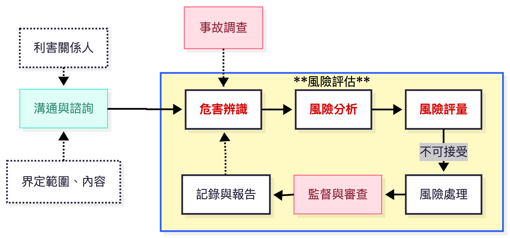

- **範圍**：工程全生命週期（規劃、設計、施工、使用、拆除）

- **準則**：法令、指引、實務規範、工程經驗

------------------------------------------------------------------------

## 關鍵名詞定義

- **危害 (Hazard)**：可能造成人員傷亡或健康損害的**根源**（如：開口、感電）。

- **風險 (Risk)**：危害發生的**可能性** × 後果的**嚴重度**。

- **風險評估 (Risk Assessment)**：包括辨識、分析、評量風險的程序。

- **風險處理 (Risk Treatment)**：對不可接受風險擬定對策，並執行追蹤。

::: callout-tip
**風險 = 可能性 × 嚴重度**\
風險評估的核心就是計算這個值，並決定是否要進一步控制。
:::

## 施工風險評估的類型

根據指引，營造工程全生命週期需辦理以下評估：

| 階段             | 評估類型                   | 主辦者                 |
|:-----------------|:---------------------------|:-----------------------|
| **規劃設計階段** | 設計階段施工風險評估       | 設計單位 (建築師/技師) |
| **施工前**       | 施工規劃階段施工風險評估   | 施工者 (營造廠)        |
| **每日作業前**   | 作業前危害調查、評估       | 工地主任/安衛人員      |
| **變更時**       | 工程變更施工風險評估       | 設計者或施工者         |
| **使用階段**     | 維護/修繕/拆除作業風險評估 | 使用者或施工者         |

------------------------------------------------------------------------

## 設計階段風險評估小組

- 召集人/工程設計負責人

  - 專案主辦人員

  - 職業安全衛生人員

  - 工址調查人員

  - 各專業設計工程師/結構、土木、機電等

  - 施工規劃人員

  - 預算/規範編製人員

  - 繪圖人員

::: callout-tip
職業安全衛生人員須具備職安衛風險評估專業知識，引導小組進行法令遵循與程序控管。
:::

------------------------------------------------------------------------

## 作業拆解 (Work Breakdown Structure, WBS)

**目的**：將複雜工程分解為可管理的作業單元，以便模擬風險。

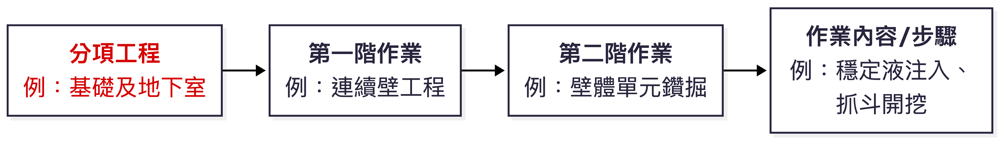

**編碼範例**：B（分項） - b（第一階） - ⅱ（第二階） - 03（作業步驟） = `Bbⅱ03`

## 作業拆解案例：連續壁工程

| 分項工程           | 第一階作業 | 第二階作業       | 作業內容 (部分)         |
|:-------------------|:-----------|:-----------------|:------------------------|
| **B.基礎及地下室** | a.準備作業 | i.機具設備進場   | 01.平板車載運連續壁鑽機 |
|                    | c.連續壁   | i.施工場地整備   | 02.泥漿池、土碴坑施築   |
|                    |            | ii.導溝施築      | 01.挖溝機開挖           |
|                    |            | iii.壁體單元施工 | 01.抓斗開挖、穩定液循環 |
|                    |            |                  | 02.鋼筋籠吊放           |
|                    |            |                  | 03.特密管澆置混凝土     |

> 拆解越細，越能發現潛在可能危害。

------------------------------------------------------------------------

## 危害辨識方法 - 5M1E 魚骨圖

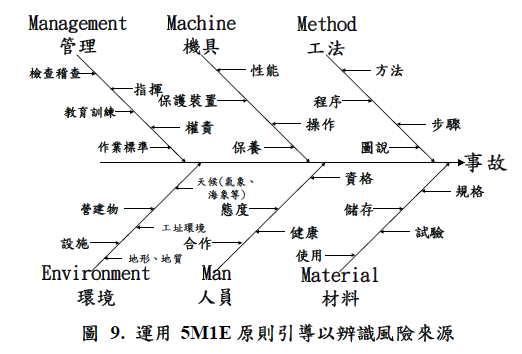

> 透過小組討論，逐一列出可能導致事故的根源(危害？)。

------------------------------------------------------------------------

## 危害/風險情境描述 - 5W1H

| 項目                | 說明     | 範例                                     |
|:--------------------|:---------|:-----------------------------------------|
| **What** (什麼危害) | 風險來源 | 吊掛鋼筋籠 - 危害?                       |
| **Why** (為何發生)  | 起因     | 吊耳焊接不實、鋼索斷裂                   |
| **When** (何時)     | 時間     | 鋼筋籠吊起瞬間/過程?                     |
| **Where** (何處)    | 地點     | 連續壁單元上方                           |
| **Who** (誰受害)    | 影響對象 | 吊掛手、下方作業人員                     |
| **How** (如何處理)  | 對策     | 檢查吊耳強度、設置警戒區、使用自動脫鉤器 |

> 完整描述風險情境，才能擬定有效對策。

------------------------------------------------------------------------

## 風險分析與評量

**步驟**：

- 分析

  - 決定**可能性 (Likelihood)** 等級

  - 決定**嚴重度 (Severity)** 等級

- 評量

  - 查**風險矩陣**得風險值與等級

> 這是半量化方法，受主觀影響

## 5級風險矩陣：可能性分級(例)

| 等級  | 描述           | 作業頻率 / 發生機率參考                      |
|:------|:---------------|:---------------------------------------------|
| **5** | **幾可確定**   | 日常性作業（每日數次），或過去一年曾發生多次 |
| **4** | **極有可能**   | 經常性作業（每週數次），或業界常見災害類型   |
| **3** | **可能**       | 週期性作業（每月數次），或曾有災害案例       |
| **2** | **不太可能**   | 間歇性作業（每季或更少），或國內極少發生     |
| **1** | **幾乎不可能** | 偶發性作業（每年1次以下），或從未聽聞        |

> 營造業可依據**作業頻率**（如每週幾次）、**作業人數**（如每次10人以上）來判斷可能性。?

------------------------------------------------------------------------

## 5級風險矩陣：嚴重度分級(例)

| 等級 | 描述 | 人員傷亡 | 財物/作業損失 |
|:---|:---|:---|:---|
| **5** | **災難性的** | 1人以上死亡，或3人以上重傷 | 停工1個月以上，或損失超過1000萬 |
| **4** | **重大** | 1人以上重傷（需住院） | 停工1週以上，或損失100萬\~1000萬 |
| **3** | **中等** | 1人以上受傷需住院療養 | 停工1天以上，或損失10萬\~100萬 |
| **2** | **較低** | 1人以上受傷需送醫治療（未住院） | 停工1天以內，或損失1萬\~10萬 |
| **1** | **可忽略的** | 輕傷（包紮敷藥即可） | 現場清理後即可復工，損失1萬以下 |

> 嚴重度應同時考量**人員傷害**與**工程損失**，取較高等級。

------------------------------------------------------------------------

## 5x5 風險矩陣 (風險值與等級)(例)

| 風險值 | 嚴重度5 | 嚴重度4 | 嚴重度3 | 嚴重度2 | 嚴重度1 |
|:---|:---|:---|:---|:---|:---|
| **可能性5** | **25 (極高)** | 20 (極高) | 15 (高度) | 10 (高度) | 5 (中度) |
| **可能性4** | 20 (極高) | **16 (高度)** | 12 (高度) | 8 (中度) | 4 (中度) |
| **可能性3** | 15 (高度) | 12 (高度) | **9 (中度)** | 6 (中度) | 3 (低度) |
| **可能性2** | 10 (高度) | 8 (中度) | 6 (中度) | **4 (低度)** | 2 (低度) |
| **可能性1** | 5 (中度) | 4 (中度) | 3 (低度) | 2 (低度) | **1 (極低)** |

### 風險等級(例)

| 風險等級          | 風險值範圍 | 因應對策                                   |
|:------------------|:-----------|:-------------------------------------------|
| **極高風險 (EH)** | 20 - 25    | **立即停止作業**，須採取工程控制或重新設計 |
| **高度風險 (H)**  | 10 - 16    | **立即改善**，限期完成風險對策             |
| **中度風險 (M)**  | 5 - 9      | **有計畫地改善**，指定責任人限期處理       |
| **低度風險 (L)**  | 3 - 4      | **維持現有防護**，持續觀察                 |
| **極低風險 (EL)** | 1 - 2      | **無需進一步行動**，但應記錄               |

------------------------------------------------------------------------

## 實例：高處作業墜落風險

**作業情境**：5樓外牆施工架（高度15公尺）上進行模板組立。

| 評估項目     | 說明                             | 等級             |
|:-------------|:---------------------------------|:-----------------|
| **危害**     | 高處開口，無完整護欄             |                  |
| **可能性**   | 每日作業，過去曾發生墜落虛驚事件 | **4 (極有可能)** |
| **嚴重度**   | 墜落15公尺，可能造成死亡         | **5 (災難性的)** |
| **風險值**   | 4 x 5 = **20**                   | R=20             |
| **風險等級** | **極高風險 (EH)**                | EH               |

### 對策措施（消除/降低風險）：

1.  **優先**：採用系統式施工架，並設置**雙層護欄**及**下拉桿**。

2.  **使用安全母索**：作業人員必須穿戴安全帶，並確實掛勾於母索。

3.  **設置防墜網**：於施工架外側及下方設置防墜網。

4.  **勤前教育**：每日確認安全帶掛勾點。

**對策後評估**：可能性降至2（不太可能），嚴重度仍為5，風險值=10（高度風險），仍須持續降低與管理？

------------------------------------------------------------------------

## 實例：臨時用電感電風險

**作業情境**：工地使用延長線接電鋸，電纜線破損且橫越潮濕地面。

| 評估項目     | 說明                           | 等級             |
|:-------------|:-------------------------------|:-----------------|
| **危害**     | 潮濕環境 + 破損電線            |                  |
| **可能性**   | 每日使用，曾有人員觸電（輕傷） | **3 (可能)**     |
| **嚴重度**   | 可能導致心室顫動、死亡         | **5 (災難性的)** |
| **風險值**   | 3 x 5 = **15**                 | R=15             |
| **風險等級** | **高度風險 (H)**               | H                |

### 對策措施（工程/管理控制）：

1.  **裝設漏電斷路器 (ELCB)**：於分電盤或延長線插座端裝設，動作電流30mA以下。

2.  **電纜線保護**：架高電纜線或使用橡膠護套覆蓋，避免水浸。

3.  **替代工法**：使用電池式電動工具，消除感電風險。

4.  **每日檢查**：作業前檢查電線、插頭、斷路器功能。

**對策後評估**：可能性降至1（幾乎不可能），嚴重度仍為5，風險值=5（中度風險），可接受 ?

## 風險矩陣圖示（墜落 vs 感電）

```{mermaid}
quadrantChart
    title 風險矩陣分布範例
    x-axis "可能性低" --> "可能性高"
    y-axis "嚴重度低" --> "嚴重度高"
    quadrant-1 "高度/極高風險 (須立即改善)"
    quadrant-2 "高度/極高風險 (須立即改善)"
    quadrant-3 "中度風險 (有計畫改善)"
    quadrant-4 "低/極低風險 (維持現狀)"
    "墜落 (4,5)": [0.75, 0.9]
    "感電 (3,5)": [0.6, 0.9]
    "噪音 (4,2)": [0.75, 0.3]
    "跌倒 (2,2)": [0.35, 0.35]
```

## 風險對策的優先順序 (階層)

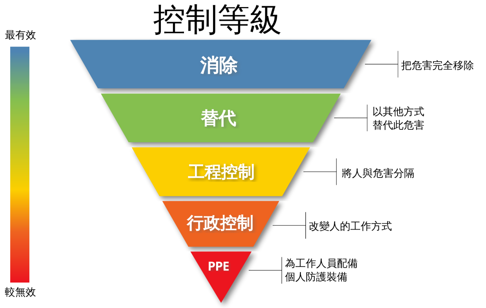{width="80%"}

1.  消除風險 - 改變設計/工法、AI 識別？

2.  降低風險 - 以安全方法替代危險

3.  工程控制 - 護欄、安全網、漏電斷路器、AI 識別等

4.  管理控制 - 教育訓練、標準作業程序、自主檢查等

5.  個人防護具 - 安全帽、安全帶、護目鏡等

> **重要概念**：**消除風險**是最有效的對策（本質安全），**個人防護具**是最後一道防線。
>
> **進階閱讀**：美國安全工程師專業雜誌文章 [Risk Assessment & Hierarchies of Control](https://aeasseincludes.assp.org/professionalsafety/pastissues/050/05/030505as.pdf)

## 風險對策類型範例

| 對策類型 | 工程設計階段 | 施工規劃階段 | 墜落/感電對策實例 |
|:---|:---|:---|:---|
| **消除** | 修改結構，避免高空作業 | 採地面組立後吊裝 | 使用高空工作車取代施工架 |
| **降低** | 指定安全工法 | 選用自動脫鉤器 | 採用低電壓或電池工具 |
| **工程控制** | 設計永久護欄 | 規劃安全母索、安全網 | 裝設漏電斷路器 |
| **管理控制** | 規範施工計畫 | 訂定安全作業標準 | 每日電氣檢點、勤前教育 |
| **個人防護具** | 編列安全帶預算 | 採購高品質安全帶 | 穿戴絕緣手套、安全鞋 |

------------------------------------------------------------------------

## 設計階段風險評估成果

設計者完成風險評估後，必須產出以下文件，納入招標文件：

1.  **施工安全衛生設施參考圖說**：如護欄、施工架、擋土支撐標準圖。(只有硬體？)

2.  **施工安全衛生規範**： [**(風險控制措施？)**]{.underline}

    - 法令規定應辦事項

    - 本工程施工安全衛生注意事項

    - 各項計畫送審規定

    - 安全衛生設施設置規範

3.  **職業安全衛生經費明細表**：量化編列，如安全網數量、護欄長度。

4.  **合理工期建議**：避免因趕工而忽略安全。

------------------------------------------------------------------------

## 施工風險評估表 (標準版) 5級矩陣範例

+-----------------------+------+------------------------------+--------------------+----------------------+-------------------+----------------------+
| 作業拆解              | 危害 | 可能風險狀況                 | 現有防護措施       | 風險分析 (L/S)       | 新增防護措施      | 處理後風險 (L/S)     |
+:======================+:=====+:=============================+:===================+:=====================+:==================+:=====================+
| 施工架組拆 (高度\>2m) | 墜落 | 未使用安全帶、踏板未鋪滿     | 交叉拉桿、部分護欄 | L:4, S:5\            | 1.全面鋪設踏板\   | L:2, S:5\            |
|                       |      |                              |                    | **風險值:20 (極高)** | 2.設置安全母索\   | **風險值:10 (高度)** |
|                       |      |                              |                    |                      | 3.強制使用安全帶  |                      |
+-----------------------+------+------------------------------+--------------------+----------------------+-------------------+----------------------+
| 臨時電配線            | 感電 | 電纜破損、潮濕、無漏電斷路器 | 接地線、提醒標示   | L:3, S:5\            | 1.裝設漏電斷路器\ | L:1, S:5\            |
|                       |      |                              |                    | **風險值:15 (高度)** | 2.電纜架高\       | **風險值:5 (中度)**  |
|                       |      |                              |                    |                      | 3.每日檢查        |                      |
+-----------------------+------+------------------------------+--------------------+----------------------+-------------------+----------------------+

> 風險處理後，目標是將風險值降至 **中度 (≤9)** 或更低。

------------------------------------------------------------------------

## 作業前危害調查與勤前教育 (搭配5級矩陣)

- **法源**：營造安全衛生設施標準第6條

- **時機**：每日或每項作業開始前

- **執行者**：職業安全衛生人員、工作場所負責人、專任工程人員

- **重點**：

  - 針對當日高風險作業（風險值≥10），**逐項確認對策是否到位**。(安全確認)

  - 確認工作場所環境（有無**新危害**？）。

  - 確認機具設備、防護設施有效性（特別是漏電斷路器、安全帶掛點）。

  - 告知可能危害及安全作業要領 (**危險預知**)，並說明風險等級。

  - 勞工**複誦**安全要領並簽名確認。

------------------------------------------------------------------------

## 工程變更風險評估 (5級矩陣)

**時機**：現地情況差異、施工方法改變、主要機具變更、安衛設施變更等

**流程**：

1.  **辨識**：變更內容帶來的新危害。

2.  **分析**：使用5級矩陣評估新風險的可能性與嚴重度。

3.  **評量**：計算風險值及等級。

4.  **處理**：對高度/極高風險擬定對策，修正施工計畫。

5.  **啟用前檢查**：所有措施完成後，經資深人員檢查確認才能開始施作。

> 範例：原採傳統施工架，變更為**高空工作車**，墜落風險從L:4,S:5（20極高）降為L:2,S:4（8中度）。

------------------------------------------------------------------------

## 風險矩陣實務要點

1.  **分級更細**：極高風險(20-25)必須**立即停工**改善。

2.  **量化評估**：透過作業頻率、人數、傷亡程度合理給分，避免主觀。

3.  **動態更新**：隨著對策實施，**重新評估殘餘風險**。

4.  **結合目標管理**：將高度/極高風險項目列為年度安全衛生管理方案。

5.  **教育訓練**：讓所有主管及勞工理解風險等級的意義及對應的行動。

> 使用5級矩陣，能更精準地配置資源，優先處理墜落、感電、倒塌等重大風險。

## 施工規劃階段風險評估流程

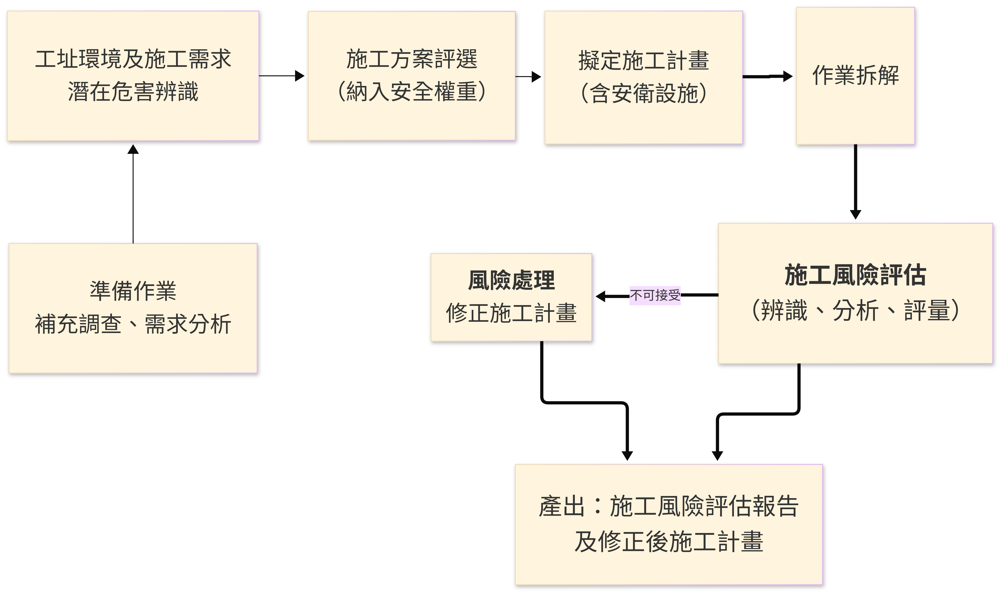{width="80%"}

## 施工方案評選範例

| 方案         | 技術 (20%) | 成本 (30%) | 工期 (20%) | **安全 (30%)** | 總分   | 排序  |
|:-------------|:-----------|:-----------|:-----------|:---------------|:-------|:------|
| 傳統順打工法 | 80         | 85         | 80         | 60             | 76     | 2     |
| **逆打工法** | 85         | 75         | 90         | **85**         | **83** | **1** |

> 「安全」項目的權重不應低於各項目權重之平均值，建議至少15%-30%。

------------------------------------------------------------------------

## 施工風險評估表 (標準版) 重點欄位

+------------------+----------+----------------------------------------+------------------------------+-----------------+--------------------------+------------------------------------+
| 作業拆解         | 危害     | 可能風險狀況                           | 現有防護措施                 | 風險分析 (L/S)  | 新增防護措施             | 風險對策執行成果                   |
+:=================+:=========+:=======================================+:=============================+:================+:=========================+:===================================+
| 連續壁鋼筋籠吊放 | 物體飛落 | 吊耳斷裂、吊索滑脫，鋼筋籠掉落擊傷人員 | 起重機定期檢查、吊鉤防滑舌片 | L:2, S:3\       | 1\. 吊耳進行非破壞檢測\  | 修改施工計畫：增加檢測規定及警戒區 |
|                  |          |                                        |                              | 風險值:6 (高度) | 2. 鋼筋籠下方設置牽引繩\ |                                    |
|                  |          |                                        |                              |                 | 3. 吊掛半徑內禁止進入    |                                    |
+------------------+----------+----------------------------------------+------------------------------+-----------------+--------------------------+------------------------------------+
| ...              | ...      | ...                                    | ...                          | ...             | ...                      | ...                                |
+------------------+----------+----------------------------------------+------------------------------+-----------------+--------------------------+------------------------------------+

> 事業單位可依工程規模選擇**簡易版**、**基本版**或**標準版**評估表。

------------------------------------------------------------------------

## 作業前危害調查與勤前教育

- **法源**：營造安全衛生設施標準第6條

- **時機**：每日或每項作業開始前

- **執行者**：職業安全衛生人員、工作場所負責人、專任工程人員

- **重點**：

  - 確認工作場所環境（有無新危害？）

  - 確認機具設備、防護設施有效性

  - 確認作業人員身心狀況

  - 告知可能危害及安全作業要領 (**危險預知**)

  - 勞工**複誦**安全要領並簽名確認

------------------------------------------------------------------------

## 作業前危害調查表 (範例)

| 調查內容 | 現況 | 潛在危害 | 修正後安全作業要領 |
|:---|:---|:---|:---|
| 作業環境 | 3樓樓板邊緣無護欄 | 墜落 | 作業前設置臨時護欄或安全母索，並穿戴安全帶 |
| 機具設備 | 起重機支撐腳未完全伸展 | 翻覆 | 操作手確認支撐腳完全伸出，下方鋪設墊木 |
| 作業步驟 | 鋼樑吊掛後需人員解索 | 被撞、墜落 | 使用遙控脫鉤器，人員站立於安全平台並掛安全帶 |

> 所有作業人員必須在**勤前教育紀錄表**上簽名，表示已了解風險及對策。

------------------------------------------------------------------------

## 工程變更風險評估

**時機**：現地情況差異、施工方法改變、主要機具變更、安衛設施變更

**流程**：

1.  **辨識**：變更內容帶來的新危害

2.  **分析**：新風險的可能性與嚴重度

3.  **評量**：是否可接受？

4.  **處理**：修正施工計畫、修改圖說、增設設施、教育訓練

5.  **啟用前檢查**：所有措施完成後，經資深人員檢查確認才能開始施作

> 依據[職業安全衛生管理辦法第12條之3](https://laws.mol.gov.tw/FLAW/FLAWDOC01.aspx?id=FL015039&flno=12-3)，變更前**必須**評估。

------------------------------------------------------------------------

## 拆除作業風險評估重點

拆除作業風險極高，必須事前詳實調查：

| 調查項目       | 內容                                       |
|:---------------|:-------------------------------------------|
| **圖說與紀錄** | 設計圖、施工紀錄、維修改建紀錄、竣工圖     |
| **構造物現況** | 結構損壞、腐蝕、裂縫、含石綿或放射性物質？ |
| **管線與設備** | 電力、瓦斯、給排水、化學品殘留             |
| **鄰近環境**   | 道路、建築物、人潮、交通                   |

**拆除計畫**須包括：工法、機具、支撐系統、分類、交通維持、安全衛生管理、緊急應變。

> 部分拆除（如結構補強）更要詳加評估保留部分的穩定性。

------------------------------------------------------------------------

## 風險資訊傳遞與追蹤管制

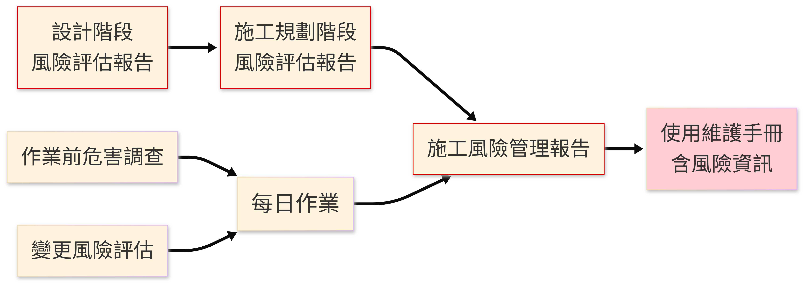{width="80%"}

- **主要設計者**：彙整各設計者成果，編製「設計階段施工風險評估報告」傳給施工者。

- **主要施工者**：彙整各施工者風險評估成果，編製「施工風險管理報告」交付業主，轉給使用單位。

- **追蹤管制表**：列出風險項目、對策、負責人、完成日期、結案確認。

------------------------------------------------------------------------

## 實務演練建議

1.  **分組討論**：選擇一個工地常見作業（如：施工架組拆、擋土支撐、鋼筋吊掛）。

2.  **填寫風險評估表**：使用標準版或基本版表格。

    - 進行作業拆解。

    - 辨識3\~5項潛在危害。

    - 評估現有防護措施下的風險等級。

    - 研擬新增控制措施，降低風險至可接受。

3.  **簡報分享**：各組說明評估結果與對策。

4.  **講師回饋**：補充法令要求與實務經驗。

> 透過實際操作，才能真正掌握風險評估的技巧。

------------------------------------------------------------------------

## 總結

- **源頭管理**：設計階段就要納入施工安全考量，消除或降低風險。

- **全員參與**：由小組進行評估，結合專業與經驗。

- **動態管理**：作業前、變更時都要評估，不能一勞永逸。

- **資訊透明**：風險評估成果要確實傳遞給現場施工人員（透過勤前教育）。

- **持續改善**：追蹤對策成效，發現新風險立即再評估。

------------------------------------------------------------------------

## Q & A

> 參考資料：
>
> 1.  勞動部職業安全衛生署，[營造工程風險評估技術指引 (第三版)](https://www.osha.gov.tw/48110/48129/48177/48183/49944/)，114年2月
>
> 2.  [營造工程風險評估技術指引解說手冊](https://service.mol.gov.tw/download_file.php?f=pBOV7hjFceYX9tpQPJzMEum7jBwZHmC91FYKTGC6D-eOFcEa3pjnRqJea_xawADkrPAN_eYO-3o5X9iHZVcU7w)
>
> 3.  營造甲種職業安全衛生業務主管教材

# 2. 營造工程施工風險評估技術指引（介紹）

## 導引

> 依《職業安全衛生法》第5條第2項規定：「工程之設計或施工者，應於設計或施工規劃階段實施風險評估。」

本內容由講師依據勞動部職安署 **「營造工程風險評估技術指引（第三版）」** 編訂，協助營造業甲種業務主管：

- ✅ 掌握營造全生命週期風險評估方法
- ✅ 運用風險矩陣量化風險等級（半量化）
- ✅ 掌握設計、施工規劃、作業前、變更及拆除階段之風險評估重點
- ✅ 建立風險評估資訊傳遞與追蹤管制機制

------------------------------------------------------------------------

## 營造工程風險特性

| 特性 | 說明 | 影響 |
|:---|:---|:---|
| **動態性** | **危害隨工程進度改變** | 需分階段評估，持續更新 |
| **複雜性** | 多工種、多分包、界面多 | 需整合管理，強化溝通 |
| **環境不確定** | 天候、地質、鄰房、地下管線 | 設計階段即應盡可能詳實調查 |
| **高風險作業多** | 開挖、支撐、施工架、鋼構、拆除 | 需採行工程控制及管理措施 |
| **人員流動率高** | 臨時工多，教育訓練不易 | 作業前危害告知、勤前教育與監督至關重要 |

> 💡 營造業職災發生率及嚴重度均高於其他行業，惟有系統性風險評估方可有效預防。

------------------------------------------------------------------------

## 法源依據

| No | 法規 | 主要內容 |
|----|----|----|
| 1 | 職業安全衛生法<br>第5條第2項 | 設計或施工規劃階段<br>實施風險評估 |
| 2 | 職安法施行細則<br>第8條 | 風險評估定義:<br>辨識、分析、評量 |
| 3 | 營造安全衛生設施標準<br>第3條、第6條 | 施工規劃納入安衛設施<br>作業前實施危害調查 |
| 4 | 職安管理辦法<br>第12條之3 | 變更管理:<br>修改程序/設備前評估風險 |
| 5 | 政府採購法<br>第70條之1 | 機關應分析潛在危險<br>編製安衛圖說及經費 |

> 📌 違反上述規定，除可能發生職業災害外，將面臨行政處罰。

------------------------------------------------------------------------

## 關鍵名詞定義

| 名詞 | 定義（依指引） |
|:---|:---|
| **危害 (Hazard)** | 潛在會造成人員受傷及健康妨害之來源。 |
| **風險 (Risk)** | 對目標之不確定性之效應，常為**可能性 × 嚴重度**。 |
| **風險評估 (Risk Assessment)** | 辨識、分析及評量風險之程序。 |
| **風險處理 (Risk Treatment)** | 將低風險之過程，對不可接受風險擬定對策並執行。 |
| **殘餘風險** | 風險處理後仍存在的風險，應予監控並在必要時再處理。 |

> 目標：將風險控制在 **最低合理可行範圍 (ALARP)**。

------------------------------------------------------------------------

## 風險管理架構

| 構面 | 項目 | 內容說明 |
|----|----|----|
| 領導與承諾 (Leadership & Commitment) | 工程業主/高層支持 | 提供管理推動所需之決策與支持 |
| 設計 (Design) | 界定範圍、準則 | 確認管理邊界與驗收標準 |
|  | 準備作業 | 行政與技術資源的預先配置 |
|  | 風險評估 | 識別、分析與評估風險等級 |
| 實施 (Implementation) | 風險處理 | 執行風險應對措施（規避、減輕、轉移或承擔） |
|  | 監督查核 | 確認執行過程符合設計規劃 |
| 評估與改善 (Evaluation & Improvement) | 績效評估 | 以數據化方式衡量管理成效 |
|  | 持續改善 | 針對偏差或不足提出優化方案 |
| 整合 (Integration) | 納入組織管理系統 | 將成果制度化並導入組織運作 |

> 參考ISO 31000:2018及CNS 31000:2021風險管理原則、架構及程序。

------------------------------------------------------------------------

## 風險管理程序 (Process)

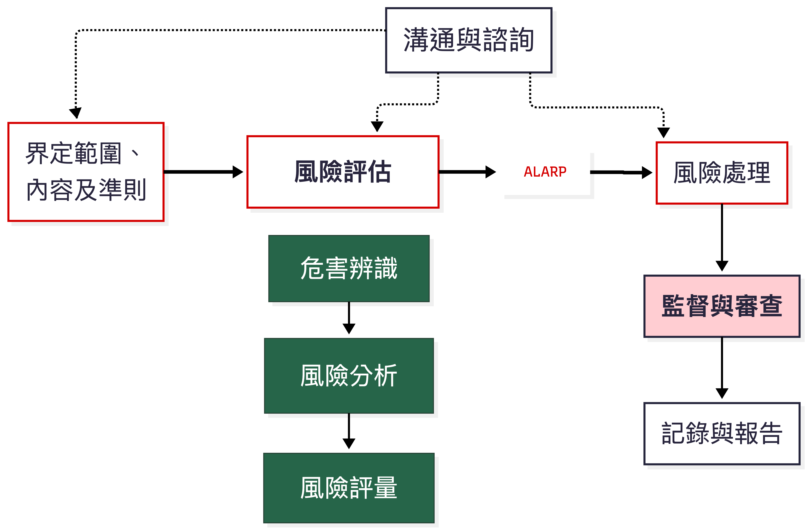{width="80%"}

- **範圍**：全生命週期（規劃、設計、施工、使用、拆除）

- **準則**：法令、指引、實務規範、工程經驗、災害案例

------------------------------------------------------------------------

## 各角色當責

| 角色 | 主要職責 (依指引) |
|:---|:---|
| **工程業主** | 慎選工址與設計施工廠商；要求實施風險評估；**建立風險管理平台**；監督審核 |
| **設計者** | 規劃設計階段風險評估；依評估成果修正設計；**編製安衛圖說、規範及經費；製作使用維護手冊** |
| **施工者** | **施工規劃階段風險評估**；作業前危害調查評估；**變更風險評估**；落實施工計畫 |
| **監造者** | 訂定安衛監督查核計畫；審查施工計畫及風險評估報告；**執行查核** |
| **工作者** | **參與諮詢**；接受教育訓練及健康檢查；遵守作業標準；落實勤前教育 |

------------------------------------------------------------------------

## 準備作業 – 成立風險評估小組

### 設計階段小組組成

| 角色                 | 職稱/人員          | 職責說明                       |
|----------------------|--------------------|--------------------------------|
| 召集人               | 工程設計負責人     | 負責整體統籌、決策與跨部門協調 |
| 專案主辦人員         | 專案管理人員       | 負責專案推動與整體執行管理     |
| **職業安全衛生人員** | 具風險評估專業人員 | **負責風險辨識、分析與評估**   |
| 工址調查人員         | 現地調查人員       | 提供現場環境、地形與條件資料   |
| 各專業設計工程師     | 設計專業人員       | **提供設計技術面之風險資訊**   |
| 施工規劃人員         | 施工管理人員       | **規劃施工方法、流程與可行性** |
| 預算／規範編製人員   | 成本與規範人員     | 編列成本與制定相關技術規範     |

## 施工規劃階段小組組成

| 角色 | 職稱/人員 | 職責說明 |
|----|----|----|
| 召集人 | 工地主任／資深主管 | 負責整體統籌、現場決策與跨單位協調 |
| 專任工程人員 | 工程專責人員 | 負責工程技術管理與執行監督 |
| **職業安全衛生人員** | 安衛專責人員 | **負責風險辨識、危害控制與安全管理** |
| 施工規劃人員 | 施工管理人員 | 規劃施工流程、工法與現場配置 |
| **分項工程主辦** | 各分項負責人 | **負責各工項執行與風險控管** |
| 協力廠商代表 | 外包/承攬單位代表 | 配合施工並落實安全與品質要求 |
| 作業主管 | 現場帶班主管 | 負責第一線作業指揮與安全督導 |

> 評估小組應涵蓋**工程專業、安衛、施工實務**等成員，必要時邀請設計單位提供諮詢。

------------------------------------------------------------------------

## 作業拆解 (Work Breakdown Structure)

目的：將工程分解為可管理、可評估風險的作業單元。（舉例）

+---------------+------------+------------------------------+--------------------------------+
| 層級          | **編碼**   | 項目                         | 說明                           |
+===============+============+==============================+================================+
| 分項工程      | B          | 基礎及地下室工程             | 整體施工項目                   |
+---------------+------------+------------------------------+--------------------------------+
| 第一階作業    | `B-c`      | 連續壁工程                   | 主要施工工法                   |
+---------------+------------+------------------------------+--------------------------------+
| 第二階作業    | `B-c-ⅲ`    | 壁體單元施工                 | 工法細分作業                   |
+---------------+------------+------------------------------+--------------------------------+
| 作業內容/步驟 | `B-c-ⅲ-02` | 穩定液注入、抓斗鑽掘\        | 實際施工活動\                  |
|               |            | 泥漿泵啟動、抓斗下放速度控制 | 細部操作行為（可進行風險辨識） |
+---------------+------------+------------------------------+--------------------------------+

> ✅ 拆解越細，越能完整辨識潛在危害。

------------------------------------------------------------------------

## 危害辨識 – 5M1E 魚骨圖

### 前已說明，不贅述。

### 方法多元，不限於此 。

### 需經驗累積，多看事故調查報告。

> 評估小組逐項檢討，列出每項作業可能的所有危害根源。

------------------------------------------------------------------------

## 風險描述 – 5W1H

| 項目                  | 說明       | 範例（施工架組拆墜落）                 |
|:----------------------|:-----------|:---------------------------------------|
| **What** （什麼危害） | 危害來源   | 高處開口、未設置護欄                   |
| **Why** （為何發生）  | 致災原因   | 交叉拉桿過早拆除、未使用安全帶         |
| **When** （何時）     | 發生時間點 | 施工架組立或拆除階段                   |
| **Where** （何處）    | 發生地點   | 建築物外牆高度2公尺以上                |
| **Who** （誰受害）    | 影響對象   | 施工架組配作業勞工、下方人員           |
| **How** （如何處理）  | 風險對策   | 系統式施工架、安全母索、強制使用安全帶 |

> 完整描述風險情境，才能擬定有效對策。

------------------------------------------------------------------------

## 風險分析 – 5級可能性基準（參考）

| 等級 | 可能性描述 | 作業頻率   | 作業人次參考 |
|:-----|:-----------|:-----------|:-------------|
| 5    | 幾可確定   | 日常性作業 | 10人以上     |
| 4    | 極有可能   | 經常性作業 | 6-9人        |
| 3    | 可能       | 週期性作業 | 4-5人        |
| 2    | 不太可能   | 間歇性作業 | 2-3人        |
| 1    | 幾乎不可能 | 偶發性作業 | 1人          |

> 營造工程亦可參考**過去災害統計**：同類工程曾發生多次→給較高等級。

------------------------------------------------------------------------

## 風險分析 – 5級嚴重度基準（參考）

| 等級 | 嚴重度描述 | 人員傷亡                  | 財物/作業損失  |
|:-----|:-----------|:--------------------------|:---------------|
| 5    | 災難性的   | 1人以上死亡或3人以上重傷  | 停工1個月以上  |
| 4    | 重大       | 1人以上重傷住院           | 停工1週以上    |
| 3    | 中等       | 1人以上受傷住院療養       | 停工1天以上    |
| 2    | 較低       | 1人以上受傷送醫（未住院） | 停工1天以內    |
| 1    | 可忽略的   | 輕傷（包紮敷藥）          | 現場清理後復工 |

> 嚴重度應同時考量**人員傷害**與**工程/財物損失**，取較高等級。

------------------------------------------------------------------------

## 5x5 風險矩陣（參考）

| 風險值      | 嚴重度5 | 嚴重度4 | 嚴重度3 | 嚴重度2 | 嚴重度1 |
|:------------|:--------|:--------|:--------|:--------|:--------|
| **可能性5** | **25**  | **20**  | 15      | 10      | 5       |
| **可能性4** | **20**  | **16**  | 12      | 8       | 4       |
| **可能性3** | 15      | 12      | **9**   | 6       | 3       |
| **可能性2** | 10      | 8       | 6       | **4**   | 2       |
| **可能性1** | 5       | 4       | 3       | 2       | **1**   |

| 風險等級          | 風險值範圍 | 因應對策                             |
|:------------------|:-----------|:-------------------------------------|
| **極高風險 (EH)** | 20-25      | 立即停止作業，須採工程控制或變更設計 |
| **高度風險 (H)**  | 10-16      | 立即改善，限期完成風險對策           |
| **中度風險 (M)**  | 5-9        | 有計畫地改善，指定責任人限期處理     |
| **低度風險 (L)**  | 3-4        | 維持現有防護，持續觀察               |
| **極低風險 (EL)** | 1-2        | 無需進一步行動，但仍應記錄           |

------------------------------------------------------------------------

## 風險評量與可接受度

- **風險評量**為將風險分析結果（風險值/等級）與預先設定的**風險判定基準**比較，決定風險是否可接受。

- **風險基準**應由工程業主或設計/施工者依據：

  - 職業安全衛生法令最低要求

  - 工程實務規範及指引

  - 以往災害案例教訓

  - 社會期待（公共安全、鄰房安全等）

- **建議**：

  - 中度風險以上 (風險值 ≥ 5) 為**不可接受風險**，應實施風險處理。

  - 低度風險及極低風險 (風險值 ≤ 4) 可維持現有防護，但仍需定期監控。

------------------------------------------------------------------------

## 風險處理 – 對策類型及優先順序

### 風險控制層級表（Hierarchy of Controls）

| 層級 | 控制策略 | 說明 | 具體措施範例 |
|----|----|----|----|
| 1 | 消除風險 | 從源頭移除危害 | 改變設計或施工工法，使危害不再存在 |
| 2 | 降低風險（替代） | 以較安全方式取代原有危害 | 使用低危險材料或較安全設備 |
| 3 | 工程控制 | 透過設備或設施隔離危害 | 護欄、安全網、漏電斷路器 |
| 4 | 管理控制 | 透過制度與管理降低風險 | 教育訓練、SOP、自主檢查 |
| 5 | 個人防護具 | 由個人配戴防護裝備 | 安全帽、安全帶 |

## 例

| 優先順序 | 對策類型   | 實例（墜落預防）                     |
|:---------|:-----------|:-------------------------------------|
| 1        | 消除       | 採用地面組裝後整體吊裝，減少高空作業 |
| 2        | 降低       | 使用高空工作車取代施工架             |
| 3        | 工程控制   | 設置護欄、安全母索、防墜網           |
| 4        | 管理控制   | 訂定施工架組拆作業標準、實施認證     |
| 5        | 個人防護具 | 強制使用安全帶並確實掛勾             |

------------------------------------------------------------------------

## 風險處理 – 追蹤管制

- **指定負責人**：每項風險對策應指派人員於期限內完成。

- **處理後再評估**：實施對策後，重新分析殘餘風險（可能性及嚴重度），確認風險值已降至可接受範圍。

- **管制表追蹤**：

  - 紀錄風險項目、對策內容、負責人、完成日期。

  - 管理階層定期審查執行進度及成效。

  - 如發現殘餘風險仍不可接受或衍生新風險，應立即再評估、調整對策。

> 📌 風險處理不是一次性工作，而是**滾動式管理與修正**。

------------------------------------------------------------------------

## 設計階段施工風險評估

### 實施時機

- 可行性研究、綜合規劃、基本設計、細部設計階段

### 主要工作

1.  工址環境現況調查及工程功能需求分析

2.  工址及工程需求潛在危害辨識

3.  設計方案評選（納入安全權重）

4.  設計成果作業拆解及施工風險評估

5.  風險處理：修正設計、選用安全工法、編製安衛圖說及規範、編列經費

### 輸出成果

- 設計階段施工風險評估報告

- 施工安全衛生設施參考圖說

- 施工安全衛生規範

- 職業安全衛生經費明細表

- 使用維護手冊（初稿）

> 此階段為**源頭管理**，消除風險的成本最低、效果最好。

------------------------------------------------------------------------

## 設計方案評選表（例）

| 方案 | 功能 (10%) | 技術 (15%) | 成本 (25%) | 工期 (10%) | 工址環境 (10%) | **安全 (20%)** | 維護 (10%) | 總分 | 排序 |
|:---|:---|:---|:---|:---|:---|:---|:---|:---|:---|
| 順打工法 | 85 | 80 | 90 | 80 | 70 | **60** | 80 | 78.5 | 2 |
| **逆打工法** | 85 | 85 | 75 | 85 | 80 | **85** | 85 | **82.5** | **1** |

> 「安全」權重應不低於各項目權重之平均值，建議 ≥15%。

------------------------------------------------------------------------

## 施工規劃階段風險評估

### 實施時機

- 施工前，施工者擬定施工計畫時

### 主要工作

1.  工址環境補充調查及施工需求分析

2.  辨識工址及施工需求潛在危害

3.  施工方案評選（納入安全權重）

4.  擬定施工計畫（含安衛設施）

5.  作業拆解及施工風險評估

6.  風險處理：修正施工方法、改變程序、選用安全機具、設置設施、訂定SOP、教育訓練、自主檢查、個人防護具

### 輸出成果

- 施工規劃階段施工風險評估報告

- 修正後施工計畫（含安衛設施施工圖、安全作業標準等）

> 施工規劃階段評估結果應納入**施工計畫**，並作為**作業前危害調查**的基礎。

------------------------------------------------------------------------

## 施工方案評選表（例）

| 方案 | 技術 (20%) | 機具 (15%) | 人力 (10%) | 成本 (25%) | 工期 (10%) | **安全 (15%)** | 環境 (5%) | 總分 | 排序 |
|:---|:---|:---|:---|:---|:---|:---|:---|:---|:---|
| 傳統施工架 | 80 | 80 | 85 | 90 | 85 | **60** | 80 | 79.8 | 2 |
| **高空工作車** | 85 | 85 | 90 | 80 | 85 | **90** | 85 | **85.0** | **1** |

> 即使初期成本較高，但**安全權重**納入後，優選方案仍可能勝出。

------------------------------------------------------------------------

## 作業前危害調查與勤前教育

### 法源

營造安全衛生設施標準第6條：「雇主使勞工於營造工程工作場所作業前，應指派所僱之職業安全衛生人員、工作場所負責人或專任工程人員等專業人員，實施危害調查、評估，並採適當防護設施，列入施工計畫執行。」

### 實施方式

- **時機**：每日作業前或每項作業開始前

- **調查內容**：

  - 工作場所環境現況（有無新危害）

  - 機具設備、安全設施有效性

  - 作業步驟及可能風險

- **評量**：[**判定是否有殘餘風險或新生風險**]{.underline}

- **處理**：即時調整作業方法、增設防護設施

- **勤前教育**：告知勞工危害及安全作業要領，勞工複誦並簽名

------------------------------------------------------------------------

## 作業前危害調查與危害告知流程

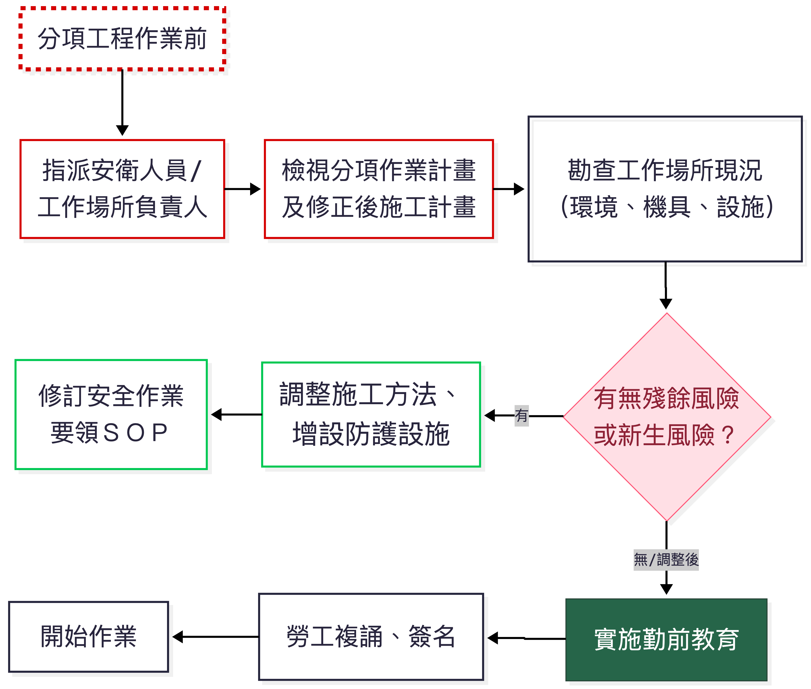{width="80%"}

> 勤前教育紀錄應妥善保存，備供查核。

------------------------------------------------------------------------

## 工程變更風險評估

### 時機

- 現地情況差異（如地質與設計不符）

- 工程內容或設計變更

- 主要施工方法改變

- 主要機具設備變更

- 主要安全衛生設施變更

### 實施步驟

1.  辨識變更可能帶來的新危害

2.  使用風險矩陣分析新風險等級

3.  對不可接受風險擬定對策

4.  修正變更設計或變更施工計畫

5.  實施變更管理：

    - 更新圖說文件管制

    - 調整機具設備及安全設施

    - 辦理變更作業教育訓練

    - 修改管理制度及檢查表

6.  **啟用前檢查**：由資深人員確認所有措施完成後方可開始作業

> 依據職安管理辦法第12條之3：變更前未經評估，不得逕行施工。

------------------------------------------------------------------------

## 拆除作業施工風險評估

### 事前調查重點

- 圖說及紀錄：設計圖、施工紀錄、竣工圖、維修改建紀錄

- 構造物現況：結構損壞、腐蝕、裂縫、有無石綿、放射性物質

- 管線及設備：電力、瓦斯、給排水、化學品殘留

- 鄰近環境：道路、建築物、人車流動

### 拆除計畫應包含

- 拆除方法及順序（穩定維持措施）

- 使用機具設備

- 拆除物處理及分類

- 交通維持計畫

- 職業安全衛生管理計畫

- 緊急應變計畫

> 拆除作業風險極高，必須擬定**拆除計畫**並實施風險評估後方可作業。

------------------------------------------------------------------------

## 風險資訊傳遞與追蹤管制

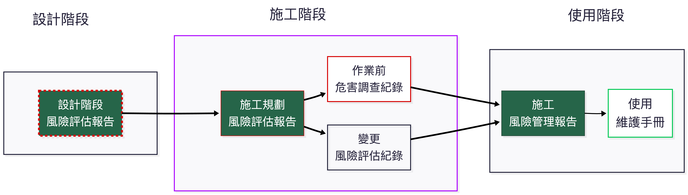{width="100%"}

> 各階段風險資訊應完整記錄並傳遞予後續權責單位，確保風險對策持續有效。

------------------------------------------------------------------------

## 風險處理追蹤管制表（例）

| 分項工程 | 作業內容 | 危害類型 | 風險等級 | 風險對策 | 負責人 | 完成日期 | 結案確認 |
|:---|:---|:---|:---|:---|:---|:---|:---|
| B.基礎及地下室 | 連續壁鋼筋籠吊放 | 物體飛落 | H (16) | 吊耳非破壞檢測、下方警戒、使用牽引繩 | 張三 | 5/20 | ✓ |
| C.結構工程 | 施工架組拆 | 墜落 | EH (20) | 改採系統架+安全母索+強制安全帶 | 李四 | 5/18 | ✓ |
| D.鋼構吊裝 | 鋼樑假固定 | 墜落、倒塌 | H (15) | 使用自鎖式螺栓、設置工作平台 | 王五 | 5/25 | 持續追蹤 |

> 高度及極高風險項目應列為優先改善對象，並由管理階層定期審查。

------------------------------------------------------------------------

## 風險評估表單 – 簡易版

（適用契約金額150萬以下或勞工人數未滿5人之微型工程）

| 作業環境 | 機具設備 | 作業名稱 | 作業步驟 | 可能風險狀況 | 現有防護設施 | 風險可否接受 | 風險對策執行成果 | 負責人 |
|:---|:---|:---|:---|:---|:---|:---|:---|:---|
| 基地整平 | 挖土機 | 土方開挖 | 開挖深度1.5m | 地層崩塌 | 依法設置擋土支撐 | 可 | — | — |
| 鋼筋加工 | 裁切機 | 鋼筋裁切 | 操作裁切機 | 切傷、感電 | 護罩、接地、漏電斷路器 | 可 | — | — |

> 簡易版將風險分析併入評量，直接判斷可否接受。

------------------------------------------------------------------------

## 風險評估表單 – 基本版

（適用150萬以上、5000萬以下或勞工人數5人以上、30人以下之工程）

+----------+------------+----------------------+------------------------------+--------------+-------------------+--------------------+-------------------+--------+
| 編號     | 作業步驟   | 可能風險狀況         | 現有防護設施                 | 風險可否接受 | 新增防護設施      | 處理後風險可否接受 | 對策執行成果      | 負責人 |
+:=========+:===========+:=====================+:=============================+:=============+:==================+:===================+:==================+:=======+
| B-c-ⅲ-02 | 鋼筋籠吊放 | 吊耳斷裂，鋼筋籠掉落 | 起重機定期檢查、吊鉤防滑舌片 | 否 (H)       | 1.吊耳非破壞檢測\ | 可 (M)             | 施工計畫修正第X頁 | 張三   |
|          |            |                      |                              |              | 2.警戒區\         |                    |                   |        |
|          |            |                      |                              |              | 3.牽引繩          |                    |                   |        |
+----------+------------+----------------------+------------------------------+--------------+-------------------+--------------------+-------------------+--------+

> 基本版區分「法定防護設施」及「新增防護設施」二次評估。

------------------------------------------------------------------------

## 風險評估表單 – 標準版

（適用5000萬以上、勞工人數30人以上或丁類危險性工作場所）

| 編號 | 作業步驟 | 危害類型 | 可能風險狀況 | 現有防護設施 | 風險分析 (L/S) | 風險評量 | 新增防護設施 | 處理後風險 (L/S) | 處理後評量 | 對策執行成果 | 負責人 |
|:---|:---|:---|:---|:---|:---|:---|:---|:---|:---|:---|:---|
| B-c-ⅲ-02 | 鋼筋籠吊放 | 物體飛落 | 吊耳斷裂、吊索滑脫 | 起重機檢查、防滑舌片 | L:3, S:5 | 15 (H) | 非破壞檢測、警戒區、牽引繩 | L:1, S:5 | 5 (M) | 施工計畫修正 | 張三 |

> 標準版詳細記錄風險分析(可能性/嚴重度/風險值/等級)及處理後再評估結果。

------------------------------------------------------------------------

## 案例演練建議

1.  **分組討論（20分鐘）**

    - 選擇工地常見高風險作業：施工架組拆、擋土支撐、鋼構吊裝、臨時用電。

    - 使用5x5矩陣及標準版評估表進行風險評估。

2.  **步驟**

    - 作業拆解至第二階或作業步驟。

    - 辨識至少3項潛在危害。

    - 評估現有防護措施下的風險等級（L/S值、風險值）。

    - 對不可接受風險擬定新增對策。

    - 再評估殘餘風險是否可接受。

3.  **小組發表 & 講師回饋（20分鐘）**

    - 分享評估成果及改善對策。

    - 補充法令規定及實務最佳作法。

------------------------------------------------------------------------

## 結語

- **源頭管理**：設計階段即實施風險評估，消除或降低施工風險，效果最好、成本最低。

- **系統化程序**：依循 ISO 31000 風險管理原則，持續溝通、監督、審查。

- **動態管理**：施工規劃、作業前、變更時、拆除前，各階段皆應評估，不可一勞永逸。

- **全員參與**：風險評估小組須納入安衛、工程、施工、分包商等成員。

- **資訊透明**：風險評估成果必須傳遞至現場作業勞工（透過勤前教育及危害告知）。

> 落實施工風險評估，是提升營造安全文化、預防職業災害的根本之道。

------------------------------------------------------------------------

## Q & A

> 各事業單位可依工程規模與特性，參考指引表單格式，自訂符合實際需求之評估表格。

**參考資料**：

- 勞動部職業安全衛生署，營造工程風險評估技術指引（第三版），114年2月

- 營造工程施工風險評估技術指引解說手冊（核定版）

- 營造安全衛生設施標準、職業安全衛生管理辦法等相關法規

## **營造只有安全風險？健康呢？**

::: callout-caution
**你關心什麼健康議題？**
:::

# 3. 游離二氧化矽暴露風險評估（例）

## 台灣人造石案例

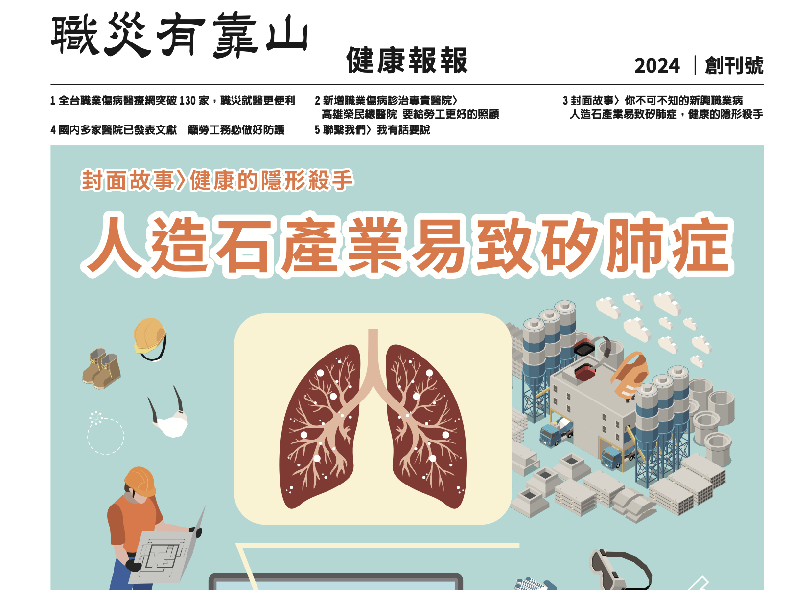{width="100%"}

------------------------------------------------------------------------

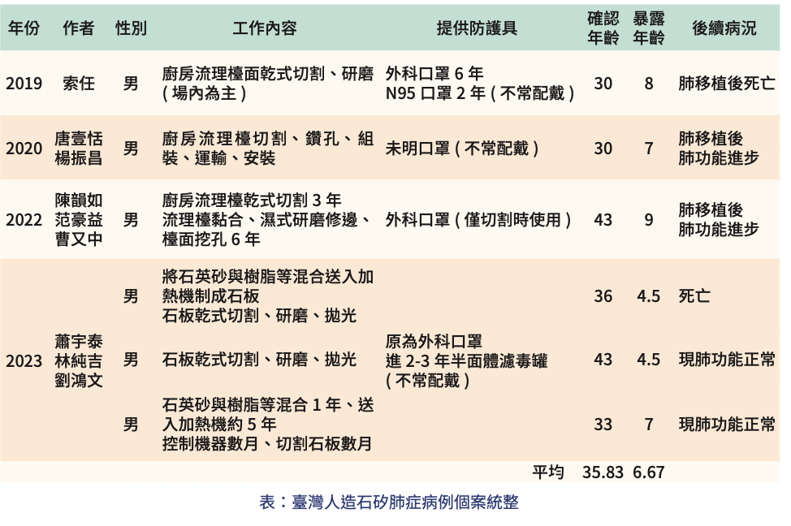{width="100%"}

------------------------------------------------------------------------

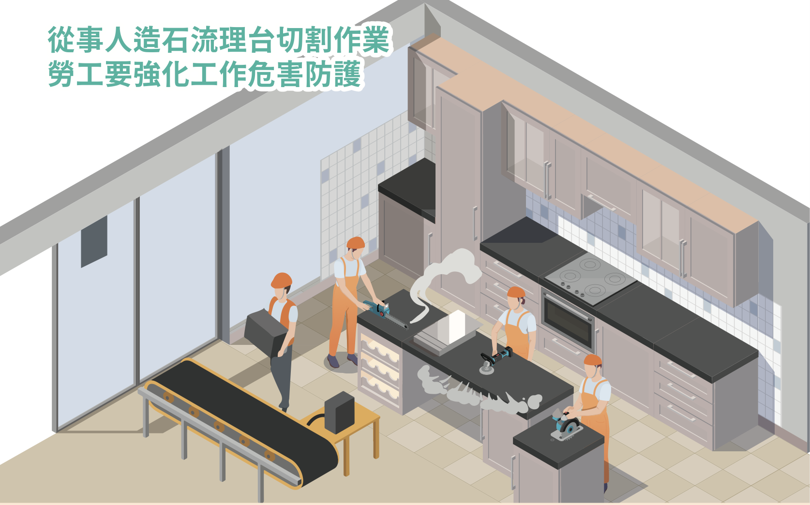{width="100%"}

## 台灣人造石案例的啟示

- 在營造工程中，**結晶型游離二氧化矽**（respirable crystalline silica, **RCS**）暴露是常見卻容易被忽視的職業健康危害。

- 許多營造作業（如混凝土切割、鑽孔、研磨，磁磚、紅磚切割，以及近年興起的人造石加工）都會產生RCS，長期吸入可能導致**矽肺症、肺癌等不可逆疾病**。

- 以下整合澳洲安全作業規範與台灣本土案例，說明如何在營造工程的風險評估架構中納入RCS暴露管理，提供甲種業務主管實務操作參考。

## 一、危害辨識：哪些營造作業有RCS風險？

RCS主要來自含石英（Quartz）等結晶型二氧化矽的建材，包括：**混凝土、紅磚、磁磚、花崗岩、砂岩，以及人造石（engineered stone）**。營造工程中常見的高風險作業有：

- 使用電動手工具（切割機、砂輪機、鑽孔機）進行**乾式切削、研磨、拋光**

- **破碎、敲除**混凝土或磚牆

- **乾式掃除、吹除粉塵**

- 隧道開挖、礦石開採、**石材加工**

**澳洲規範**（Safe Work Australia, 2025）明確將上述作業定義為「crystalline silica substance processing」，並規定必須進行風險評估。

**台灣人造石案例**（財團法人職業災害預防及重建中心，2023）指出，**人造石(石英石)含有高濃度二氧化矽（通常 \> 90%）**，從業者**暴露年資僅4-10年即發病**，遠短於傳統矽肺症（\>20年），且多位年輕患者需接受肺臟移植。這警示營造業若以乾式方式切割含高矽建材，風險極高。

## 二、風險評估方法：沿用既有風險矩陣，納入健康暴露評估

營造工程風險評估已熟悉 **危害辨識 → 風險分析（可能性 × 嚴重度）→ 風險評量 → 風險處理** 的流程。RCS暴露風險可融入此模式：

| 評估項目    | 說明                 | 範例（乾式切割人造石）                    |
|:------------|:---------------------|:------------------------------------------|
| 危害類型    | 化學性危害（粉塵）   | RCS                                       |
| 可能性（L） | 依作業頻率、粉塵濃度 | 每日作業，無濕式設備 → L=4（極有可能）    |
| 嚴重度（S） | 健康後果             | 矽肺症（不可逆、可能死亡）→ S=5（災難性） |
| 風險值      | L × S                | 20 → 極高風險，須立即改善                 |

澳洲規範進一步建議，若無法確定RCS空氣濃度是否超過**暴露標準（0.05 mg/m³ 八小時時量平均，台灣0.1mg/m³）**，應執行**空氣監測**。對於高風險作業（風險值 ≥ 10），應建立**矽暴露風險控制計畫**，並實施**健康監測**（肺功能、胸部X光或低劑量電腦斷層）。

## 三、風險控制措施：層級控制與實務要點

澳洲規範（Safe Work Australia, 2025）強調必須依**層級控制（Hierarchy of Control）** 選擇對策，且**優先消除或取代**，不可僅依賴呼吸防護具。

+--------------+------------------------------+------------------------------------------------------+
| 層級         | 對策類型                     | 營造實例                                             |
+:=============+:=============================+:=====================================================+
| **消除**     | 不使用含高矽建材或工法       | 以預鑄構件取代現場切割；以非矽質材料取代人造石       |
+--------------+------------------------------+------------------------------------------------------+
| **替代**     | 改用低矽含量材料             | 選擇低石英含量的磁磚、紅磚                           |
+--------------+------------------------------+------------------------------------------------------+
| **隔離**     | 封閉作業區、人員隔離         | 切割作業在專門隔間內進行；使用全密閉駕駛室附HEPA過濾 |
+--------------+------------------------------+------------------------------------------------------+
| **工程控制** | 濕式作業、局部排氣、工具吸塵 | 切割機加裝水霧裝置（流量 ≥ 0.5 L/min）或M/H級吸塵器  |
+--------------+------------------------------+------------------------------------------------------+
| **管理控制** | 作業排程、清潔程序、教育訓練 | 減少切割次數；使用濕式擦拭或H級吸塵器清潔，禁止乾掃  |
+--------------+------------------------------+------------------------------------------------------+
| **個人防護** | 呼吸防護具（RPE）            | 選用N95／P2/P3等級，並通過密合度測試（fit test）     |
|              |                              |                                                      |
|              | **呼吸防護計畫**             |                                                      |
+--------------+------------------------------+------------------------------------------------------+

> 台灣案例（財團法人職業災害預防及重建中心，2023）中，多位勞工即使雇主提供N95口罩，仍因**未正確佩戴、有鬍鬚導致密合不良**而罹病。因此，呼吸防護具應視為最後一道防線，且必須搭配教育訓練與監督。

## 四、監測機制：空氣監測與健康監測

### 4.1 空氣監測 (環測)

- 時機：當不確定暴露是否超過法定標準（0.1 mg/m³ 八小時時量平均），或為確認控制措施有效性時執行。

- 方法：委請職業衛生專業人員進行個人呼吸帶採樣，樣本送至認證實驗室分析。（直讀式？）

- 結果應用：若超過標準，立即採行與檢討控制措施。

### 4.2 健康監測

- 適用對象：從事高風險RCS暴露作業之勞工（粉塵作業）。

- 頻率：新進人員**作業前特殊體格**檢查，其後定期**特殊健康**追蹤（建議每年或依醫囑）。

- 檢查項目：肺功能（FEV1、FVC）、胸部X光（PA view）或**低劑量電腦斷層**（對早期矽肺症更敏感）。

- 記錄保存：健康監測報告至少保存30年。

台灣人造石案例（財團法人職業災害預防及重建中心，2023）顯示，多數患者確診時已進展至嚴重肺纖維化，需肺臟移植。**早期發現**至關重要，建議高暴露族群每年實施低劑量電腦斷層篩檢。

## 五、管理文件與資訊傳遞

- **(澳洲) 矽暴露風險控制計畫**：對於高風險作業，應擬定書面計畫，內容包括：作業說明、控制措施、監測計畫、教育訓練、緊急應變。

- **安全作業標準（SOP）**：將濕式作業、工具檢查、清潔程序標準化，並於每日勤前教育宣導。

- **記錄保存**：空氣監測結果（30年）、健康監測報告（30年）、呼吸防護具密合度測試紀錄應妥善保存。

## 六、結論：營造風險評估應納入RCS暴露風險評估

傳統營造風險評估多聚焦於墜落、倒塌、感電等立即性危害，容易忽略**慢性健康危害**如游離二氧化矽暴露。

介紹澳洲規範的系統化評估方法（辨識高危害作業→量化風險→層級控制→監測驗證），並警惕於人造石案例的慘痛教訓，營造業應將RCS暴露納入施工規劃階段及作業前危害調查，確實執行工程控制與健康監測，才能有效保護勞工健康。

------------------------------------------------------------------------

### 參考文獻

Safe Work Australia. (2025). *Managing risks of respirable crystalline silica in the workplace: Code of practice*.

財團法人職業災害預防及重建中心. (2023). 人造石產業易致矽肺症，健康的隱形殺手. *健康報報*, (1), 3-7.

唐壹恬, & 楊振昌. (2020). 新興產業人造石造成的矽肺症. *臨床醫學月刊*, *86卷6期 (2020/12) Pp. 736-739*

陳韻如, 范豪益, & 曹又中. (2022). 流理台切割作業致矽肺症案例討論. *環境職業醫學會訊*.

郭育良等人. (2023). *人造石作業勞工健康危害評估研究*. 勞動部勞動及職業安全衛生研究所。

# 4. 科學研究：營造業墜落事故在風險評估上的應用

- 在營造業風險評估實務中，墜落一直是最主要且致命的危害類型。

- 本節整理 Halabi 等人（2022）發表於 *Safety Science* 的研究〈Causal factors and risk assessment of fall accidents in the U.S. construction industry: A comprehensive data analysis (2000-2020)〉，說明如何運用大數據分析強化風險評估的科學基礎，並提供我國營造甲種業務主管可借鏡的管理重點。

## 一、研究背景與方法

該研究分析美國 OSHA 資料庫中 **23,057 件** 墜落事故（2000年1月至2020年8月），涵蓋工程類型、作業活動、職業別、墜落高度、位置、防護具使用、傷害程度（致命/非致命）等變項。分析方法包括：

- **頻率分析**：描述各變項的分布趨勢與佔比。

- **卡方檢定**：檢驗各因子與傷害程度（致命 vs. 非致命）之間是否有顯著關聯。

- **邏輯斯迴歸**：建立預測模型，估算各因子對「致命」結果的勝算比（odds ratio），並計算模型的預測準確率。

> 此研究為目前少數同時涵蓋**描述統計、關聯性分析與預測建模**的墜落風險研究，對風險評估的量化與動態管理極具參考價值。

## 二、關鍵研究發現

### 1. 墜落事故的時空分布

- **月份**：60.5% 的事故發生在 4 月至 10 月，夏季（6-8月）佔比最高（43.9%），**高溫與疲勞是可能原因**。

- **星期**：週末事故數較少，但**致命率（RFFA）高於平日**，可能因安全監管較鬆散。

- **時段**：上午 10:00-12:00 與下午 13:00-15:00 為兩個高峰，分別對應上午疲勞與午後注意力下降。

## 2. 工程資訊與墜落風險

| 類別     | 最高事故佔比          | 備註                     |
|:---------|:----------------------|:-------------------------|
| 工程用途 | 商業建築 (32.5%)      | 住宅新建及維修事故率上升 |
| 工程類型 | 新建工程 (51.8%)      | 維修/改建佔比亦明顯增加  |
| 工程成本 | 低於 \$50,000 (31.0%) | 小型公司防護與訓練不足   |

## 3. 作業活動與職業別

- **最高事故作業活動**：**屋頂作業**（27.7% 致命事故）、外牆收尾、鋼結構吊裝、外牆木作。

- **最高事故職業**：**屋頂工**（26.3% 致命事故）、建築 laborers、木工。

- **屋頂工的致命風險**：為木工的 **1.95 倍**。

## 4. 墜落高度與位置

- **高度**：80.5% 的事故發生在 **30 英尺（約 9.15 公尺）以下**，顯示低處墜落仍佔絕大多數，且防護法規在低處易被忽略。

- **位置**：**從屋頂墜落佔 30.0%（最高），其次為梯子（21.7%）**、施工架（9.9%）、開口（7.3%）。

## 5. 防護具使用現況（嚴重警訊）

- **無任何防護（No protection）** 佔 **27.3%**，此類事故的致命率高達 **48.1%**。

- 僅提供被動防護（如安全網、護欄）佔 **44.7%**；同時提供被動與個人防護者僅 **5.5%**。

- 與 1990-2001 年相比，防護具使用率**未有顯著改善**。

### 6. 年齡與經驗

- 45-64 歲勞工佔致命事故的 **45.2%**，且致命率隨年齡遞增。

- **經驗並不足以取代安全防護**，高齡勞工生理條件較差，墜落後果更嚴重。

## 三、風險評估方法的應用：從描述到預測

### 1. 卡方檢定：找出與「致命」顯著相關的因子

| 因子       | Cramer's V | 關聯強度   |
|:-----------|:-----------|:-----------|
| 墜落高度   | 0.265      | 中等       |
| 職業       | 0.162      | 中等       |
| 墜落位置   | 0.143      | 中等       |
| 工程用途   | 0.133      | 中等       |
| 防護具狀態 | 0.087      | 稍弱但顯著 |

**時間（星期、時段）、工程成本、SIC 碼**等與致命性無顯著關聯（V \< 0.06）。\
-\> **意涵**：事故「發生頻率」高的因子（如清晨時段、低成本工程）不一定導致更高的致命率；風險評估應區分 **「發生可能性」** 與 **「後果嚴重度」**。

## 2. 邏輯斯迴歸模型

- **預測變項**：墜落高度、工程用途、職業、作業活動、墜落位置、防護具。

- **模型表現**：

  - 整體預測正確率 **77.7%**（非致命 86.7%、致命 63.0%）

  - ROC 曲線下面積 AUC = 0.821（良好）

- **勝算比（Odds Ratio）—致命風險的關鍵驅動因子**：

| 因子           | 勝算比 (OR) | 解釋                       |
|:---------------|:------------|:---------------------------|
| 高度每增加一級 | 1.10        | 高度越高，致命風險增加 10% |
| 塔槽/儲槽工程  | 1.55        | 致命風險提高 55%           |
| 屋頂工         | 1.56        | 致命風險提高 56%           |
| 鋼構吊裝作業   | 1.38        | 致命風險提高 38%           |
| 從屋頂墜落     | 1.57        | 致命風險提高 57%           |
| 從開口墜落     | 1.73        | 致命風險提高 73%           |
| 有提供防護具   | 0.83        | 致命風險降低 17%           |

> 提供防護具雖能降低致命風險，但降幅僅 17%，顯示防護具的正確使用與配套工程控制仍嚴重不足。

## 四、對營造風險評估實務的啟示

### 1. 風險評估必須納入「高度」的細緻分級

傳統風險矩陣常將「高度 \> 2m」一律視為高風險，但研究顯示 **80% 墜落發生在 9m 以下**，且高度與致命性呈連續正相關。建議：

- 將高度分為 ≤2m、2-6m、6-9m、9-15m、\>15m 等層級。

- 低處墜落（如梯子、施工架 2-6m）亦應視為不可接受風險，並採取工程控制。

### 2. 特定作業與職業應納入專項風險評估

- 屋頂作業、鋼構吊裝、開口作業應列為**高風險作業**，於施工計畫中強制要求防墜計畫及第三方檢查。

- 作業前危害調查應針對屋頂工、鋼構工等職業，加強**個人防護具適配性與使用監督**。

## 3. 防護具不是萬能，但「無防護」絕對致命

- 研究顯示「無防護」佔 27.3%，致命率近五成。風險評估必須明確記錄：

  - 防護具類型（被動/個人）

  - 是否經**適配性測試**（fit test）

  - 是否納入每日勤前教育與檢查清單

- 我國營造工地常見「有安全帶卻未掛勾」或「掛勾點不當」，可參考此研究強化稽核。

### 4. 年齡因子應納入風險評估

- 高齡勞工（45歲以上）墜落後致命風險顯著較高。風險評估可增加「年齡」作為風險因子：

  - 高齡勞工從事高處作業時，應優先指派至地面作業或提供更完善的被動防護。

  - 健康監測應包括平衡感、視力等與墜落相關的項目。（聽力？）

## 5. 事故趨勢分析可做為風險評估滾動更新的依據

- 研究發現，屋頂墜落比例從 24.7%（1997-2012）上升至 30.0%（2000-2020），顯示既有防護策略失效。營造事業單位應**定期回顧自身事故或虛驚事件**，更新風險評估表單中的「可能風險狀況」與「現有防護設施」。

- 建議建立**工地風險資料庫**，每年進行趨勢分析，調整下一年度的風險管理重點。

## 五、結論

Halabi 等人（2022）的研究證明，大量墜落事故數據經過嚴謹的統計分析，能夠：

- 辨識出真正影響**致命後果**的關鍵因子（高度、職業、位置、防護具），而不只是發生頻率。

- 提供量化風險評估所需的**勝算比**，使風險矩陣的「嚴重度」不再只是主觀給分。

- 驗證提供防墜防護具有助益，但改善幅度有限，**工程控制與管理控制仍是確實使用的重要手段**。

營造甲種業務主管可將上述發現轉化為以下具體行動：

1.  風險評估表中增列 **「墜落高度分級」** 與 **「年齡」** 欄位。

2.  針對屋頂、鋼構、開口等作業，於施工計畫強制納入**被動防墜設施**（安全網、護欄），並減少對個人防護具的依賴。

3.  每季檢討工地墜落事故與虛驚，滾動修正風險評估表。

4.  加強高齡勞工的作業前健康詢問與工作指派調整。

------------------------------------------------------------------------

## 參考文獻（APA 格式）

Halabi, Y., Xu, H., Long, D., Chen, Y., Yu, Z., Alhaeck, F., & Alhaddad, W. (2022). Causal factors and risk assessment of fall accidents in the U.S. construction industry: A comprehensive data analysis (2000-2020). *Safety Science, 146*, 105537. <https://doi.org/10.1016/j.ssci.2021.105537>

# 5. 科學研究：重新定義職業健康、風險與安全

> 對營造業風險評估的啟示

- 在營造業風險評估實務中，我們經常使用「健康」、「風險」、「安全」這些詞彙，但每個人對這些詞的理解可能不盡相同。

- Karanikas 與 Zerguine（2025）發表於 *Safety Science* 的研究〈Health is influenced by risks moderated by safety’: Redefining health, risk, and safety for occupational settings〉，透過混合方法（焦點團體訪談 + 文獻回顧）重新定義這三個核心構念，並提出**依組織層級調整的定義版本**。

- 本節整理該研究的重要發現與對營造業的應用建議。

------------------------------------------------------------------------

## 一、研究背景與方法

#### 1.1 研究動機

- 職業安全衛生（OHS）領域長期缺乏對「健康」、「風險」、「安全」的共識性定義。

- 定義不清會影響：

  - 風險評估方法與工具的設計

  - 組織內外的溝通與協作

  - 安全績效的衡量與管理

  - OHS 被視為專業領域的地位

## 1.2 研究對象與方法

- **研究對象**：澳洲最大私有營造公司 Hutchinson Builders

  - 約 1,500 名直接雇員，超過 10,000 名分包商與供應商

  - 每日超過 14,000 人在工地作業

- **研究方法**：

  - 7 場焦點團體工作坊，共 53 名參與者

  - 參與者涵蓋：安衛人員、工地經理、高階主管、專案經理、合約管理人員等

  - 使用 Padlet 平台收集匿名定義，再與文獻定義進行比較討論

- **分析方式**：主題分析，將定義分類為「狀態」、「能力」、「結果」、「過程」、「特性」等類別

## 二、核心洞察：健康、風險與安全的動態關係

研究提出一個簡潔的關係式，可作為營造業風險評估的指導原則：

> **健康受風險影響，風險由安全調節。**
>
> ***Health is influenced by risks moderated by safety.***

**意涵**：

- **風險是「可能」**而非「已發生」的傷害 — 是潛在的、不確定的

- **安全是「行動」**而非「結果」 — 是主動的、可見的

- **健康是「受影響的狀態與能力」** — 是動態的、可比較的

------------------------------------------------------------------------

## 三、對營造業風險評估的應用

### 3.1 釐清風險評估中的用語

**問題**：**營造工地中，「風險」常與「危害」混用；「安全」常被理解為「零事故」。**

**應用**：

- 使用研究提供的定義，建立組織內共同的 **風險語言**

- 風險評估前，先確認團隊對「風險」、「危害」、「安全」的理解一致

| 常見混淆         | 正確區分（依本研究）                           |
|:-----------------|:-----------------------------------------------|
| 風險 = 機率×後果 | 風險是「可能」，機率×後果是風險的「等級」      |
| 安全 = 沒有事故  | 安全是「行動」，不是結果                       |
| 危害 = 風險      | 危害是「媒介」，風險是該媒介帶來傷害的「可能」 |

## 3.2 將「韌性/脆弱度」納入風險評估

**問題**：傳統風險矩陣假設所有勞工面對相同危害時的脆弱度相同，忽略個人差異。

**應用**：

- 風險評估中納入 **「人員韌性」評估**：

  - 內在韌性：年齡、健康狀況（如高齡勞工墜落致命風險更高）

  - 外在韌性：防護具取得與使用、作業輔具、團隊支援

- 可利用研究提出的關係式：

  > **韌性 = 1 − 脆弱度**

**實例**：

- 同樣是 6 公尺高處作業，20 歲與 55 歲勞工的墜落後果嚴重度應有不同權重

- 風險矩陣的「嚴重度」可依年齡或健康狀況進行調整

## 3.3 安全績效衡量方式的反思

**問題**：營造業普遍以「失能傷害頻率（FR）」、「嚴重率（SR）」等 **落後指標** 衡量安全績效，但這些是「結果」，而非「安全本身」。

**應用**：

- 區分 **「安全行動」**（工程控制、隔離、取代）與 **「安全干預」**（訓練、提供PPE、政策制定）

- 衡量重點轉向：(**領先指標？**)

  - 組織採取了哪些 **直接控制風險的行動**？

  - 這些行動的 **覆蓋率** 與 **有效性** 如何？

  - 風險等級在行動前後的 **變化**（相對安全有效性）

> 研究建議使用「相對安全水準」與「相對安全有效性」取代傳統的安全績效指標。

## 3.4 納入非物質媒介(健康)的風險

**問題**：營造業風險評估偏重物理性危害（墜落、感電、倒塌），忽略 **心理社會風險**。

**應用**：

- 風險評估表的「危害類型」可增列：

  - 溝通不良（如無線電通訊中斷）

  - 管理壓力（如趕工壓力導致安全捷徑）

  - 孤立作業（如夜間單獨作業）

  - 政策缺失（如無明確的安全獎懲制度）

**實例**：

- 屋頂工在夏季高溫下作業，除了墜落風險外，還有熱壓力、疲勞導致的注意力下降 — 這些非物質媒介風險應納入評估

------------------------------------------------------------------------

## 四、對營造業管理實務的具體建議

### 4.1 定義統一化

### 4.2 風險評估工具更新

- 風險評估表中增加：

  - 物質與非物質危害的分類

  - 暴露路徑參數（頻率、持續時間、濃度）

  - 人員韌性評估（年齡、健康、經驗）

- 風險等級計算時，不僅考慮「機率×嚴重度」，還可納入「可控制性」

### 4.3 安全績效管理

- 減少對落後指標（事故率）的依賴

- 增加領先指標：

  - 工程控制措施完成率

  - 高風險作業前風險評估執行率

  - 風險行動的有效性驗證結果

- 建立「安全行動」與「安全干預」的分類記錄系統

------------------------------------------------------------------------

## 七、結論

Karanikas 與 Zerguine（2025）的研究對營造業風險評估提供了以下重要啟示：

1.  **定義是行動的基礎**：沒有清晰的定義，就無法設計有效的風險評估工具與管理措施。

2.  **風險不是機率×後果**：機率與嚴重度是風險等級的參數，而不是風險本身的定義。營造業常用的風險矩陣（L×S）是評估工具，但不應與風險定義混淆。

3.  **安全是行動，不是結果**：安全不是「零事故」，而是組織與個人為了控制風險而採取的行動。營造業應將重點放在「做了什麼」，而非「沒有發生什麼」。

4.  **健康是動態且相對的**：健康不僅是「狀態」，更是「能力」。風險評估應考量勞工的年齡、健康狀況、韌性等差異。

5.  **依層級溝通**：組織應針對不同角色採用不同複雜度的定義，以確保有效溝通與落實。

6.  **物質與非物質媒介並重**：營造業風險評估應從傳統的物理危害擴展至心理社會風險。

------------------------------------------------------------------------

### 參考文獻（APA格式）

Karanikas, N., & Zerguine, H. (2025). ‘Health is influenced by risks moderated by safety’: Redefining health, risk, and safety for occupational settings: A mixed-methods study. *Safety Science, 181*, 106698. <https://doi.org/10.1016/j.ssci.2024.106698>

# 6. 職安衛法修正重點與職災案例

## 職安衛法修正重點與職災案例

### [**納入工程業主責任？**](https://sh168.osha.gov.tw/Content/Epaper/EpaperCategoryDetail?enc=E6D418B07354271208349EA29C6F835834D06B223F36D46BD1FC4267220B0A6B)

### 風險評估？—[從事屋頂剪黏作業發生墜落致死災害](https://sh168.osha.gov.tw/Content/Epaper/EpaperCategoryDetail?enc=E6D418B07354271208349EA29C6F835872128816B754AAE123F1A312ADAFF2EC)

### 思考：事故調查與風險評估關係？

# 7. 英國 CDM 2015 與台灣職安署指引之比較

## 課程目標

- ✅ 了解英國 CDM 2015 的核心架構與角色分工
- ✅ 掌握 CDM 2015 與台灣指引在**風險評估要求**上的異同
- ✅ 學習將國際最佳實務轉化為營造工地可運用的管理措施
- ✅ 建立**全生命週期風險管理**的正確認知

> 本內容比較 **英國 HSE《Construction (Design and Management) Regulations 2015》（CDM 2015）** 與 **勞動部職安署《營造工程風險評估技術指引（第三版）》**，協助甲種業務主管理解國際趨勢並提升實務管理能力。

------------------------------------------------------------------------

## 為什麼要比較英國 CDM 2015？

| 面向 | 說明 |
|:---|:---|
| **立法精神** | 英國 CDM 是全球最早（1994年）將「設計階段安全」納入法規的國家 |
| **角色明確** | 明確定義 Client（業主）、Principal Designer（主導設計者）、Principal Contractor（主導施工者）的法定職責 |
| **全生命週期** | 從概念設計、施工到維護拆除，風險管理貫穿始終 |
| **影響深遠** | 澳洲、新加坡、香港等地皆參考 CDM 架構制定本土規範 |

> 台灣指引雖已納入「設計階段風險評估」，但英國 CDM 在 **角色職能、資訊傳遞、法定責任分配** 上更為細緻，值得借鏡。

------------------------------------------------------------------------

## 英國 CDM 2015 核心架構

{width="100%"}

> **核心精神**：業主（Client）負最終責任，主導設計者與主導施工者在施工前、中、後分別擔任協調與管理角色。

------------------------------------------------------------------------

## CDM 2015 五大角色與職責

| 角色 | 職責摘要（HSE L153, 2015） |
|:---|:---|
| **Client（業主）** | 確保專案有足夠時間與資源；任命 Principal Designer 與 Principal Contractor；提供 Pre-construction Information |
| **Principal Designer（主導設計者）** | 規劃、管理、監控**施工前階段**；消除或控制設計風險；協助業主彙整施工前資訊；與主導施工者聯繫 |
| **Principal Contractor（主導施工者）** | 規劃、管理、監控**施工階段**；制定 Construction Phase Plan（施工階段計畫）；提供工地安全教育、福利設施 |
| **Designer（設計者）** | 辨識並消除/降低設計風險；將殘餘風險資訊傳遞給主導設計者；提供足夠的設計資訊 |
| **Contractor（施工者）** | 規劃、管理、監控自身工項；遵循施工階段計畫；確保勞工具備必要技能與訓練 |

> 資料來源：HSE L153 (2015) *Managing health and safety in construction*, Table 1, pp.5-7

------------------------------------------------------------------------

## 台灣指引的角色與職責

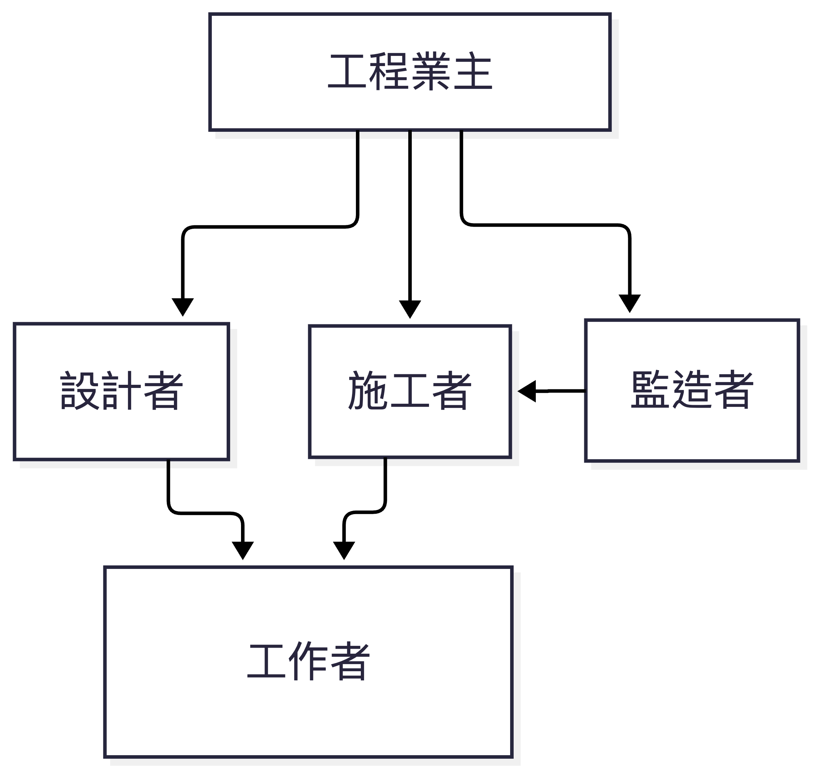{width="100%"}

> 台灣指引強調「工程業主為核心」，但業主本身不直接執行風險評估，而是透過契約要求設計者與施工者辦理，並由監造者監督。

------------------------------------------------------------------------

## 角色對照：英國 CDM vs 台灣指引

| 功能角色 | 英國 CDM 2015 | 台灣職安署指引（第三版） | 差異分析 |
|:---|:---|:---|:---|
| **業主** | Client：負主動管理責任，須任命主導設計者與主導施工者 | 工程業主：採購管理、監督審核、建立風險平台 | 英國業主**法定義務更重**，須確保資源與時間充足 |
| **設計階段整合者** | Principal Designer：專責協調設計風險；必須是設計師 | 主要設計者：彙整各設計者成果；職責較偏文書彙整 | 英國 Principal Designer **決策權與協調權更明確** |
| **施工階段整合者** | Principal Contractor：統籌施工安全管理 | 主要施工者：彙整風險評估成果、編製報告 | 英國 Principal Contractor **須制定施工階段計畫** |
| **設計者** | Designer：須達成「合理可行」的風險消除 | 設計者：實施設計階段風險評估，編製安衛圖說與經費 | 英國設計者須與 Principal Designer **密切協作** |
| **施工者** | Contractor：遵循施工階段計畫 | 施工者：施工規劃評估、作業前調查、變更評估 | 英國施工者須遵循**上級協調指令** |
| **第三方監督** | HSE 檢查；無強制監造角色 | 監造者：訂定安衛監督查核計畫 | 台灣有**法定監造角色**，英國無 |

------------------------------------------------------------------------

## 風險評估範圍的比較

| 階段 | 英國 CDM 2015 | 台灣職安署指引 |
|:---|:---|:---|
| **可行性/規劃** | 業主與主導設計者須確保初步設計納入安全考量 | 可行性研究：風險及不定性分析；綜合規劃：安全衛生初步規劃 |
| **設計階段** | 設計者須依「一般預防原則」消除或降低風險；殘餘風險須傳遞 | 設計階段風險評估：方案評選、施工風險評估、風險處理 |
| **施工前規劃** | 主導施工者制定 Construction Phase Plan | 施工規劃階段風險評估 + 施工計畫 |
| **作業前** | Contractor 提供工地安全教育及資訊 | 作業前危害調查、評估及勤前教育 |
| **變更管理** | Management of Change（MOC）精神 | 工程變更施工風險評估 |
| **使用維護** | Health & Safety File + 維護資訊 | 使用維護手冊 + 施工風險管理報告 |

------------------------------------------------------------------------

## 英國 CDM 的核心工具

### 1. Pre-construction Information（施工前資訊）

業主須提供給設計者與施工者的資訊，包括：

- 專案描述、關鍵時程

- 已知危害（如**石綿調查**、地下管線）

- 既有安全檔案（如有）

- 管理安排（合作、協調機制）

> 「施工前資訊」是設計者進行風險評估的起點（HSE L153, Appendix 2）

## 2. Construction Phase Plan（施工階段計畫）

主導施工者制定，內容須包括：

- 安全管理安排

- 工地規則

- Schedule 3 特定高風險作業的特別措施

> 相當於台灣的「施工計畫」加上「風險評估報告」

## 3. Health & Safety File（安全檔案）

竣工後移交業主，供未來維護、改建、拆除使用：

- 結構設計原則

- 殘餘風險資訊

- 危險材料位置

- 設備維護資訊

> 相當於台灣的「使用維護手冊」+「施工風險管理報告」

------------------------------------------------------------------------

## 風險評估方法的對照

| 方法論面向 | 英國 CDM 2015 | 台灣職安署指引 |
|:---|:---|:---|
| **風險定義** | 未明確定義，但沿襲 HSE 既有架構 | 參考 ISO 31000：可能性 × 嚴重度 |
| **風險矩陣** | 未強制規定特定矩陣 | 提供 3×3 與 5×5 矩陣範例 |
| **ALARP 原則** | 明確採用「合理可行（reasonably practicable）」 | 明確定義「最低合理可行範圍（ALARP）」 |
| **一般預防原則** | Appendix 1 列出 9 項原則（如源頭控制、集體優於個人） | 指引中雖未獨立列出，但風險對策階層（消除、降低、工程、管理、防護具）與其一致 |
| **評估表單** | 無制式表單，由專業人員依實務判斷 | 提供簡易版、基本版、標準版三種表單範例 |

------------------------------------------------------------------------

## 英國 CDM 的「一般預防原則」（General Principles of Prevention）

英國 HSE《建築設計與管理法規 2015 (CDM 2015)》附錄 1 (Appendix 1) 要求所有設計者、主導設計者、主導施工者、施工者在執行職務時，必須考量 **Management Regulations 1999 Schedule 1** 的九項原則（HSE L153, Appendix 1）：

1.  **避免風險** (avoid risks)。

2.  **評估無法避免的風險** (evaluate the risks which cannot be avoided)。

3.  **從源頭對抗/控制風險** (combat the risks at source)。

4.  **使工作適應個人 (人因工程)** (adapt the work to the individual)：特別是在工作場所的設計、工作設備的選擇，以及工作和生產方法的選擇上。其主要目的是減輕單調工作或固定節奏的工作，從而降低這些工作對健康的影響。

5.  **配合技術的進步進行調整** (adapt to technical progress)。

6.  **以無危險或較低危險的事物取代危險事物** (replace the dangerous by the non-dangerous or the less dangerous)。

7.  **制定連貫的整體預防政策** (develop a coherent overall prevention policy)：該政策應涵蓋技術、工作組織、工作條件、社會關係以及與工作環境相關因素的影響。

8.  **集體防護措施優先於個人防護措施** (give collective protective measures priority over individual protective measures)。

9.  **給予員工適當的指示與指導** (give appropriate instructions to employees)。

> 這套原則與台灣指引的「風險對策階層」（消除、降低、工程、管理、防護具）實質一致，但英國更強調 **組織政策與社會關係**。

------------------------------------------------------------------------

## 台灣與英國風險管理流程對照

| 步驟 | 英國 CDM 2015 | 台灣職安署指引 |
|:---|:---|:---|
| 1\. 界定範圍 | 業主設定專案目標、時程、資源（Reg.4） | 界定範圍、內容及準則（5.2.2） |
| 2\. 風險辨識 | 設計者辨識設計風險；主導設計者協調（Reg.9,11） | 辨識工址環境、工程需求、作業潛在危害 |
| 3\. 風險分析 | 依一般預防原則分析 | 分析可能性與嚴重度，計算風險值 |
| 4\. 風險評量 | 決定風險是否「合理可行」處理 | 依風險等級（極高/高/中/低/極低）決定處理優先順序 |
| 5\. 風險處理 | 設計者→消除/降低；主導設計者→資訊傳遞；主導施工者→施工階段計畫 | 消除→降低→工程控制→管理控制→個人防護具 |
| 6\. 資訊傳遞 | Pre-construction Information → Construction Phase Plan → Health & Safety File | 設計階段報告 → 施工規劃報告 → 施工風險管理報告 → 使用維護手冊 |
| 7\. 監督與審查 | 業主確保主導設計者與主導施工者履行職責；HSE執法 | 業主審核、監造者監督查核、主管機關檢查 |

------------------------------------------------------------------------

## 實際案例：高架作業墜落風險

### 英國 CDM 2015 的處理方式

1.  **設計階段**：設計師是否可在屋頂設計永久護欄或錨點？是否可將空調主機移至地面？

2.  **施工前資訊**：業主提供既有結構圖、墜落風險區域

3.  **施工階段計畫**：主導施工者訂定安全網、護欄、個人防墜系統

4.  **安全檔案**：竣工後記錄需維護的墜落防護設備位置及檢測週期

### 台灣指引的處理方式

1.  **設計階段**：設計者實施風險評估，繪製安全衛生設施參考圖說（如護欄標準圖）

2.  **施工規劃**：施工者擬定施工計畫，納入墜落預防措施

3.  **作業前危害調查**：每日確認護欄、安全母索、安全帶勾點

4.  **使用維護手冊**：記錄維護時高空作業的安全要求

> **差異**：英國 CDM 要求設計階段即需評估「維護時的安全」，並將資訊傳遞至安全檔案；台灣指引亦有類似要求（使用維護手冊），但實務落實度仍有加強空間。

------------------------------------------------------------------------

## 對營造業甲種業務主管的啟示

| 英國 CDM 優點 | 可借鏡之處 |
|:---|:---|
| **業主責任明確** | 業主應在契約中明確要求設計者與施工者的風險評估義務，並提供足夠工期與經費 |
| **Principal Designer 專業角色** | 大型營造工程可考慮設置類似「設計安全協調人」角色，專責整合設計風險 |
| **Construction Phase Plan** | 施工計畫應整合各工項風險評估成果，成為工地日常管理的核心文件 |
| **Health & Safety File** | 竣工時應交付完整的安全檔案，不僅供查核，更要讓未來維護者能安全作業 |

------------------------------------------------------------------------

## 結論：英國 CDM 的核心精神

> **「安全不是檢查表，而是從設計到拆除的持續對話」**

1.  **責任分配明確**：業主、設計者、施工者各有明確且不可轉嫁的法定職責。

2.  **風險資訊流動**：Pre-construction Information → Design Risk Information → Construction Phase Plan → Health & Safety File，形成完整追蹤鍊。

3.  **設計階段是關鍵**：約 70% 的風險可在設計階段消除或降低，成本最低、效果最好。

4.  **工作者參與**：CDM 明確要求主導施工者須諮詢工作者並讓他們參與安全決策。

::: callout-important
> 安全是設計出來的！
:::

------------------------------------------------------------------------

## 結語：台灣實務

- 台灣指引已具備與國際接軌的基礎架構（設計階段評估、作業前調查、變更管理、使用維護手冊）。

- 強化重點：

  1.  提升**業主主動管理**的意識與能力

  2.  加強**設計階段與施工階段**的風險資訊傳遞機制

  3.  參考 CDM 的 **Construction Phase Plan** 概念，將風險評估真正融入日常工地管理

  4.  建立**安全檔案（Health & Safety File）** 的標準格式與交付義務

> ::: callout-caution
> 甲種業務主管應扮演 **風險溝通橋樑**，確保設計端的風險資訊能確實傳遞至施工端與維護端。
> :::

------------------------------------------------------------------------

## Q & A

**參考文獻**：

- HSE (2015). *Managing health and safety in construction: Construction (Design and Management) Regulations 2015. Guidance on Regulations (L153)*. Health and Safety Executive.

- 勞動部職業安全衛生署 (2025). *營造工程風險評估技術指引（第三版）*.

- 勞動部職業安全衛生署. *營造工程施工風險評估技術指引解說手冊（核定版）*.

# 課程與本講義聲明

- 本網頁資訊供職安衛專業人員課程使用，在合理使用上（不涉及商業營利）原則下，歡迎分享，以充實職安衛專業與防止職災。

- 本網頁內容雖有參考依據，但仍有ＡＩ工具之協助與應用，正確性上容有疏誤，職安衛專業人員仍應參考相關法規、資訊與指引等，做出正確判斷。

- 本網頁講義可透過列印功能，做成ＰＤＦ電子檔案，不另行提供紙本。

::: callout-note
講師：何明信 職安衛技師、退休專業檢查員 2026-05
:::
