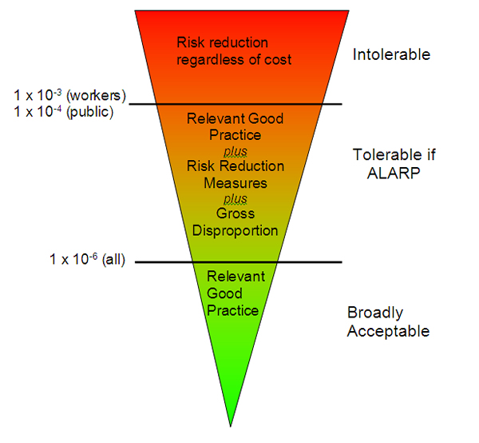
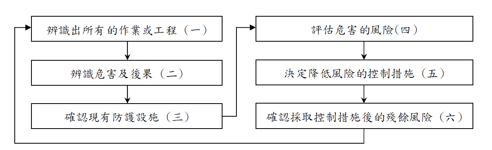

## 講師簡介

- 姓名：何明信

- 學歷：成大環醫所 、職安衛技師

- 經歷：檢查員30年 (製造、危機設、營造、化工職衛科、專委)

- 現職：114年退休

- E-mail：msho7336959\@gmail.com

# 1.教材內容

## 壹、前言

- 人類生活環境到處存有危害因素：能造成傷亡、財物損壞或健康影響。
- **風險評估**是現代安全及健康管理的基礎，包含三個步驟：
  1.  危害辨識
  2.  風險評估
  3.  風險控制

> 雇主與產品製造者須遵守職業安全衛生法規，並正確理解「危害」與「風險」。

## 一、危害？

- **危害**：一種能源或情況，具有潛在可能引致人體傷害、健康受損、財物毀壞或其組合。
- 三個重要元素：
  - 物品及行動（機器、物質、工作方法）
  - 結果（傷害、健康受損、毀壞財物）
  - 潛在危險

> 辨識危害需依靠觀察、專業知識與提問：「如果這樣做，會發生什麼？」

## 二、風險？

- **風險**：危害事故發生的可能性 × 嚴重性。
- 數學式：風險 = 機率 × 損失。

### 常見風險分類

| 分類方式 | 類型                 |
|----------|----------------------|
| 風險性質 | 純粹風險、投機風險   |
| 產生環境 | 靜態風險、動態風險   |
| 發生原因 | 自然、社會、經濟風險 |
| 損失對象 | 財產、人身、責任風險 |

## 風險認知與整合

- 危害辨識會產生不同程度的風險（主要、重要、一般）。
- 需對風險進行評級，優先處理主要的，次要的可容忍甚至不處理。**(WHY ?)**
- **整合性風險管理(IRM)**結合保險與財務技術，管理可保風險、財務風險、作業風險。

> 英國HSE將風險分為：不可容忍、可容忍(ALARP)、不需考慮、無足輕重。(？)
>
> {width="60%"}

## 危害辨識方法

- 目的：識別作業環境中的化學、物理、生物、人因及心理危害。
- 步驟：(限 化學性？)
  1.  確認使用物質與特性
  2.  了解健康影響（毒物學知識）
  3.  尋找暴露途徑（吸入、皮膚、食入）

> 可參考IPCS、IARC、UNEP-IRPTC等國際資料庫。

## 危害分類

- 基本三元素：
  1.  工作場所特徵
  2.  接觸模式（頻率、量、時間）
  3.  危害評估與計量
- 沒有單一技術適用所有場所，需依目標、大小、產品種類選擇方法。

### 工作場所特徵 & 接觸模式

- **工作場所特徵**：
  - 不同部門、製程階段
  - 密閉系統/開放系統
  - 新廠設計時即辨識危害
- **接觸模式**：
  - 吸入、皮膚接觸、偶然食入
  - 直接或間接暴露
  - 暴露組概念（相同暴露群）

## 危害辨識程式 ?

### 評估與計量

- 參考流行病學、毒理學、臨床與環境研究
- 使用SDS（安全資料表），標明濃度、CAS號、TLV值

### 化學、生物及物理因子 ?

- **化學物質**：氣體、蒸氣、液體、氣膠（粉塵、煙、霧）
- **暴露評估**：決定暴露量、頻率、持續時間
  - 參考EN689 (CEN1994)
  - 重視可呼吸性粉塵，必要時生物監測

## 職業衛生實施三方面 ?

1.  **最初檢查**：是否過度暴露 → 決定是否干預
2.  **追蹤監測**：控制改動時監控效能
3.  **流行病學研究**：高精確度定量暴露

> 歷史暴露數據應精準記錄以備將來分析。

## 危害分析評估及量化 (半量化？)

### 可能性描述表

| 可能性     | 描述                   |
|------------|------------------------|
| 很有可能   | 時常重複發生，預料之中 |
| 頗可能     | 多次發生               |
| 可能       | 有時發生               |
| 可能性極微 | 不大可能但可想像       |
| 幾乎不可能 | 或然率接近零           |

### 嚴重性

- 從無傷害到死亡，包括環境/財物損失。
- 需依每種危害特質判斷，不可全視為「嚴重」。

## 風險計算公式 (是這樣嗎?)

> 風險的法律定義是指某危害（危險）事故發生的可能性兼嚴重性，

計算式可寫成：

- 風險＝某危害事故發生可能性x某危害事故的嚴重性風險(Risk) ＝ 可能性(Likelihood) x嚴重性(Severity) } (1)

嚴重性與危害及暴露時間有關，因此

- 嚴重性＝危害(Hazard) x暴露(Exposure) } (2)

而暴露與濃度／能量／劑量及時間有關，因此

- 暴露＝濃度／能量／劑量(Concentration/Energy/Dose) x時間 (Duration) } (3)

把程式(2)及(3)代入程式(1)

- 風險 ＝危害 x濃度／能量／劑量 x 時間 x 可能性 }(4)

::: callout-warning
留意這段話 (教材 p135)..... ，別被誤導.....
:::

## 參、製程安全評估 

### (外洩中毒、火災、爆炸案件)

### 一、安全評估概述

- 重大工業災害（如毒氣外洩）促使各國制定標準：
  - 歐盟《重大事故危害防範規則》
  - 美國OSHA《高危險性化學物質製程安全管理標準》
- **目的**：預防或減低因毒性、反應性、易燃、爆炸性物質外洩引起的危害。

## 二、製程安全資訊收集與分析

### (一) 製程安全資訊

1.  **有害化學物質資料**：毒性、暴露濃度、物理/反應/腐蝕/熱安定性等。
2.  **製程技術資料**：流程圖、化學、最大存量、安全操作條件。
3.  **製程設備資料**：材質、管線儀器圖、電器分級、緊急釋壓、通風等。

### (二) 製程危害分析

- 系統化辨識重大潛在危害，分析因果關係，評估後果重要性。
- 考慮因素：歷史事故、工程/管理管制、設備配置、人為因素、控制失誤。

## 製程危害分析方法

| 方法            | 特點                       |
|-----------------|----------------------------|
| What-if         | 腦力激盪，開放式問題       |
| 檢核表          | 簡易，但可能遺漏           |
| What-if/檢核表  | 合併兩者                   |
| Hazop           | 引導字系統化，完整定性分析 |
| FMEA            | 設備失效模式分析           |
| 故障樹分析(FTA) | 量化找出機率最高因素       |

> 事業單位可選擇一種以上方法。

## 三、安全評估工具與方法

### (一) 初步危害分析

- 用於建廠初期或首次評估，找出重大危害，不深入。

### (二) 分析小組

- 包含：製程專家、熟悉方法人員、工業安全、維修、電機、文書等。

### (三) 結果及建議

- 應記錄改善計畫，追蹤執行情況。
- 五年（或製程修改30日前）報請檢查機構備查。

## 肆、結語

- 國內以往偏重工程技術，未整合管理。
- **製程安全管理**：以管理制度為基礎，整合技術與人員，辨識、了解、控制潛在危害。
- 唯有整合性管理才能充分發揮安全技術的功能。 **(？)**

> 參考文獻： 1. 工業安全風險評估，王世煌，2002。 2. OHSAS 18001 / ILO-OSH 2001 等。

## 附件：風險評估作業流程

1.  **辨識所有的作業或工程**

2.  **辨識危害及後果**

3.  **確認現有防護設施**（工程控制、管理控制、個人防護具）

4.  **評估危害的風險**（可能性×嚴重性，等級判定）

5.  **採取降低風險的控制措施**（消除→取代→工程→管理→ PPE）

6.  **確認控制後的殘餘風險**，定期監督

7.  **記錄與傳達**，定期檢討

## 附件：風險評估方法選擇考量

- 安全衛生法規要求（如危險性工作場所）

- 工作場所性質（固定/臨時）

- 製程特性（自動化、開發性）

- 作業特性（重複/偶發）

- 技術複雜度

> 例如：自動化製程 → HazOp, FTA；維護保養 → 工作安全分析(JSA)

## 附件：安全衛生法規與TOSHMS要求

- **職安法管理辦法第12-1條**：訂定管理計畫，包含危害辨識、評估及控制。

- **危險場所審查辦法**：甲、乙、丙類執行製程安全評估，丁類施工安全評估。

- **TOSHMS指引**：先期審查、目標設定、預防控制（優先消除危害）、變更管理等。

# 2. 風險評估技術指引 內容介紹

## 前言

- 依據《職業安全衛生管理辦法》第12-1條及《職安法施行細則》第31條，雇主應訂定管理計畫，執行危害辨識、評估及控制。
- 本指引協助事業單位建立及推動職業安全衛生管理系統（TOSHMS），提出風險評估的基本原則、作業流程及建議性作法。

> 包含： 1. 簡介 2. 適用範圍 3. 用語與定義 4. 作業流程及基本原則 5. 參考文件 附錄一：技術指引補充說明 附錄二：安全衛生法規及TOSHMS相關要求

## 一、簡介

- **目的**：適當地執行風險評估，可建置完整職業安全衛生管理計畫或系統，預防或消減災害，提升管理績效。
- **風險評估定義**：辨識、分析及評量風險之程序。
- **非強制性**：[本指引非唯一方法]{.underline}，事業單位可參考原則選擇適合其規模與特性的方法。
- **應優先考量**：安全衛生法規要求（如附錄二）。

## 二、適用範圍

- 適用於須建立及執行工作環境或作業危害辨識、評估及控制之事業單位。
- 也可用於符合職業安全衛生管理系統相關規範（如TOSHMS）。
- **其他風險**：製程安全評估、化學品、重複性作業、異常工作負荷等應另依勞動部相關指引辦理。

## 三、用語與定義

- 本指引採用與TOSHMS相同的用語與定義。
- **風險評估**（本法第5條第2項、施行細則第31條）：指辨識、分析及評量風險之程序。
- 與「危害之辨識、評估及控制」同義。

## 四、風險評估之作業流程及基本考量

### 作業流程圖

{width="100%"}

## （一）辨識所有的作業或工程

1.  建立、實施及維持風險評估管理計畫或程序。

2.  依安全衛生法規、工作環境規模與特性選擇適合的方法。

3.  有熟悉作業的員工參與。

4.  執行人員應接受教育訓練。

5.  涵蓋所有工作環境及作業，考量以往危害事件。

6.  依製程、活動或服務流程辨識出所有相關作業。

7.  涵蓋例行性、非例行性作業，以及承攬人、供應商、訪客等所有組織控制下人員的作業。

## （二）辨識危害及後果

1.  事先界定潛在危害的分類或類型。

2.  對所辨識的作業蒐集相關資訊。

3.  針對危害源，辨識所有潛在危害、發生原因及合理最嚴重的後果。

> **危害類型參考**（詳見附錄一）：墜落、跌倒、衝撞、物體飛落、倒塌、被撞、被夾/被捲、刺割擦傷、踩踏、溺斃、與高低溫接觸、與有害物接觸、感電、火災、爆炸、物體破裂、不當動作、化學品洩漏、環保事件、**職業病**、交通事件等。

## （三）確認現有防護設施

- 依所辨識的危害及後果，確認現有可預防或降低可能性、減輕嚴重度的防護設施。

- 必要時分為：

  - **工程控制**：護欄、安全裝置、通風、洩漏偵測、防爆設備等。

  - **管理控制**：教育訓練、標準作業程序、工作許可、變更管理等。

  - **個人防護具**：呼吸防護具、防護衣、安全帽、安全帶等。

## （四）評估危害的風險

- 風險 = 嚴重度 × 可能性

- 不必精確量化，可設計簡單的風險等級判定基準（如4x4矩陣）。

- 有害物暴露之健康風險評估須參考作業環境測定結果。

### 嚴重度分級基準（例）

| 等級    | 人員傷亡                 | 危害影響範圍         |
|:--------|:-------------------------|:---------------------|
| S4 重大 | 死亡1人以上或3人以上受傷 | 大量洩漏，影響廠外   |
| S3 高度 | 永久失能                 | 中量洩漏，影響廠內外 |
| S2 中度 | 外送就醫，工時損失       | 少量洩漏，廠內局部   |
| S1 輕度 | 急救處理，無工時損失     | 微量洩漏，設備附近   |

### 可能性分級基準（例）

| 等級        | 預期發生頻率 | 防護設施完整性       |
|:------------|:-------------|:---------------------|
| P4 極可能   | ≥1次/年      | 未設置必要防護設施   |
| P3 較有可能 | 1\~10年1次   | 僅部分設施，未維護   |
| P2 有可能   | 10\~100年1次 | 已設置必要設施且維護 |
| P1 不太可能 | \<100年1次   | 額外設施且定期維護   |

### 風險矩陣（4x4例）

| 嚴重度\\可能性 | P4  | P3  | P2  | P1  |
|:---------------|:----|:----|:----|:----|
| S4             | 5   | 4   | 4   | 3   |
| S3             | 4   | 4   | 3   | 3   |
| S2             | 4   | 3   | 3   | 2   |
| S1             | 3   | 3   | 2   | 1   |

> 風險等級：5（重大）、4（高度）、3（中度）、2（低度）、1（輕度）

## （五）採取降低風險的控制措施

- **不可接受風險**判定基準：違反法規者須納入；其餘可依風險等級統計及可用資源逐年調整。

- 控制措施優先順序：

  1.  消除（如本質安全設計）

  2.  取代（如低危害物質）

  3.  工程控制（如連鎖停機）

  4.  管理控制（如SOP、訓練）

  5.  個人防護具

> 風險控制規劃（例）：
>
> 重大/高度風險須立即或限期改善，
>
> 中度風險逐步降低，
>
> 低度/輕度風險維持現有防護設施。

## （六）確認控制措施後的殘餘風險

- 評估控制後的殘餘風險（預估嚴重度與可能性是否降低）。

- 若無法達成預期效果，須修正或另提控制措施。

- 控制措施完成後，納入績效監督與量測，並作為管理審查輸入。

> 範例：局限空間作業，原風險等級4（高度），增設攜帶式四用氣體偵測警報器、緊急應變計畫及定期演練後，可能性由P3降為P1，殘餘風險降為中度。

## （七）其他相關事項

- **風險管理原則**（共11項）：創造價值、融入組織程序、輔助決策、明確不確定性、系統性結構化、依可靠資料、客製化、考量人性文化、透明全面、動態循環、促進持續改善。

- **記錄保存**：至少保存三年（第一類事業300人以上）。

- **結果應用**：用於目標設定、訓練、監督查核、緊急應變、文件修正等。

- **定期檢討時機**：法規修改、製程變更、新知技術、事件調查、監督量測失效等。

## 五、參考文件

- （一）職業安全衛生管理辦法

- （二）臺灣職業安全衛生管理系統指引（TOSHMS）

- （三）CNS 15506（同OHSAS 18001）

- （四）CNS 15507（指導綱要）

- （五）ILO-OSH 2001

- （六）OHSAS 18001:2007

- （七）BS 8800:2004

## 附錄一：補充說明

### 風險評估方法的選擇

- 無單一方法適用所有情況。

- 考量因素：

  - 安全衛生法規要求（如危險性工作場所須用：檢核表、What-If、HazOp、FTA、FMEA等）

  - 工作場所性質（固定/臨時）

  - 製程特性（自動化/開發性）

  - 作業特性（重複/偶發）

  - 技術複雜度

> 例：自動化製程 → HazOp, FTA；維護保養 → 工作安全分析（JSA）

## 工作安全分析（JSA）範例

### 步驟一：辨識作業

- 作業清查原則：依部門職務、生產流程、涵蓋例行與非例行、涵蓋所有人員（含承攬人、訪客）。

- 表單版本：

  - **基本版**（29人以下）

  - **標準版**（30\~299人）

  - **系統版**（300人以上或須推動管理系統）

### 範例：塔槽清洗作業（系統版）

| 作業編號 | 作業名稱 | 作業週期 | 作業環境 | 機械/設備/工具 | 能源/化學物質 | 作業資格 |
|:------|:------|:------|:-----------|:----------|:----------|:----------------|
| A-01 | 塔槽清洗 | 1-2次/月 | 局限空間、防爆區、動火管制區、高處 | 通風設備、手工具、塔槽 | 丙酮、甲苯、樹脂 | 缺氧作業主管、有機溶劑作業主管、局限空間教育訓練 |

## 危害辨識與後果（範例）

| 危害類型             | 危害可能造成後果之情境描述         |
|:---------------------|:-----------------------------------|
| 與有害物接觸         | 槽內氧氣濃度不足，導致人員窒息     |
| 火災/爆炸            | 危害性物質未清除，清洗中產生明火   |
| 墜落                 | 站立於攪拌葉片上作業，重心不穩掉落 |
| 被夾/被捲            | 誤啟動攪拌機，人員被捲入           |
| 與有害物接觸（緊急） | 未配戴救護設備進入救人，缺氧或中毒 |

## 現有防護設施（範例）

| 工程控制 | 管理控制 | 個人防護具 |
|:------------|:-------------------------------------|:-----------------------|
| 通風設備 | 標準作業程序、工作許可（測定氧氣/有害氣體、外部監視）、進出管制、緊急救援設備（空氣呼吸器、三腳架、救生索） | 安全帶 |

## 風險評估與控制措施（範例）

- 原風險：嚴重度S4（重大），可能性P3（較有可能） → **風險等級4（高度）**

- 降低風險措施：

  1.  作業人員配戴攜帶式四用氣體濃度偵測警報器

  2.  定期維護校正測定器

  3.  制定局限空間作業緊急應變計畫並演練

  4.  緊急救援設備定期檢查保養

- 殘餘風險：嚴重度S4不變，可能性降為P1 → **風險等級3（中度）**

## 附錄二：安全衛生法規及TOSHMS要求

### 一、法規要求摘要

- **本法第5條**：雇主應採取必要預防設備或措施；設計、製造、輸入者於規劃階段實施風險評估。

- **管理辦法第12-1條**：訂定管理計畫，包含危害辨識、評估及控制。

- **設施規則第29-1條**：局限空間作業前訂定危害防止計畫。

- **設施規則第184-1條**：使用危險物前確認危險性，分析化學製程危害。

- **危險性機械設備檢查規則第6條**：特殊儲槽須送風險評估報告。

- **危險性工作場所審查辦法**：甲、乙、丙類製程安全評估，丁類施工安全評估。

- **營造標準第6條**：作業前實施危害調查評估。

## TOSHMS指引要求

### 4.3.1 先期審查

- 辨識、預測、評估危害與風險

- 確定控制措施有效性

### 4.3.3 目標

- 依據風險評估結果訂定具體可量測目標

### 4.3.4 預防與控制措施

- 優先順序：消除 → 工程/管理控制 → 個人防護具

### 4.3.5 變更管理

- 變更前評估危害與風險

## TOSHMS驗證標準（CNS 15506）相關要求

- **4.3.1 危害鑑別、風險評估及決定管制措施**：需考量例行/非例行活動、所有人員、人為因素、外部危害、變更管理等；方法論需主動、文件化；控制措施優先順序（消除→取代→工程→標示/管理→個人防護具）。

- **4.4.2 能力、訓練及認知**：確保人員能力，提供訓練並評估有效性。

- **4.4.3.2 參與及諮詢**：員工應參與危害鑑別與風險評估過程。

- **4.4.6 作業管制**：對已鑑別危害實施管制，含變更管理。

- **4.4.7 緊急應變**：鑑別潛在緊急狀況，預防減緩後果。

- **4.5.1 績效量測**：將風險納入量測方法選擇。

- **4.5.3.2 不符合、矯正及預防**：措施前需進行風險評估。

- **4.5.5 內部稽核**：依風險與先前稽核結果規劃稽核方案。

## 總結

- 風險評估是職業安全衛生管理系統的核心。

- 遵循本指引作業流程（七大步驟）可有效辨識、評估及控制風險。

- 選擇適合事業單位特性的方法（如JSA、HazOp、FTA等）。

- 控制措施優先消除危害，而非依賴個人防護具。

- 記錄保存、定期檢討、持續改善。

- 符合法規及TOSHMS要求，可提升安全績效，達成永續經營。

> 📌 本簡報依據職安署104年12月4日修正之《風險評估技術指引》製作，實際執行請參閱最新法規及指引原文。

參考資料：勞動部職業安全衛生署（104年）[風險評估技術指引](https://www.osha.gov.tw/48110/48713/48735/60256/)

## 我的看法：

### 1.教材基本上參照指引製作

### 2.指引有點老舊，涵蓋性不足，學員可以自我擴充...

# 3. 製程安全風險評估內容介紹

## 前言

- **法源依據**：職業安全衛生法第15條、製程安全評估定期實施辦法。
- **適用對象**：甲類危險性工作場所（石油裂解、危害性化學品達一定量）。
- **兩大時機**：
  1.  **每5年**定期實施製程安全評估
  2.  **製程修改**時（既有安全防護措施無法控制新潛在危害）

> 本簡報聚焦於「製程安全風險評估」之核心要求與實務作法。

## 一、製程修改之判定

### 製程修改定義

> 危險性工作場所既有安全防護措施未能控制新潛在危害之**製程化學品、技術、設備、操作程序或規模**之變更。

## 新潛在危害之三種類型

| 類型 | 說明 | 範例 |
|:---|:---|:---|
| **新災害類型** | 與前次評估相比，出現全新危害類型 | 反應器高壓破裂（物理性爆炸） |
| **不同危害情境，相同災害類型** | 不同原因或演變過程導致相同災害 | 管線腐蝕洩漏 vs 高壓破裂洩漏，皆引發火災 |
| **增加原災害類型嚴重度** | 影響人數增加、後果範圍擴大 | 增加易燃液體使用量，擴大洩漏影響範圍 |

## 製程修改之實務範例（化學品變更）

- ✅ 將惰性氣體改為氟氣 → 既有防護無法控制毒性 → **製程修改**

- ✅ 粒狀改粉狀 → 新增粉塵爆炸危害 → **製程修改**

- ✅ 氣態改液態 → 蒸氣雲爆炸/池火，情境不同 → **製程修改**

- ✅ 提高過氧化氫濃度（8%→65%）→ 爆炸潛在危害 → **製程修改**

- ✅ 0.5% PH₃/He 改為 100% PH₃ → 洩漏後果加劇 → **製程修改**

## 製程修改實務範例（技術/設備/程序/規模）

- **技術**：調高操作溫度使液態變氣液兩相，原設備無法控制 → 修改

- **設備**：碳鋼管線改不鏽鋼，但鄰海產生應力腐蝕（新情境）→ 修改

- **程序**：改變加料順序，增加未反應物累積，反應失控加劇 → 修改

- **規模**：矽甲烷儲存量超出原設計數量 → 修改

> 📌 增加同類型機台但擴大影響範圍，或提高操作量導致反應失控風險上升，均屬製程修改。

## 二、定期製程安全評估

### 評估頻率與啟動條件

- **每5年**定期實施（自上次備查日、審查合格日或重新評估日起算）

- **製程修改日之30日前**報請勞動檢查機構備查

- **事故發生後應檢討**：死亡、3人以上罹災、火災爆炸、有害氣體洩漏等

### 評估報告內容（14大項）

製程安全資訊、製程危害控制措施、勞工參與、標準作業程序、教育訓練、承攬管理、啟動前安全檢查、機械完整性、動火許可、變更管理、事故調查、緊急應變、符合性稽核、商業機密。

## 評估小組成員

| 成員             | 資格要求                     |
|:-----------------|:-----------------------------|
| 工作場所負責人   | 具管理權責                   |
| 製程安全評估人員 | 受國內外專業訓練，經中央認可 |
| 職業安全衛生人員 | 依管理辦法設置               |
| 工作場所作業主管 | 現場管理                     |
| 熟悉作業之勞工   | 非主管之操作人員             |

> 若無製程安全評估人員，得以工業安全技師＋化學工程/工礦衛生/機械/電機技師任之。

## 製程安全評估方法（至少一種）

| 方法                       | 特性                 |
|:---------------------------|:---------------------|
| 如果-結果分析 (What-If)    | 開放式腦力激盪       |
| 檢核表 (Checklist)         | 結構化檢查           |
| What-If/檢核表             | 合併兩者             |
| 危害及可操作性分析 (HazOp) | 引導字系統化，最常用 |
| 失誤模式與影響分析 (FMEA)  | 設備失效為中心       |
| 故障樹分析 (FTA)           | 量化找出根本原因     |

> 初步危害分析 (PrHA) 用以發掘重大潛在危害，再針對重大項選用上述方法。

## 三、製程危害控制措施

### 評估應考量項目

- 製程危害辨識（含廠內及同業事故）

- 既有工程/管理控制措施

- 危害控制失效之後果（合理最嚴重）

- 設備設施設置地點（相互影響）

- 人為因素（人因工程、人機介面、疲勞等）

- 控制失效對勞工安全健康之定性評估

### 風險控制優先順序

1.  **消除**（本質安全設計）

2.  **取代**（低危害物質）

3.  **工程控制**（連鎖、釋壓、防護）

4.  **管理控制**（SOP、訓練、許可）

5.  **個人防護具**

## 四、啟動前安全檢查 (PSSR)

### 適用時機

- 新建設備引入危害性化學品前

- 製程單元重大修改後啟動前

### 檢查項目

- ✅ 建造及設備符合設計規範

- ✅ 完成安全、操作、維修及緊急應變程序

- ✅ 完成製程危害分析及變更管理，相關建議已改善

- ✅ 已對相關勞工實施教育訓練

> 缺失分A/B級：A級須啟動前完成改善，B級可啟動後限期改善。

## 五、變更管理與製程安全

### 變更管理程序要件

- 建立書面程序（授權、審查、核准）

- 變更前須考量：

  - 技術依據

  - 安全衛生影響評估

  - 操作程序修改

  - 必要期限

  - 授權要求

- 啟動前對相關人員教育訓練

- 更新受影響之製程安全資訊、操作程序

> 📌 無法判斷是否屬變更管制範圍者，應視同變更案件處理。

## 六、製程安全資訊 (PSI)

### 必要內容

| 類別 | 資訊項目 |
|:---|:---|
| **化學品危害** | 毒性、容許濃度、物理/反應/腐蝕/熱安定性、混合危害 |
| **製程技術** | 流程圖、化學反應資料、最大存量、安全操作上下限、偏移後果 |
| **製程設備** | 建造材料、P&IDs、防爆分區、釋壓系統、通風、設計規範、質能平衡、安全連鎖 |

> PSI是執行所有製程安全管理要素的基礎，應隨時更新。

## 七、機械完整性 (MI)

### 涵蓋設備

壓力容器與儲槽、管線（含閥件）、釋壓及排放系統、緊急停車系統、控制系統（警報連鎖）、泵浦。

### 核心要求

- 建立書面檢查/測試/預防性維護程序

- 維修人員接受製程概要與危害認知訓練

- 檢查測試頻率符合法規及工程規範，並依經驗定期檢討

- 超出操作界限未矯正前不得繼續操作

- 品質保證計畫（材質、安裝、備品）

## 八、符合性稽核

- **頻率**：至少每3年一次

- **範圍**：所有製程安全管理要素

- **稽核人員**：至少一位熟知製程之人員

- **產出**：稽核報告（含不符合事項、矯正措施）

- **保存**：至少最近二次稽核報告

> 稽核結果須與相關部門、勞工及承攬人溝通。

## 九、緊急應變與製程安全

### 計畫應包含

- 應變組織與指揮官權責

- 疏散程序與路徑

- 重要操作人員疏散前程序

- 搶救與醫療責任

- 危害物質控制程序

- 應變設備與外援聯繫

- **演練計畫**（涵蓋各種可能緊急狀況，依PHA結果制定）

### 演練要求

- 每年至少一次廠級演練

- 所有緊急狀況清單在一定週期內演練完畢

- 留存演練紀錄至少3年

## 十、事故調查與製程安全

### 調查範圍

- 職業災害、火災、爆炸、有害氣體洩漏

- **虛驚事件**及可能造成上述事件之製程異常

### 調查小組

- 至少一位熟知製程之人員

- 涉及承攬作業須納入承攬人勞工

### 報告內容（保存5年以上）

事故日期、調查開始日、經過描述、發生原因、改善建議

> 調查結果應與相關作業人員（含承攬人）溝通，並作為教育訓練教材。

## 總結

| 要項             | 核心重點                         |
|:-----------------|:---------------------------------|
| **製程修改判定** | 新潛在危害 + 既有防護不足        |
| **定期評估**     | 每5年，14大項，由合格小組執行    |
| **評估方法**     | HazOp、What-If、FMEA、FTA等      |
| **變更管理**     | 啟動前評估、核准、訓練、文件更新 |
| **啟動前檢查**   | 確保設計、程序、訓練、改善完成   |
| **機械完整性**   | 生命週期管理，檢查測試計畫       |
| **符合性稽核**   | 每3年，含製程人員參與            |
| **緊急應變**     | 依PHA情境演練，定期修正          |

📌 **落實製程安全風險評估，有效預防重大災害，保障勞工與社區安全。**

## 參考資料

1.  **勞動部職業安全衛生署（110年12月）**。《甲類工作場所製程修改之安全評估實務參考手冊》。

2.  **勞動部職業安全衛生署（106年12月）**。《事業單位實施定期製程安全評估參考手冊》。

3.  **製程安全評估定期實施辦法**（勞動部）。
