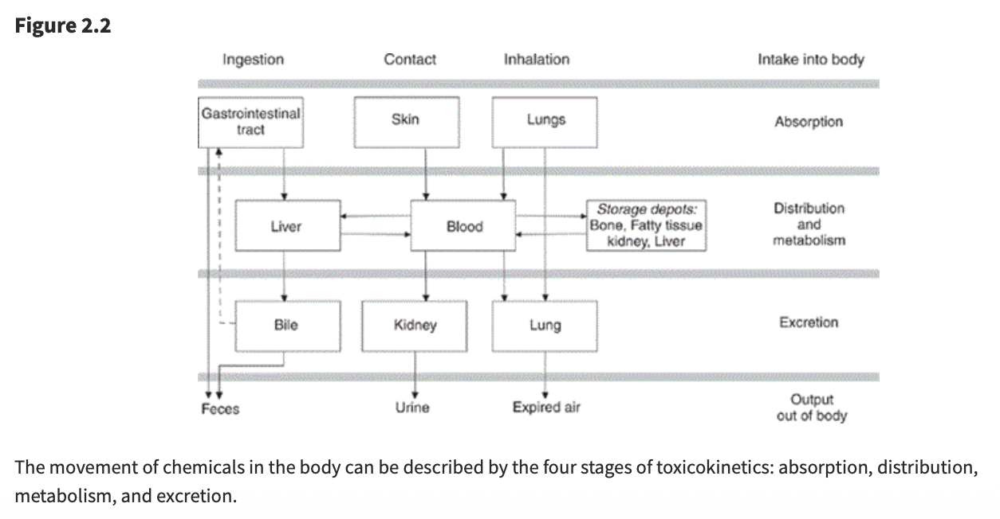

# 職場風險評估總論

## 安全與衛生領域的風險評估

這份教材專為職安衛主管設計，旨在深度解析\*\*安全（Safety）**與**衛生（Hygiene）\*\*兩大領域的風險評估精要。透過通用步驟與與健康（專業毒理學）的並陳，學員將建立起「預見危害、科學評估、有效控制」的全方位預防管理思維，從源頭阻斷職業傷害（意外）與職業病的發生。

## 第一部分：通用風險評估五步驟 (HSE 模式 - 安全導向)

通用風險評估主要聚焦於**即時性、物理性**的傷害。這些危害通常是直觀可見的，依循英國安全衛生執行署（HSE）的經典五步驟（融合我國相關指引），其核心在於透過專業的現場巡查與常識判斷來防止傷亡意外。

### 步驟 1：辨識顯著危害 (Look for the Hazards)

- **管理深度解析**：管理者巡視現場時，應具備「預見性」視角。除了顯而易見的缺失，更要關注「潛在」的不安全狀態。

- **實務範例**：

  - **物理能量可能釋放**：如高壓蒸氣管線的腐蝕劣化、未固定的高壓鋼瓶、運轉中缺乏安全護罩的快速刀片等。

  - **環境動態可能危害**：濕滑地面不只是液體傾倒，也包含環境溼度凝結；堆放雜物不僅堵塞路口，更可能在地震時坍塌造成傷亡。

  - **人機互動介面**：堆高機在盲區的作業、員工因疲勞導致的誤操作情境等。

- **關鍵方法**：採取「行動巡檢」，落實到位查證，及徵詢第一線老員工，詢問：「在哪個作業環節你覺得最不合理？」或「哪台機器曾發生過『差點傷到人』的情況？」。

## 步驟 2：確認可能受到傷害的對象與方式 (Decide Who Might be Harmed)

- **重點**：不要僅列出姓名，而要分析**群體暴露的脆弱性**及其特定的受傷機制。

- **特殊族群考量**：

  - **青少年與新進勞工**：由於缺乏職涯中的「危險記憶」，常會為了追求效率而簡化安全流程。

  - **非固定雇員（承攬商/訪客）**：他們不熟悉廠內特定的應變程序。例如，化學品洩漏報警聲響時，他們可能不知道該往哪裡撤離。

  - **脆弱個體**：包含患有特定慢性病（如心臟病勞工在高溫環境）、孕婦（需防範體力負荷過重）或單獨作業者（發生心肌梗塞或受傷時無人呼救）。

## 步驟 3：評估風險並決定控制措施 (Evaluate and Decide)

- **目標：（ALARP 原則）** 判斷剩餘風險是否已降至「合理可行」的最低限度（As Low As Reasonably Practicable）。這涉及控制成本與風險降低效益之間的平衡。

- **控制層級（Hierarchy of Controls）應用**：

  1.  **消減 (Elimination)**：從設計階段就移除風險，如自動化倉儲取代人工搬運。

  2.  **取代 (Substitution)**：改用較低危險性的作業方式或材料。

  3.  **工程控制 (Engineering)**：這是最應投入預算的環節，如設置連鎖防護、遠端遙控作業。

  4.  **行政管理 (Administrative)**：包括建立作業許可證制度（PTW）、限制高風險區域的進入人數、教育訓練、制定ＳＯＰ等。

  5.  **個人防護裝備 (PPE)**：**嚴禁將 PPE 作為第一線或唯一手段**。主管需指導與監督 PPE 的正確配戴與耗材更換頻率。

## 步驟 4：記錄重要發現 (Record Your Findings)

- **法律與責任**：紀錄不僅是法規要求，更是發生爭議時的「免責與佐證」資料。

- **高品質紀錄的標準**：

  - 必須證明已進行過「適當且充分」的調查。

  - 展示已處理所有顯著危害。

  - 證明控制措施是與風險程度相稱的（Proportionate）。

### 步驟 5：審查與修訂 (Review and Revise)

- **觸發機制**：評估不是終點。當引進新設備、製程變更、或發生「事故或虛驚事故（Near Miss）」時，代表既有危害與風險評估可能存在盲點，必須立即重啟評估流程。

## 第二部分：化學健康風險評估 (毒理學模式 - 衛生導向)

化學品風險評估需具備科學廣度。由於化學傷害具備**長期性、隱蔽性與不可逆性**，管理者必須仰賴毒理學數據而非僅靠肉眼觀察或感覺。

### 1. 危害辨識 (Hazard Identification)

- **資訊解讀能力**：熟練查閱 SDS（安全資料表）第 2、11、15 節。辨識化學品是否具備「三致效應ＣＭＲ」（致癌、致突變、生殖毒性）。

- **環境特徵分析**：分析化學品的飽和蒸氣壓、高揮發性物質在通風不良處會迅速達到有害濃度。

## 2. 危害特徵描述與 ADME 程序 (Hazard Characterization)

- **毒理動力學（Toxicokinetics）解析**：

  - **吸收 (Absorption)**：吸入是職場最危險途徑，肺泡巨大的交換面積使毒素直接進入血流。注意皮膚滲透，某些溶劑會攜帶其他溶質「穿透」防護手套。

  - **分布 (Distribution)**：化學品會儲存於人體「儲存庫」。如鉛儲存於骨骼、脂溶性溶劑存於脂肪。這會導致**動員作用 (Mobilization)**，使員工在停止暴露後血液中仍持續出現毒素。

  - **代謝 (Metabolism)**：肝臟的「活化作用」可能使化學品轉化為強致癌的代謝物。

  - **排泄 (Excretion)**：腎臟功能影響排毒效率。半衰期長的化學品更易造成蓄積性中毒。

{width="100%"}

## 3. 暴露評估與監控邏輯 (Exposure Assessment)

- **定量標準**：不僅看現點濃度，更要計算 **8 小時時量平均濃度 (TWA)、ＳＴＥＬ等**。

- **生物監測 (Biomonitoring)**：必要時透過尿液或血液檢查，確認「總吸收量」，這比單純的環境空氣採樣更能精準反映勞工的真實風險。

### 4. 風險特徵描述與長期效應 (Risk Characterization)

- **潛伏期與慢性疾病**：（例）

  - **慢性肺部損傷**：如石棉引發的肺纖維化、長期粉塵導致的肺氣腫。

  - **癌症風險**：潛伏期常長達 20-40 年。這意味著今日的管理疏失，將在員工退休時以癌症形式顯現。

- **交互作用 (Interactions)**：

  - **協同效應 (Synergy)**：如吸菸勞工暴露於石棉，其癌症風險不是相加而是**相乘**。

  - **相加效應**：多種溶劑同時使用，會累加中樞神經系統的抑制效果。

## 第三部分：安全 vs. 衛生風險評估比較

| 比較項目 | 通用風險評估 (安全 - Safety) | 化學品風險評估 (衛生 - Hygiene) |
|----|----|----|
| **傷害性質** | 急性、即時發生（如骨折、電擊、爆炸傷）。 | 慢性、累積、延遲發生（如癌症、神經萎縮）。 |
| **危害感知** | 危害清晰可見（如漏電、轉動軸、不穩的梯子）。 | 危害常不可見（如無味蒸氣、亞微米粉塵）。 |
| **判定準則** | 機械安全標準、法規淨空間距、承重係數。 | **OEL**（暴露限值）、**TWA**、**ADME** 分布模型。 |
| **可逆性** | 外科損傷通常可修復。 | 器官損傷常具**不可逆性**（如肺纖維化、細胞突變）。 |
| **監控手段** | 安全巡檢、設備自動檢測、自動斷電。 | 空氣採樣、生物檢材採樣（尿/血）、肺功能監控。 |
| **主要侵入路徑** | 物理性機械能、熱能、電能接觸。 | **吸入**（最主）、皮膚滲透、體內化學代謝。 |
| **預防邏輯** | 阻斷接觸能量傳遞，隔離危險源。 | 降低累積暴露濃度、強化代謝排泄、縮短工時。 |

## 第四部分：職安衛專業人員的專業提升建議

為了具備卓越的職場風險評估與控制職能（Competence），專業人員可以從以下四個維度持續自我提升，從追求「合規者」轉型為「策略管理專家」：

### 1. 跨學科知識的深度與廣度

- **化學與毒理學深耕**：不要只滿足於讀懂 SDS。應研究第 11 節的毒理數據（如 \$LD\_{50}\$、\$LC\_{50}\$、ＡＤＬＨ），理解化學品的傷害機制。

- **工程與流體力學**：掌握局部排氣系統（LEV）的評估技術。能判斷捕捉風速是否真正將污染物帶離勞工呼吸帶，而非僅是「有抽風聲而已」。

- **倫理與法規**：熟悉 ISO 45001 與最新勞動法令，同時維持「保護勞工生命與健康與企業發展平衡」的專業倫理。

### 2. 數據解讀與證據轉化能力 (Evidence-based Action)

- **批判性思考**：學會質疑環境監測報告，採樣點是否設在「最糟情況」？採樣時間是否涵蓋了作業高峰期？統計推論暴露風險等。

- **流行病學應用**：觀察員工體檢報告的「趨勢」，若特定單位員工肝指數集體異常，即使環境監測合格，也應懷疑是否存在皮膚吸收或非典型暴露路徑的可能性。

## 3. 高階風險溝通與影響力 (Strategic Communication)

- **向上溝通**：學會將「安全與健康數據」轉化為「財務語言」，向高層解釋預防性控制能節省多少未來的停工、罰鍰、職災補償費用與商譽損失等。

- **向下溝通**：將枯燥的法規標準、OEL 限值轉化為感性敘事，如強調「為了二十年後能健康地陪伴家人，在一定狀況下，請選用正確呼吸防護具等」。

### 4. 國際視野與資訊同步

- **追蹤權威機構資訊**：定期訂閱 ＨＳＥ、ＯＳＨＡ、ＡＩＨＡ、勞安所、職安署等電子報或指南與研究報告等。

- **專業認證與社群**：積極參與國內外專業證照考試（如 職安衛技師、管理師、CIH、CSP），並透過案例研討汲取他人的失敗教訓，避免在自家企業重蹈覆轍。

## 對職安衛主管的實務建議

1.  **整合概念 (Integrated Vision)**：考量健康與安全，例如，通風櫃既是職業衛生設施（移除毒氣等有害物質），其馬達也可能需具備安全規格（防爆）。

2.  **專業判斷力**：例如，看懂 ＴＥＬ、ＬＥＬ、**RD50**（刺激濃度）、專業儀器設備與安全裝置等原理。

3.  **拒絕謬誤**：**留意倖存者偏差、確認偏誤、可得性偏誤等思維陷阱**，專注於**源頭控制**風險。

4.  **責任照顧 (Responsible Care)**：視野應超越廠房圍牆，關注社區健康與環境逸散（Fugitive Emissions），落實企業永續經營ＥＳＧ。

**總結：安全防護能確保勞工今日平安回家；衛生管理則能確保勞工在退休後依然擁有尊嚴與健康。而你的專業職能，則是這份承諾與期許的唯一保證。**
